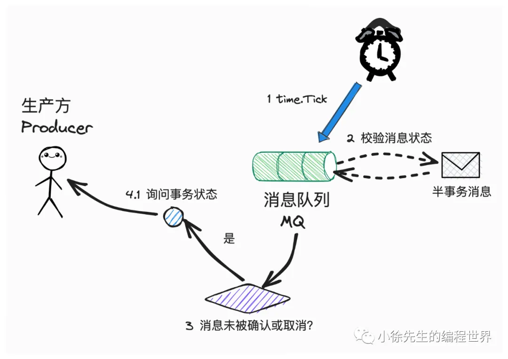
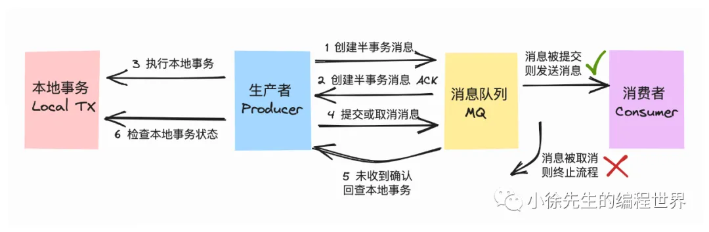
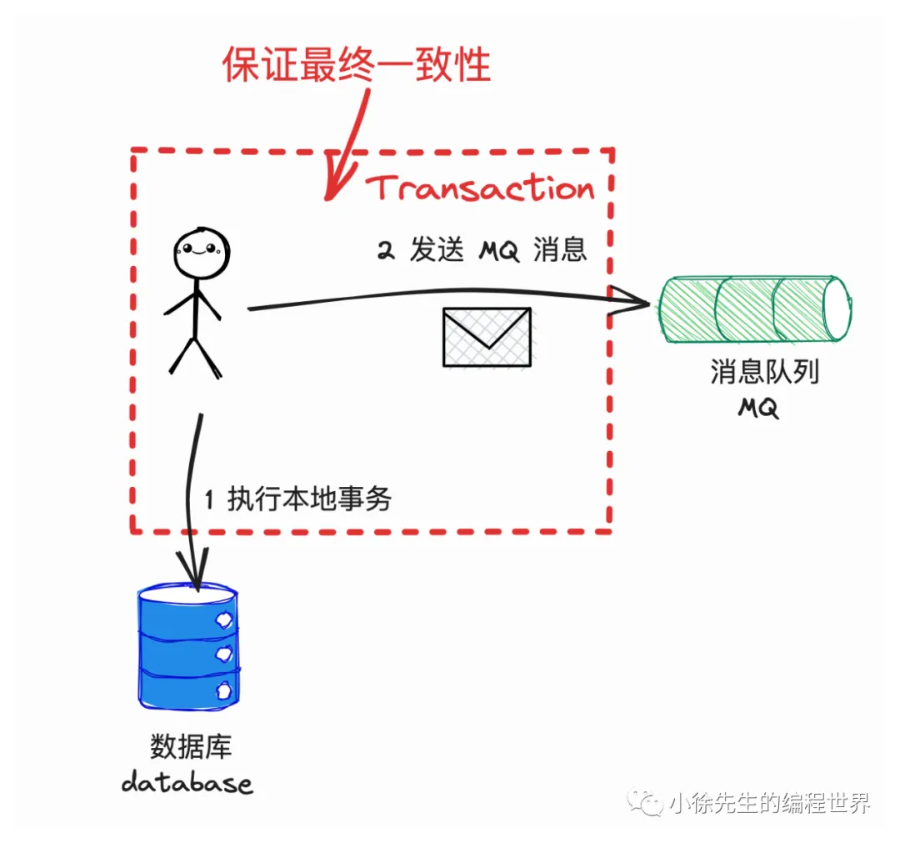
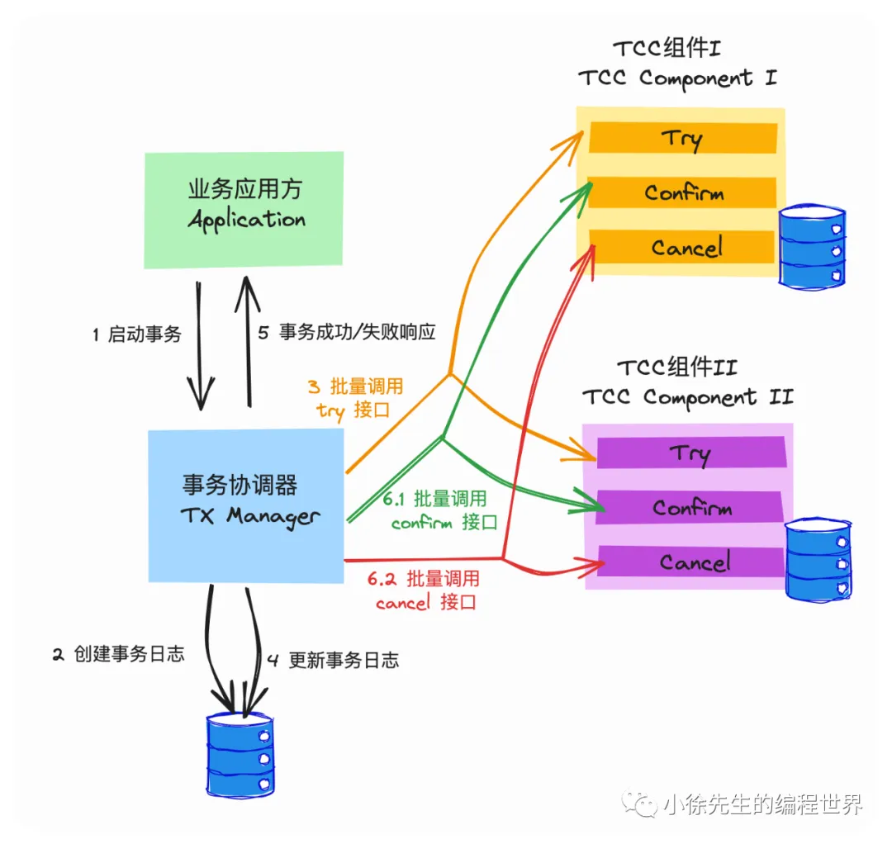
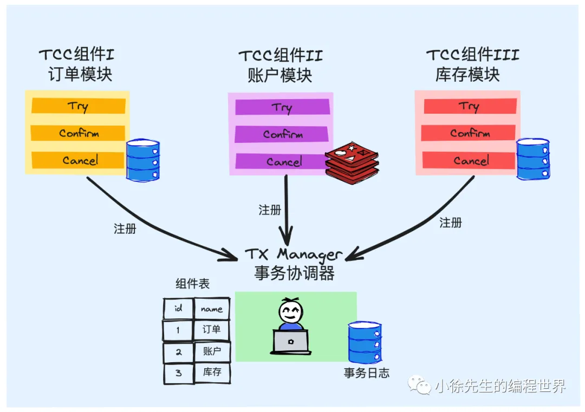
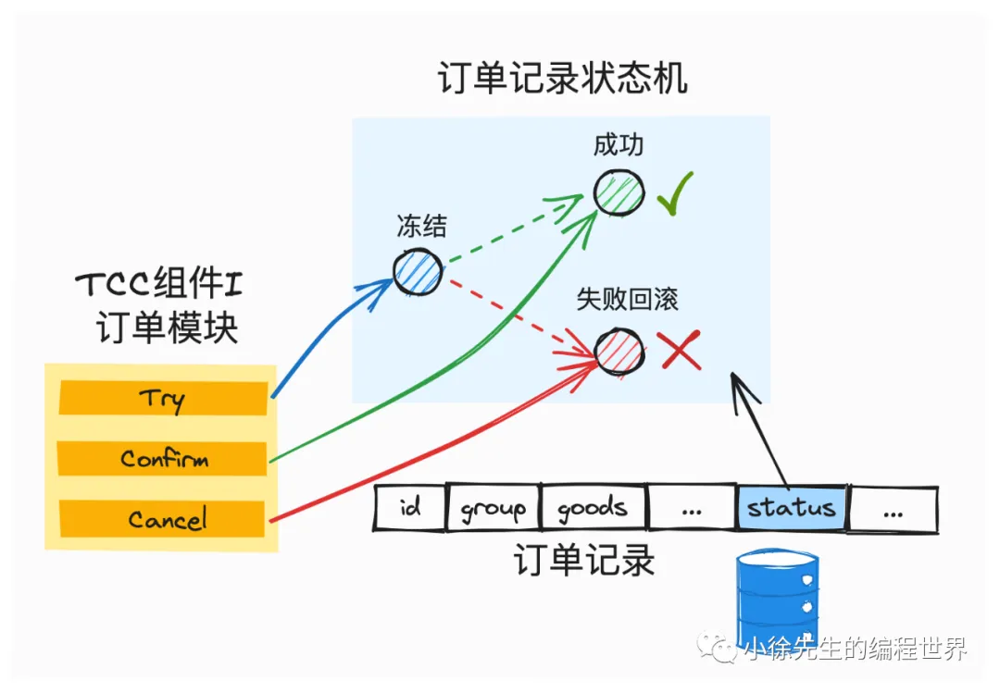
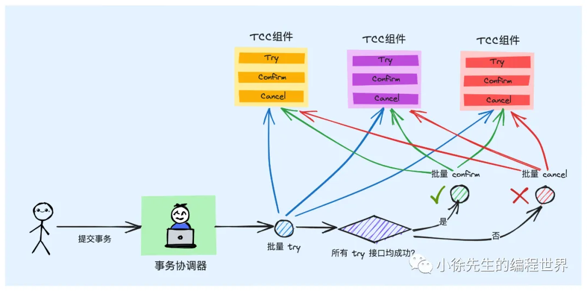
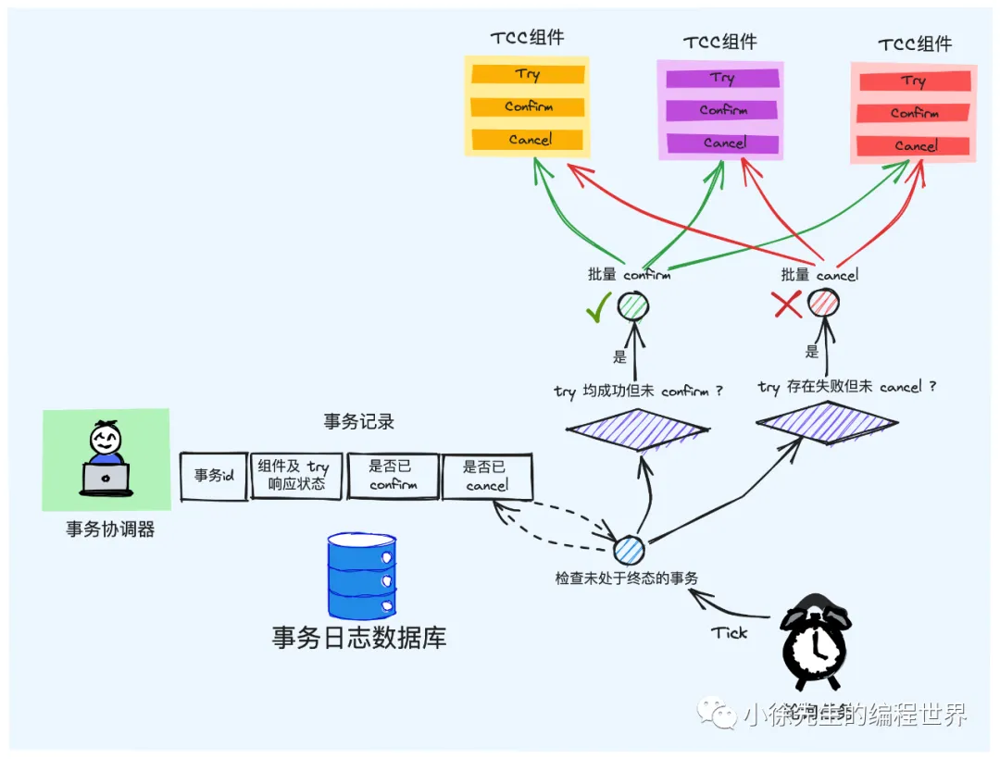
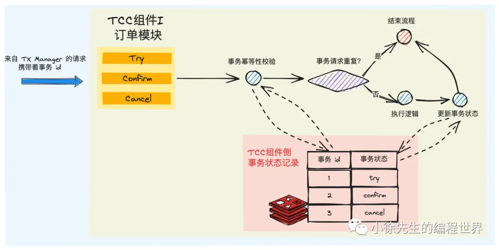
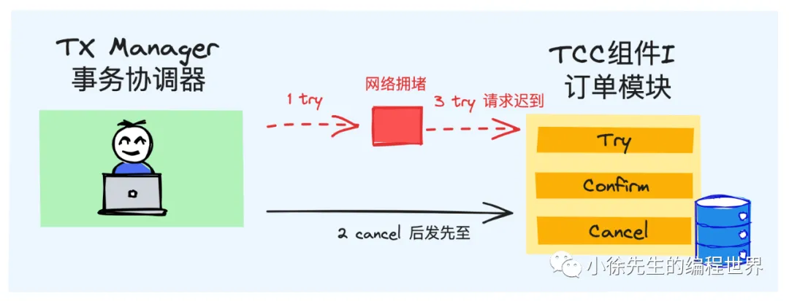

# 万字长文漫谈分布式事务实现原理

https://mp.weixin.qq.com/s?__biz=MzkxMjQzMjA0OQ==&mid=2247484585&idx=1&sn=b5ee56c2334e3cf4e9a1d8d9b54cd02c

## 1 分布式事务场景

1. 事务核心特性
   
   倘若事务涉及修改的对象是跨数据库甚至跨服务跨存储组件时，这个问题就开始变得复杂且有趣了，也就正式迈入我们今天所重点探讨的“分布式事务”领域的问题.
2. 分布式事务场景问题
   • 从账户系统中，扣减用户的账户`余额`
   • 从库存系统中，扣减商品的剩余`库存`
   
   业界针对于分布式事务早已提出一套被广泛认可应用的解决方案.

## 2 事务消息方案

一类偏狭义的分布式事务解决方案是基于消息队列 MessageQueue（后续简称 MQ）实现的事务消息 Transaction Message.

1. RocketMQ 简介
   RocketMQ 是阿里基于 java 实现并托管于 apache 基金会的顶级开源消息队列组件，其中`事务消息 TX Msg` 也是 RocketMQ 现有的一项能力.
2. 基于 MQ 实现分布式事务
   在 MQ 组件中，通常能够为我们保证的一项能力是：`投递到 MQ 中的消息能至少被下游消费者 consumer 消费到一次，即所谓的 at least once 语义.`
   
   倘若我们需要执行一个分布式事务，事务流程中包含需要`在服务 A 中执行的动作 I 以及需要在服务 B 中执行的动作 II`，此时我们可以基于如下思路串联流程：

   - 以服务 A 作为 MQ 生产方 producer，服务 B 作为 MQ 消费方 consumer
   - 服务 A 首先在执行动作 I，执行成功后往 MQ 中投递消息，驱动服务 B 执行动作 II
   - 服务 B 消费到消息后，完成动作 II 的执行

   **局限性：**

   - 动作 I 执行成功，而动作 II 执行失败的不一致问题(事务消息无法解决，无法令动作 I 回滚；消费者失败，生产者无法回滚)
   - （1）执行动作 I +（2）投递消息 需要保证原子性

3. 本地事务 + 消息投递 思路推演
   
   

   捋完上述两种流程中存在的问题后，一种比较容易想到的实现思路是：基于`本地事务包裹消息投递`操作的实现方式.
   

   问题：

   - 长事务：本地事务中夹杂了和第三方组件的 IO 操作，mysql开满连接，没有提交
   - 脏数据：当你把消息发送到MQ中，消费者就可以消费了，但是`本地修改数据还没有进行commit，会出现读到脏数据`(时序问题, happens-before)
   - 在执行事务提交操作时，可能发生失败. 此时事务内的数据库修改操作自然能够回滚，`然而 MQ 消息一经发出，就已经无法回收了.`

   **解决方案：事务消息(Transaction Message)**

4. 事务消息原理
   TX Msg 能保证我们做到在本地事务执行成功的情况下，后置的投递消息操作能以接近百分之百的概率被发出
   
   
   
5. 事务消息局限性
   
   **不具备逆向回滚能力**
   倘若接收消息的下游 consumer 侧执行操作失败，此时至多只能依赖于 MQ 的重发机制通过重试动作的方式提高执行成功率，但是`无法从根本上解决下游 consumer 操作失败后回滚上游 producer 的问题`. 这一点正是 TX Msg 中存在的最大的局限性.
   并非所有动作都能通过简单的重试机制加以解决.有的动作必然失败.

## 3 TCC 实现方案

1. TCC 概念简述
   TCC，全称 `Try-Confirm-Cancel`，指的是将一笔状态数据的修改操作拆分成两个阶段：

   • 第一个阶段是 Try，指的是`先对资源进行锁定`，资源处于中间态但不处于最终态
   • 第二个阶段分为 Confirm/Cancel，指的是在 Try 操作的基础上，真正提交这次修改操作还是回滚这次变更操作

2. TCC 宏观架构
   

   事务协调器 TX Manager：

   - 负责统筹分布式事务的执行：
   - 实现 TCC Component 的注册管理功能
   - 负责和 Application 交互，提供分布式事务的创建入口，给予 Application 事务执行结果的响应

   串联 Try -> Confirm/Cancel 的两阶段流程. 在第一阶段中批量调用 TCC Component 的 Try 接口，根据其结果，决定第二阶段是批量调用 TCC Component 的 Confirm 接口还是 Cancel 接口

3. TCC 案例分析
   电商后台系统，需要处理来自用户的支付请求. 每当有一笔支付请求到达，我们需要执行下述三步操作，并要求其前后状态保持一致性：

   • 在订单模块中，创建出这笔订单流水记录
   • 在账户模块中，对用户的账户进行相应金额的扣减
   • 在库存模块中，对商品的库存数量进行扣减

   
   
   

   ***

   说明

   - Try 操作的容错率是比较高的，原因在于有人帮它兜底. Try 只是一个试探性的操作，不论成功或失败，后续可以通过第二轮的 Confirm 或 Cancel 操作对最终结果进行修正
   - `Confirm/Cancel 操作是没有容错的`，倘若在第二阶段出现问题，可能会导致 Component 中的状态数据被长时间”冻结“或者数据状态不一致的问题

   针对于这个场景，TCC 架构中采用的解决方案是：
   **在第二阶段中，TX Manager 轮询重试 + TCC Component 幂等去重. 通过这两套动作形成的组合拳，保证 Confirm/ Cancel 操作至少会被 TCC Component 执行一次.**
   

   下游 TCC Component 的 Confirm 和 Cancel 请求只能保证 at least once 的语义。为例保证幂等性，TX Manager 每次向 TCC Component 发起请求时，都要携带上 `Transaction ID。`

4. TX Manager 职责

- 暴露出`注册` TCC Component 的接口，进行 Component 的注册和管理
- 暴露出启动分布式事务的接口，作为和 Application 交互的唯一`入口`，并基于 Application 事务执行结果的反馈
- 为每个事务维护全局唯一的 Transaction ID，基于事务日志表记录每项分布式事务的`进展明细`
- 串联 Try——Confirm/Cancel 的`两阶段流程`，根据 Try 的结果，推进执行 Confirm 或 Cancel 流程
- 持续运行`轮询`检查任务，推进每个处于中间态的分布式事务流转到终态

5. TCC Component 职责
   

   - 暴露出 Try、Confirm、Cancel `三个入口`，对应于 TCC 的语义
   - 针对数据记录，新增出一个对应于 Try 操作的`中间状态`枚举值
   - 针对于同一笔事务的重复请求，需要执行`幂等性`校验
   - 需要支持`空回滚`操作. 即针对于一笔新的 Transaction ID，在没收到 Try 的前提下，若提前收到了 Cancel 操作，也需要将这个信息记录下来，但不需要对真实的状态数据发生变更
     

   TCC 对代码侵入性较高。

6. TCC 优劣势分析
   1. 优点
      - 真正意义上的分布式事务
        任意一个 Component 的 Try 操作发生问题，都能支持事务的整体回滚操作
      - 状态一致性能够趋近于 100%
        第二阶段 Confirm/Cancel 的成功率很高
   2. 缺点
      - 只能保证最终一致性
      - 代码侵入性较高
        数据一致性要求不那么高的场景中，通常不会使用到这套架构
      - 事务的原子性只能做到趋近于 100%
        第二阶段的 Confirm 和 Cancel 仍然存在极小概率发生失败，即便通过重试机制也无法挽救. 这部分小概率事件，就需要通过人为介入进行兜底处理。
        所有分布式事务都存在的问题，由于网络请求以及第三方系统的不稳定性，分布式事务永远无法达到 100% 的原子性.

## 4 总结

• Transaction Message：能够支持狭义的分布式事务. 基于消息队列组件中半事务消息以及轮询检查机制，保证了本地事务和消息生产两个动作的原子性，但不具备事务的逆向回滚能力

• TCC Transaction：能够支持广义的分布式事务. 架构中每个模块需要改造成实现 Try/Confirm/Cancel 能力的 TCC 组件，通过事务协调器进行全局 Try——Confirm/Cancel 两阶段流程的串联，保证数据的最终一致性趋近于 100%
