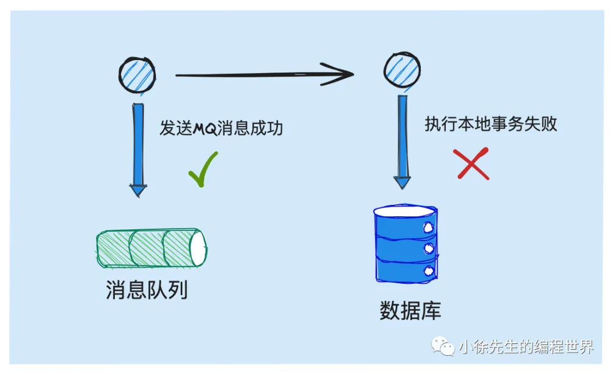

# 万字长文漫谈分布式事务实现原理

https://mp.weixin.qq.com/s?__biz=MzkxMjQzMjA0OQ==&mid=2247484585&idx=1&sn=b5ee56c2334e3cf4e9a1d8d9b54cd02c

## 1 分布式事务场景

1. 事务核心特性
   
   倘若事务涉及修改的对象是跨数据库甚至跨服务跨存储组件时，这个问题就开始变得复杂且有趣了，也就正式迈入我们今天所重点探讨的“分布式事务”领域的问题.
2. 分布式事务场景问题
   • 从账户系统中，扣减用户的账户`余额`
   • 从库存系统中，扣减商品的剩余`库存`
   
   业界针对于分布式事务早已提出一套被广泛认可应用的解决方案.

## 2 事务消息方案

一类偏狭义的分布式事务解决方案是基于消息队列 MessageQueue（后续简称 MQ）实现的事务消息 Transaction Message.

1. RocketMQ 简介
   RocketMQ 是阿里基于 java 实现并托管于 apache 基金会的顶级开源消息队列组件，其中`事务消息 TX Msg` 也是 RocketMQ 现有的一项能力.
2. 基于 MQ 实现分布式事务
   在 MQ 组件中，通常能够为我们保证的一项能力是：`投递到 MQ 中的消息能至少被下游消费者 consumer 消费到一次，即所谓的 at least once 语义.`
   
   倘若我们需要执行一个分布式事务，事务流程中包含需要`在服务 A 中执行的动作 I 以及需要在服务 B 中执行的动作 II`，此时我们可以基于如下思路串联流程：

   - 以服务 A 作为 MQ 生产方 producer，服务 B 作为 MQ 消费方 consumer
   - 服务 A 首先在执行动作 I，执行成功后往 MQ 中投递消息，驱动服务 B 执行动作 II
   - 服务 B 消费到消息后，完成动作 II 的执行

   **局限性：**

   - 动作 I 执行成功，而动作 II 执行失败的不一致问题(事务消息无法解决，无法令动作 I 回滚)
   - （1）执行动作 I +（2）投递消息 需要保证原子性

3. 本地事务 + 消息投递 思路推演
   
   

   捋完上述两种流程中存在的问题后，一种比较容易想到的实现思路是：基于`本地事务包裹消息投递`操作的实现方式.
   

   问题：

   - 长事务：本地事务中夹杂了和第三方组件的 IO 操作，mysql开满连接，没有提交
   - 脏数据：当你把消息发送到MQ中，消费者就可以消费了，但是`本地修改数据还没有进行commit，会出现读到脏数据`(时序问题, happens-before)
   - 在执行事务提交操作时，可能发生失败. 此时事务内的数据库修改操作自然能够回滚，`然而 MQ 消息一经发出，就已经无法回收了.`

   **解决方案：事务消息(Transaction Message)**

4. 事务消息原理

5. 事务消息局限性

## 3 TCC 实现方案
