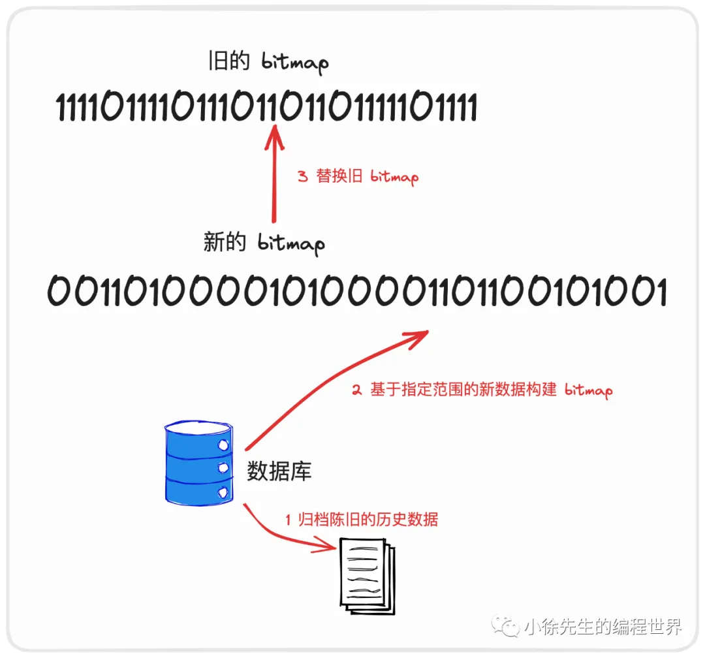

# 布隆过滤器技术原理及应用实战

https://mp.weixin.qq.com/s/_dtmItfAnHn6x8s0zSzFLA
布隆过滤器（Bloom Filter）是一种高效的概率型数据结构，用于判断一个元素是否存在于集合中。它通过牺牲一定的准确性来换取极高的空间效率和查询速度，尤其适合处理海量数据场景。以下从技术原理、实现细节、数学推导到应用实战进行全面解析。

**关键：将任一个对象哈希成一个长度为k的int32元组**

---

### 一、技术原理

#### 1. 核心思想

布隆过滤器由**位数组（Bitmap）**和**多个哈希函数**组成：

- **位数组**：初始时所有位均为0，用于存储元素的标记。
- **哈希函数**：每个元素通过多个哈希函数映射到位数组的不同位置。

#### 2. 工作流程

- **添加元素**：对元素进行k次哈希，将对应的k个位数组位置置1。
- **查询元素**：对元素进行k次哈希，若所有对应位均为1，则认为元素可能存在（可能存在误判）；若有任意一位为0，则元素一定不存在。

#### 3. 特性分析

- **空间高效**：仅用1 bit标记一个元素，空间复杂度为O(m)，m为位数组长度。
- **时间高效**：插入和查询的时间复杂度均为O(k)，k为哈希函数数量。
- **误判率**：存在假阳性（False Positive），但无假阴性（False Negative）。
- **不可删除**：传统布隆过滤器不支持删除操作
  - 方案一：数据归档 + 离线定期重构
    
    这种方案适用于我们在数据库中仍然存有全量数据的明细记录，使用布隆过滤器仅仅作为缓存层起到保护关系型数据库的用途. 此时我们可以`定期地对一部分数据库中的老数据进行归档`，然后定期使用指定时间范围内的新数据构建出一个新的 bitmap，对老的 bitmap 进行覆盖，以此延长布隆过滤器的生命力.
  - 方案二：优化定期重构：**渐进式迁移**
    monitor记录误判率，当误判率超过阈值时，进行重构。
    构造一个新的布隆过滤器，优先使用新的布隆过滤器进行查询，老的布隆过滤器变成readonly。
    如果不存在于new但存在于old，则将老的布隆过滤器中的数据迁移到新的布隆过滤器中。
    再记录老过滤器的命中率，当命中率降到一定程度时，将老的布隆过滤器删除。
  - 方案三：计数布隆过滤器（Counting Bloom Filter）-> 平衡实现难度与功能需求
    - 每位使用计数器（如4-bit），支持删除操作。
    - 代价：空间增加4倍。
  - 方案四：布谷鸟过滤器 -> 适合大规模数据且需频繁删除
  - 方案五：标记删除法 -> 适用于删除操作较少的临时场景

---

### 二、数学推导：误判率与参数调优

#### 1. 误判率公式

假设位数组长度为m，元素数量为n，哈希函数数量为k：

- **单个位未被置1的概率**：\( (1 - \frac{1}{m})^{kn} \approx e^{-kn/m} \)
- **误判率（所有k位均为1）**：\( P \approx \left(1 - e^{-kn/m}\right)^k \)

#### 2. 最优参数选择

- **哈希函数数量k**：当 \( k = \frac{m}{n} \ln 2 \) 时，误判率最低。
- **位数组大小m**：给定误判率p和元素数量n，最优 \( m = -\frac{n \ln p}{(\ln 2)^2} \)。

**示例**：若n=1亿，p=1%，则：
\[ m \approx -\frac{10^8 \times \ln 0.01}{(\ln 2)^2} \approx 958,505,832 \, \text{bits} \approx 114 MB \]
\[ k = \frac{m}{n} \ln 2 \approx 7 \]

针对于布隆过滤器的参数选取，这里有一个现成的参数调优模拟器，可供使用：

https://hur.st/bloomfilter/?n=9000000&p=&m=65000000&k=6

---

### 三、实现细节与优化

#### 1. 哈希函数设计

需选择独立且均匀的哈希函数。常用方法：

- **双重哈希**：\( h_i(x) = h_1(x) + i \cdot h_2(x) \)
- **种子哈希**：使用不同种子生成多个哈希值（如Murmur3）。

**修正原代码中的哈希生成问题**：

```go
func (b *BloomService) getKEncrypted(val string) []int32 {
    encrypteds := make([]int32, 0, b.k)
    for i := 0; int32(i) < b.k; i++ {
        // 使用不同种子生成独立哈希值
        hasher := murmur3.New32WithSeed(uint32(i))
        _, _ = hasher.Write([]byte(val))
        encrypted := int32(hasher.Sum32() % uint32(b.m))
        encrypteds = append(encrypteds, encrypted)
    }
    return encrypteds
}
```

#### 2. 位数组操作

- **本地实现**：使用`[]int`数组，每个int管理32位。
- **Redis实现**：利用`SETBIT`和`GETBIT`命令操作位数组，执行 lua 脚本，将 k 个 bit 位统统置为 1。(注意要在单节点上才能保证原子性)

---

### 四、应用实战案例

#### 1. 爬虫URL去重

- **需求**：10亿URL去重，单机内存限制。
- **方案**：布隆过滤器（约114MB内存）替代哈希表（16GB内存），容忍少量误判。

#### 2. 分布式定时器（XTimer）

- **场景**：定时任务幂等性校验。定时任务满足 at least once 的语义，但无法做到 exactly once 的语义.
- **流程**：
  1. **触发任务**：Trigger模块异步触发任务。
  2. **布隆过滤**：Executor优先检查任务是否已执行。
  3. **兜底查询**：若布隆过滤器返回存在，则二次查库确认(假阳)。

**优势**：减少90%以上的数据库查询，显著降低负载。

---

### 五、变种与扩展

1. **计数布隆过滤器（Counting Bloom Filter）**

   - 每位使用计数器（如4-bit），支持删除操作。
   - 代价：空间增加4倍。

2. **布谷鸟过滤器（Cuckoo Filter）**
   - 支持删除，更高空间利用率。
   - 基于布谷鸟哈希，插入性能略有下降。

---

### 六、总结

**优势**：

- 空间效率极高，适合海量数据。
- 查询速度快，常数时间复杂度。

**局限**：

- 存在误判，需业务容忍。
- 无法删除元素（需变种支持）。

**适用场景**：

- 缓存穿透防护
- 分布式系统路由判定
- 垃圾邮件过滤
- 日志监控去重

---

通过深入理解布隆过滤器的原理与实现，结合业务场景合理调参，可在大数据处理中显著提升性能，平衡空间与时间的矛盾。
