# 两万字长文解析raft算法原理

https://mp.weixin.qq.com/s/nvg9J4ky9mz-dFVi5CyYWg

## 1 引入分布式共识算法的背景

1. 如何提高大规模数据的读写性能？
   纵向 -> 更好的机器(硬件)
   横向 -> 更多的机器(集群)
2. 分布式的优势和问题？
   优势：分区容错(数据备份、负载均衡)
   问题：可用性、一致性

   CAP理论：一致性、可用性、分区容错性，最多只能满足其中两个
   AP 系统 -> redis，强调系统的可用性
   CP 系统 -> zookeeper、etcd，强调系统数据的正确性

   基于木桶效应面对 CAP： 评价一个系统时，`评价的标准不光体现在它的高光方面，更重要的是需要权衡它的下限.` => 类似评价数据结构复杂度。

   分布式一致性共识算法，是在基于各种精妙的算法机制，能够在`尽可能少地牺牲 C 的基础之上，将 A 提升到尽可能高的水平.`（BASE理论）

## 2 raft 算法核心概念

1. 术语表

| 中文术语      | 英文术语              | 含义                                                                                                              |
| ------------- | --------------------- | ----------------------------------------------------------------------------------------------------------------- |
| 领导者        | leader                | 节点的三种角色之一. 集群的首脑，负责发起”提议“、”提交“被多数派认可的决断.                                         |
| 跟随者        | follower              | 节点的三种角色之一. 需要对 leader 的 ”提议“ 、”提交“和 candidate 的 ”竞选“ 进行响应.                              |
| 候选人        | candidate             | 节点的三种角色之一. 是一种处于竞选流程中的临时状态，根据多数派投票的结果会切为 leader 或 follower 的稳定态.       |
| 最终一致性    | finnal consistency    | 中强一致性. 对于写请求，服务端保证最终一定能提供出正确的结果，但需要同步时间. 同步期间，可能被读到不一致的老数据. |
| 即时一次性    | immediate consistency | 强一致性. 服务端要求做到写入立即可读(RYW).                                                                        |
| 预写日志(WAL) | write ahead log       | 记录写请求明细的日志.（单指 raft 算法下狭义的预写日志）                                                           |
| 状态机        | state machine         | 节点内存储数据的介质.                                                                                             |
| 提议          | proposal              | 两阶段提交的第一个阶段. 指的是 leader 向所有节点发起日志同步请求的过程.                                           |
| 提交          | commit                | 两阶段提交的第二个阶段. 指的是 leader 认可一笔写请求已经被系统采纳的动作.                                         |
| 应用          | apply                 | 指的是将预写日志记录内记录的写操作应用到状态机的过程.                                                             |
| 任期          | term                  | 任期是用于标识 leader 更迭的概念. 每个任期内至多只允许有一个 leader.                                              |
| 日志索引      | index                 | 日志在预写日志数组中的位置.                                                                                       |
| 脑裂          | brain split           | 同一任期内，集群出现两个 leader，导致秩序崩盘.                                                                    |

2. 多数派原则
   多数派(n/2+1)原则指的是，系统的决断无需全员参与,多数派达成的共识即可视为整个系统的答复.
3. 一主多从、读写分离
   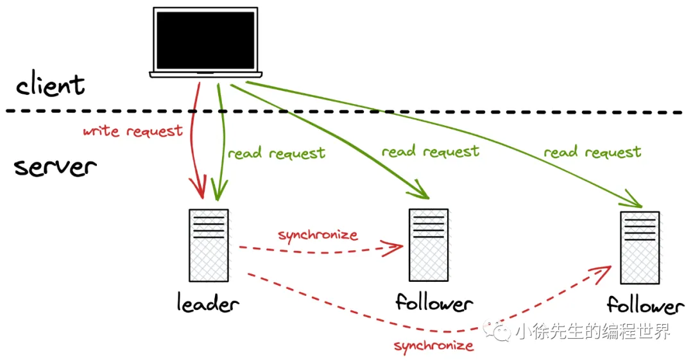
   读操作可以由集群的任意节点提供服务；
   写操作统一需要由 leader 收口处理，并向 follower 同步. 倘若 follower 率先收到了来自客户端的写请求，也需要转发给 leader 进行处理.
   这种读写分离的机制，**通过读操作的负载均衡提高了系统整体的吞吐量，也通过写操作的统一收口降低了共识算法的复杂度**。
4. 状态机与预写日志
   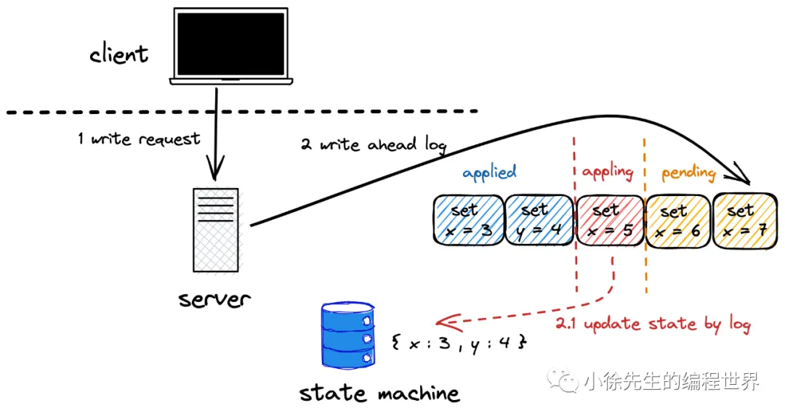

   - 状态机 （state machine）是节点实际存储数据的容器,写请求的最后一步是将结果写入状态机，而读请求也需要从状态机中获取数据进行响应.
   - **预写日志（write ahead log，简称 wal）**是通过日志的方式记录下每一笔写请求的明细（例如 set x = 3 这样一笔记录），使得变更历史有迹可循.当一个日志（写请求）达到集群多数派的认可后，才能够被提交，将变更应用到状态机当中.

5. 两阶段提交
   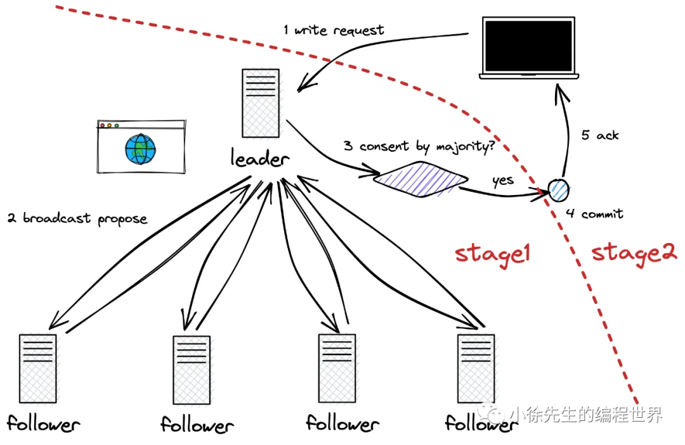
   proposal + commit

   - 提高了可用性：
     请求的耗时只取决于多数派中的短板，而不取决于全员的短板

6. 领导者选举
   - 心跳检测
   - 数据足够新(被多数派认可)的 follower 才有资格补位成为 leader
7. 任期与日志索引
   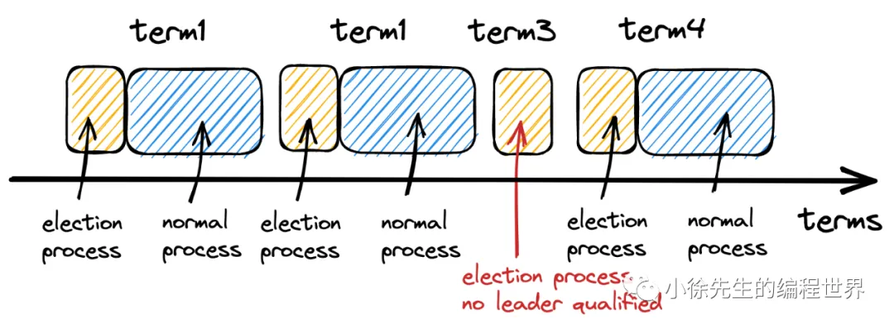
   每一则预写日志唯一标识为(term,index)元组

## 3 raft 算法下节点的角色流转

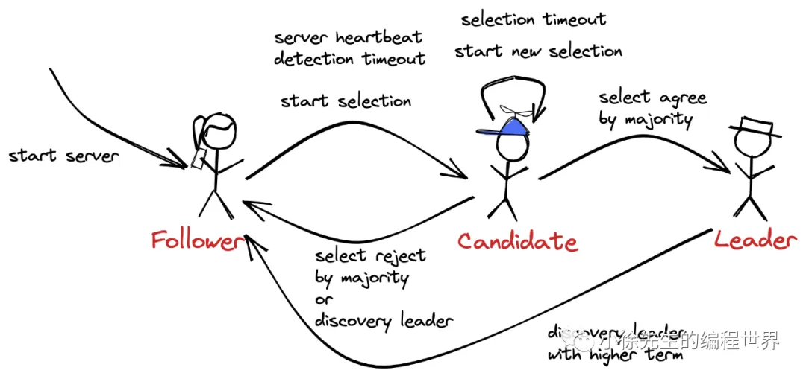

- leader
  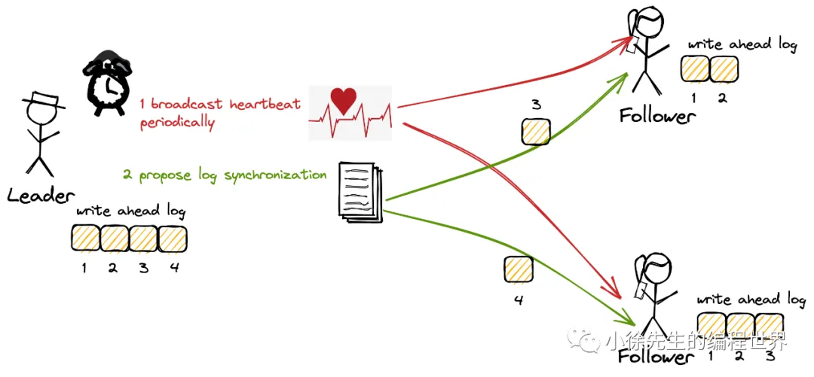

  - 对外：写请求的统一入口、两阶段提交
  - 内对：心跳请求(双向)
    - 让follower重置心跳检测定时器
    - 心跳请求中携带上 leader 最新已提交日志的标识 id（term + index），推动 follower 更新日志提交进度

- follower
  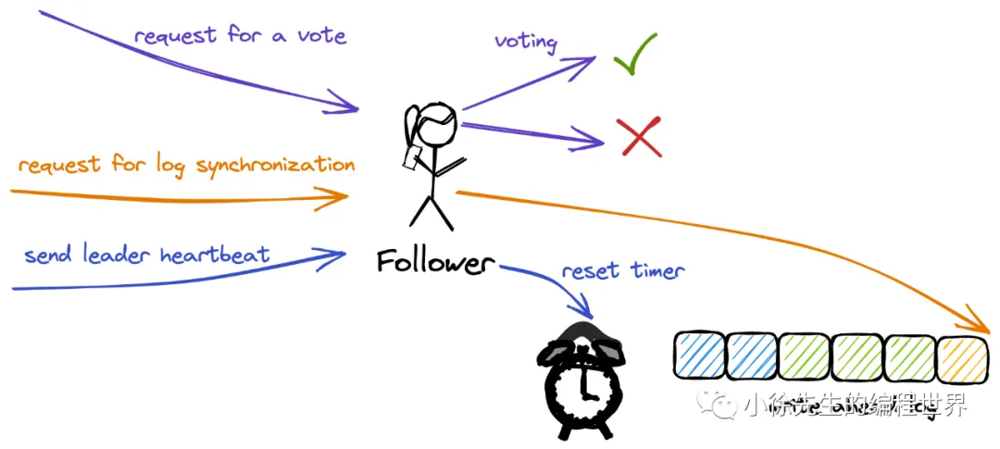

  - 对外：负责同步 leader 传来的写请求
  - 对内：
    - 接收 leader 心跳
    - candidate 的投票

- candidate
  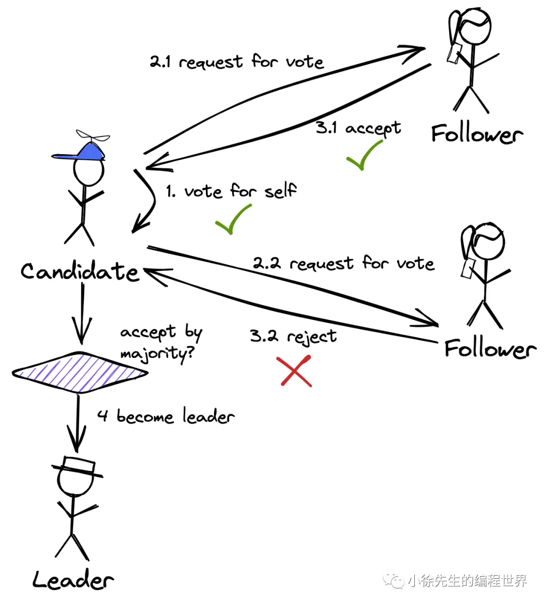

  - 对内：
    - 发现高(>=)任期的 leader，切换为 follower
    - 向所有节点拉票

## 4 raft 算法下的外部请求链路梳理

1. 写

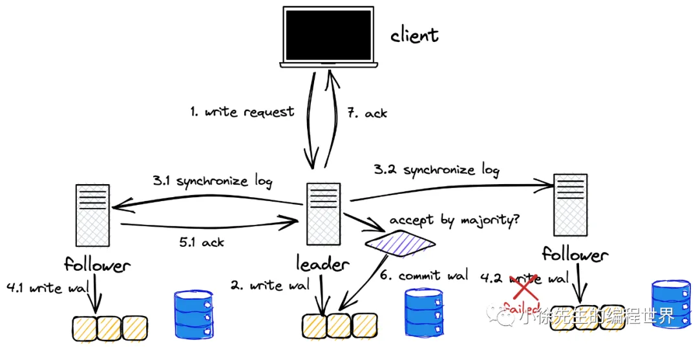

- 理想化的写流程链路：
  - 客户端请求到达 leader
  - leader 将请求 append 预写日志
  - leader 向所有 follower 发送 proposal 请求
    leader会带三个东西:(curLog,preLog,curTerm)
  - follower 收到请求后，写入预写日志，并返回 ack
  - leader 收到超过半数的 ack，commit 日志(移动commitIndex)，并向客户端返回 ack
  - leader 在后续同步心跳时带上最新的commitIndex，follower在此时更新commitIndex进度
- 边界场景

  1. leader 任期滞后(网络分区等原因造成)
     follower 拒绝 leader 的这次同步请求，并在响应中告知 leader 当前最新的 term；
     leader 感知到新 term 的存在后退位.
  2. follower 日志滞后
     类似 git push 时远端的检查, **follower 的最后一笔日志必须与 leader 的倒数第二笔日志一致，才能够进行同步**.
     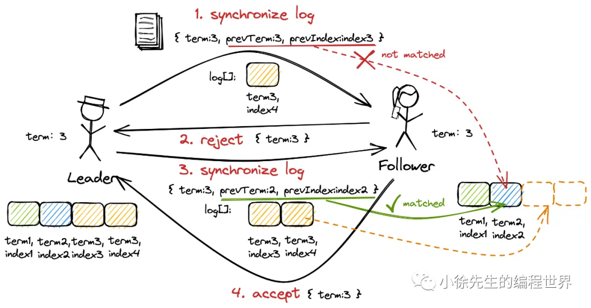
  3. follower 日志超前(脏数据,未提交)
     此时 follower 需要移除这部分”超前“的日志(脏数据)，然后同步 leader 传送的日志，向在任 leader 看齐.
     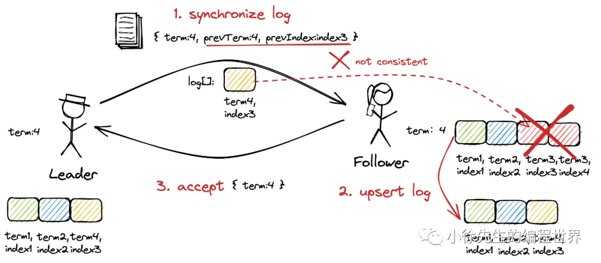
     case 2 和 case 3 的处理方式共同保证了，在 raft 算法下，各节点间预写日志数组的已提交部分无论在内容还是顺序上都是完全一致的
  4. 如何将最终一致性升级到强一致性
     标准的 raft 算法模型中，在 C 方面只能做到”最终一致性“的语义. 倘若想要升级为”强一致性“，就需要`leader ack之前，需要确保将这笔日志应用到状态机中`，才能给予客户端”请求成功“的 ack，且保证读 leader 状态机时，能读取到最新的数据.

     ---- appliedIndex ---- commitIndex ----
     appliedIndex 是指状态机已经应用的日志索引，commitIndex 是指已经被多数派认可的日志索引.

2. 读

如果只要求最终一致性，随便读；
如果要求读流程满足强一致性的要求，则要做一些额外的处理。

- 方法1：appliedIndex 校验
  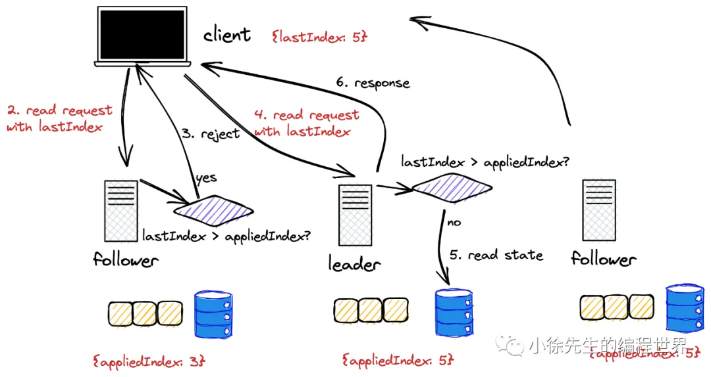
  每次 leader 处理写请求后，会把最晚一笔应用到状态机的日志索引 appliedIndex 反馈给客户端，客户端需要带着这个索引去读raft集群，这样集群节点可以发现本机数据滞后，从而拒绝这笔请求。
- 方法2：强制读leader
  这种强制读主的方案还存在一个问题，就是领导者在处理读请求时，需要额外对自己做一次合法性身份证明(不知大清已亡)。
  解决这个问题的方案是身份合法性校验，`leader 提供读服务时，需要额外向集群所有节点发起一轮广播，当得到多数派的认可，证明自己身份仍然合法时，才会对读请求进行响应.`

## 5 raft 算法下的内部请求链路梳理

1. 日志同步请求
   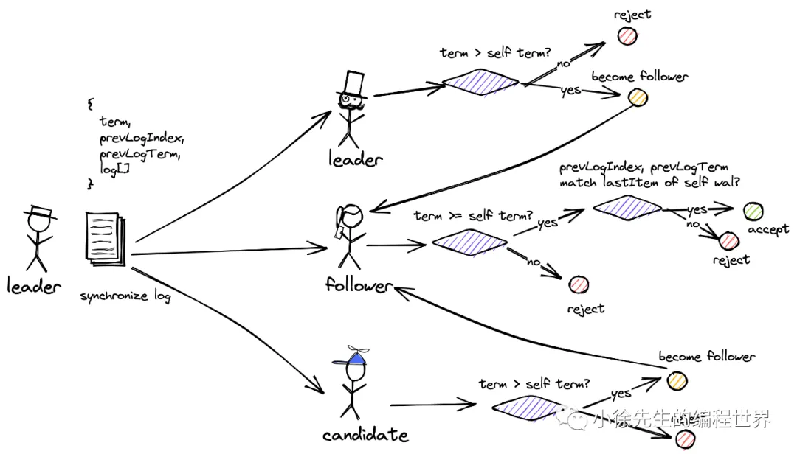

## 6 raft 算法下的集群变更

## 7 Q&A

## 8 展望
