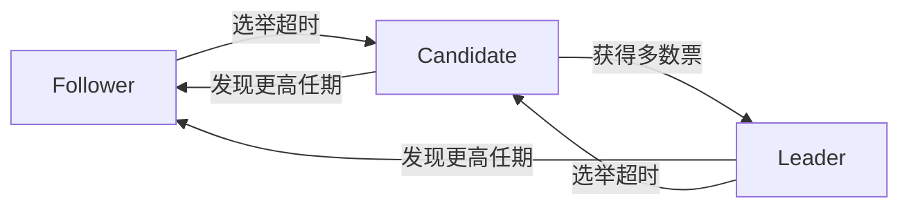

以下是关于分布式共识算法及Raft协议的详细讲解：

---

### 1. 引入分布式共识算法的背景

**核心问题**：在分布式系统中，多个节点如何就某个值（例如数据状态、操作顺序）达成一致？

**需求驱动**：

- **容错性**：允许部分节点故障时系统仍能正常运行
- **数据一致性**：确保所有节点看到相同的数据视图
- **高可用性**：系统能持续提供服务
- **顺序保证**：所有操作需要确定全局顺序

**传统方案痛点**：

- 主从复制存在单点故障风险
- 客户端Quorum机制无法保证强一致性
- Paxos算法正确但难以工程实现

---

### 2. Raft算法核心概念

**设计目标**：易理解、易实现的强一致性算法

**核心要素**：

1. **Leader机制**：唯一负责处理客户端请求的节点
2. **日志复制**：所有操作通过日志传播实现状态机复制
3. **任期机制**（Term）：逻辑时钟，每个任期最多一个Leader
4. **选举机制**：通过投票产生新Leader
5. **心跳机制**：Leader维持权威性的保活信号

**关键数据结构**：

```python
class LogEntry:
    term: int       # 产生该条目的任期号
    command: any    # 状态机指令

class NodeState:
    current_term: int
    voted_for: int  # 当前任期投票给的节点ID
    log: List[LogEntry]
    commit_index: int
    last_applied: int
```

---

### 3. 节点角色流转

**三种角色**：

- **Leader**：处理所有客户端请求，管理日志复制
- **Follower**：被动响应Leader和Candidate的请求
- **Candidate**：选举过程中的临时状态

**状态转换图**：



**转换条件**：

- **Follower → Candidate**：选举超时（150-300ms随机）
- **Candidate → Leader**：获得超过半数的投票
- **Leader → Follower**：发现更高任期的消息
- **任何角色 → Follower**：收到更高任期的RPC请求

---

### 4. 外部请求链路梳理

**写请求处理流程**：

1. 客户端发送请求到Leader
2. Leader将操作追加到本地日志（未提交）
3. Leader并行发送AppendEntries RPC给所有Followers
4. 收到超过半数节点的成功响应
5. Leader提交日志（更新commit_index）
6. Leader应用日志到状态机
7. 返回结果给客户端

**异常处理**：

- 客户端请求发送到Follower时，会被重定向到Leader
- 请求超时后客户端应重试请求
- 已提交的日志在任何选举结果下都会被保留

---

### 5. 内部请求链路梳理

**关键RPC类型**：

1. **RequestVote RPC**（选举阶段）

   - Candidate发起，收集投票
   - 接收方验证：候选人的日志至少和自己一样新

2. **AppendEntries RPC**（心跳+日志复制）
   - Leader定期发送（心跳间隔通常50ms）
   - 携带prevLogIndex/prevLogTerm用于日志一致性检查
   - 包含新日志条目（心跳时为空列表）

**日志复制流程**：

```mermaid
sequenceDiagram
    Leader->>Follower: AppendEntries(prevIndex=5, prevTerm=2, entries=[...])
    Follower-->>Leader: 检查prevIndex处的日志项
    alt 日志匹配
        Follower->>Leader: 成功响应
        Leader更新commit_index
    else 日志不匹配
        Follower->>Leader: 失败响应
        Leader递减nextIndex重试
    end
```

---

### 6. 集群变更

**核心挑战**：配置变更期间避免出现双主

**安全变更方案**（单节点变更）：

1. 将新配置C-new作为特殊日志条目提交
2. 使用两阶段变更：
   - 先提交包含新旧配置的联合共识条目（C-old + C-new）
   - 再提交单独的新配置条目
3. 每个变更只增加或删除一个节点

**关键约束**：

- 新配置必须获得旧配置多数派和新配置多数派的双重认可
- Leader必须存在于新配置中才能提交配置变更

---

### 7. Q&A

**Q1: Raft与Paxos的主要区别？**

- Raft强调强Leader简化流程，Paxos允许并行提议
- Raft通过日志连续性简化一致性检查
- Raft用任期替代Paxos的提案编号

**Q2: 如何应对网络分区？**

- 多数派原则保证最多一个分区能选举Leader
- 分区恢复后，低任期的Leader会自动下台
- 被隔离的少数派分区无法提交新日志

**Q3: 选举失败如何处理？**

- 立即开启新一轮选举（随机化超时时间避免活锁）
- 逐步延长选举超时时间（指数退避策略）

**Q4: 如何处理日志冲突？**

- Leader强制覆盖Follower的不一致日志
- 通过AppendEntries的prevLogIndex/prevLogTerm进行一致性检查
- 回退nextIndex直到找到一致点

**Q5: 为什么需要多数派同意？**

- 保证每个提交的日志至少存在于一个节点的新日志中
- 防止不同Leader同时提交冲突日志（选举安全性）
- 满足quorum交集性质，确保强一致性

---

通过这种结构化的设计，Raft算法在保证强一致性的同时，显著降低了理解和实现的难度，现已成为Etcd、Consul等主流分布式系统的核心共识算法。
