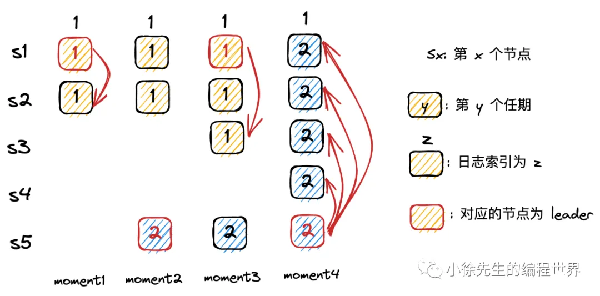

以下是对 Raft 协议相关问题的逐条解答：

---

### **1. 为什么能保证一个任期内至多只有一个领导者？**

- **核心机制**：Raft 通过 **选举规则** 和 **任期（Term）递增** 来保证。
  - 每个节点在一个任期内最多只能投一票，且只有获得 **多数派（Majority）** 投票的节点才能成为 Leader。
  - 如果多个 Candidate 同时发起选举（选票瓜分），它们的任期可能相同，但最终只有能获得多数票的节点能胜出。若无法决出 Leader，则任期递增后重新选举。
  - 一旦 Leader 被选出，会通过心跳机制维持权威，其他节点无法在相同任期内发起新的选举。

---

### **2. 为什么能保证通过任期和索引相同的日志内容一定相同？**

- **日志匹配特性（Log Matching Property）**：
  - **唯一性**：Leader 在每个任期内的某个日志索引位置只会生成一条日志条目。
  - **一致性检查**：Leader 向 Follower 发送日志时，会携带前一条日志的 `<Term, Index>`，Follower 会验证本地日志是否匹配。若不匹配，则拒绝并回退，直到找到一致点。
  - 因此，相同 `<Term, Index>` 的日志内容必然一致。

---

### **3. 如果两个节点中存在相同任期和索引的日志，之前的日志是否也一致？**

`数学归纳法`

- **是**。根据日志匹配特性：
  - 若两节点在某个 `<Term, Index>` 的日志条目一致，则它们在该位置之前的所有日志条目（内容和顺序）必然完全一致。
  - 这一特性通过日志追加时的 **前向一致性检查** 保证（Follower 会拒绝与 Leader 不一致的日志）。

---

### **4. 如何解决选票瓜分引发的问题？**

- **随机化选举超时（Randomized Election Timeout）**：
  - 每个节点的选举超时时间是随机的（通常在 150ms-300ms 之间），减少多个 Candidate 同时发起选举的概率。
  - 若选票被瓜分（无节点获得多数票），所有 Candidate 会超时并递增任期，进入新一轮选举。由于随机化设计，后续选举中大概率只有一个 Candidate 能快速获得多数票。

---

### **5. 为什么新任 Leader 一定拥有旧 Leader 已提交的日志？**

- **选举限制（Election Restriction）**：
  - 在选举过程中，Candidate 必须向其他节点证明自己的日志 **至少和大多数节点一样新**。
  - `已提交的日志一定存在于多数派节点中，而新任 Leader 必须获得多数派节点的投票，因此其日志必然包含所有已提交的日志`（至少从某个拥有完整日志的节点复制而来）。

---

### **6. 是否一项提议只需要被多数派通过就可以提交？**

`raft 算法中新增了一项限制，新上任的 leader 需要至少完成一笔本任期内的写请求，才能够执行提交动作.`
`在工程实践上，通常每个 leader 上任之后，都会向集群广播同步一笔内容为空的日志，称之为 no-op. 只要这个请求被提交了，多数派也就写入了一遍当前任期的日志`，于是本小节所谈及的异常问题就不可能再发生了.

- **分情况讨论**：

  - **当前任期（Current Term）的日志**：需要多数派确认后即可提交。
  - **历史任期（Previous Term）的日志**：必须通过提交当前任期的日志来间接提交（防止出现“已提交但被覆盖”的问题，详见 Raft 论文的 **Figure 8** 场景）。
  - 这是 Raft 安全性（Safety）的关键设计。

---

### **7. Leader 同步日志时如何保证不出现乱序、丢失、重复？**

- 不乱序、不重复：follower 同步日志前，会校验上一笔日志是否和 leader 的上一笔完全一致，只有这样才会执行同步动作.

- 不丢失：基于 ack 机制保证. 倘若 leader 超时未收到 follower 同步日志的 ack，会重发同步日志请求.

---

### **8. 如何保证各节点已提交的日志顺序和内容一致？**

- **提交规则（Commit Rule）**：
  - Leader 只能提交当前任期的日志（或通过提交当前任期日志间接提交旧日志）。
  - 一旦某条日志被提交，Leader 会通过后续 AppendEntries RPC 通知所有节点。
  - 所有节点按相同顺序应用日志到状态机（需先提交后应用）。

---

### **9. 如何保证状态机数据的最终一致性？**

- **日志一致性 → 状态机一致性**：
  - 所有节点按相同顺序提交并应用相同的日志条目。
  - 即使某些节点暂时落后，最终会通过日志同步追上（强一致性）。

---

### **10. 如何解决网络分区引发的无意义选举？**

问题：小分区内部无意义竞选，导致集群暂时不可用。

解决：
每个 candidate 发起真实选举之前，会有一个`提前试探`的过程，试探机制是向集群所有节点发送请求，只有得到多数派的响应，证明自己不存在网络环境问题时，才会将竞选任期自增，并且发起真实的选举流程.

---

### **11. 如何保证客户端写请求不丢失、不重复？**

- `不丢失：通过 ack 机制保证`. 客户端超时未收到服务端的 ack，则会重发请求.
- `不重复：客户端记录写请求的序列号`，与服务端交互时透传这个序列号. 最终由服务端的 leader 实现对相同序列号写请求的幂等去重.

---

### **总结**

Raft 通过 **强领导者模型**、**日志匹配特性**、**多数派原则** 和 **随机化选举超时** 等机制，在保证强一致性的同时兼顾可理解性。其核心思想是将复杂问题分解为 **Leader 选举**、**日志复制** 和 **安全性** 三个子问题，并通过严格的规则约束各节点行为。
