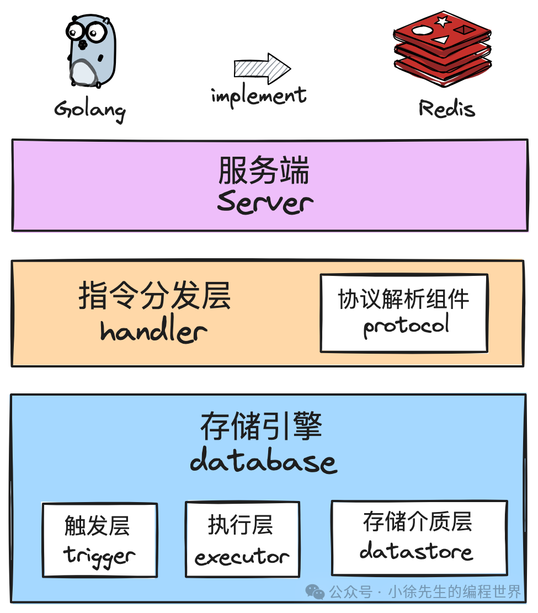
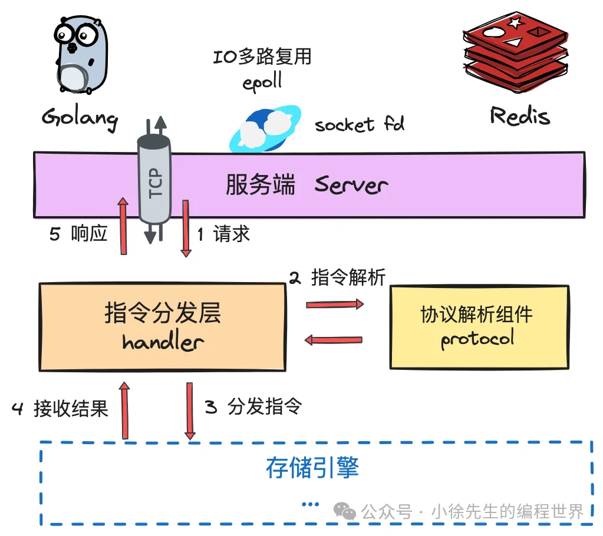

server->handler(parser)->dbtrigger->dbexecutor->kvstore(persister)

好的，我们来深入讲解一下这篇关于 `goredis` 项目主干框架的文章。

这篇文章详细阐述了如何使用 Go 语言构建一个 Redis 的简化版实现——`goredis`。其核心思想是通过分层架构，清晰地划分不同模块的职责，并借鉴了 Redis 的一些关键设计，如单线程（在此为单协程）模型处理数据操作，以实现无锁化的高效数据存取。

下面，我将按照文章的结构，对每个部分进行深入的剖析。

### 1. 核心目标与设计哲学

文章开篇明确了项目的目标：实现一个“乞丐版”的 Redis。这一定位很重要，意味着它会聚焦于核心功能的模仿，而非完整复刻。关键实现点包括：

- **TCP 服务端**: 使用 Go 标准库 `net` 构建网络服务，利用其底层的 I/O 多路复用能力来高效处理并发连接。
- **协议解析**: 还原 Redis 的序列化协议（RESP），将网络字节流转换为结构化的命令。
- **核心数据结构**: 支持 String, List, Set, HashMap, SortedSet 这五种常用类型及其基本操作。
- **数据持久化**: 实现 AOF (Append-Only File) 机制，保证数据在服务重启后不丢失。

其中，最核心的设计哲学是 **“单协程模型与无锁化”**。这意味着所有对核心数据的读写操作都将被路由到同一个、专门的 Goroutine 中串行执行。这样做的好处是：

- **避免竞态条件**: 因为只有一个协程能修改数据，所以天然地避免了多线程并发访问共享资源时需要处理的复杂锁机制（如互斥锁、读写锁）。
- **简化设计**: 无需为数据结构的每个操作都考虑加锁和解锁，代码逻辑更清晰。
- **提升性能**: 在单核或特定场景下，避免了锁竞争和上下文切换带来的开销。这正是 Redis 高性能的关键原因之一。

### 2. 架构总览 (Architecture Overview)

`goredis` 采用了经典的三层垂直架构，使得请求处理流程非常清晰：

1.  **服务运行层 (Service Layer)**:

    - **职责**: 负责网络交互，是整个应用的入口。它监听指定端口，接收客户端的 TCP 连接，并将连接交给下一层处理。
    - **组件**: `Application` (应用抽象), `Server` (TCP 服务)。

2.  **指令分发层 (Command Dispatch Layer)**:

    - **职责**: 承上启下。它从服务层接收原始的 TCP 连接，读取字节流，按照 Redis 协议将其解析成具体的命令（如 `SET key value`），然后将解析后的命令分发给存储引擎执行。
    - **组件**: `Handler` (指令分发器), `Parser` (协议解析器)。

3.  **存储引擎层 (Storage Engine Layer)**:
    - **职责**: 实际的数据处理中心。它负责执行命令、管理内存中的数据、处理数据过期、以及将数据写入磁盘进行持久化。
    - **组件**: `Executor` (执行器), `Trigger` (触发器), `KVStore` (存储介质), `Persister` (持久化)。

**请求处理的完整链路**:
`Server` -> `Handler` (内部使用 `Parser`) -> `DBTrigger` -> `DBExecutor` -> `KVStore` (可能与 `Persister` 交互)

**依赖注入 (DI)**:
项目使用了 `uber-go/dig` 库来实现依赖注入。`app/factory.go` 文件是 DI 容器的配置中心，它清晰地定义了各个组件的创建方式和它们之间的依赖关系。这种方式极大地降低了模块间的耦合度，使得代码更易于测试和维护。

### 3. 服务运行层 (Service Layer) 详解

这一层是应用的“外壳”。

- **`Application` (`app/app.go`)**:

  - 是对整个应用的最高层封装。它持有 `Server` 实例和配置 `Config`。
  - `Run()` 方法实际上是调用 `server.Serve()` 来启动服务。
  - `Stop()` 方法则负责优雅地关闭服务。

- **`Server` (`server/server.go`)**:
  - 核心职责是监听网络端口并接受连接。
  - 它持有一个 `Handler` 接口，体现了面向接口编程的思想。
  - `Serve()` 方法首先启动 `Handler`（用于加载持久化数据等预处理），然后进入一个无限循环 `listenAndServe`。
  - 在 `listenAndServe` 中，`listener.Accept()` 会阻塞等待新连接。
  - **关键点**: 每当一个新连接 `conn` 到来，它会使用 `ants` 协程池提交一个任务 `pool.Submit(func() { s.handler.Handle(ctx, conn) })`。这意味着 **每个客户端连接都会由一个独立的 Goroutine 来处理**（Goroutine-per-Connection 模型），实现了高并发。使用协程池是为了复用 Goroutine，避免在高并发下无限制地创建 Goroutine 导致资源耗尽。

### 4. 指令分发层 (Command Dispatch Layer) 详解

这一层是连接网络与数据的“翻译官”。

- **`Handler` (`handler/handler.go`)**:

  - 实现了 `Handler` 接口，是连接处理的逻辑核心。
  - 它持有 `DB` (存储引擎)、`Parser` (解析器) 和 `Persister` (持久化) 的实例。
  - `Start()` 方法在服务启动时被调用，它会通过 `persister` 加载 AOF 文件，将历史命令重新执行一遍，从而恢复内存中的数据状态。
  - `Handle()` 方法是处理单个连接的主循环。它利用 `parser.ParseStream(conn)` 将一个 `io.Reader` (网络连接) 转换成一个只读的 channel (`<-chan *Droplet`)。
  - `handle()` 内部的 `for-select` 循环不断地从这个 channel 中接收解析好的命令 (`Droplet`)。
  - `handleDroplet()` 接收到命令后，调用 `db.Do()` 将命令交给存储引擎执行，并等待返回结果 `Reply`。最后，它将 `Reply` 序列化成字节流写回给客户端 `conn.Write(reply.ToBytes())`。

- **`Parser` (`protocol/parser.go`)**:
  - 职责是实现 Redis 协议解析。
  - `ParseStream` 方法非常巧妙：它创建一个 channel，然后启动一个后台 Goroutine 去执行 `parse` 方法。这个 Goroutine 会持续地从 `io.Reader` 读取数据，解析出一条条完整的 Redis 命令，然后将解析结果封装成 `Droplet` 发送到 channel 中。
  - `parse` 方法通过 `bufio.NewReader` 逐行读取，根据 Redis 协议的第一个字节（如 `*` 表示多行命令）来选择不同的行解析函数 `lineParser`，最终将请求参数解析出来。

### 5. 存储引擎层 (Storage Engine Layer) 详解

这是 `goredis` 的心脏，也是体现其单协程无锁化设计的关键。

- **`DBTrigger` (`database/trigger.go`)**:

  - 它实现了 `DB` 接口，是存储引擎对外的门面。
  - `Do()` 方法接收到 `Handler` 传来的命令后，并不直接执行。而是将命令和参数封装成一个 `Command` 对象。
  - 这个 `Command` 对象包含一个 `receiver` channel，用于接收执行结果。
  - **关键点**: `DBTrigger` 将 `Command` 对象发送到 `executor.Entrance()` channel 中。这是一个**同步转异步**的过程。`Do` 方法会阻塞在 `<-cmd.Receiver()`，直到 `Executor` 处理完命令并通过 `receiver` channel 返回结果。

- **`DBExecutor` (`database/executor.go`)**:

  - 这是**单协程模型的实现核心**。`DBExecutor` 在系统初始化时会创建一个全局单例，并启动 `run()` 方法。
  - `run()` 方法内是一个 `for-select` 无限循环，它只监听两个 channel：
    1.  `e.ch` (`Entrance()`): 从 `DBTrigger` 接收新的命令。
    2.  `e.gcTicker.C`: 定时器 channel，用于触发定期的过期键回收 (`GC`)。
  - **所有的数据操作都汇集于此**。当从 `e.ch` 收到 `cmd` 时，它会查找 `cmdHandlers` map 找到对应的处理函数（如 `handleSet`, `handleGet`），执行该函数。
  - 在执行具体命令前，它会先进行**惰性删除** (`ExpirePreprocess`)，检查命令操作的 key 是否已过期。
  - 执行完毕后，将结果 `Reply` 发送到 `cmd.receiver` channel，此时 `DBTrigger` 中的 `Do` 方法解除阻塞，并将结果返回给上层 `Handler`。
  - 由于 `run()` 运行在单个 Goroutine 中，所有对 `dataStore` 的访问都是串行的，因此 `dataStore` 内部的数据结构（如 `map`）无需加锁。

- **`KVStore` (`database/kv_store.go`)**:

  - 实现了 `DataStore` 接口，是真正存储数据的地方。
  - `data map[string]interface{}`: 一个普通的 Go map，用于存储键值对。因为上层 `DBExecutor` 保证了串行访问，所以它不需要锁。
  - `expiredAt map[string]time.Time`: 另一个 map，用于记录键的过期时间。
  - 它实现了所有数据类型的具体操作方法，如 `Get`, `Set`, `LPush` 等。这些方法直接操作 `data` 和 `expiredAt` 这两个 map。

- **`Persister` (`persist/aof.go`)**:
  - 负责 AOF 持久化。当 `DBExecutor` 执行一个写命令时，它会同时调用 `persister.PersistCmd()`。
  - `PersistCmd` 会将命令发送到内部的 `buffer` channel。
  - `aofPersister` 内部有另一个 Goroutine，负责从 `buffer` channel 中取出命令，并根据配置的持久化策略（如 `appendFsync`）将其写入到 AOF 文件中。这个过程是异步的，不会阻塞主命令的执行。

### 总结

这篇文章通过一个实际项目 `goredis`，清晰地展示了构建一个高性能网络服务的基本框架和设计模式：

1.  **分层架构**: 将网络、逻辑、存储清晰分离，职责单一，易于理解和扩展。
2.  **依赖注入**: 使用 `dig` 解耦各模块，提升了代码的可维护性和可测试性。
3.  **并发模型**: 采用 "Goroutine-per-Connection" + 协程池的模式处理网络并发，高效且稳定。
4.  **核心数据模型**: 借鉴 Redis 的精髓，采用**单协程串行执行**数据操作，通过 channel 在不同协程间安全地传递数据和指令，巧妙地实现了无锁化数据存储，简化了并发控制。
5.  **异步化**: 像持久化、协议解析等耗时或阻塞操作都通过独立的 Goroutine 异步执行，保证主处理流程的流畅。

通过对这个主干框架的理解，可以为后续深入学习指令分发细节、存储引擎实现以及持久化策略打下坚实的基础。这是一个非常优秀的 Go 项目学习范例。
