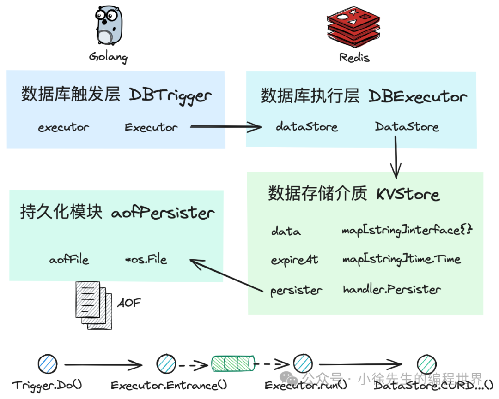

好的，这是 `基于go实现redis之存储引擎` 的详细内容。

---

### 基于 go 实现 redis 之存储引擎

#### 0 前言

欢迎回来，由我们一起继续推进技术分享专题—— **【基于 go 实现 redis】**。

此前我已于 github 开源项目——`goredis`，由于我个人水平有限，如有实现不到位之处，欢迎批评指正：https://github.com/xiaoxuxiansheng/goredis



本系列正是围绕着开源项目`goredis`展开，共分为四篇内容，本文为其中的第三篇——存储引擎篇：

- **基于 go 实现 redis 之主干框架（已完成）**： 在宏观视角下纵览 goredis 整体架构，梳理各模块间的关联性
- **基于 go 实现 redis 之指令分发（已完成）**： 聚焦介绍 goredis 服务端如何启动和运行，并在接收客户端请求后实现指令协议的解析和分发
- **基于 go 实现 redis 之存储引擎（本篇）**： 聚焦介绍数据存储层中单协程无锁化执行框架，各类基本数据类型的底层实现细节，以及过期数据的惰性和定期回收机制
- **基于 go 实现 redis 之数据持久化（待填坑）**： 介绍 goredis 关于 aof 持久化机制的实现以及有关于 aof 重写策略的执行细节

#### 1 架构梳理

在往期内容中，我们介绍了有关 `goredis` 的整体架构，探讨了 `goredis` 的 server 端如何运行，指令分发层如何遵循 RESP 协议将原始请求内容解析成可识别的操作指令，并将其发往存储引擎层进行执行。

接下来我们就要正式打开存储引擎模块的黑盒子一探究竟。

##### 1.1 DB

在上层 `handler` 的视角中，整个存储引擎模块是一个整体 ， 被抽象成一个名为 `DB` 的接口，通过方法暴露出一个用于执行指令并返回结果的 `Do` 方法。接口定义代码位于 `handler/struct.go` 文件中：

```go
type DB interface {
    // 执行指令
    Do(ctx context.Context, cmdLine [][]byte) Reply
    // 关闭存储引擎
    Close()
}

type Reply interface {
    ToBytes() []byte
}
```

事实上从存储引擎内部视角中，可以将其自上而下拆分为三个模块：

- **数据触发层 Trigger**： 属于一个代理层，封装指令并将其投递给 `executor`。该模块采用并发模型。
- **数据执行层 Executor**： 接收来自 `trigger` 的指令，操作 `dataStore` 完成执行。该模块采用单例串行的执行模式。
- **数据存储介质 DataStore**： 底层存储数据的所在之处，收敛有关各种数据类型的实现模型和操作细节。


##### 1.2 Trigger

数据触发层 `trigger` 是狭义上针对 `DB` 接口的实现类。

从功能上看，`trigger` 负责封装指令并通过 channel 投递给底层的 `executor`，看起来只是扮演了一个简单的代理层角色，但是从职能架构上看，一方面实现了职能边界的拆分，另一方面实现了由并发模式到串行模式的过渡转换。

这部分代码位于 `database/trigger.go`：

```go
type DBTrigger struct {
    // 保证关闭操作单次执行的单例工具.
    once     sync.Once
    // 依赖的数据库执行层 executor
    executor Executor
}

func (d *DBTrigger) Do(ctx context.Context, cmdLine [][]byte) handler.Reply {
    // ...
    // 组装指令
    cmd := Command{
        ctx:      ctx,
        cmd:      cmdType,
        args:     cmdLine[1:],
        receiver: make(CmdReceiver),
    }

    // 投递给到 executor
    d.executor.Entrance() <- &cmd

    // 监听 chan，直到接收到返回的 reply
    return <-cmd.Receiver()
}
```

##### 1.3 Executor

`executor` 是全局单例运行的，通过串行执行的 `run` 方法进行数据操作流程的收口，保证底层数据存储介质一定只会在同一个协程中进行读写，不存在任何并发行为，因此底层存储模型可以实现无锁化。

有关 `executor` 的实现类代码位于 `database/executor.go`，其中包含如下核心成员属性：

- `ctx`、`cancel`：生命周期控制
- `ch`：从上游 `trigger` 接收指令的入口 channel
- `cmdHandlers`：各种指令类型对应的处理函数
- `dataStore`：更底层的存储介质
- `gcTicker`：定时驱动执行过期数据回收的定时器

```go
// 具体的数据库执行层实现类
type DBExecutor struct {
    // 生命周期控制
    ctx    context.Context
    cancel context.CancelFunc

    // 用户接收 cmd 的入口
    ch     chan *Command

    // 根据 cmd 类型映射到具体的处理方法
    cmdHandlers map[CmdType]CmdHandler

    // 数据存储介质
    dataStore   DataStore

    // 驱动定期执行过期数据回收的定时器
    gcTicker *time.Ticker
}

// executor 持续运行
func (e *DBExecutor) run() {
    for {
        select {
        case <-e.ctx.Done():
            return
        // 每隔一段时间批量回收过期的 key
        case <-e.gcTicker.C:
            e.dataStore.GC()
        // 接收来自 trigger 发送的 cmd，并执行具体的操作
        case cmd := <-e.ch:
            cmdFunc, ok := e.cmdHandlers[cmd.cmd]
            if !ok {
                cmd.receiver <- handler.NewErrReply("unsupported command")
                continue
            }
            // 惰性回收机制实现过期 key 删除
            e.dataStore.ExpirePreprocess(string(cmd.args[0]))
            // 将执行结果通过 receiver chan 发送给 trigger
            cmd.receiver <- cmdFunc(cmd)
        }
    }
}
```

##### 1.4 DataStore

针对数据存储介质的实现类是 `KVStore`，其中包含两个 map 和一个有序 set：

- `data` map： 记录了 redis 中的全量 key-value 数据。
- `expiredAt` map： 记录了各个 key 对应的过期时间。
- `expireTimeWheel` 有序 set： 基于过期时间实现 key 的有序存储，便于后续通过时间范围批量回收过期数据的操作。


这部分代码位于 `datastore/kv_store.go`：

```go
type KVStore struct {
    // 存储 key-value 数据的 map
    data      map[string]interface{}
    // 记录 key 过期时间的 map
    expiredAt map[string]time.Time
    // 各 key 根据过期时间排序的有序集合
    expireTimeWheel SortedSet
    // 持久化模块
    persister handler.Persister
}
```

#### 2 数据类型

在 `goredis` 中，暂时只支持了 redis 中最常见的五种数据类型，对应的方法和用途如下：


##### 2.1 string

对于其中最简单的字符串 `string` 类型，底层实现为一个简单的结构体。

```go
// 字符串数据类型接口定义
type String interface {
    // 将字符串内容转为字节数组表达形式
    Bytes() []byte
    database.CmdAdapter
}

// 字符串数据类型实现类
type stringEntity struct {
    key, str string
}

// 将字符串内容转为字节数组表达形式
func (s *stringEntity) Bytes() []byte {
    return []byte(s.str)
}
```

##### 2.2 list

针对列表 `list` 类型，底层通过切片 `[][]byte` 实现，支持一系列数据的追加和弹出操作。

```go
// 列表数据类型接口定义
type List interface {
    LPush(value []byte)
    LPop(cnt int64) [][]byte
    RPush(value []byte)
    RPop(cnt int64) [][]byte
    Len() int64
    Range(start, stop int64) [][]byte
    database.CmdAdapter
}

// 列表数据类型具体实现
type listEntity struct {
    key  string
    data [][]byte
}

// 从左侧推入数据
func (l *listEntity) LPush(value []byte) {
    l.data = append([][]byte{value}, l.data...)
}

// 从左侧弹出数据
func (l *listEntity) LPop(cnt int64) [][]byte {
    if int64(len(l.data)) < cnt {
        return nil
    }
    poped := l.data[:cnt]
    l.data = l.data[cnt:]
    return poped
}
// ... 其他方法类似
```

##### 2.3 set

集合 `set` 类型，底层通过一个 `map[string]struct{}` 来实现数据去重的功能。

```go
// 集合数据类型的接口定义
type Set interface {
    Add(value string) int64
    Exist(value string) int64
    Rem(value string) int64
    database.CmdAdapter
}

// 集合数据类型的实现类
type setEntity struct {
    key       string
    container map[string]struct{}
}

// 向集合中添加元素
func (s *setEntity) Add(value string) int64 {
    if _, ok := s.container[value]; ok {
        return 0
    }
    s.container[value] = struct{}{}
    return 1
}
// ... 其他方法类似
```

##### 2.4 hashmap

字典 `hashmap` 类型的底层就是对 Go 语言 `map` 数据结构的直接封装。

```go
// map 数据类型的接口定义
type HashMap interface {
    Put(key string, value []byte)
    Get(key string) []byte
    Del(key string) int64
    database.CmdAdapter
}

// map 数据类型的实现类
type hashMapEntity struct {
    key  string
    data map[string][]byte
}

// 将 kv 对写入 map
func (h *hashMapEntity) Put(key string, value []byte) {
    h.data[key] = value
}
// ... 其他方法类似
```

##### 2.5 zset

`zset`（SortedSet）为有序集合，支持将存入的元素按照分数高低进行排序。`goredis` 中通过跳表 `skiplist` 来实现 `zset`。

首先是关于有序集合 `zset` 的接口定义：

```go
// 有序集合数据类型的接口定义
type SortedSet interface {
    Add(score int64, member string)
    Rem(member string) int64
    Range(score1, score2 int64) []string
    database.CmdAdapter
}
```

在跳表 `skiplist` 类定义中，包含如下核心成员属性：

- `key`： 整个 `zset` 维度对应的 key。
- `memberToScore`： 记录了每个元素对应的分数，用于实现 member 的去重和快速查找分数。
- `scoreToNode`： 记录分数与跳表节点的映射关系。
- `head`： 跳表头节点。
- `rander`： 随机数生成器，用于在插入新节点时决定其高度。

```go
// 采用跳表作为有序集合数据类型的实现类
type skiplist struct {
    key           string
    scoreToNode   map[int64]*skipnode
    memberToScore map[string]int64
    head          *skipnode
    rander        *rand.Rand
}
```


由于 `zset` 本质上还是一个集合，所以在插入一个新元素时，首先需要判定其之前是否已经存在于有序集合中，如果是的话，需要对老数据进行删除，然后再遵循跳表的操作流程完成数据插入。

```go
// 往跳表中添加元素.
func (s *skiplist) Add(score int64, member string) {
    // member 此前已存在
    oldScore, ok := s.memberToScore[member]
    if ok {
        // 如果分数相同，则无需处理，直接返回
        if oldScore == score {
            return
        }
        // 分数不同，则需要先移除 member 旧数据，再执行添加流程
        s.rem(oldScore, member)
    }

    // 建立 member 映射到 score 的关系
    s.memberToScore[member] = score
    // 判断 score 对应的跳表节点是否存在
    node, ok := s.scoreToNode[score]
    if ok {
        // 节点已存在，则在节点对应的 member 集合中添加 member 即可
        node.members[member] = struct{}{}
        return
    }

    // 构造出 score 对应的跳表节点...
    // 将新节点插入跳表...
}
```

#### 3 指令执行


接下来，以 `get` 和 `set` 指令执行为例进行流程串联。

##### 3.1 Trigger

首先，数据触发层 `trigger` 接收到来自 `handler` 分发的指令后，会对指令内容合法性进行校验，然后对指令进行封装，并通过 `executor` 暴露出的 channel 将其投递到执行层：

```go
func (d *DBTrigger) Do(ctx context.Context, cmdLine [][]byte) handler.Reply {
    // 1. 指令校验...

    // 2. 指令封装
    cmd := Command{
        ctx:      ctx,
        cmd:      cmdType,
        args:     cmdLine[1:],
        receiver: make(CmdReceiver),
    }

    // 3. 指令投递
    d.executor.Entrance() <- &cmd

    // 4. 监听 chan，直到接收到返回的 reply
    return <-cmd.Receiver()
}
```

##### 3.2 Executor

数据执行层 `executor` 属于全局单例执行模式，通过单一协程运行 `run` 方法，持续接收来自 `trigger` 层投递的指令，根据指令类型映射到数据存储介质模块中对应的执行方法：

```go
func (e *DBExecutor) run() {
    for {
        select {
        // ...
        case cmd := <-e.ch:
            cmdFunc, ok := e.cmdHandlers[cmd.cmd]
            // ...
            cmd.receiver <- cmdFunc(cmd)
        }
    }
}
```

##### 3.3 KVStore

数据存储介质中封装了一系列具体的数据操作方法，以 `get` 和 `set` 方法为例进行展示，代码位于 `datastore/kv_store.go` 文件中。

`get` 方法相对比较简单，首先根据 key 从 `data` map 中获取 value，然后将其断言成 `String` 类型并返回：

```go
func (k *KVStore) Get(cmd *database.Command) handler.Reply {
    args := cmd.Args()
    key := string(args[0])
    v, err := k.getAsString(key)
    if err != nil {
        return handler.NewNillReply()
    }
    return handler.NewBulkReply(v.Bytes())
}

// 从 data map 中读取数据
func (k *KVStore) getAsString(key string) (String, error) {
    v, ok := k.data[key]
    if !ok {
        return nil, errors.New("not found")
    }
    str, ok := v.(String)
    if !ok {
        return nil, errors.New("wrong type")
    }
    return str, nil
}
```

`set` 的本质流程是往 `data` map 中写入一笔 kv 数据，但还需要兼顾考虑 `ex` 和 `nx` 的附属指令：

```go
func (k *KVStore) Set(cmd *database.Command) handler.Reply {
    args := cmd.Args()
    key := string(args[0])
    value := string(args[1])

    // 解析 NX EX 等参数...

    // 将 kv 数据写入到 data map
    affected := k.put(key, value, insertStrategy)

    // 过期时间设置
    if affected > 0 && ttlStrategy {
        expireAt := time.Now().Add(time.Duration(ttlSeconds) * time.Second)
        k.expire(key, expireAt)
        // 持久化 EXPIRE 指令
        k.persister.PersistCmd(cmd.Ctx(), ...)
    }

    if affected > 0 {
        // 持久化 SET 指令
        k.persister.PersistCmd(cmd.Ctx(), ...)
        return handler.NewIntReply(affected)
    }

    return handler.NewNillReply()
}
```

#### 4 过期回收

接下来，我们针对 `goredis` 中数据过期时间设置以及过期数据回收的流程进行串联。

##### 4.1 数据结构

在 `KVStore` 的类定义中，通过两个成员属性记录了有关过期时间的信息：

- `expiredAt`: 记录数据 key 对应的过期时间。
- `expireTimeWheel`: 一个特殊的有序集合，其中根据过期时间对 key 进行排序。

```go
type KVStore struct {
    // ...
    expiredAt map[string]time.Time
    expireTimeWheel SortedSet
    // ...
}
```


基于以上设计，我们对数据过期流程进行如下设计：

- **设置数据过期时间流程**： 分别记录 key 对应过期时间，并且将 key 添加到基于时间排序的有序集合中。
- **回收过期数据流程**：
  1.  **惰性删除**：在执行某个 key 的操作指令时，先通过过期时间 map 获取其过期信息，倘若数据已经过期，则对其进行删除。
  2.  **定期删除**：通过定时任务驱动，定期对有序集合中的已过期的数据进行回收。

##### 4.2 设置 TTL

在 `goredis` 的实现中，涉及到设置数据过期时间的指令包括 `set` (带 `ex`)、`expire`、`expireat`。


以 `expire` 指令为例，首先推算出数据的过期时间点，然后将 key 对应的过期时间添加到过期时间 map，并将其添加到过期时间有序集合中：

```go
func (k *KVStore) Expire(cmd *database.Command) handler.Reply {
    // ...
    expireAt := time.Now().Add(time.Duration(ttl) * time.Second)
    return k.expireAt(cmd.Ctx(), ..., key, expireAt)
}

func (k *KVStore) expireAt(ctx context.Context, cmd [][]byte, key string, expireAt time.Time) handler.Reply {
    k.expire(key, expireAt)
    k.persister.PersistCmd(ctx, cmd) // 持久化
    return handler.NewOKReply()
}

func (k *KVStore) expire(key string, expiredAt time.Time) {
    if _, ok := k.data[key]; !ok {
        return
    }
    k.expiredAt[key] = expiredAt
    k.expireTimeWheel.Add(expiredAt.Unix(), key)
}
```

##### 4.3 过期回收


数据执行层 `executor` 运行过程中，通过 `for-select` 运行模式同时监听 `gcTicker` 和 `cmdChan`。

**定期删除**：在接收到来自 `gcTicker` 信号时，会执行 `GC` 方法，通过过期时间有序集合获取到所有已过期的数据 key，然后一次性完成过期数据的回收：

```go
func (e *DBExecutor) run() {
    for {
        select {
        // ...
        case <-e.gcTicker.C:
            e.dataStore.GC()
        // ...
        }
    }
}

// filepath: datastore/kv_store.go
func (k *KVStore) GC() {
    // 找出当前所有已过期的 key，批量回收
    nowUnix := time.Now().Unix()
    for _, expiredKey := range k.expireTimeWheel.Range(0, nowUnix) {
        k.expireProcess(expiredKey)
    }
}

func (k *KVStore) expireProcess(key string) {
    delete(k.expiredAt, key)
    delete(k.data, key)
    k.expireTimeWheel.Rem(key)
}
```

**惰性删除**：在接收到来自 `cmdChan` 的操作指令时，则会针对 key 进行过期时间校验，倘若数据已过期，则在此时推动完成数据的回收：

```go
func (e *DBExecutor) run() {
    for {
        select {
        // ...
        case cmd := <-e.ch:
            // 惰性机制实现过期 key 删除
            e.dataStore.ExpirePreprocess(string(cmd.args[0]))
            // ...
        }
    }
}

// filepath: datastore/kv_store.go
func (k *KVStore) ExpirePreprocess(key string) {
    expiredAt, ok := k.expiredAt[key]
    if !ok {
        return
    }
    if expiredAt.After(time.Now()) {
        return
    }
    k.expireProcess(key)
}
```
