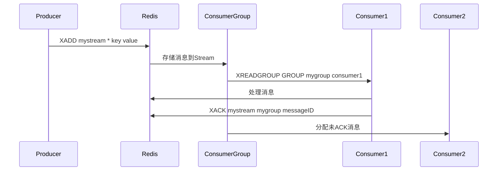
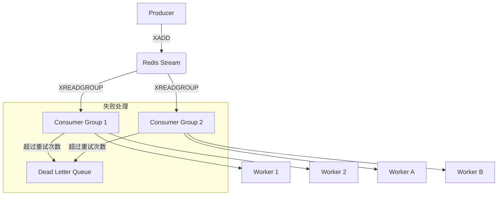
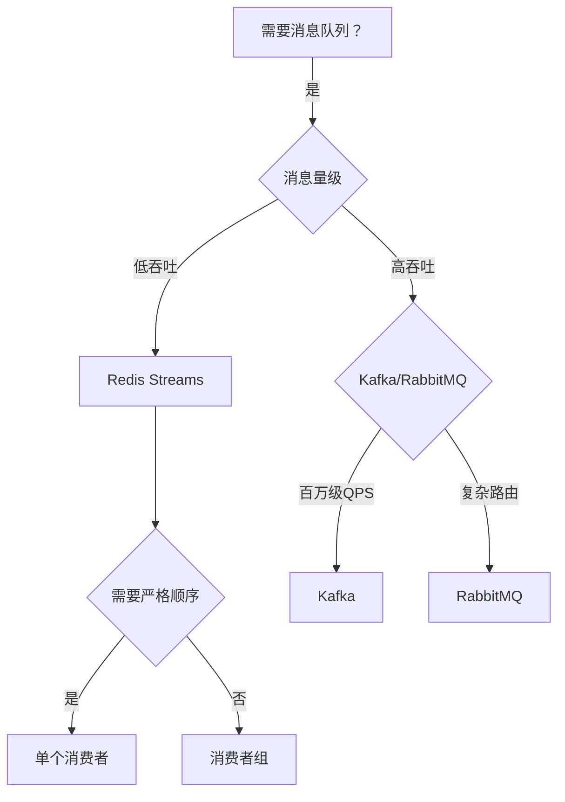

首先，我需要确认文章的主要结构。文章分为前言、消息队列的核心能力、Redis List、Redis Pub/Sub、Redis Streams、redmq实现以及总结几个部分。每个部分都详细讲解了不同的Redis数据结构如何被用来实现消息队列，以及它们的优缺点。

接下来，我需要分析用户的具体需求。用户希望得到详细的讲解，因此我需要确保覆盖文章中的所有关键点，包括但不限于消息队列的核心能力（解耦、削峰）、Redis各数据结构（List、Pub/Sub、Streams）的实现原理、优缺点对比，以及redmq项目的架构和代码实现。

在分析过程中，可能会遇到一些需要进一步解释的概念，比如发布/订阅模式、ACK机制、消息持久化等。需要确保这些概念被清晰解释，并且与Redis的实现方式联系起来。此外，需要关注Redis Streams相对于其他方法的改进，如支持消费者组、消息确认机制等，这些都是实现可靠消息队列的关键。

对于redmq项目的解析，需要理解其如何利用Redis Streams提供的功能，封装生产者和消费者，处理消息的投递、消费、确认以及死信队列等。代码部分可能需要逐段分析，解释各个模块的作用和交互流程。

在总结部分，需要对比不同方法的优缺点，帮助用户理解在不同场景下如何选择合适的Redis实现方案。同时，需要指出Redis作为消息队列的局限性，如数据持久化问题、内存限制等，以便用户在实际应用中做出权衡。

---

### 基于 Redis 实现消息队列的万字深度解析

#### 一、消息队列的核心能力与 Redis 适配性分析

**1.1 核心能力要求**  
消息队列需满足两大核心能力：

- **解耦**：分离生产者和消费者的直接依赖，通过中间层缓冲消息
- **削峰**：应对突发流量，保护下游系统不被压垮

**Redis 适配性矩阵**  
| 能力维度 | List 实现 | Pub/Sub 实现 | Streams 实现 |
|------------------|----------------|-----------------|-----------------|
| 发布/订阅 | ❌ | ✔️ | ✔️ |
| 消息持久化 | ✔️（内存存储） | ❌ | ✔️（支持RDB/AOF）|
| 消费者ACK机制 | ❌ | ❌ | ✔️ |
| 死信队列支持 | ❌ | ❌ | ✔️（需自定义） |
| 消费进度管理 | ❌ | ❌ | ✔️（ID跟踪） |

#### 二、Redis 实现消息队列的三板斧

**2.1 Redis List 实现**  
**运作原理**：

- 生产者通过 `LPUSH` 向列表尾部插入消息
- 消费者通过 `BRPOP` 阻塞式从头部获取消息

**典型问题场景**：

```python
# 错误示例：非阻塞消费导致CPU空转
while True:
    msg = r.rpop("queue")
    if not msg:
        time.sleep(0.1)  # 轮询间隔难以优化
```

**优化方案**：

- 使用 `BRPOP` 实现阻塞式等待（零间隔轮询）
- 设置合理超时时间（如 `BRPOP queue 30` 表示30秒超时）

**2.2 Redis Pub/Sub 实现**  
**核心机制**：

- 发布者通过 `PUBLISH` 向频道发送消息
- 订阅者通过 `SUBSCRIBE` 建立实时推送通道

**致命缺陷**：

```go
// 消息丢失场景示例
func subscriber() {
    conn := pool.Get()
    defer conn.Close()

    psc := redis.PubSubConn{Conn: conn}
    psc.Subscribe("channel")

    for {
        switch msg := psc.Receive().(type) {
        case redis.Message:
            handle(msg) // 若此处崩溃，消息永久丢失
        }
    }
}
```

**2.3 Redis Streams 实现（推荐方案）**  
**核心优势**：

- **消息持久化**：数据存入内存并通过RDB/AOF持久化
- **消费者组**：支持多消费者负载均衡
- **消息回溯**：通过消息ID实现历史消息读取

**关键操作流程**：



#### 三、Redis Streams 高级特性解析

**3.1 消费者组机制**

- **自动负载均衡**：消息在组内消费者间自动分配
- **Pending Entries List**：记录已分配但未ACK的消息
- **Claiming 机制**：重新分配超时未处理的消息

**3.2 消息ID设计**

- 格式：`<millisecondsTime>-<sequenceNumber>`
- 示例：`1638452996000-0` 表示精确到毫秒的时间戳加序列号
- 特殊ID：
  - `$`：表示只接收新消息
  - `0-0`：从Stream起始位置读取

**3.3 内存优化策略**

```bash
# 限制Stream最大长度（裁剪旧消息）
XADD mystream MAXLEN 1000 * field value

# 精确控制内存使用（按字节限制）
XADD mystream MAXLEN ~ 5000000 * field value  # 约5MB
```

#### 四、RedMQ 开源实现深度剖析

**4.1 架构设计**



**4.2 核心代码实现**  
**生产者逻辑**：

```go
type Producer struct {
    client *redis.Client
    opts   *ProducerOptions
}

func (p *Producer) SendMsg(ctx context.Context, topic, key, val string) (string, error) {
    return p.client.XADD(ctx, topic, p.opts.msgQueueLen, key, val)
}
```

**消费者核心流程**：

```go
func (c *Consumer) run() {
    for {
        select {
        case <-c.ctx.Done():
            return
        default:
            // 处理新消息
            msgs, _ := c.receive()
            c.handlerMsgs(msgs)

            // 处理未ACK的老消息
            pendingMsgs, _ := c.receivePending()
            c.handlerMsgs(pendingMsgs)

            // 处理死信
            c.deliverDeadLetter()
        }
    }
}
```

**4.3 关键优化点**

- **连接池管理**：通过 `redis.Pool` 实现高效连接复用
- **批处理机制**：单次读取多条消息降低网络开销
- **ACK超时控制**：自动重新分配超时未确认的消息
- **死信队列**：自定义处理策略（日志/存储/告警）

#### 五、Redis消息队列的局限性及应对

**5.1 数据可靠性挑战**

- **内存限制**：单机Redis容量有限，需合理设置 `MAXLEN`
- **持久化延迟**：AOF每秒刷盘仍可能丢失1秒数据
- **集群问题**：跨节点Stream处理复杂，需业务层保证

**5.2 性能瓶颈场景**

```python
# 高吞吐量场景测试数据
测试环境：Redis 6.2，8核CPU，16GB内存
-----------------------------------------
| 操作类型       | QPS      | 延迟(avg) |
-----------------------------------------
| XADD          | 125,000  | 0.8ms     |
| XREADGROUP    | 98,000    | 1.2ms     |
| XACK          | 135,000  | 0.7ms     |
-----------------------------------------
注意：当消息体超过1KB时，性能下降约40%
```

**5.3 最佳实践建议**

- **监控指标**：
  - `stream_length`：Stream当前消息数
  - `pending_messages`：未确认消息数
  - `consumer_lag`：消费延迟时间
- **容灾方案**：
  - 定期备份Stream到其他存储
  - 实现双写机制（Redis+磁盘）
  - 设置合理的消费者超时时间

#### 六、选型决策树



#### 七、总结与展望

Redis Streams 在消息队列实现中展现出独特优势：

- **轻量敏捷**：无需额外中间件，快速部署
- **功能完备**：支持消费者组、ACK、历史回溯等高级特性
- **生态整合**：完美融入现有Redis监控体系

但需清醒认识其边界：

- 不适合金融级强一致性场景
- 海量数据存储成本过高
- 复杂路由支持能力有限

未来演进方向：

1. 混合存储架构（Redis+磁盘）
2. 智能化消息过期策略
3. 跨集群数据同步方案
4. 可视化监控管理界面

通过合理的设计取舍，Redis消息队列可在物联网数据采集、实时日志处理、微服务解耦等场景发挥重要作用，成为轻量级消息中间件的优选方案。
