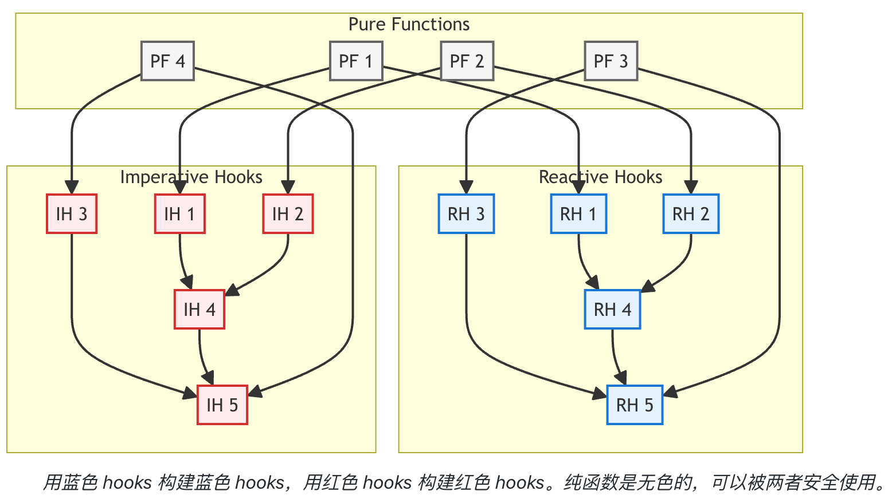

**React hooks 也有"颜色"——不是关于同步/异步，而是关于响应式和命令式。**

## preface

```ts
// 需求 1：向用户展示当前节点可以引用的变量，并在连接发生变化时实时更新。

function useNodeVariables(nodeId: string) {
  const graph = useWorkflowGraph()

  return useMemo(() => {
    const upstreamNodes = findUpstreamNodes(graph, nodeId)
    return extractVariables(upstreamNodes)
  }, [graph, nodeId])
}

function VariablePicker({ nodeId }: { nodeId: string }) {
  const variables = useNodeVariables(nodeId) // 自动更新！

  return (
    <div>
      {variables.map(v => (
        <VariableOption key={v.id} variable={v} />
      ))}
    </div>
  )
}
```

```ts
// 需求 2：当用户保存 Workflow 时，验证所有变量引用是否仍然有效，并为无效的引用显示错误。
for (const node of allNodes) {
  const variables = useNodeVariables(node.id) // 🚨 这样不行！你不能在循环或事件处理函数中调用 hooks！
  const brokenRefs = findBrokenReferences(node, variables)
  validationErrors.push(...brokenRefs)
}

// !初次尝试：将 Hook 移到组件层级
// 不行：你在验证时需要所有节点的变量，但你的响应式 hook 一次只能处理一个节点，而且只能在组件渲染周期内工作。
//
// 你意识到自己面临两个根本不同的使用场景：
//
// UI 显示：显示特定节点的变量，在图发生变化时自动更新
// 事件处理：在保存验证期间按需获取任何节点的变量
// !你的响应式 hook 在场景 #1 中表现出色，但在场景 #2 中完全不适用。你需要为事件处理函数采用不同的方法——`一些可以命令式调用的东西`，能够在 React 渲染周期之外工作。
//
// 解决方案：创建两个不同的 Hook
//
// 用于 UI 组件 - 响应式，自动更新
function useNodeVariables(nodeId: string) {
  const graph = useWorkflowGraph()
  return useMemo(() => {
    const upstreamNodes = findUpstreamNodes(graph, nodeId)
    return extractVariables(upstreamNodes)
  }, [graph, nodeId])
}

// 用于事件回调函数 - 命令式，按需调用
function useGetNodeVariables() {
  const getGraph = useGetWorkflowGraph() // 也是命令式的
  return useCallback(
    (nodeId: string) => {
      const graph = getGraph()
      const upstreamNodes = findUpstreamNodes(graph, nodeId)
      return extractVariables(upstreamNodes)
    },
    [getGraph]
  )
}

// 现在你的保存验证功能运行得很完美：
function SaveButton() {
  const getNodeVariables = useGetNodeVariables()

  const handleSave = async () => {
    const allNodes = getAllNodes()
    const validationErrors = []

    for (const node of allNodes) {
      const variables = getNodeVariables(node.id) // ✅ 在事件回调函数中工作！
      const brokenRefs = findBrokenReferences(node, variables)
      validationErrors.push(...brokenRefs)
    }

    if (validationErrors.length === 0) {
      await saveWorkflow()
    } else {
      showErrors(validationErrors)
    }
  }

  return <button onClick={handleSave}>Save</button>
}

// useNodeVariables 用于需要自动更新的 UI 组件
// useGetNodeVariables 用于需要按需访问的事件处理函数
//
//
// 还有个问题：代码重复
// 响应式版本
function useNodeVariables(nodeId: string) {
  const graph = useWorkflowGraph()
  return useMemo(() => {
    const upstreamNodes = findUpstreamNodes(graph, nodeId) // 🔄 重复了
    return extractVariables(upstreamNodes) // 🔄 重复了
  }, [graph, nodeId])
}

// 命令式版本
function useGetNodeVariables() {
  const getGraph = useGetWorkflowGraph()

  return useCallback(
    (nodeId: string) => {
      const graph = getGraph()
      const upstreamNodes = findUpstreamNodes(graph, nodeId) // 🔄 重复了
      return extractVariables(upstreamNodes) // 🔄 重复了
    },
    [getGraph]
  )
}

// 这种重复很危险。当业务逻辑需要变更时会怎样？你需要在两个地方同时更新，很容易遗漏其中一个。而且，如果逻辑存在 bug，你就得修复两次。
```

解决方案：**提取纯函数**
核心思路是将核心业务逻辑提取到纯函数中：

```ts
// 纯函数 - 没有 React，没有 hooks，只有逻辑
function calculateNodeVariables(graph: WorkflowGraph, nodeId: string) {
  const upstreamNodes = findUpstreamNodes(graph, nodeId)
  return extractVariables(upstreamNodes)
}

// 响应式 hook - 使用纯函数
function useNodeVariables(nodeId: string) {
  const graph = useWorkflowGraph()
  return useMemo(() => calculateNodeVariables(graph, nodeId), [graph, nodeId])
}

// 命令式 hook - 使用相同的纯函数
function useGetNodeVariables() {
  const getGraph = useGetWorkflowGraph()

  return useCallback(
    (nodeId: string) => {
      const graph = getGraph()
      return calculateNodeVariables(graph, nodeId)
    },
    [getGraph]
  )
}
```

- 易于测试：无需 React 上下文，只需传入参数并检查输出
- 可重用：可以在其他环境中使用（服务器端、workers 等）

## 发现 Hook 的颜色

**React hooks 也有"颜色"——不是关于同步/异步，而是关于响应式和命令式。**

- 🔵 响应式 Hook（蓝色 Hook）
  订阅状态变化并自动更新
  当依赖项变化时触发重新渲染
  非常适合 UI 场景，需要实时更新
- 🔴 命令式 Hook（红色 Hook）
  返回函数，按需获取数据
  不触发重新渲染或订阅变化
  非常适合事件处理函数，响应式按需执行

### 颜色不能随意混合


使用蓝色 hooks 的红色 hooks 变成了响应式的，失去了按需调用的特性
使用红色 hooks 的蓝色 hooks 变成了静态的，失去了自动更新能力

**组件显示的是过时数据。getGraph() 返回的是 hook 创建时的快照，所以 UI 不会随着图的变化而更新。**

```ts
// 🔵 蓝色 hook 试图使用红色 hook ❌
function useNodeVariables(nodeId: string) {
  const getGraph = useGetWorkflowGraph() // 🔴 蓝色 hook 中的红色 hook

  return useMemo(() => {
    const graph = getGraph()
    const upstreamNodes = findUpstreamNodes(graph, nodeId)
    return extractVariables(upstreamNodes)
  }, [getGraph, nodeId])
}
```

**getNodeVariables 在每次图更新时都会重新创建回调函数，导致不必要的重新渲染和资源浪费**

```ts
// 🔴 红色 hook 试图使用蓝色 hook ❌
function useGetNodeVariables() {
  const graph = useWorkflowGraph() // 🔵 红色 hook 中的蓝色 hook

  return useCallback(
    (nodeId: string) => {
      const upstreamNodes = findUpstreamNodes(graph, nodeId)
      return extractVariables(upstreamNodes)
    },
    [graph]
  )
}
```

### 不是每个 Hook 都需要两种颜色

回到我们的 useNodeVariables 例子，你可能已经注意到一个性能问题。
假设 graph 里面保存了节点的位置信息，那么每次用户在画布上拖动节点时，图都会更新，这会触发 findUpstreamNodes 重新计算——`尽管节点位置并不影响变量的可用性。`

**selector** 很重要!!!

```ts
function useAbstractWorkflowGraph() {
  const fullGraph = useWorkflowGraph()
  // 这个 hook 返回一个忽略位置变化的图
  // 只在节点 ID、连接或节点数据变化时更新
  return useCustomCompareMemo(
    () => fullGraph,
    [fullGraph],
    (prevGraph, nextGraph) => {
      // 自定义比较：只关心结构变化，不关心位置
      return isGraphStructurallyEqual(prevGraph, nextGraph)
    }
  )
}

// 现在我们的变量 hook 不会在位置变化时重新计算
function useNodeVariables(nodeId: string) {
  const graph = useAbstractWorkflowGraph() // 只在结构变化时更新
  return useMemo(() => {
    const upstreamNodes = findUpstreamNodes(graph, nodeId)
    return extractVariables(upstreamNodes)
  }, [graph, nodeId])
}
```

仔细思考后你会发现：useAbstractWorkflowGraph 不需要命令式版本。命令式版本没有意义，**因为红色场景没有这个 hook 要解决的"频繁更新"问题。它们可以在需要数据时直接使用。**

## 命名约定：让意图一目了然

- 蓝色 Hook（响应式）：use[Thing]
  特点是：返回实际数据、自动更新，适用于 UI 组件。
- 红色 Hook（命令式）：useGet[Thing] 或 use[Action]
  特点是：返回一个函数，需要新数据时调用，适用于事件处理函数。
- 纯函数：基于动词
  特点是：没有"use"前缀，名字描述了它们做什么，`可测试和可重用`。

## 总结

你编写的每个 hook 都在对响应性做出隐式选择，这将约束每个依赖它的 hook。
所以，下一次设计 hooks 时，也许应该先问问自己：
你的 hook 是什么颜色的？
