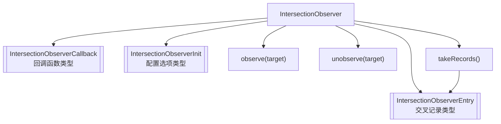

- **IntersectionObserver**：核心类，用于监听元素与视口或父元素的交叉状态。
- **IntersectionObserverCallback**：交叉状态变化时触发的回调类型。
- **IntersectionObserverInit**：配置观察器行为的参数类型。
- **IntersectionObserverEntry**：每次交叉变化时生成的记录类型。
- **observe(target)**：开始监听目标元素。
- **unobserve(target)**：停止监听目标元素。
- **takeRecords()**：获取未处理的交叉记录。
