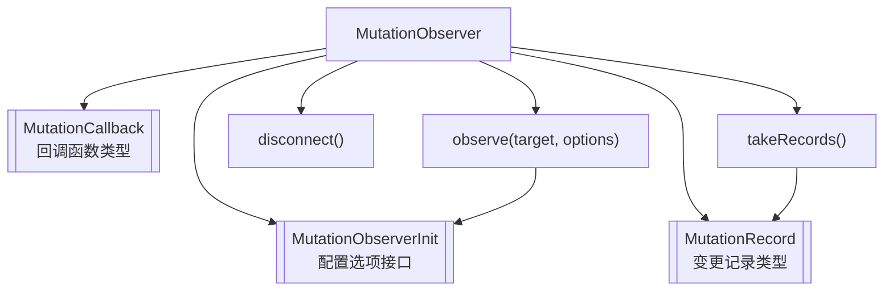

- **MutationObserver**：核心类，用于监听 DOM 变化。
- **MutationCallback**：DOM 变化时触发的回调函数类型。
- **MutationObserverInit**：配置监听哪些变化的参数类型。
- **MutationRecord**：每次 DOM 变化时生成的变更记录类型。
- **observe(target, options)**：开始监听，参数分别是目标节点和配置。
- **disconnect()**：停止监听。
- **takeRecords()**：获取未处理的变更记录。
