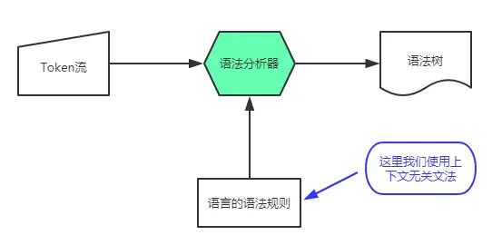

crafting interpreters
一本制作程序设计语言的指南

英文版：https://craftinginterpreters.com/
中文版：https://github.com/GuoYaxiang/craftinginterpreters_zh
https://zihengcat.github.io/crafting-interpreters-zh-cn/a-map-of-the-territory.html
笔记：
https://misakatang.cn/2024/01/18/crafting-interpreters-notes/
https://xffxff.github.io/posts/crafting_interpreters_1
https://timothya.com/learning/crafting-interpreters/

# I WELCOME 导读

真正实现 lox 语言两次

## 1 Introduction 前言

不在编译理论部分着墨过多。当我们逐步搭建起编译系统的各个部分之时，我再向你介绍关于这部分的历史与其背后的概念。

在大部分情况下，我们都将绞尽脑汁先让我们的程序运行起来。这并不意味着理论不重要，能够正确且形式化地推导语法和语义是开发程序设计语言一项至关重要的技能。但是，我个人还是喜欢边做边学。通读大段大段充斥抽象概念的段落并充分理解其含义对我来说实在是太过困难，但如果让我写下几行代码，跑一跑，跟踪 debug 一下，我很快就可以掌握它。

动手实操，对一门真正程序设计语言的诞生过程留下一个坚实的印象。

### 为什么要学习它

- 小众语言(DSL)无处不在
  对于任何一支成功的通用程序设计语言，都会有上千种其他语言与其相辅相成。我们通常将它们称为“小众语言(Domain-specific Languages，DSL)”。
  用途：应用程序脚本、模版引擎、标记格式、配置文件等
  
  如果当现有的领域特定语言代码库无法满足你的需求时，你还是需要勉为其难地手写一枚解析器或者类似的工具以满足需求。即使你想要重用一些现有的代码，你也将不可避免地对其进行调试和维护，深入研究其原理。
- 提高编程能力
  长跑运动员负重、高原训练的例子

- 自举(bootstraping)
  编译器以一种语言读取文件。 翻译它们，并以另一种语言输出文件。你可以使用任何一种语言（包括与目标语言相同的语言）来实现编译器，该过程称为“自举”。
  编译器的自举就是用 X 语言自己开发的编译器来编译 X 语言本身。
  例如：ts 的编译(转译)器先是 js 写的，后来是 ts 自举。
- **编程语言的名字有什么含义吗？**

1. 尚未使用 -> 版权问题!
2. 容易发音 -> 容易记
3. 足够独特，易于搜索 -> 如果你将语言命名为“for”，那对用户基本不会有任何帮助
4. 文化上没有负面含义 -> Nimrod 编程语言的设计师最终将其语言重命名为“Nim”，因为太多的人只记得 Bugs Bunny 使用“Nimrod”作为一种侮辱（其实是讽刺）。

## 2 A Map of the Territory 解释器简介

1. 
   SourceCode
   ↓
   Scanning
   ↓
   (Tokens)
   ↓
   Parsing
   ↓
   (Synctax Tree)
   ↓
   Static Analysis
   ↓
   -> (Tree-Walk Interpreter) -> Transpiling -> `Hight-Level Language`
   ↓
   (Intermediate Representation)
   ↓
   Optimization -> Transpiling -> `Hight-Level Language`
   ↓
   Code Generation -> (Virtual Machine) -> `ByteCode`
   ↓
   `Machine Code`

**前端是把源代码字符串转换为结构化数据，中端是针对变形后的结构化数据反复做优化，后端是从优化后的数据生成真实的机器指令。**

- 前端（Front end）:
  词法分析、语法分析、语义分析
- 中端（Middle end）:
  中间代码表示；IR 中间代码更像是介于源代码与二进制机器码之间的接口。
  目的是简化跨平台。
- 后端（Back end）：
  代码优化、代码生成
  代码优化技巧:

  - 常量折叠（constant folding）
    编译时用常数值替换整个表达式
  - 常量传播（constant propagation）
    用常数值替换变量
  - 死代码消除（dead code elimination）
    删除永远不会执行的代码
  - 公共子表达式消除（common subexpression elimination）
    识别重复计算的表达式
  - 循环不变代码外提（loop-invariant code motion）
    将循环内不变的代码移到循环外
  - 全局值编号（global value numbering）
    为每个值分配唯一的编号，以便识别重复的计算
  - 折减表达式的计算强度（strength reduction）
    用更快的操作替换慢的操作
  - 聚合标量替换（scalar replacement of aggregates）
    将数组和结构体拆分为单独的变量
  - 循环展开（loop unrolling）
    复制循环体，减少循环开销

  许多成功的程序设计语言在编译时所做的代码优化都很少，它们仅在编译时生成未优化的代码，而将性能优化的重点放到了运行时，如：Lua 和 CPython。

  代码生成：
  `一种是直接生成机器码，另一种是生成字节码。`
  字节码(Bytecode)是一种中间表示，介于源代码和机器码之间。
  字节码运行在`虚拟机`上，虚拟机要在运行时逐条翻译字节码指令解释执行。
  通过虚拟机执行字节码，相比起将字节码编译到目标平台机器码再执行，程序运行效率要慢上很多。
  作为回报，你收获了编译器实现的简单性与可移植性。
  你可以使用 C 语言编写一个虚拟机程序，这样一来，你设计的程序语言就可以在所有拥有 C 语言编译器的平台上运行

  > 编译领域的一个基本原则是：越把与体系结构相关的编译工作推后，就有越多先前的编译阶段可供跨平台共享。

  运行程序：
  如果我们编译到目标平台机器码，我们可以简单地招呼操作系统装载可执行程序上 CPU 执行。如果我们编译到字节码，那么我们需要启动虚拟机，加载字节码程序并执行。
  不管是哪种情况，对于所有低阶语言（如：汇编语言）以外的程序语言来说，通常都需要在程序运行的时候提供一些额外的服务，例如：如果该语言支持自动内存管理，那我们就需要实现一枚垃圾收集器回收不再使用的内存；如果该语言支持 instance of 这样的运算符查看对象类型（即：反射），我们就需要在程序运行过程中追踪每一个对象的类型。
  `所有这些事情都会在程序运行的时候发生，所以被称为运行时（Runtime）。`
  完全编译到二进制机器码的程序设计语言会将语言运行时的代码实现`直接插入`到编译后的可执行程序之中。Go 语言便是如此，每一个编译后的 Go 程序都被嵌入了一份完整的 Go 运行时拷贝。
  如果程序在解释器或虚拟机中运行，那么语言运行时就存在于解释器或虚拟机中，大部分虚拟机语言的具体实现都是如此：Java、Python、JavaScript。

2. 捷径与可选道路

- 单遍扫描编译器(Single-pass compilers)
  一些简单的编译器将词法解析、代码分析、代码生成这些步骤糅合到一起，直接在解析器中生成目标代码，而不生成任何语法树或其他 IR 中间代码。
  程序语言必须被设计为，当编译器首次看到程序表达式就能够正确编译的形式。
  这些单遍扫描编译器（Single-pass compilers）制约了程序语言的设计与发展。`既没有任何中间数据结构存储关于程序的全局信息，也没有办法可以再访问先前已经解析过的代码部分。`
  Pascal 语言与 C 语言就是采用了单遍扫描的设计方式。在 Pascal 与 C 诞生的那个年代，计算机内存极其宝贵，以至于编译器甚至都无法将一份源代码文件完整地载入到内存中，更不用说整支程序了。
  **这就是为什么 Pascal 语法要求类型声明必须出现在程序块开头的位置。这也是为什么 C 语言无法调用代码下方定义的函数**，除非做前向声明（forward declaration）显式告诉编译器此处调用函数的必要信息，编译器才能正确地生成出代码。
- 树遍历解释器(Tree-walk interpreters)
  一些程序语言在将代码解析为抽象语法树，再配合上一点静态分析后，就开始执行代码。执行程序的过程，就是解释器从头至尾遍历语法树的分支与叶子节点，对遍历到的每一个节点进行求值。
  `很多 DSL 语言都是这样实现的`，例如：SQL、正则表达式、Markdown。
- 转译器(Transpilers)
  typescript、babel
  完整编写一门程序设计语言“后端”需要费上很大一番功夫。如果你选择一些已经存在的 IR 中间代码来帮忙实现“后端”，那么你只需要编写一个将程序语言编译到目标 IR 中间代码的“前端”就可以了。
  `转译器用来将一门高阶语言转译到另一门高阶语言，编译器则是将高阶语言转译到低阶语言。`
  如果源程序语言只是在目标转译语言之上套了一层语法皮囊，那么静态分析这步就可以忽略，直接生成目标转译语言的对应语法即可。
  `如果源语言和目标语言的语法相差很大，转译器就可能包含更多的编译阶段，如：静态分析、代码优化等。`在代码生成阶段，转译器会生成语义相同的目标语言代码，而不是二进制机器码。
- 即时编译(Just-in-time compilation)
  这并不是一条捷径，而是一座留给程序语言专家攀登的高峰
  代码运行效率最高的方式便是将其编译到机器码，`但是如果事先并不知道代码最终将跑在哪个目标平台下`，该怎么办呢？
  你可以效仿 Java 虚拟机 HotSpot JVM，微软公共语言运行时（Microsoft’s Common Language Runtime、CLR），大部分 JavaScript 解释器的做法。`当程序在用户机器中被加载时（不管是 JS 代码还是 JVM／CLR 字节码），将代码编译为用户机器体系结构下的二进制机器码。`大部分程序语言开发者把这种编译方法叫做：即时编译（Just-in-time compilation），简称 “JIT”（发音类似单词“fit”）。

  较为复杂的 JIT 实现中，会在生成的代码里插入`性能监测探针`，观察哪一块区域的代码是造成性能瓶颈的`热点代码`，以及都有什么类型的数据流经这些热点代码。观察一段时间后，对这些热点代码应用更高级的优化手段重新编译优化，提高程序运行效率。
  `Java 虚拟机 HotSpot JVM 得名于此。`

3. 编译器与解释器
   编译器与解释器之间的区别是什么？
   **编译器就是笔译工作者，而解释器就是口译工作者。**
   编译器在编译的过程中，读入源程序文件，输出一份等价的二进制可执行文件，就和笔译工作者一样，他们都会输出一份翻译后的文件。
   解释器在解释的过程中，读入源程序文件，输出的是执行的结果，就和口译工作者一样，他们输出的是已经完成翻译的结果。
   **输出的不同是这两者最大的区别，一个会输出用于执行的文件，另一个只会输出运行的结果。**

   - 编译是一种`将源语言翻译为其他语言的实现技术`。通常会将源语言翻译到更低阶形式，当你从源代码生成字节码或机器码时，你在做编译；当你从源代码生成另一门高级语言时，也是在做编译。
   - 如果我们说一门程序语言的实现是一枚编译器，`这意味着它是将源代码翻译为另一种形式，而并不执行代码。`用户需要自己手动执行编译生成的程序。
   - 相对的，如果我们说一门程序语言的实现是一枚解释器，这意味着解释器接收源代码然后立即开始`执行`。从源代码开始，解释执行程序。

   

   - CPython、V8(JS)、Go: 编译器+解释器
     在具体实践中，大部分脚本语言都采用这样的实现方式。
     - CPython 是一个解释器，解释执行 Python 字节码；CPython 还包含了一个编译器，用以将 Python 程序编译为字节码。
     - Go 语言的编译工具链设计非常有意思。如果你键入 go build 命令，Go 编译器将 Go 程序源代码编译为机器码后停止；如果你键入 go run 命令，Go 编译工具先编译出可执行程序，然后立刻运行编译后的可执行程序。
       所以 go 是一个编译器（可以将 Go 代码编译为机器码），也是一个解释器（可以立即运行 Go 程序，当把它用作解释器时，它会在内部进行编译）。
     - CLox(本书第二个解释器)：在内部将程序源代码编译为字节码，再通过虚拟机解释执行字节码。
   - Javcc、Rust、Typescript：编译器
   - JLox(本书第一个解释器)：解释器

## 3 The Lox Language Lox 语言介绍

1. Lox 采用与 C、Java 一脉相承的类 C 语法
2. JavaScript 最初诞生的那会儿，布兰登·艾奇为了能让网页上的按钮动起来，仅花了十天时间就设计实现了第一支 JS 解释器，放进网景浏览器里
3. 动态类型。将类型检查下推到运行时，可以让我们快速构建起一支可以执行代码的语言解释器。
4. 自动内存管理。
5. 数据类型：Boolean、Number(只有 f64)、String、NIL
   nil：如果我们使用的是静态类型语言，那么禁止它是值得的。然而，在动态类型中，消除它往往比保留它更加麻烦。
6. 表达式
   算术运算
   比较与相等:我通常是反对隐式转换的
   逻辑运算
   优先级与分组
7. 语句

   表达式的主要作用是产生一个值，语句的主要作用是产生一个效果
   表达式后跟分号（;）可以将表达式提升为语句状态。这被称为(很有想象力)表达式语句。

8. 变量
   你可以使用 var 语句声明变量。如果你省略了初始化操作，变量的值默认为 nil
9. 控制流
   if 语句
   while 语句
   for 语句
10. 函数
    fun 定义
    一等公民
    如果执行到达代码块的末尾而没有 return 语句，则会隐式返回 nil。
    支持闭包。由于闭包的存在，我们不能再假定变量作用域严格地像堆栈一样工作，在函数返回时局部变量就消失了
11. 类

    - 为什么任何语言都想要面向对象？
      对于动态类型语言来说，对象是`非常方便`的。我们需要某种方式来定义复合数据类型，用来将一堆数据组合在一起。
      如果我们也能把方法挂在这些对象上，那么我们就不需要把函数操作的数据类型的名字作为函数名称的前缀，以`避免与不同类型的类似函数发生冲突`。方法的作用域是对象，所以这个问题就不存在了。

    - 为什么 Lox 是面向对象的？
      我们很多人整天都在使用 OOP 语言
    - 类还是原型？
      我们将省去用户的麻烦，直接把`类`包含进去。
    - Lox 中的类:first-class
    - 实例化和初始化(Instantiation and initialization)
      如果您的类中包含一个名为 init() 的方法，则在构造对象时会自动调用该方法。传递给类的任何参数都会转发给它的初始化器：
    - 单继承
      当你声明一个类时，你可以使用小于(<)操作符指定它继承的类

      > 为什么用<操作符？我不喜欢引入一个新的关键字，比如 extends。

      super:子类通常也想定义自己的 init()方法。但还需要调用原始的初始化方法，以便超类能够维护其状态

      Lox 不是一种纯粹的面向对象的语言。`在真正的 OOP 语言中，每个对象都是一个类的实例，即使是像数字和布尔值这样的基本类型。`从类实例的意义上说，基本类型的值并不是真正的对象。它们没有方法或属性。如果以后我想让 Lox 成为真正的用户使用的语言，我会解决这个问题。

12. 标准库

---

表达式和语句
"一切都是表达式" 的语言往往具有函数式的血统，包括大多数 Lisps、SML、Haskell、Ruby 和 CoffeeScript。
要做到这一点，对于语言中的每一个 "类似于语句" 的构造，你需要决定它所计算的值是什么。其中有些很简单：

- if 表达式的计算结果是所选分支的结果。同样，switch 或其他多路分支的计算结果取决于所选择的情况。
- 变量声明的计算结果是变量的值。
- 块的计算结果是序列中最后一个表达式的结果。

# II A TREE-WALK INTERPRETER jlox 介绍

## 4 Scanning 扫描

1. 错误处理
   **把产生错误的代码和报告错误的代码分开**是一个很好的工程实践
   it’s good engineering practice to separate the code that generates the errors from the code that reports them
   功能齐全的语言实现中，您可能会通过多种方式显示错误：在 stderr 上、在 IDE 的错误窗口中、记录到文件中等。您不希望该代码遍布扫描仪和解析器。
2. Token
   - 类型(tokenType)
   - 词素(lexeme)
     词法单元的原始字符串
   - 字面量(literal)：数字、字符串等
   - 位置信息
     两个数字：**偏移量、token 长度。**
     知道偏移量之后，可以二分求出行号和列号.
     这里我们只用一个 line.
3. 正则语言和表达式
   `扫描器的核心是一个循环`
   决定一门语言如何将字符分组为词素的规则被称为它的词法语法`(lexical grammar)`
   调库：像 Lex 或 Flex 这样的工具就是专门为实现这一功能而设计的——`向其中传入一些正则表达式，它可以为您提供完整的扫描器。`
   由于我们的目标是了解扫描器是如何工作的，`所以我们不会把这个任务交给正则表达式`。我们要亲自动手实现。
4. Scanner 类
   关键属性：
   `start、current、line`
5. 识别 token
   `_scanToken`
   `_advance()、_addToken()`

   - 词法错误
     错误的字符仍然会被前面调用的 advance()方法消费。这一点很重要，这样我们就不会陷入无限循环了
   - 单字符 token
   - 多字符 token
     操作符：需要 peek 下一个
     更长：lookahead 多个。大多数广泛使用的语言只需要提前一到两个字符。
   - 字面量

     - 字符串字面量： lox 中的字符串以"开头结尾
     - 数字字面量：lox 中的数字是 IEEE 754 双精度浮点数
       本可以让 peek()方法接受一个参数来表示要前瞻的字符数，而不需要定义两个函数。但这样做就会允许前瞻任意长度的字符。**提供两个函数可以让读者更清楚地知道，我们的扫描器最多只能向前看两个字符**

   - 保留字和标识符
     剩下的词素是 Boolean 和 nil，但我们把它们作为关键字来处理
     - **maximal munch(最长匹配原则)**
       每个符号序列总是以合法符号序列中最长的那个解释。当两个语法规则都能匹配扫描器正在处理的一大块代码时，哪个规则相匹配的字符最多，就使用哪个规则，尽管这样做会在语法分析器中导致后面的语法错误。
       `a+++p 会被解释为a++ +p`
       `<= 会被解释为 <= 而不是 < 和 =`
     - 如果匹配的话，就使用关键字的标记类型。否则，就是一个普通的`用户定义的标识符。`

   至此，我们就有了一个完整的扫描器，可以扫描整个 Lox 词法语法

---

设计笔记：隐藏的分号

- 几乎每一种新语言都会放弃一个小的语法点（一些古老的语言，比如 BASIC 从来没有过），那就是**将;作为显式的语句结束符**
  许多风格指南要求在每条语句后都显式地使用分号，尽管理论上该语言允许您省略它们，但 JavaScript 是我所知道的唯一一种（省略分号的）语言。

- 在不同的语言中，有各种不同的规则来决定哪些换行符是分隔符。

- 为什么 Python 中的 lambda 只允许单行的表达式体：
  如果要求进入一个嵌套在括号内的语句中，并且要求其中的换行是有意义的，**那么 Python 将需要一套不同的隐式连接行的规则**

## 5 Representing Code 代码的表示形式

https://v2ex.com/t/802520


- 代码的表示形式。它应该易于语法分析器生成，也易于解释器使用
  It should be simple for the parser to produce and easy for the interpreter to consume.
- 有一种方法可以将优先级进行可视化，那就是使用树。还有一种方式是字节码，这是另一种对人类不友好但更接近机器的表示方式。
  > 在美国，运算符优先级常缩写为 PEMDAS，分别表示 Parentheses(括号), Exponents(指数), Multiplication/Division(乘除), Addition/Subtraction(加减)。为了便于记忆，将缩写词扩充为“Please Excuse My Dear Aunt Sally”。

1. 上下文无关文法(CFG)
   https://www.nosuchfield.com/2017/07/30/Talk-about-compilation-principles-2/
   正则语言 (regular language) 是可以用正则表达式或自动机描述的语言(连接、选择、重复)。
   正则语言还不够强大，**无法处理可以任意深度嵌套的表达式(不能处理递归)**。例如，正则语法可以表达重复，但它们无法统计有多少重复。
   我们还需要一个更强大的工具，就是`上下文无关文法`（context-free grammar，CFG）。它是`形式化文法`的工具箱中又一个重量级的工具。

   正则表达式能够涵盖的文法被称作正则文法。直观理解，上下文无关无法比正则文法复杂的本质在于，它支持递归，而正则文法不支持。所以在有限自动机之外，还需要一个栈，才能完整地保存当前解析的状态。

   | Terminology<br/>术语                     |     | Lexical grammar 词法                | Syntactic grammar 语法 |
   | ---------------------------------------- | --- | ----------------------------------- | ---------------------- |
   | The “alphabet” is . . . <br />字母表     | →   | Characters<br />字符                | Tokens<br />词法标记   |
   | A “string” is . . . <br />字符串         | →   | Lexeme or token<br />词素或词法标记 | Expression<br />表达式 |
   | It's implemented by the . . . <br />实现 | →   | Scanner<br />扫描器                 | Parser<br />解析器     |

   CFG 是一个四元组（N, T, P, S），组成为：

   - N 是非终止符集合 (Non-terminal)
   - T 是终止符集合 (Terminal)
   - P 是产生式集合 (Production rules)
   - S 是(唯一的)开始符号 (Start symbol)

   比较有名的是**巴科斯范式(BNF)**，它们的本质其实是一样的，都是对 **CFG 的四元组**的描述

   ```
   S –> AB
   A –> aA | ε
   B –> b | bB
   ```

   其中 S A B 就是非终结符，代表可以继续扩展或产生的符号；a b ε 是终结符，表示其无法再产生新的符号了，其中 ε 表示一个空句子；上面的每一行就是一个产生式规则，代表了一种非终结符的转移方式；而 S 就是开始符号。

   `形式化文法的工作是指定哪些字符串有效，哪些无效`。如果我们要为英语句子定义一个文法，“eggs are tasty for breakfast”会包含在文法中，但“tasty breakfast for are eggs”可能不会。

   - 语法规则(Rules for grammars)
     CFG 产生语言的基本方法 —— 推导
     如果你从规则入手，你可以用它们生成语法中的字符串。以这种方式`创建的字符串被称为推导（derivations）`，因为每个字符串都是从语法规则中推导出来的。`规则被称为产生式(productions)`，因为它们生成了语法中的字符串。

     我试图提出一个简单的形式。 每个规则都是一个名称，后跟一个箭头（→），后跟一系列符号，最后以分号（;）结尾。 终止符是带引号的字符串，非终止符是小写的单词。

     早餐表达式语法：

     ```js
     breakfast  → protein "with" breakfast "on the side" ;
     breakfast  → protein ;
     breakfast  → bread ;

     protein    → crispiness "crispy" "bacon" ;
     protein    → "sausage" ;
     protein    → cooked "eggs" ;

     crispiness → "really" ;
     crispiness → "really" crispiness ;

     cooked     → "scrambled" ;
     cooked     → "poached" ;
     cooked     → "fried" ;

     bread      → "toast" ;
     bread      → "biscuits" ;
     bread      → "English muffin" ;
     ```

   - 增强符号(enhancing our notation，syntactic sugar)

     1. 我们将允许一系列由`管道符(|)`分隔的生成式，避免在每次在添加另一个生成式时重复规则名称。
        bread → "toast" | "biscuits" | "English muffin" ;
     2. 此外，我们允许用`括号`进行分组，然后在分组中可以用|表示从一系列生成式中选择一个。
        protein → ( "scrambled" | "poached" | "fried" ) "eggs" ;
     3. 我们也使用后缀`*`来允许前一个符号或组重复零次或多次。
        crispiness → "really" "really"`*` ;
     4. 后缀`+`与此类似，但要求前面的生成式至少出现一次。
        crispiness → "really"+ ;
     5. 后缀`？`表示可选生成式，它之前的生成式可以出现零次或一次，但不能出现多次。

     有了所有这些语法上的技巧，我们的早餐语法浓缩为：

     ```js
     breakfast → protein ( "with" breakfast "on the side" )?
               | bread ;

     protein   → "really"+ "crispy" "bacon"
               | "sausage"
               | ( "scrambled" | "poached" | "fried" ) "eggs" ;

     bread     → "toast" | "biscuits" | "English muffin" ;
     ```

     在本书的其余部分中，我们将使用这种表示法来精确地描述 Lox 的语法。当您使用编程语言时，您会发现上下文无关的语法(使用此语法或 EBNF 或其他一些符号)可以帮助您将非正式的语法设计思想具体化。它们也是与其他语言黑客交流语法的方便媒介。

   - Lox 表达式语法 (A Grammar for Lox expressions)
     现在，我们只关心几个表达式：

     - 字面量(Literals)：数字、字符串、布尔值以及 nil。
     - 一元表达式(Unary expressions)：!、-。
     - 二元表达式(Binary expressions)：+、-、`*`、/、>、>=、<、<=、==、!=。
     - 括号(Parentheses)

     使用我们的新符号，下面是语法的表示：

     ```js
     expression → literal
                | unary
                | binary
                | grouping ;

     literal    → NUMBER | STRING | "true" | "false" | "nil" ;
     grouping   → "(" expression ")" ;
     unary      → ( "-" | "!" ) expression ;
     binary     → expression operator expression ;
     operator   → "==" | "!=" | "<" | "<=" | ">" | ">="
                 | "+"  | "-"  | "*" | "/" ;
     ```

     除了与精确词素相匹配的终止符会加引号外，我们还对表示单一词素的终止符进行大写化，这些词素的文本表示方式可能会有所不同。NUMBER 是任何数字字面量，STRING 是任何字符串字面量。稍后，我们将对 IDENTIFIER 进行同样的处理
     这个语法实际上是有歧义的，我们在解析它时就会看到这一点。但现在这已经足够了。

2. 实现语法树

- 树节点数据结构
  - 非面向对象
    树节点是只有数据，没有方法的 dataClass。
    为什么？
    因为树节点不属于任何单个的领域。
    树是在解析的时候创建的，难道类中应该有解析对应的方法？或者因为树结构在解释的时候被消费，其中是不是要提供解释相关的方法？`树跨越了这些领域之间的边界，这意味着它们实际上不属于任何一方。`
    `这些类型的存在是为了让parser和interpreter能够进行交流`。
    这就适合于那些只是简单的数据而没有相关行为的类型。这种风格在 Lisp 和 ML 这样的函数式语言中是非常自然的，因为在这些语言中，所有的数据和行为都是分开的，但是在 Java 中感觉很奇怪。
- 节点树元编程
  generateAst 自动化生成节点类的代码
  `一个启示：dataClass 可以用脚本生成`

3. visitor 模式
   作者先提及解释器模式(其实就是模板方法)：可以在 Expr 上添加一个抽象的 interpret()方法，然后每个子类将实现该方法来解释自身。`这对于小型项目来说没问题，但扩展性很差。(This works alright for tiny projects, but it scales poorly. )`为什么？因为树节点跨越了几个领域。至少，解析器和解释器都会弄乱它们。
   如果我们为每个操作的表达式类添加实例方法，那么就会`将一堆不同的域混在一起`。这违反了关注点分离(separation of concerns)并导致代码难以维护。

   - **表达式问题(expression problem)**
     

     - 对于函数式编程：
       `添加新操作非常简单` —— 只需定义另一个与所有类型`模式匹配(pattern match)`的的函数即可
       但是，反过来说，`添加新类型是困难的`。您必须回头向已有函数中的所有模式匹配添加一个新的 case。
       

     - 对于面向对象编程：
       `添加新类型非常简单` —— 只需创建一个新的子类并实现所有的方法即可
       但是，反过来说，`添加新操作是困难的`。您必须回头向所有类型添加一个新的方法，侵入性很强。
       `
       

     这两种风格都不容易向表格中添加行和列(二选一)。

     **面向对象的语言希望你按照类型的行来组织你的代码。而函数式语言则鼓励你把每一列的代码都归纳为一个函数。**
     一群聪明的语言迷注意到，这两种风格都不容易向表格中添加行和列。`他们称这个困难为“表达式问题”`
     人们已经抛出了各种各样的语言特性、设计模式和编程技巧，试图解决这个问题，但还没有一种完美的语言能够解决它。与此同时，`我们所能做的就是尽量选择一种与我们正在编写的程序的自然架构相匹配的语言。`

   - visitor 模式
     **Visitor 模式让你可以在 oop 语言中模仿函数式**
     访问者模式是所有设计模式中最容易被误解的模式。
     问题出在术语上。这个模式不是关于“visiting（访问）”，它的 “accept”方法也没有让人产生任何有用的想象。
     访问者模式实际上**近似于 OOP 语言中的函数式。它让我们可以很容易地向表中添加新的列。**
     我们可以在一个地方定义针对一组类型的新操作的所有行为，而不必触及类型本身。`这与我们解决计算机科学中几乎所有问题的方式相同：添加中间层。(adding a layer of indirection)`

     这种模式的本质：
     `visitor 充当了一个 map，本质是表驱动, accept(this) 就是 key，visitor 中的方法就是 value`

4. 一个（不是很）漂亮的打印器(pretty printer)
   我们希望字符串非常明确地显示树的嵌套结构。

## 6 Parsing Expressions 解析表达式

我们中的许多人都曾将正则表达式和字符串操作糅合在一起，以便从一堆文本中提取一些信息。这些代码可能充满了错误，而且很难维护。编写一个真正的解析器——具有良好的错误处理、一致的内部结构和能够健壮地分析复杂语法的能力——被认为是一种罕见的、令人印象深刻的技能。

1. 语法解析中的歧义
   歧义意味着解析器可能会误解用户的代码
   数学家们解决这种模糊性的方法就**是定义优先级和结合律**

   - 优先级(Precedence)
     在一个包含`不同运算符`的混合表达式中，哪个运算符先被执行
   - 结合律(Associativity)
     在一系列`相同操作符`中先计算哪个操作符
     左结合(left-associative)：从左到右，例如加减乘除
     右结合(right-associative)：从右到左，例如赋值操作符

   我们在 Lox 中会解决这个问题，使用与 C 语言相同的优先级规则
   

   | Name             | Operators         | Associates   | Precedence |
   | ---------------- | ----------------- | ------------ | ---------- |
   | Equality 等于    | `==` `!=`         | Left 左结合  | 0          |
   | Comparison 比较  | `>` `>=` `<` `<=` | Left 左结合  | 1          |
   | Term 加减运算    | `-` `+`           | Left 左结合  | 2          |
   | Factor 乘除运算  | `/` `*`           | Left 左结合  | 3          |
   | Unary 一元运算符 | `!` `-`           | Right 右结合 | 4          |

   一些解析器生成器(parser generators)并没有将优先级直接写入语法规则中，而是允许你保持同样的模糊但简单的语法，然后`在旁边添加一点明确的操作符优先级元数据，以消除歧义`
   而我们通过`对语法进行分层来解决这个问题。我们为每个优先级定义单独的规则。`
   每个规则仅匹配其当前优先级或更高优先级的表达式。

   规则主体中的第一个符号与规则头部相同意味着这个生成式是`左递归(left-recursive)`的，例如 `factor → factor ( "/" "*" ) unary | unary ;`
   这种规则会导致无限递归，因为解析器会一直尝试匹配 factor，而 factor 又会调用自身。
   一些解析技术，包括我们将要使用的解析技术，在处理左递归时会遇到问题。左递归规则的函数会立即调用自身，并循环往复，直到解析器遇到堆栈溢出并崩溃。

   ```js
   expression     → equality  // 任何优先级的表达式
   equality       → comparison ( ( "!=" | "==" ) comparison )* ;
   comparison     → term ( ( ">" | ">=" | "<" | "<=" ) term )* ;
   term           → factor ( ( "-" | "+" ) factor )* ;
   factor         → unary ( ( "/" | "*" ) unary )* ; // 注意不要左递归，例如 → factor ( "/" "*" ) unary | unary ;
   unary          → ( "!" | "-" ) unary | primary ;
   primary        → NUMBER | STRING | "true" | "false" | "nil"
                  | "(" expression ")" ;  // 优先级最高的括号、字面量
   ```

   这个语法比我们以前的那个更复杂，但反过来我们也消除了前一个语法定义中的歧义。

   思考：为什么递归下降可以解决优先级问题？
   `因为更高优先级的树节点深度更深，而解析表达式是后序遍历，因此会先解析高优先级的表达式。`

2. 递归下降解析(Recursive Descent Parsing)
   现在有一大堆解析技术(parsing techniques)，它们的名字大多是 "L "和 "R "的组合——LL(k)、LR(1)、LALR——还有更多的异类，比如 parser combinators、Earley parsers、分流码算法和 packrat 解析。
   对于我们的第一个解释器来说，一种技术已经足够了：**递归下降。**
   递归下降是构建解析器最简单的方法，不需要使用复杂的解析器生成工具，如 Yacc、Bison 或 ANTLR。你只需要直接手写代码。但是不要被它的简单性所欺骗，`递归下降解析器速度快、健壮，并且可以支持复杂的错误处理。事实上，GCC、V8 (Chrome 中的 JavaScript VM)、Roslyn(用 c#编写的 c#编译器)和许多其他重量级产品语言实现都使用了递归下降技术。它很好用。`
   递归下降被认为是一种`自顶向下`解析器，因为它从最顶部或最外层的语法规则(这里是 expression)开始，一直向下进入嵌套子表达式，最后到达语法树的叶子。这与 LR 等自下而上的解析器形成鲜明对比，后者从初级表达式(primary)开始，将其组成越来越大的语法块
   

   规则主体翻译成代码大致是这样的：

   | Grammar notation | Code representation                                      |
   | ---------------- | -------------------------------------------------------- |
   | Terminal         | Code to match and consume a token 匹配并消费一个语法标记 |
   | Nonterminal      | Call to that rule’s function 调用规则对应的函数          |
   | `\|`             | `if` or `switch` statement if 或 switch 语句             |
   | `*` or `+`       | `while` or `for` loop while 或 for 循环                  |
   | `?`              | `if` statement if 语句                                   |

   下降被“递归”修饰是因为，如果一个规则引用自身（直接或间接）就会变为递归的函数调用

   - Parser 类
     每个语法规则都成为新类中的一个方法
     规则中的`( ... )*`循环映射为一个 while 循环

3. 语法错误(Synctax Errors)
   解析器实际上有**两项工作：**

- Given a valid sequence of tokens, produce a corresponding syntax tree.
  给定一个有效的标记序列，生成相应的语法树。

- Given an invalid sequence of tokens, detect any errors and tell the user about their mistakes.
  给定一个无效的标记序列，检测错误并告知用户。

  **不要低估第二项工作的重要性！在现代的 IDE 和编辑器中，为了语法高亮显示和支持自动补齐等功能，当用户还在编辑代码时，解析器就会不断地重新解析代码。**这也意味着解析器总是会遇到不完整的、半错误状态的代码。

  当解析器遇到语法错误时，有几个硬性要求。解析器必须能够：

  - 检测并报告错误(Detect and report the error)
  - 避免崩溃或挂起(Avoid crashing or hanging)

  一个像样的解析器还应该：

  - 快(Be Fast)
  - 尽可能多地报告出不同的错误(Report as many distinct errors as there are)
    在第一个错误后中止是很容易实现的，但是如果每次当用户修复文件中的一个错误时，又出现了另一个新的错误，这对用户来说是很烦人的。他们`希望一次看到所有的错误。`
  - 最小化级联错误(Minimize `cascaded` errors)
    不希望报告有联系的错误. a 导致 b，b 导致 c，应该只报告 a

---

错误恢复(error recovery)
解析器对一个错误做出反应，并继续去寻找后面的错误的方式叫做错误恢复。

- 恐慌模式错误恢复(`Panic mode` error recovery)
  一旦解析器检测到一个错误，它就会进入恐慌模式。它知道至少有一个 token 是没有意义的。
  在程序继续进行解析之前，它需要将自己的状态和即将到来的标记序列对齐，使下一个标记能够匹配正则解析的规则。这个过程称为**同步(synchronization)。**
- 进入恐慌模式
  error()方法是返回错误而不是抛出错误，因为我们希望解析器内的调用方法决定是否要跳脱出该错误
- 同步
  `语句的结束`是一个同步点
  在捕获一个 ParseError 后，我们会调用该方法

- 当确实出现语法错误时，该方法会返回 undefined。这没关系。解析器承诺不会因为无效语法而崩溃或挂起

---

假设我们决定在 Lox 中添加位元&和|运算符。我们应该将它们放在优先级层次结构的哪个位置？
C（以及大多数跟随 C 语言步伐的语言）将它们放在==之下。 目前普遍认为这是一个错误，**因为这意味着检测标志位等常用操作都需要加括号。**
`这里没有完美的答案，只有权衡取舍。你和我显然都倾向于喜欢新奇的语言，所以我们的自然倾向是烧掉历史书，开始我们自己的故事。`
在实践中，充分利用用户已经知道的知识往往更好。让他们来使用你的语言需要一个大的跨越。两个语言间的鸿沟越小，人们就越愿意跨越它。但你不能总是拘泥于历史，否则你的语言就不会有什么新颖的、令人信服的东西让用户们有理由跳过去。

## 7 Evaluating Expressions 表达式求值

对于语言实现来说，有各种方式可以使计算机执行用户的源代码命令。它们可以

- 将其编译为机器码，
- 将其翻译为另一种高级语言，
- 或者将其还原为某种字节码格式，以便在虚拟机中执行。

不过对于我们的第一个解释器，我们要选择最简单、最短的一条路，也就是`执行语法树本身。`

- **Tree-walk Interpreter**

1. 值描述(Representing Values)
2. 表达式求值

   - 字面量
   - 括号
   - 一元表达式
   - 二元表达式

3. 运行时错误(Runtime Errors)
   在前面的章节中，我花了很多笔墨讨论错误处理，但这些都是语法或静态错误。这些都是在代码执行之前进行检测和报告的。
   运行时错误是语言语义要求我们在程序运行时检测和报告的故障（因此得名）。
   `虽然运行时错误需要停止对表达式的计算，但它不应该杀死解释器`。`如果用户正在运行REPL，并且在一行代码中出现了错误`，他们应该仍然能够保持会话，并在之后继续输入更多的代码。

   - 检测运行时错误
     返回答案前 check，不满足则抛出异常

4. 将 Interpreter 类连接到驱动它的 Lox 主类中
   (Hooking Up the Interpreter)

---

静态类型和动态类型

用户选择静态类型语言的一个关键原因是，这种语言让他们相信：在`他们的程序运行时，某些类型的错误永远不会发生。`将过多的类型检查推迟到运行时，就会破坏用户的这种信心。

## 8 Statements and State 语句和状态

1. 语句

   - 表达式语句(expression statement)
     计算有副作用的表达式
   - print 语句(print statement)
     print 直接放进语言中，而不是把它变成一个库函数

   新的规则如下：

   ```js
    program        → statement* EOF ;

    statement      → exprStmt
                   | printStmt ;

    exprStmt       → expression ";" ;
    printStmt      → "print" expression ";" ;
   ```

   - Statement 语法树
     表达式和语句拆分为单独的类结构
     表达式为 Expr，语句为 Stmt
   - 根据语法完善 Parser
   - 为 Interpreter 增加 stmtVisitor 实现

2. 全局变量
   现在我们已经有了语句，可以开始处理状态了

   - 变量声明(variable declaration)
     变量声明是一种`语句`，它将一个值绑定到一个变量上。对应树节点 VariableStmt。
   - 变量表达式(variable expression)
     变量表达式是一种`表达式`，它读取一个变量的值。对应树节点 VariableExpr。

   - 变量声明语法

     ```js
     program        → declaration* EOF ;
     declaration    → varDecl | statement ;
     varDecl        → "var" IDENTIFIER ( "=" expression )? ";" ;
     statement      → exprStmt | printStmt ;
     ```

   - 修改 parser 和 interpreter

3. 环境
   变量与值之间的绑定关系(bindings)需要保存在某个地方。这种数据结构就被称为环境。可以把它想象成一个映射，其中键是变量名称，值就是变量的值。

   - `如何处理环境中没找到变量的情况？`

     1. 抛出语法错误(SyntaxError)
     2. 抛出运行时错误(RuntimeError)
     3. 允许该操作，返回 nil

     注意：**使用一个变量并不等同于引用它**，
     例如：函数内部引用变量,而不必立即对其求值
     如果我们把引用未声明的变量当作一个静态错误，那么`定义递归函数`就变得更加困难了

     **因此我们把这个错误推迟到运行时**

4. 赋值

   - 赋值语法
     像大多数 C 派生语言一样，**赋值是一个表达式，而不是一个语句**。对应树节点 AssignExpr。

     和 C 语言中一样，它是优先级最低的表达式形式

   ```js
    expression     → assignment ;
    assignment     → IDENTIFIER "=" assignment
                   | equality ;
   ```

   有两个概念的经典术语是`左值(l-value)和右值(r-value)。`
   到目前为止，我们看到的所有产生值的表达式都是右值。左值"计算"会得到一个存储位置，你可以向其赋值。

   ```js
   var a = 'before'
   a = 'value'
   ```

   parser 这里有一个难题：
   解析器`直到遇到=才知道正在解析一个左值。`在一个复杂的左值中，可能在出现很多标记之后才能识别到。
   我们只会前瞻一个标记，那我们该怎么办呢？
   **诀窍在于，在创建赋值表达式节点之前，我们先查看左边的表达式，**弄清楚它是什么类型的赋值目标，比如它是任何优先级更高的表达式。此时，如果我们发现一个=，说明左边是一个左值，我们就可以继续解析右边的表达式。
   **因为赋值操作是右关联的，所以我们优先递归调用 assignment()来解析右侧的值。**

5. 作用域(Scope)
   在像 Lox 这样的类 C 语言语法中，作用域是由花括号的块控制的。
   - 实现方式
     env 内加了一个栈。如果变量不在此环境中，它会递归地检查外围环境。
   - 块语法
   ```js
   statement      → exprStmt | printStmt | block ;
   block          → "{" declaration* "}" ;
   ```

---

隐式变量声明(implicit variable declaration)
python、ruby 等语言中，如果你在使用一个变量之前没有显式声明它，解释器会自动为你创建一个变量。
在过去的几年里，当大多数脚本语言都非常命令式并且代码非常扁平时，隐式声明是有意义的。**随着程序员对深度嵌套、函数式编程和闭包越来越熟悉，想要访问外部作用域中的变量变得更加普遍。这使得用户更有可能遇到棘手的情况，即不清楚他们的分配是要创建新变量还是重用周围的变量。**
所以我更喜欢显式声明变量，这就是 Lox 需要它的原因。

## 9 Control Flow 控制流

在本章中，我们的解释器向编程语言大联盟迈出了一大步：图灵完备性。

1. 图灵机(Turing Machines)
   艾伦·图灵和阿隆佐·邱奇定义了什么样的函数是可计算的
   图灵的系统被称为图灵机，邱奇的系统是 lambda 演算。这两种方法仍然被广泛用作计算模型的基础，事实上，许多现代函数式编程语言的核心都是 lambda 演算。
2. 分支
   加一个语法的过程：
   **确定语法、优先级 => 新增语法树节点 => parser 写语法 => interpreter 解释**

   解决歧义性问题：这里的 else 子句属于哪个 if 语句

   ```js
   if (first)
     if (second) whenTrue()
     else whenFalse()
   ```

   这种典型的语法陷阱被称为**悬空的 else (dangling else)问题。**
   大多数语言和解析器都以一种特殊的方式避免了这个问题。不管他们用什么方法来解决这个问题，他们总是选择同样的解释——**else 与前面最近的 if 绑定在一起。**

3. 逻辑操作符
   两个新的运算符在优先级表中的位置很低，类似于 C 语言中的||和&&，它们都有各自的优先级，or 低于 and。我们把这两个运算符插入 assignment 和 equality 之间

   ```js
   expression     → assignment;
   assignment     → IDENTIFIER "=" assignment
                  | logic_or ;
   logic_or       → logic_and ( "or" logic_and )* ;
   logic_and      → equality ( "and" equality )* ;
   ```

4. While 循环
   语法
   ```js
    statement      → exprStmt | printStmt | ifStmt | whileStmt | block ;
    whileStmt      → "while" "(" expression ")" statement ;
   ```
5. For 循环
   语法

   ```js
   statement      → exprStmt | printStmt | ifStmt | whileStmt | forStmt | block ;
   forStmt        → "for" "(" ( varDecl | exprStmt | ";" )
                            expression? ";"
                            expression? ")" statement ;
   ```

   initializer 可以是一个变量声明、一个表达式语句或者什么都没有。condition 和 increment 都是可选的。

   - 语法脱糖(Desugaring)
     for 循环是一种语法糖，它可以被展开为一个 while 循环
     `for (initializer; condition; increment) body`
     `initializer; while (condition) { body; increment; }`

     因此，**与之前的语句不同，我们不会为 for 循环添加一个新的语法树节点。相反，我们会直接进行解析。**

---

一些语法糖(SPOONFULS OF SYNTACTIC SUGAR)

- Lisp、Forth 和 SmallTalk：
  `极简主义`
  语言不需要语法糖
- Go：
  `简单清晰`
  故意避开了语法糖和前一类语言的语法扩展性。他们希望语法不受语义的影响(want the syntax to get out of the way of the semantics)，所以他们专注于保持语法和库的简单性。`代码应该是明显的，而不是漂亮的。`
- Java、C#和 Python
  `不多不少`

找到正确的平衡——为你的语言选择适当的甜度——取决于你自己的品味。
Striking the right balance—choosing the right level of sweetness for your language—relies on your own sense of taste.

## 10 Functions 函数

我们整理这些碎片——表达式、语句、变量、控制流和词法作用域，再加上其它功能，并把他们组合起来，以支持真正的用户定义函数和函数调用。
主要关注函数调用和函数声明

1. 函数调用(functions call)
   语法

   这个“运算符”比其它运算符（包括一元运算符）有更高的优先级

   ```js
   unary          → ( "!" | "-" ) unary | call ;
   call           → primary ( "(" arguments? ")" )* ;
   arguments      → expression ( "," expression )* ;
   ```

   语法树节点 Call 保存了被调用的函数 callee、参数列表和右括号标记(用于报错定位)。

   - 最大参数数量
     我们解析参数的循环是没有边界的。如果你想调用一个函数并向其传递一百万个参数，解析器不会有任何问题。我们要对此进行限制吗？
     C 语言标准要求在符合标准的实现中，一个函数至少要支持 127 个参数，但是没有指定任何上限。`Java 规范规定一个方法可以接受不超过 255 个参数。`
   - 解释函数调用
     一旦我们准备好被调用者和参数，剩下的就是执行函数调用。我们将被调用者转换为 `ILoxCallable`，然后对其调用 call()方法来实现
   - 调用类型错误
     如果被调用者无法被调用，抛出一个运行时错误
     `ILoxCallable` 是一个抽象基类
   - 检查元数(arity)
     指一个函数或操作所期望的参数数量

     不同的语言对这个问题采用了不同的方法。当然，大多数静态类型的语言在编译时都会检查这个问题，如果实参与函数元数不匹配，则拒绝编译代码。JavaScript 会丢弃你传递的所有多余参数。如果你没有传入的参数数量不足，它就会用神奇的与 null 类似但并不相同的值 undefined 来填补缺少的参数。Python 更严格。如果参数列表太短或太长，它会引发一个运行时错误。
     对于 Lox，我们将采取 Python 的方法。**在执行可调用方法之前，我们检查参数列表的长度是否与可调用方法的元数相符。**

2. 原生函数(本地函数，Native Functions)
   也叫**原语**。
   这些函数是解释器向用户代码公开的，但它们是用宿主语言(在我们的例子中是 Java)实现的，而不是正在实现的语言(Lox)。
   这些函数`可以在用户程序运行的时候被调用，因此它们构成了语言运行时的一部分。`例如，lox 内置的 print、clock 等函数。
   Native Functions 提供了对基础服务的访问，所有的程序都是根据这些服务来定义的。如果你不提供访问文件系统的 Native Functions，那么用户在写一个读取和显示文件的程序时就会有很大的困难。
   许多语言还允许用户提供自己的本地函数。这样的机制称为外来函数接口(FFI)、本机扩展、本机接口或类似的东西。

   添加 clock()，这是一个本地函数，用于返回自某个固定时间点以来所经过的秒数。这个函数被定义在全局作用域内，以确保解释器能够访问这个函数。

3. 函数声明

```js
declaration    → funDecl
             | varDecl
             | statement ;
funDecl        → "fun" function ;
function       → IDENTIFIER "(" parameters? ")" block ;
parameters     → IDENTIFIER ( "," IDENTIFIER )* ;
```

4. `函数对象`
   解释器读取函数对象时，它会创建一个新的
   LoxFunction 加到环境中。
   每个 LoxFunction 都会维护自己的环境，其中存储着那些变量。此外，这个环境必须是动态创建的。**每次 LoxFunction 调用都会获得自己的环境**，否则，递归就会中断。如果在同一时刻对相同的函数有多次调用，那么每个调用都需要自身的环境，即便它们都是对相同函数的调用。
5. return 语句

```js
returnStmt     → "return" expression? ";" ;
```

- 从函数调用中返回（Returning from calls ）
  解释 return 语句是很棘手的。你可以从函数体中的任何位置返回，甚至是深深嵌套在其它语句中的位置。
  当返回语句被执行时，**解释器需要完全跳出当前所在的上下文，完成函数调用，就像某种顶层的控制流结构。**
  这非常类似异常。
  我们执行 return 语句时，我们会`使用一个异常来解开解释器`，经过所有函数内含语句的 visit 方法，一直回退到开始执行函数体的代码。
  当捕获一个返回异常时，它会取出其中的值并将其作为 call()方法的返回值。如果没有捕获任何异常，意味着函数到达了函数体的末尾，而且没有遇到 return 语句。在这种情况下，隐式地返回 nil。

  ```ts
  // LoxFunction

  /**
   * Each function call gets its own environment.
   */
  call(interpreter: Interpreter, args: unknown[]): unknown {
    if (!this._inited) {
      throw new Error('LoxFunction not inited.')
    }
    const env = new Environment(interpreter.globalEnv)
    this._declaration.params.forEach((p, i) => {
      env.define(p.lexeme, args[i])
    })
    try {
      interpreter.executeBlock(this._declaration.body, env)
    } catch (error) {
      if (error instanceof Return) {
        return error.value
      }
    }
    return undefined
  }
  ```

6. 局部函数和闭包(Local Functions and Closures)
   这是一个很大的问题，我们将会在下一章中花费大部分时间来修补它
   LoxFunction 中的 call()实现创建了一个新的环境，并在其中绑定了函数的参数。当我向你展示这段代码时，我忽略了一个重要的问题：**这个环境的父类是什么？**
   目前，它始终是 globals，即顶级的全局环境。
   闭包早在 Lisp 时代就已经存在了，语言黑客们想出了各种方法来实现闭包。在 jlox 中，我们将采用最简单的方式。在 LoxFunction 中，我们添加一个字段来存储环境。
   在我们匆匆忙忙支持闭包时，已经`让一小部分动态作用域泄露到解释器中了`。在下一章中，我们将深入探索词法作用域，堵住这个漏洞。

## 11 Resolving and Binding 解析和绑定

1. 静态作用域(Static Scope)
   作用域规则是语言的静态语义的一部分，这也就是为什么它们被称为静态作用域。
   静态作用域的规则：`变量指向的是使用变量的表达式外围环境中，前面具有相同名称的最内层作用域中的变量声明。`
   `A variable usage refers to the preceding declaration with the same name in the innermost scope that encloses the expression where the variable is used.`

   ```js
   var a = "global";
   {
     fun showA() {
       print a;
     }

     showA();
     var a = "block";
     showA();
   }

   // 现在输出: global block，我们期望的是 global global
   ```

   在我们的实现中，环境确实表现得像整个代码块是一个作用域，只是这个作用域会随时间变化。**而闭包不是这样的。当函数被声明时，它会捕获一个指向当前环境的引用。函数应该捕获一个冻结的环境快照，就像它存在于函数被声明的那一瞬间。**

   两种解决方案：

   - 持久环境(Persistent environments)
     经典解决方法(Scheme 的解释器)，但改动有点大
   - 静态代码分析(语义分析)
     Lox 用这种方法

2. `语义分析(Semantic Analysis)`
   我们的解释器每次对变量表达式求值时，都会解析变量——追踪它所指向的声明。如果这个变量被包在一个运行 1000 次的循环中，那么该变量就会被重复解析 1000 次。
   为什么每次都要动态地解析呢？这样做不仅仅导致了这个恼人的 bug，而且也造成了不必要的低效。
   **要“解析”一个变量使用，我们只需要计算声明的变量在环境链中有多少“跳”( “hops”)**。有趣的问题是在什么时候进行这个计算——或者换句话说，`在解释器的实现中，这段代码要添加到什么地方？`

   **因为我们是根据源代码的结构来计算一个静态属性，所以答案显然是在解析器中**。

3. Resolver 类

相当于 interprete 前的预处理

- 变量解析过程(A variable resolution pass)
  在解析器生成语法树之后，解释器执行语法树之前，我们会对语法树再进行一次遍历，以解析其中包含的变量。
  特点：

  - 没有副作用。
  - 没有控制流。

  因为 Resolver 需要处理语法树中的每个节点，所以它实现了我们已有的访问者抽象.在解析变量时，有几个节点是比较特殊的：

  - Block
  - VariableDeclaration
  - VariableExpression
  - AssignmentExpression
  - FunctionDeclaration

- 解析代码块 Block
- 解析变量声明
  将绑定分为两个步骤，**先声明(declare)，然后定义(define)**，以便处理类似下面这样的边界情况：
  ```js
  var a = 'outer'
  {
    var a = a
  }
  ```
  我们要检查变量是否在其自身的初始化式中被访问
- 解析变量表达式
  `_resolveLocal`
- 解析赋值表达式
  我们解析右值的表达式，以防它还包含对其它变量的引用
- 解析函数声明
  为函数体创建一个新的作用域，然后为函数的每个参数绑定变量。
- 解析其他不关心的树节点
  我们可以看到 Resolver 和 Interpreter 的区别。
  以 ifStmt 为例。
  Resolver 是静态分析，会执行所有的分支，而 Interpreter 是动态执行，只会执行一个分支。

1. Interpreting Resolved Variables
   - 保存每个变量的深度
     我们在 Resolver 中计算这个深度值，然后在 Interpreter 中使用它。
     `resolve(expr: Expr, depth: number): void`
   - 访问已解析的变量
     `env.getAt(depth, expr.name)`
     原先的 get()方法会动态遍历外围的环境链，搜索每一个环境，查看变量是否包含在其中。但是现在我们明确知道链路中的哪个环境中会包含该变量。
   - 赋值已解析的变量
     `env.assignAt(depth, expr.name, value)`
2. Resolver 的错误处理

- Invalid return errors

```js
return 'at top level'
```

使用一个变量 track 我们是否在函数内部，如果不在函数内部，就抛出一个错误。

## 12 Classes 类

面向对象编程有三大途径：类、原型和多方法(multimethods，多分派)
OOP 的主要目标就是将数据与作用于数据的代码捆绑在一起。

1. 语法

```js
declaration    → classDecl
             | funDecl
             | varDecl
             | statement ;
classDecl      → "class" IDENTIFIER "{" function* "}" ;
```

像大多数动态类型的语言一样，类属性(fields)没有在类的声明中明确列出。实例是松散的数据包，你可以使用正常的命令式代码自由地向其中添加属性。

2. LoxClass 实例
   我们直接使用类对象的调用表达式来创建新的实例

3. 实例属性
   LoxInstance 类中添加一个字段来存储实例的属性
   Lox 遵循了 JavaScript 和 Python 处理状态的方式。每个实例都是一个开放的命名值集合。
   Lox 对 OOP 的信仰并不是那么虔诚。

   点符号与函数调用表达式中的括号`具有相同的优先级`，所以我们要将该符号加入语法时，可以替换已有的 call 规则如下：
   call 规则修改为：

   ```js
   call  -> primary ( "(" arguments? ")" | "." IDENTIFIER )* ;
   ```

   - get 表达式
     
   - set 表达式
     setter 和 getter 使用相同的语法，区别只是它们出现在赋值表达式的左侧。

     我们扩展了赋值规则，允许在左侧使用点标识符。

     ```js
      assignment     → ( call "." )? IDENTIFIER "=" assignment
                      | logic_or ;
     ```

     我们的技巧就是把左边的表达式作为一个正常表达式来解析。然后，当我们在后面发现等号时，我们就把已经解析的表达式转换为正确的赋值语法树节点。

4. 实例方法
   JavaScript 中并没有真正的“方法”的概念。所有东西都类似于字段中的函数(functions-in-fields)。
   不过，Lox 有真正的类语法。因此，像 Python、C#和其他语言一样，当方法第一次被获取时，我们会让方法与原始实例 this 进行 "绑定"。Python 将这些绑定的方法称为 `bound methods（绑定方法）。`

   创建 LoxClass 时，需要将类的方法(一些 Func)绑定到类的实例上。

5. This
   我们需要在方法被访问时获取到 this，并将其附到函数上，这样当我们需要的时候它就一直存在。嗯…一种存储函数周围的额外数据的方法，嗯？听起来很像一个闭包，不是吗？

   Resolver 中 使用 this 作为“变量”的名称，并像其它局部变量一样对其分析。当然，现在这是行不通的，因为“this”没有在任何作用域进行声明。我们在 visitClassStmt()方法中解决这个问题。
   现在，只要遇到 this 表达式（至少是在方法内部），它就会解析为一个“局部变量”，该变量定义在方法体块之外的隐含作用域中。

   **Resolver 对 this 有一个新的作用域，所以 Interpreter 需要为它创建一个对应的环境。记住，我们必须始终保持 Resolver 的作用域链与 Interpreter 的链式环境保持同步。**

   ```ts
   bind(instance: LoxInstance): LoxFunction {
      const env = new Environment(this._closure)
      env.define('this', instance)
      return new LoxFunction().init(this._declaration, env)
   }
   ```

   - this 的无效使用

6. 构造函数和初始化器(Constructors and Initializers)
   运行时为一个新的实例分配所需的内存 + 调用用户提供的一大块代码初始化未成形的对象

   - init() 方法总是返回 this
   - 如果 init 显示返回一个值，抛出错误
     Resolver 中判断

---

原型与功率
我们引入了两个新的运行时实体，LoxClass 和 LoxInstance。**前者是对象的行为所在，后者则是状态所在**
如果你可以在 LoxInstance 的单个对象中定义方法，会怎么样？这种情况下，我们根本就不需要 LoxClass。LoxInstance 将是一个用于定义对象行为和状态的完整包。

## 13 Inheritance 继承

1. 语法

```js
classDecl      → "class" IDENTIFIER ( "<" IDENTIFIER )?
                 "{" function* "}" ;
```

我们把超类的名字存为一个 Expr.Variable

2. 继承方法
   findMethod 沿着继承链找
3. 调用超类方法

   - super 关键字语法(syntax)

   ```JS
   primary       → "true" | "false" | "nil" | "this" | NUMBER | STRING | IDENTIFIER | "(" expression ")" | "super" "." IDENTIFIER ;
   ```

   - 语义 (semantics)
     super 表达式从“超类”开始查找方法，但是是哪个超类？

     ```js
     class A {
        method() {
          print "A method";
        }
      }

      class B < A {
        method() {
          print "B method";
        }

        test() {
          super.method();
        }
      }

      class C < B {}

      C().test();
     ```

     **查找应该从包含 super 表达式的类的超类开始**
     在这个例子中，由于 test()是在 B 中定义的，它内部的 super 表达式应该在 B 的超类 A 中开始查找。

     如果该类声明有超类，那么我们就在其所有方法的外围创建一个新的作用域。在这个作用域中，我们会定义名称 super。一旦我们完成了对该类中方法的分析，就丢弃这个作用域。

     ```ts
       visitSuperExprExpr(superexpr: SuperExpr): unknown {
        const dist = this._locals.get(superexpr)!
        const superclass = this._env.getAt(dist, 'super') as LoxClass
        const obj = this._env.getAt(dist - 1, 'this') as LoxInstance
        const method = superclass.findMethod(superexpr.method.lexeme)
        if (!method) {
          throw new RuntimeError(superexpr.method, `Undefined property '${superexpr.method.lexeme}'.`)
        }
        return method.bind(obj)
      }
     ```

   - super 的无效使用
     尽管 Lox 是动态类型的，但这并不意味着我们要将一切都推迟到运行时。如果用户犯了错误，我们希望能帮助他们尽早发现，所以我们会在分析器中静态地报告这些错误。
     Resolver 中判断

---

# III A BYTECODE VIRTUAL MACHINE clox 介绍

## 14 Chunks of Bytecode 字节码

## 15 A Virtual Machine 虚拟机

## 16 Scanning on Demand 扫描

## 17 Compiling Expressions 编译表达式

## 18 Types of Values 值类型

## 19 Strings 字符串

## 20 Hash Tables 哈希表

## 21 Global Variables 全局变量

## 22 Local Variables 局部变量

## 23 Jumping Back and Forth 来回跳转

## 24 Calls and Functions 调用和函数

## 25 Closures 闭包

## 26 Garbage Collection 垃圾回收

## 27 Classes and Instances 类和实例

## 28 Methods and Initializers 方法和初始化

## 29 Superclasses 超类

## 30 Optimization 优化

# BACKMATTER 后记

## A1 Appendix I: Lox Grammar Lox 语法

## A2 Appendix II: Generated Syntax Tree Classes 语法树类

---

问题

- 即时编译(JIT)往往是实现动态类型语言的最快方法，但并非所有语言都使用它。有哪些理由不采用 JIT？
  Slower startup 启动速度较慢
  Memory overhead 内存开销
  Implementation complexity 实施复杂度

https://stackoverflow.com/q/3221861

- The lexical grammars of Python and Haskell are not regular. What does that mean, and why aren’t they? Python 和 Haskell 的词法语法并不规则。这意味着什么？为什么不呢？
  正则语言是可以用正则表达式或确定性或非确定性有限自动机或状态机来表达的语言。
  **Python 基于缩进的作用域无法用正则表达式来表达。**

- 龙书、虎书、鲸书
  只推荐看下龙书，而且快速过...
  龙书前端部分学理论+b 站中科大课程
