# III A BYTECODE VIRTUAL MACHINE clox 介绍

手写一个字节码虚拟机
jlox 依赖 JVM 为我们做很多事情。如果我们想了解解释器是如何工作的，我们就需要自己构建这些零碎的东西
`写一个虚拟机`

## 14 Chunks of Bytecode 字节码

jlox 不够用的一个更根本的原因在于，它太慢了。树遍历解释器对于某些高级的声明式语言来说是不错的，但是对于通用的命令式语言——即使是 Lox 这样的“脚本”语言——这是行不通的。
我们可以把 jlox 放在性能分析器(profiler)中运行，并进行调优和调整热点(start tuning and tweaking hotspots)，但这也只能到此为止了。它的执行模型（遍历 AST）从根本上说就是一个错误的设计。我们无法将其微优化到我们想要的性能，就像你无法将 AMC Gremlin 打磨成 SR-71 Blackbird 一样。

1. tree-walk interpreter 的利弊
   - 利：简单、可移植(portable)
   - 弊：内存效率不高(节点的空间占用大、空间局部性不好)
     树遍历器的每一步都会引用子节点，都可能会超出缓存的范围，并迫使 CPU 暂停，直到从 RAM 中拉取到新的数据块（才会继续执行）。仅仅是这些树形节点及其所有指针字段和对象头的开销，就会把对象彼此推离，并将其推出缓存区。
2. 为什么不编译成本地代码(native code)
   如果你想真正快，就要摆脱所有的中间层，一直到最底层——机器码。
   最快的语言所做的是直接把代码编译为芯片支持的本地指令集(native instruction set)。将一个值从这个地址移动到这个寄存器”“将这两个寄存器中的整数相加”，诸如此类。
   `但是!这种性能是有代价的。编译成本地代码并不容易。`如今广泛使用的大多数芯片都有着庞大的拜占庭式架构，其中包含了几十年来积累的大量指令。它们需要复杂的寄存器分配、流水线和指令调度。
   `当然，你可以把可移植性抛在一边。`花费几年时间掌握一些架构，但这仍然只能让你接触到一些流行的指令集。为了让你的语言能在所有的架构上运行，你需要学习所有的指令集，并为每个指令集编写一个单独的后端。
3. 什么是字节码

   > 在很多字节码格式中，每条指令只有一个字节长，因此称为“字节码”

   trade-off (权衡)
   一方面，树遍历解释器简单、可移植，而且慢。另一方面，`本地代码复杂且特定与平台`，但是很快。字节码位于中间。它保留了树遍历型的可移植性——在本书中我们不会编写汇编代码，同时它牺牲了一些简单性来换取性能的提升，虽然没有完全的本地代码那么快。
   它是一个理想化的幻想指令集(emulation)。虚拟机（VM）是一个用软件编写的芯片，每次会解释字节码的一条指令。
   `模拟层增加了开销，这是字节码比本地代码慢的一个关键原因。但作为回报，它为我们提供了可移植性。`
   这就是我们的新解释器 clox 要走的路。我们将追随 Python、Ruby、Lua、OCaml、Erlang 和其它主要语言实现的脚步。在许多方面，我们的 VM 设计将与之前的解释器结构并行。
   

4. 指令块(Chunks of Instructions)
   使用“chunk”指代字节码序列
   在我们的字节码格式中，每个指令都有一个字节的操作码（通常简称为 opcode）。这个数字控制我们要处理的指令类型——加、减、查找变量等。
5. 反汇编字节码块(Disassembling Chunks)
   assembler 是一个老式程序，它接收一个文件，该文件中包含 CPU 指令（如 "ADD "和 "MULT"）的可读助记符名称，并将它们翻译成等价的二进制机器代码。
   `反汇编程序(disassembler)则相反——给定一串机器码，它会返回指令的文本列表。`
6. 常量
   我们的虚拟机中应该如何表示数值？
   因为我们没有语法树，现在我们需要一个不同的解决方案。

   - 表示值：
     对于像`整数`这种固定大小的值，许多指令集直接将值存储在操作码之后的代码流中。这些指令被称为`即时指令(immediate instructions)`，因为值的比特位紧跟在操作码之后。
     对于`字符串`这种较大的或可变大小的常量来说，在本地编译器的机器码中，这些`较大的常量会存储在二进制可执行文件中的一个单独的“常量数据”区域。`然后，加载常量的指令会有一个地址和偏移量，指向该值在区域中存储的位置。例如，Java 虚拟机将常量池与每个编译后的类关联起来。https://docs.oracle.com/javase/specs/jvms/se7/html/jvms-4.html#jvms-4.4

   当 VM 执行常量指令时，它会“加载”常量以供使用。一个简单的操作码不足以知道要加载哪个常量。为了处理这样的情况，我们的字节码像大多数其它字节码一样，`允许指令有操作数(operands)`。这些操作数以二进制数据的形式存储在指令流的操作码之后，让我们对指令的操作进行参数化。
   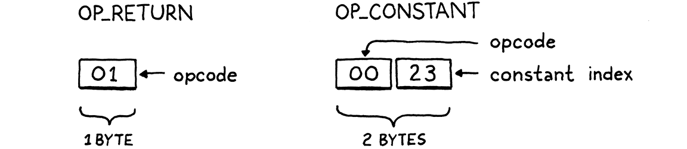

   每次我们向 clox 添加一个新的操作码时，我们都会指定它的操作数是什么样子的——即它的`指令格式(instruction format)`。

7. 行信息
   在 jlox 中，这些数字保存在词法标记中，而我们又将词法标记存储在 AST 节点中。既然我们已经抛弃了语法树而采用了字节码，我们就需要为 clox 提供不同的解决方案。对于任何字节码指令，我们需要能够确定它是从用户源代码的哪一行编译出来的。
   `将行信息保存一个单独的数组中，而不是将其编入字节码本身中`。行信息只在运行时出现错误时才使用，我们不希望它在指令之间占用 CPU 缓存中的宝贵空间，而且解释器在跳过行数获取它所关心的操作码和操作数时，会造成更多的缓存丢失。
   优化：我们对行信息的编码非常浪费内存。鉴于一系列指令通常对应于同一源代码行，`一个自然的解决方案是对行号进行类似游程编码的操作。`

   > 设计一个编码方式，压缩同一行上一系列指令的行信息。修改 writeChunk() 以写入该压缩形式，并实现一个 getLine() 函数，给定一条指令的索引，确定该指令所在的行。
   > getLine()不一定要特别高效。因为它只在出现运行时错误时才被调用，所以在它并不是影响性能的关键因素。

jlox 中定义的整个 AST 类族吗？在 clox 中，我们把它减少到了三个数组：**代码字节数组，常量值数组，以及用于调试的行信息。**
这种减少是我们的新解释器比 jlox 更快的一个关键原因。`你可以把字节码看作是 AST 的一种紧凑的序列化，`并且解释器在执行时按照需要对其反序列化的方式进行了高度优化。

## 15 A Virtual Machine 虚拟机

在构建新解释器的前端之前，我们先从后端开始——执行指令的虚拟机。它为字节码注入了生命。通过观察这些指令的运行，我们可以更清楚地了解编译器如何将用户的源代码转换成一系列的指令。

1. 全局变量 vm
   选择使用静态的 VM 实例是本书的一个让步，但对于真正的语言实现来说，不一定是合理的工程选择。如果你正在构建一个旨在嵌入其它主机应用程序中的虚拟机，那么如果你显式地获取一个 VM 指针并传递该指针，则会为主机提供更大的灵活性。`这样，主机应用程序就可以控制何时何地为虚拟机分配内存，并行地运行多个虚拟机，等等。我在这里使用的是一个全局变量，你所听说过的关于全局变量的一切坏消息在大型编程中仍然是正确的。但是，当你想在一本书中保持代码简洁时，就另当别论了。`
2. 一个值栈操作器(A Value Stack Manipulator)
   我们的老式 jlox 解释器通过递归遍历 AST 来实现这一点。其中使用的是后序遍历。首先，它向下递归左操作数分支，然后是右操作数分支，最后计算节点本身。
   在对左操作数求值之后，jlox 需要将结果临时保存在某个地方，然后再向下遍历右操作数。`我们使用 Java 中的一个局部变量来实现。`
   在 clox 中，我们应该如何存储这些临时值呢？
   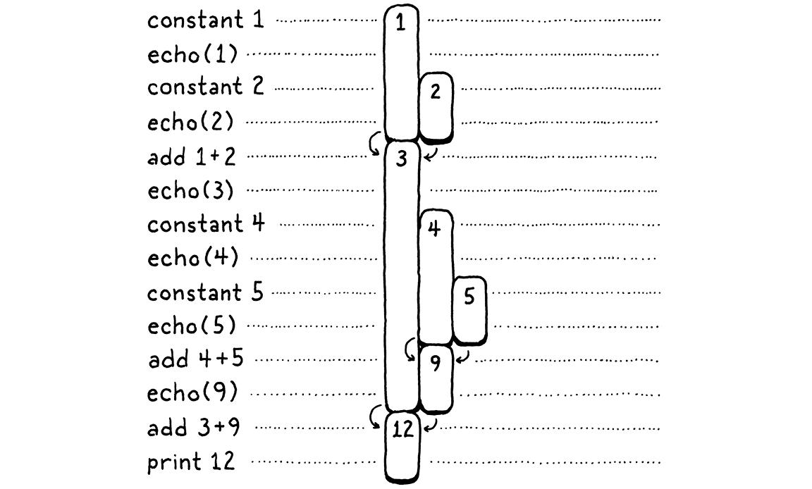
3. 基于栈的虚拟机
   基于堆栈的解释器并不是银弹。它们通常是够用的，但是 JVM、CLR 和 JavaScript 的现代化实现中都使用了复杂的`即时编译(JIT)`管道，在动态中生成更快的本地代码。 ↩︎
   给我们的虚拟机一个固定的栈大小，意味着某些指令系列可能会压入太多的值并耗尽栈空间——典型的“堆栈溢出”。我们可以根据需要动态地增加栈，但是现在我们还是保持简单。

   > 除了基于堆栈的字节码外，还有一种基于寄存器的字节码

   在我们基于堆栈的虚拟机中，`最后一条指令的编译结果`类似于

   ```c
   load <a>  // 读取局部变量a，并将其压入栈
   load <b>  // 读取局部变量b，并将其压入栈
   add       // 弹出两个值，相加，将结果压入栈
   store <c> // 弹出值，并存入局部变量c
   ```

   在基于寄存器的指令集中，指令可以直接对局部变量进行读取和存储。上面最后一条语句的字节码如下所示：

   ```c
   add <a>, <b>, <c> // 从a和b中读取值，相加，并存储到c中
   ```

   只有一条指令需要解码和调度，整个程序只需要四个字节。由于有了额外的操作数，解码变得更加复杂，但相比之下它仍然是更优秀的。没有压入和弹出或其它堆栈操作。
   **Lua 的实现曾经是基于堆栈的。到了 Lua 5.0，实现切换到了寄存器指令集，并注意到速度有所提高。**
   寄存器虚拟机是很好的，但要为它们编写编译器却相当困难。考虑到这可能是你写的第一个编译器，我想坚持使用一个易于生成和易于执行的指令集。基于堆栈的字节码是非常简单的。

4. 数学计算器
   我们的虚拟机的核心和灵魂现在都已经就位了。字节码循环分派和执行指令。栈堆随着数值的流动而增长和收缩。
   把操作符作为参数传递给宏。现在你知道了。预处理器并不关心操作符是不是 C 语言中的类，在它看来，这一切都只是`文本符号`。
   ```c
   #define BINARY_OP(op) \
    do { \
      double b = pop(); \
      double a = pop(); \
      push(a op b); \
    } while (false)
   ```

## 16 Scanning on Demand 按需扫描

我们的第二个解释器 clox 分为三个阶段——`扫描器、编译器和虚拟机。`每两个阶段之间有一个数据结构进行衔接。词法标识从扫描器流入编译器，字节码块从编译器流向虚拟机。我们是从尾部开始先实现了字节码块和虚拟机。现在，我们要回到起点，构建一个生成词法标识的扫描器。
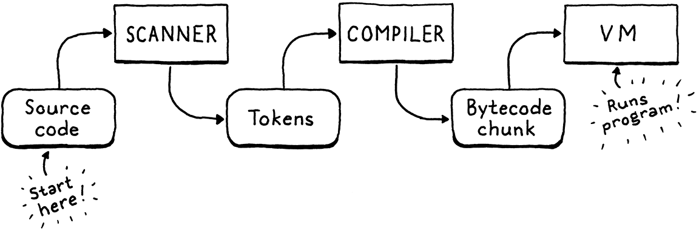

1. 开启编译管道(Opening the compilation pipeline)
   我们还不会构建真正的编译器，但我们可以开始布局它的结构(laying out its structure)
   当我们的扫描器一点点处理用户的源代码时，它会跟踪自己已经走了多远。就像我们在虚拟机中所做的那样，**我们将状态封装在一个结构体中，然后创建一个该类型的顶层模块变量，这样就不必在所有的函数之间传递它。(we wrap that state in a struct and then create a single top-level module variable of that type so we don’t have to pass it around all of the various functions.)**
2. token 扫描
   除了在所有名称前都加上 TOKEN\_前缀（因为 C 语言会将枚举名称抛出到顶层命名空间）之外，唯一的区别就是`多了一个 TOKEN_ERROR 类型。`
   在扫描过程中只会检测到几种错误：未终止的字符串和无法识别的字符。在 jlox 中，扫描器会自己报告这些错误。在 clox 中，扫描器会针对`这些错误生成一个合成的“错误”标识，并将其传递给编译器。这样一来，编译器就知道发生了一个错误，并可以在报告错误之前启动错误恢复。`
   我们用`指向第一个字符的指针和其中包含的字符数来表示一个词素`。这意味着我们完全不需要担心管理词素的内存，而且我们可以自由地复制词法标识。
3. Lox 语法
   scanToken 里根据语法规则生成 token
4. trie 树优化保留字(reserved word)匹配`?`
   如果我们愿意的话，可以构建一个巨大的 DFA 来完成 Lox 的所有词法分析，用一个状态机来识别并输出我们需要的所有词法标识。
   然而，手工完成这种巨型 DFA 是一个巨大的挑战。这就是 Lex 诞生的原因。你给它一个关于语法的简单文本描述——一堆正则表达式——它就会自动为你生成一个 DFA，并生成一堆实现它的 C 代码。

   **identifierType()**

   我们有时会陷入这样的误区：
   任务性能来自于复杂的数据结构、多级缓存和其它花哨的优化。但是，很多时候所需要的就是`做更少的工作，而我经常发现，编写最简单的代码就足以完成这些工作。`

## 17 Compiling Expressions 编译表达式

1. Vaughan Pratt’s “top-down operator precedence parsing”.
   编译算法是作者最喜欢的算法之一：**Vaughan Pratt 的“自顶向下算符优先解析”。**
   这是作者所知道的解析表达的最优雅的方法。它可以优雅地处理前缀、后缀、中缀、多元运算符，以及任何类型的运算符。它能处理优先级和结合性，而且毫不费力。我喜欢它。
   https://journal.stuffwithstuff.com/2011/03/19/pratt-parsers-expression-parsing-made-easy/
   Pratt 解析器不是递归下降解析器，但它仍然是递归的。这是意料之中的，因为语法本身是递归的。
2. 如果遇到错误，compile()方法会返回 false，我们就会丢弃不可用的字节码块。
   否则，我们将完整的字节码块发送到虚拟机中去执行。当虚拟机完成后，我们会释放该字节码块，这样就完成了。

3. 单遍编译(Single-Pass Compilation)
   在 clox 中，我们采用了一种老派的方法，将生成 ast 和遍历 ast 处理合二为一。
   在过去，语言黑客们这样做是因为计算机没有足够的内存来存储整个源文件的 AST。我们这样做是因为它使我们的编译器更简单，这是用 C 语言编程时的真正优势。
   `像我们要构建的单遍编译器并不是对所有语言都有效。因为编译器在生产代码时只能“管窥”用户的程序，所以语言必须设计成不需要太多外围的上下文环境就能理解一段语法。`

   **clox 的扫描器不会报告词法错误。相反地，它创建了一个特殊的错误标识，让解析器来报告这些错误。**

   panic mode：我还要引入另一个用于错误处理的标志。我们想要避免错误的级联效应。如果用户在他们的代码中犯了一个错误，而解析器又不理解它在语法中的含义，我们不希望解析器在第一个错误之后，又抛出一大堆无意义的连带错误。
   我们添加一个标志来跟踪当前是否在紧急模式中。

4. 发出字节码
   chunk 指针存储在一个模块级变量中，就像我们存储其它全局状态一样。以后，当我们开始编译用户定义的函数时，“当前块”的概念会变得更加复杂。为了`避免到时候需要回头修改大量代码，我把这个逻辑封装在 currentChunk()函数中。`

5. 解析前缀表达式
   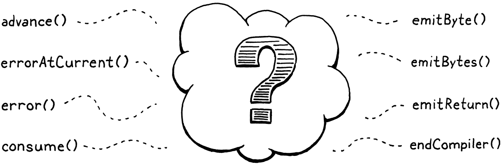
   我们已经组装了解析和生成代码的工具函数。缺失的部分就是将它们连接在一起的的中间代码：expression()。
6. 标识解析器
   我们为每个表达式定义一个函数，该函数会输出对应的字节码。然后我们构建一个函数指针的数组。数组中的索引对应于 TokenType 枚举值，每个索引处的函数是编译该标识类型的表达式的代码。
7. 括号分组
   就后端而言，分组表达式实际上没有任何意义。它的唯一功能是语法上的——它允许你在需要高优先级的地方插入一个低优先级的表达式。`因此，它本身没有运行时语法，也就不会发出任何字节码`。对 expression()的内部调用负责为括号内的表达式生成字节码。

8. parsePrecedence 处理优先级问题
   假设编译器正在处理这样的代码：`-a.b + c`
   如果我们调用 parsePrecedence(PREC_ASSIGNMENT)，那么它就会解析整个表达式，因为+的优先级高于赋值。
   如果我们调用 parsePrecedence(PREC_UNARY)，它就会编译-a.b 并停止。
   它不会径直解析+，因为加法的优先级比一元取负运算符要低。
   为了编译一元表达式的操作数，我们调用这个新函数并将其限制在适当的优先级：。

   ```go
   type Precedence byte

   const (
   	PREC_NONE       Precedence = iota
   	PREC_ASSIGNMENT            // =
   	PREC_OR                    // or
   	PREC_AND                   // and
   	PREC_EQUALITY              // == !=
   	PREC_COMPARISON            // < > <= >=
   	PREC_TERM                  // + -
   	PREC_FACTOR                // * /
   	PREC_UNARY                 // ! -
   	PREC_CALL                  // . () []
   	PREC_PRIMARY
   )
   ```

9. 解析中缀表达式
   对于中缀表达式，只有在解析了左操作数并发现了中间的运算符时，才知道自己正在处理二元运算符。
10. Pratt 解析器
    个人总结：
    **按照优先级将运算符分类，parse 就是一个后序 dfs，parse 内部调用前缀 token 的 parseLet，递归调用 parse 时候传一个优先级参数，一直往右边吃直到碰到优先级更大的；处理结合性，只要注意右结合把优先级参数-1 就可以了**

    `Pratt Parsing 从表达式树的叶子节点开始构建，然后根据后续扫描的结果，将它放置在合适的上下文（更高层级的表达式结构）中。这就是它如此擅长处理表达式的根本原因。`
    `与之形成对比的是，前面提到的递归下降算法，它需要自顶向下地理解表达式结构：program -> block -> statement -> expression -> term -> factor。`

    https://www.less-bug.com/posts/pratt-parsing-introduction-and-implementation-in-typescript/
    https://segmentfault.com/a/1190000041457544
    https://github.com/csr632/tdop-parser/tree/main?tab=readme-ov-file

    - Pratt Parsing(TDOP) vs 递归下降算法
      手工实现 Parser
      递归下降算法比较擅长解析的是语句(Statement) ，因为创造者在设计语句的时候，有意地将语句类型的标识放在最开头。
      但是，由于递归下降算法需要自顶向下地理解代码结构，因此它在处理表达式(Expression) 的时候非常吃力。`Parser 在读到表达式开头的时候，无法知道自己身处哪种表达式之中。`为了能自顶向下地解析表达式，你需要将每一种操作符优先级(precedence)都单独作为一个层级，为其编写解析函数，并手动处理结合性(associativity)，因此解析函数会比较多、比较复杂。**因此，在手工实现 Parser 的时候，一般会将表达式的解析交给其它算法，规避递归下降的劣势。**
      Pratt Parsing，又称 Top Down Operator Precedence Parsing，是一种很巧妙的算法，它实现简单、性能好，而且很容易定制扩展，`尤其擅长解析表达式，擅长处理表达式操作符优先级(precedence)和结合性(associativity)。`

    **parsePrecedence 函数是 Pratt 解析器的核心。**

    运算符举例：
    前缀运算符：`! -` (unary)
    中缀运算符：`+ - * / == != < > <= >=` (binary)
    后缀运算符：`. () []` (call)

    Pratt Parser 是一种自顶向下的语法分析器。它的核心工作原理是：

    1. 把 Token 分为两类，一类是前缀运算符，一类是中缀运算符。假设前缀运算符的优先级最高，中缀运算符的优先级依次降低。 注意：对于后缀运算符，我们把它当作中缀运算符的特殊形式处理。（具体原因可以看后文） 因此，分成三类，也没问题。

    2. 每个 Token 都有与之关联的`解析函数(parselet)`，这个函数的作用是解析以该 Token 开头的表达式。

    ```python
    class PrefixParselet(metaclass=ABCMeta):
    @abstractmethod
    def parse(self, parser, token):
        pass


    class InfixParselet(metaclass=ABCMeta):
        @abstractmethod
        def parse(self, parser, left, token):
            pass

        @abstractmethod
        def get_precedence(self):
            pass

    ```

    `中缀解析器也适用于后缀运算符。`我称它们为“中缀”，但它们实际上是“除了前缀之外的任何东西”。如果令牌之前有一些前导子表达式，则令牌将由中缀解析器处理。这包括后缀表达式和混合表达式，例如?: 。
    例如，对于 Num，解析得到一个 ValueNode。

    例如，对于 Add，解析得到一个 InfixOpNode。

    由于我们把 Token 分为三类，每类都有对应的 Parser，具体来说分别是：

    PrefixParser：前缀 Token 的 Parser。

    InfixParser：中缀 Token 的 Parser。

    PostfixParser：后缀 Token 的 Parser。（可看作一种特殊 InfixParser）

    3. 每个 Token 都有与之关联的优先级，这个优先级用于决定解析顺序。 实际上在 Parse 函数中，我们会有两个优先级，`一个是上下文优先级（未必是当前 Token 的优先级），来自于 Parse 函数的实参。一个是下一个 Token 的优先级，通过往后 peek 得到。`
       用一个“磁铁”来吸引后续的 token，递归参数 precedence 就表示这个磁铁的“吸力”。

    4. 我们 Parse 好前缀表达式，然后重点来了。`如果下一个 Token 的优先级大于上下文优先级，那么我们就把它当作中/后缀表达式的一部分，继续 Parse。否则，我们就把前缀表达式返回。`

    ```ts
       parse(prec: number = 0): ExprNode {
          let token = this.tokens.next()!
          // !解析prefix
          // 找到这个 prefix 对应的表达式构建器 prefixParselet，构建出以这个prefix为中心的表达式节点
          let prefixParser: PrefixFn = this.parsers.prefix[token.type]
          if (!prefixParser) {
              throw new Error(`Unexpected prefix token ${token.type}`)
          }
          let lhs: ExprNode = prefixParser(token)
          let precRight = this.precOf(this.tokens.peek()!.value)


          while (prec < precRight) {
              token = this.tokens.next()!
              // 解析 infix
              let infixParser: InfixFn | PostfixFn = this.parsers.infix[token.type] || this.parsers.postfix[token.type]
              if (!infixParser) {
                  throw new Error(`Unexpected infix or postfix token ${token.value}`)
              }
              lhs = infixParser(lhs, token)
              precRight = this.precOf(this.tokens.peek()!.value)
          }

          return lhs
      }

    ```

    5. **优先级决定了不同运算符之间的执行顺序。结合性指定了相同优先级的运算符在表达式中的结合顺序。**Pratt 解析器 是如何处理优先级和结合性的呢？
       - 处理优先级：给每个运算符一个优先级，parse(prec: number = 0)再传一个优先级 ，往右边吃直到碰到优先级更大的停下.
       - 处理结合性：右结合把 prec 参数-1 就可以了

    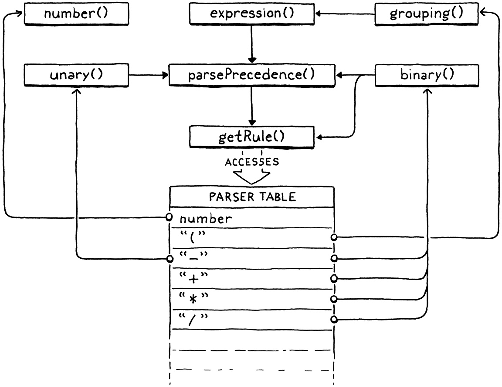

11. 转储字节码块(Dumping Chunks)
    我们的解释器看起来不大，但它内部有扫描、解析、编译字节码并执行。
12. 设计笔记：只是解析(IT’S JUST PARSING)
    作者的主张是，解析并不重要(My claim is that parsing doesn’t matter.)
    最初，是编译器研究者，他们深入研究编译器的编译器、LALR，以及其它类似的东西。龙书的前半部分就是写给对解析器生成器(parser generators)好奇的人的一封长信。
    后来，函数式编程人员开始研究解析器组合子、packrat 解析器和其它类型的东西。原因很明显，如果你给函数式程序员提出一个问题，他们要做的第一件事就是拿出一堆高阶函数。
    `作为一项智力练习，学习解析技术也是很有趣和有意义的。但是，如果你的目标只是实现一门语言并将其送到用户面前，那么几乎所有这些都不重要了。`
    我见过人们花费大量的时间，使用当下最热门的库或技术，编写或重写他们的解析器。
    这些时间并不会给用户的生活带来任何价值。`如果你只是想完成解析器，那么可以选择一个普通的标准技术，使用它，然后继续前进。递归下降法，Pratt 解析和流行的解析器生成器（如 ANTLR 或 Bison）都很不错。`
    **把你不用重写解析代码而节省下来的额外时间，花在改进编译器向用户显示的编译错误信息上。对用户来说，良好的错误处理和报告比你在语言前端投入时间所做的几乎任何事情都更有价值。**

## 18 Types of Values 值类型

1. 在静态类型和动态类型之外，还有第三类：`单一类型（unityped）。`在这种范式中，所有的变量都是一个类型，通常`是一个机器寄存器整数`。单一类型的语言在今天并不常见，但一些 Forth 派生语言和 BCPL（启发了 C 的语言）是这样工作的。从这一刻起，clox 是单一类型的。
2. 带标签联合体(Tagged Unions)
   一个值包含两个部分：一个类型“标签”，和一个实际值的有效载荷。
3. 动态类型数字
4. 字节码虚拟机的大部分执行时间都花在读取和解码指令上。对于一个特定的行为，你需要的指令越少、越简单，它就越快。专用于常见操作的短指令是一种典型的优化。Java 字节码指令集中有专门的指令用于加载 0.0、1.0、2.0 以及从-1 到 5 之间的整数。（考虑到大多数成熟的 JVM 在执行前都会对字节码进行 JIT 编译，这最终成为了一种残留的优化）
5. 字节码指令不需要紧跟用户的源代码。虚拟机可以完全自由地使用它想要的任何指令集和代码序列，只要它们有正确的用户可见的行为。

## 19 Strings 字符串

1. 值与对象
   如果对象比较大，它的数据就驻留在堆中。
   每个状态位于堆上的 Lox 值都是一个`Obj`。
2. 结构体继承
   我们如何处理不同的有效载荷和大小？我们不能像 Value 那样使用另一个联合体，因为这些大小各不相同。

`我曾见过一些语言实现因为后来的GC太困难而夭折。如果你的语言需要GC，请尽快实现它。`
今天我们至少应该做到最基本的一点：`确保虚拟机可以找到每一个分配的对象，即使Lox程序本身不再引用它们，从而避免泄露内存。`
高级内存管理程序会使用很多复杂的技术来分配和跟踪对象的内存。我们将采取最简单的实用方法。
我们会创建一个链表存储每个 Obj。虚拟机可以遍历这个列表，找到在堆上分配的每一个对象，无论用户的程序或虚拟机的堆栈是否仍然有对它的引用。
我们可以定义一个单独的链表节点结构体，但那样我们也必须分配这些节点。**相反，我们会使用侵入式列表——Obj 结构体本身将作为链表节点。每个 Obj 都有一个指向链中下一个 Obj 的指针。**

`这一节的obj太麻烦了，不用这种表示`

字符串是一个 byte 数组
**从 Python 2 到 3 的漫长转变之所以令人痛苦，主要是因为它围绕字符串编码的变化**

## 20 Hash Tables 哈希表

这一章大概看了下

1. 负载因子和封装键(Load factor and wrapped keys)
2. 冲突解决
   拉链法(Separate chaining)
   开放地址法(Open addressing) -> “双重哈希(double hashing)”、“布谷鸟哈希(cuckoo hashing)”以及“罗宾汉哈希(Robin Hood hashing)”。 ↩︎
3. 哈希函数
4. 墓碑(tombstone)：标记删除
5. 字符串驻留(String Interning)

## 21 Global Variables 全局变量

jlox 每次进入一个代码块或调用一个函数时，都要分配一个新的哈希表，这不是通往快速虚拟机的道路。
对于 clox，我们会通过对局部变量使用更有效的策略来改善这一点，但全局变量不那么容易优化

1. 语句
   Lox 将语句分为两类：声明(Declaration)和控制流(Control Flow)。我们不允许在控制流语句中直接使用声明.
   在完整的 Lox 实现中，程序是一系列声明.

   ```ts
   declaration    → varDecl
                  | statement ;

   statement      → exprStmt
                  | printStmt ;
   ```

堆栈效应(Stack Effect)：每个指令都有一个堆栈效应，它描述了`指令执行后堆栈的变化`。例如，`add`指令的堆栈效应是“pop pop push”，因为它弹出两个值，然后推入一个值。
`语句对应字节码的总堆栈效应为0。`因为语句不产生任何值，所以它最终会保持堆栈不变，尽管它在执行自己的操作时难免会使用堆栈。这一点很重要。

1. 错误同步(Error Synchronization)
   我们会不分青红皂白地跳过标识，直到我们到达一个看起来像是语句边界的位置。
2. 变量声明
   使用 var 语句声明一个新变量、使用标识符表达式访问一个变量的值、使用赋值表达式将一个新的值存储在现有的变量中
   vm 中，我们从常量表中获取变量的名称，然后我们从栈顶获取值，并以该名称为键将其存储在哈希表中
3. 读取变量
   实现是 OP_DEFINE_GLOBAL 的镜像操作(The implementation mirrors OP_DEFINE_GLOBAL)
4. 赋值
   我们的字节码编译器中的其它设计选择使得赋值的实现变得很麻烦。
   我们的字节码虚拟机使用的是`单遍编译器。`它在不需要任何中间 AST 的情况下，动态地解析并生成字节码。一旦它识别出某个语法，它就会生成对应的字节码。`赋值操作天然不符合这一点。`
   不过，这个问题并不像看上去那么可怕。
   我们不需要太多的前瞻就可以意识到.xxx 应该被编译为 set 表达式而不是 getter。
   ```go
   func (c *Compiler) namedVariable(name *Token) {
   	arg := c.identifierConstant(name)
   	if c.match(TOKEN_EQUAL) {
   		c.expression()
   		c.emitByte2(OP_DEFINE_GLOBAL, arg)
   	} else {
   		c.emitByte2(OP_GET_GLOBAL, arg)
   	}
   }
   ```
5. 反例

```go
a * b = c + d;
```

我们的 pratt 解析器是这样处理的：

- 首先， parsePrecedence() 使用 variable() 前缀解析器解析 a
- 之后，它进入中缀解析循环。
- 它到达了 `*` 并调用 binary() 。
- 它递归调用 parsePrecedence() 来解析右侧操作数
- 这再次调用 variable() 以解析 b .
- 在对 variable() 的调用中，它查找一个尾随的 = 。它看到了一个=，因此将该行的其余部分解析为赋值。
  

会错误地认为 `= c+d 是一个赋值表达式`
variable()没有考虑包含变量的外围表达式的优先级。如果变量恰好是中缀操作符的右操作数，或者是一元操作符的操作数，那么这个包含表达式的优先级太高，不允许使用=。

解决方案：
为了解决这个问题，variable()应该只在低优先级表达式的上下文中寻找并使用=。
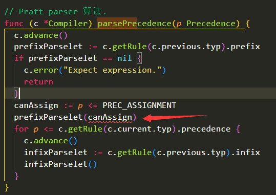

## 22 Local Variables 局部变量

局变量在 Lox 中是后期绑定的。这里的“后期”是指“在编译后分析”。这有利于保持编译器的简单性，但不利于性能。局部变量是语言中最常用的部分之一。如果局部变量很慢，那么一切都是缓慢的。因此，`对于局部变量，我们希望采取尽可能高效的策略`。
局部变量不是后期绑定的。我们在编译器中所做的任何处理工作都不必在运行时完成，因此局部变量的实现将在很大程度上依赖于编译器。

1. 表示局部变量
   C 和 Java 是如何管理它们的局部变量的呢？当然是在堆栈上！它们通常使用芯片和操作系统支持的本地堆栈机制。这对我们来说有点太底层了，但是在 clox 的虚拟世界中，我们有自己的堆栈可以使用。
   现在，我们只使用它来保存临时变量(temporaries)——我们在计算表达式时需要记住的短期数据块。

   我们要准确地**解析每个局部变量占用的栈槽**。这样，在运行时就不需要进行查找或解析。

2. 使用 local 数组定义局部变量
   编译器中的局部变量数组与虚拟机在运行时的栈**具有完全相同的布局**。变量在局部变量数组中的索引与其栈槽相同。
   The locals array in the compiler has the exact same layout as the VM’s stack will have at runtime. `The variable’s index in the locals array is the same as its stack slot.`
3. 解释局部变量
4. 解决 var a = a 错误
   引入`变量未初始化`状态, depth 为-1 表示未初始化
   编译器中“声明”和“定义”变量的真正含义：“声明”是指变量被添加到作用域中，而“定义”是指它变得可供使用。
   **“Declaring” is when the variable is added to the scope, and “defining” is when it becomes available for use.**

## 23 Jumping Back and Forth 来回跳转

虚拟机中的控制流是如何实现的？
当我们编译成字节码时，代码中显式的嵌套块结构就消失了，只留下一系列扁平的指令。
Lox 是一种结构化编程语言，但 clox 字节码不是。
为了实现控制流，所需的只是以更有趣的方式改变 ip 。
**goto 是唯一真正的控制流。**

> structured programming 结构化编程
> 引入明确的`控制结构`和`模块化设计`，显著改善了代码的可读性和可维护性。

1. If 语句
   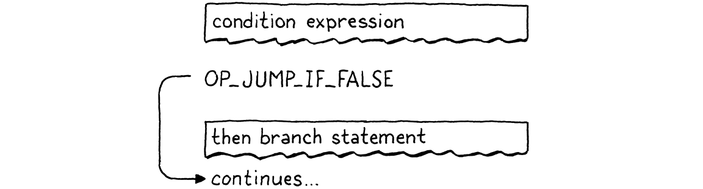
   我们写入 OP_JUMP_IF_FALSE 指令的操作数时，我们怎么知道跳多远？我们还没有编译 then 分支，所以我们不知道它包含多少字节码。
   为了解决这个问题，我们使用一个经典的技巧，称为**回填(backpatching)**。我们在写入指令时只`写入一个占位符，然后在编译 then 分支时再回来填充它。`
   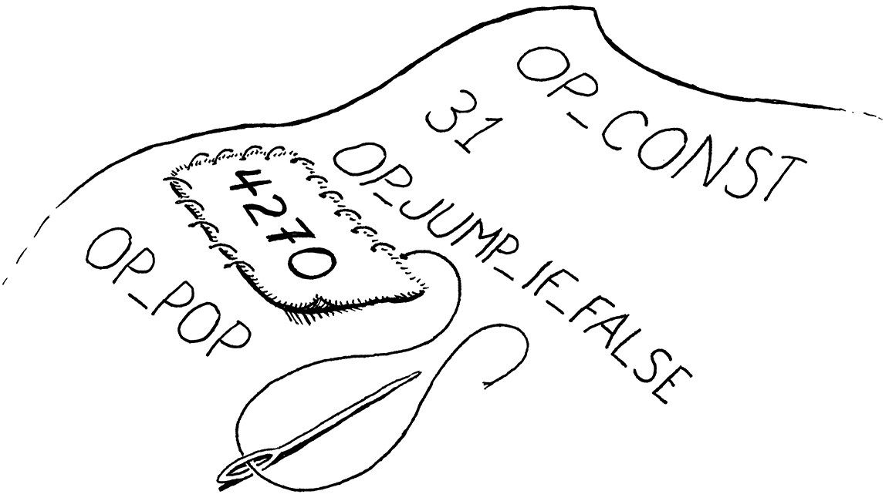

   ```go
   thenJump := c.emitJump(OP_JUMP_IF_FALSE)
   c.statement()
   c.patchJump(thenJump)
   ```

2. Else 语句
   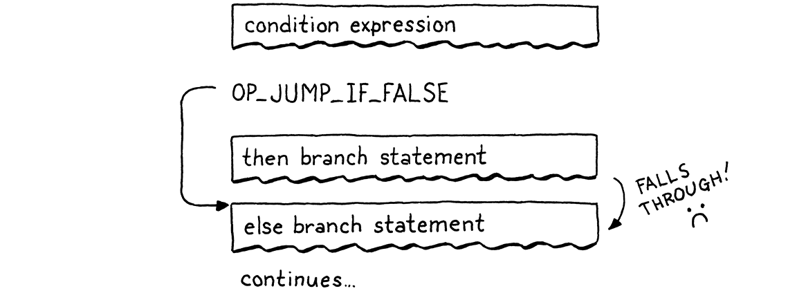
   Statement is required to have zero stack effect—after the statement is finished executing, the stack should be as tall as it was before.
   `每个语句都要求没有栈效果——在语句执行完毕后，栈的高度应该和之前一样。`
   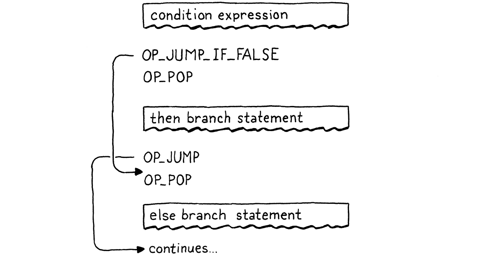
3. 逻辑运算符
   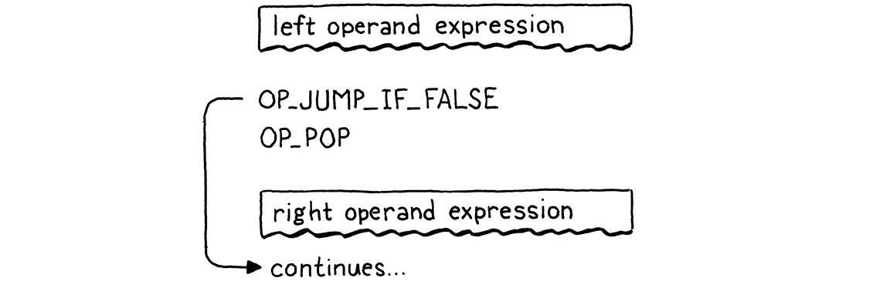
   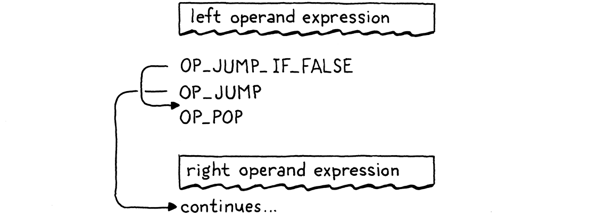
4. while 语句
   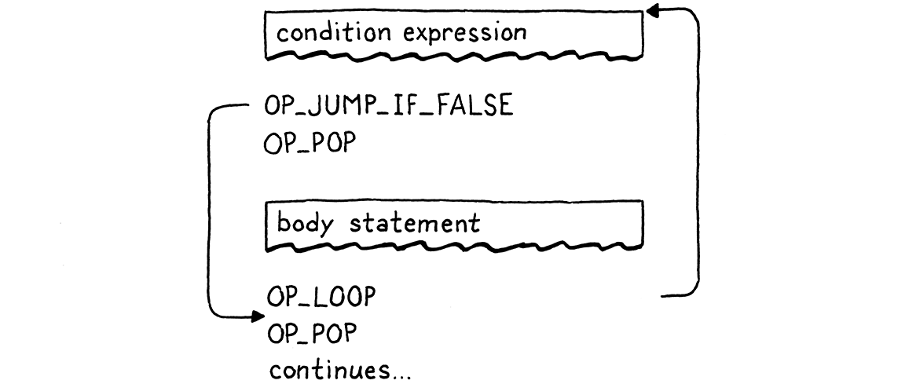
5. for 语句
   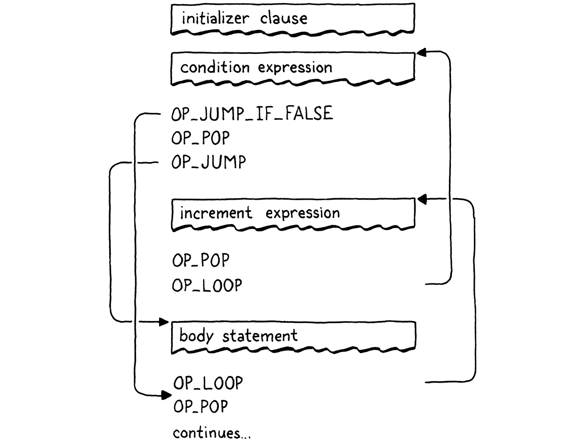

作者认为 goto 是一种有用的工具，但是要谨慎使用。goto 语句是一种强大的工具，但是它很容易被滥用。
任何使用 goto 的控制流都可以转化为仅使用顺序、循环和分支的控制流

> goto 的使用场景：跳出多层循环
>
> 1. 使用 goto 语句可以跳出多层循环，而 break 只能跳出一层循环。

```c
for (int x = 0; x < xSize; x++) {
  for (int y = 0; y < ySize; y++) {
    for (int z = 0; z < zSize; z++) {
      if (matrix[x][y][z] == 0) {
        printf("found");
        goto done;
      }
    }
  }
}
done:
```

## 24 Calls and Functions 调用和函数

计算机科学中的任何问题都可以通过引入一个中间层来解决。除了中间层太多的问题。

---

我们已经有了用于局部变量和临时变量的栈，所以我们已经完成了一半。但是我们还没有调用堆栈的概念。从虚拟机的角度来看，什么是函数？

1. 函数对象
   从 VM 的角度来看，什么是函数？
   每个函数将有一个指向其代码在该块内的第一条指令的指针。
2. 编译为函数对象
   我们可以通过将顶层代码放入一个自动定义的函数中来简化编译器和虚拟机。(虚拟根结点).就好像整个程序都被包裹在一个隐式的 main() 函数中。
3. Call Frames 调用帧

   - 分配局部变量
     编译器为局部变量分配栈槽。当程序中的局部变量集分布在多个函数中时，这应该如何工作？

     - Fortran 的静态分配：
       一个选择是将它们完全分开。`每个函数将在虚拟机堆栈中获得自己专用的一组槽位`，即使在函数未被调用时也会永远拥有。整个程序中的每个局部变量将在虚拟机中拥有一小块内存，供其自己使用。 这是 C 程序中使用 static 声明每个局部变量时会得到的结果。这样效率非常低下。大多数函数在任何时刻都不会被调用，因此占用未使用的内存是浪费。
     - jlox 的动态方法：
       在每次调用函数或进入块时动态分配内存
     - clox 的方法：
       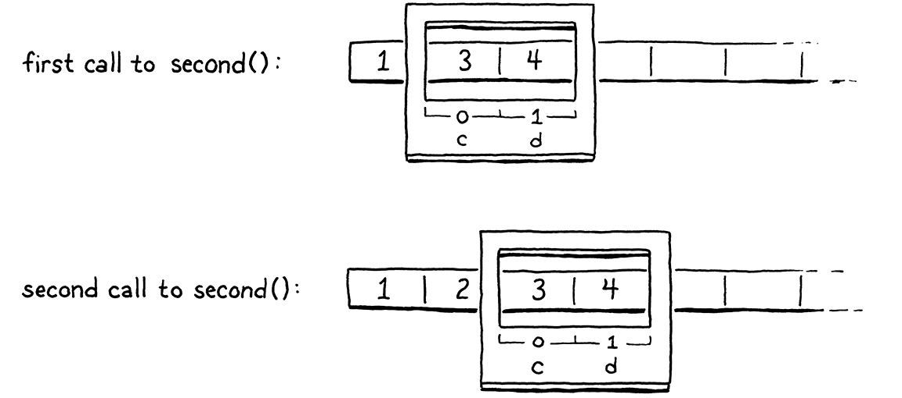
       **在每个函数调用的开始，虚拟机记录该函数自身局部变量开始的第一个槽的位置(frame pointer/base pointer)。**处理局部变量的指令通过相对于该槽的索引来访问它们，而不是像今天那样相对于栈底。`在编译时，我们计算这些相对槽。在运行时，我们通过加上函数调用的起始槽将该相对槽转换为绝对栈索引。`

       就好像函数在更大的堆栈中获得了一个“窗口”或“框架”，可以在其中存储其局部变量。

   - 返回地址(return addresses)
     调用一个函数非常简单——只需将 ip 设置为指向该函数块中的第一条指令。
     当函数完成时，虚拟机需要返回到调用函数的代码块(return addresses)，并在调用后立即恢复执行下一条指令。

     > 早期 Fortran 编译器的作者们有一个巧妙的技巧来实现返回地址。由于他们不支持递归，因此任何给定的函数在任何时刻只需要一个返回地址。`因此，当在运行时调用一个函数时，程序会修改自己的代码，将函数末尾的跳转指令更改为跳回其调用者`。有时，天才与疯狂之间的界限是微乎其微的。

   call frame 替代了我们之前在虚拟机中直接使用的 chunk 和 ip 字段。`现在每个调用帧都有自己的 ip 和指向它正在执行的 ObjFunction 的指针`

4. 函数声明（Function Declarations）

   - 进入函数时，创建一个新的 Compiler(包含 func、locals、depth 等信息)，退出时还原 enclosing
   - 函数是一个 literal.

5. 函数调用(function calls)
   参数绑定
   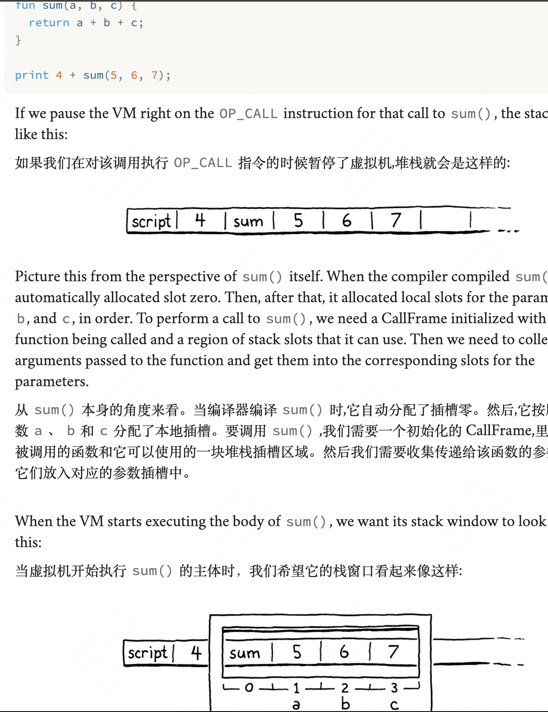
   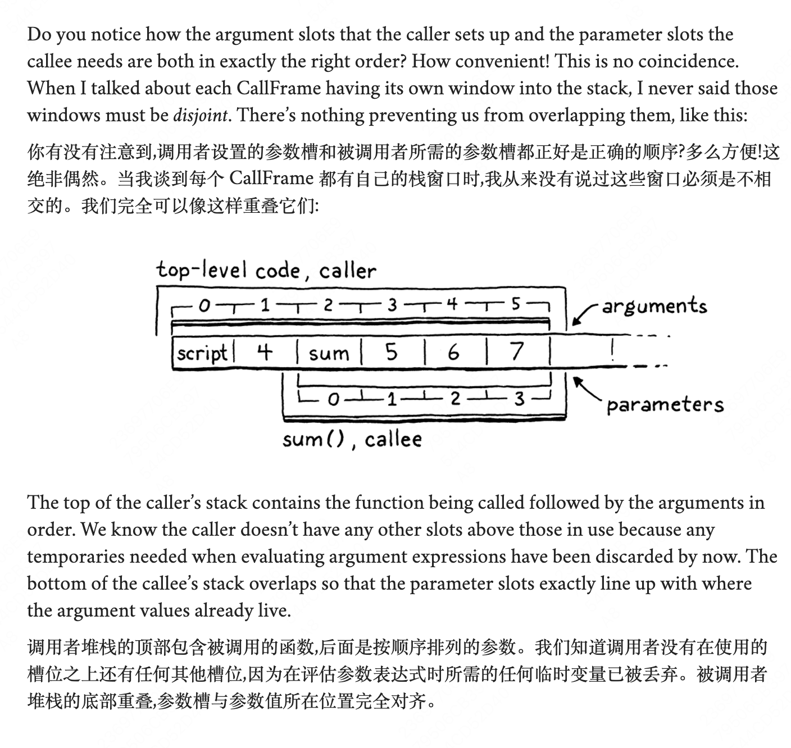
   我们无需做任何工作来 `“bind an argument to a parameter”`
   call(functio, argCount)

   - Printing stack traces 打印堆栈跟踪
     对于应该在跟踪中以何种顺序显示堆栈帧存在一些分歧。大多数人将最内层的函数作为第一行,然后逐步往下工作到堆栈的底部。新闻学中的"倒金字塔"理论告诉我们,在文本块中应该先呈现最重要的信息。
     `Python 以相反的顺序打印它们。因此,从上到下读取可以告诉你程序如何到达现在的位置,最后一行是错误实际发生的地方。`

6. 函数的返回值（Return Statements)
   与 jlox 有很大不同，那里我们必须使用异常来解开堆栈(unwind the stack)。由于 jlox 递归地遍历 AST,这意味着我们需要逃脱大量的 Java 方法调用。
   而我们的字节码编译器将其完全扁平化。
7. 本地函数(Native Functions)
   如果你想编写程序来检查时间、读取用户输入或访问文件系统，我们需要添加 native functions。

## 25 Closures 闭包

我们需要在解析变量时包含所有周围函数的整个词法作用域。
这个问题在 clox 中比在 jlox 中更困难,因为我们的字节码 VM 将局部变量存储在堆栈上，变量以与创建顺序相反的顺序被丢弃。

> jlox 通过动态分配内存解决这个问题(所有变量全部放在堆上)

对于没有被闭包捕获的局部变量,我们将保持它们在栈上的原样。当一个局部变量被闭包捕获时,我们将采用另一种解决方案,将它们提升到堆上,从而可以根据需要保持它们的生命周期(lifts them onto the heap where they can live as long as needed)。
我们使用 Lua VM 中的设计。

变量逃逸。
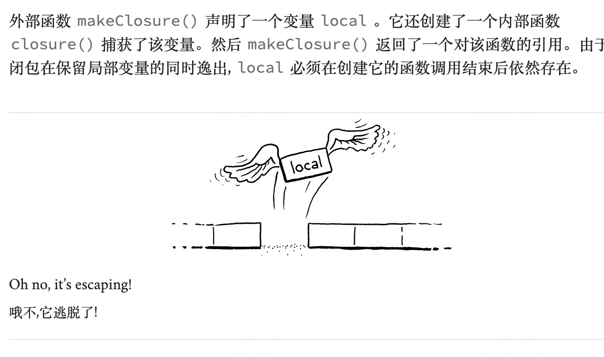

> closed-over variables： 被闭包引用的变量

1. Closure Objects 闭包对象

   - 普通函数和闭包的区别
     VFunc 是由前端在编译期间创建的，在运行时,虚拟机所做的就是从常量表中加载函数对象并将其绑定到一个名称。在运行时没有"创建"函数的操作。因为组成函数的所有数据在编译时都是已知的。
     VClos 需要一些运行时表示来捕获函数周围的局部变量,这些变量在函数声明`执行时存在`,而不仅仅是在编译时。

   - Lua 的实现将包含字节码的原始函数对象称为"原型"。
     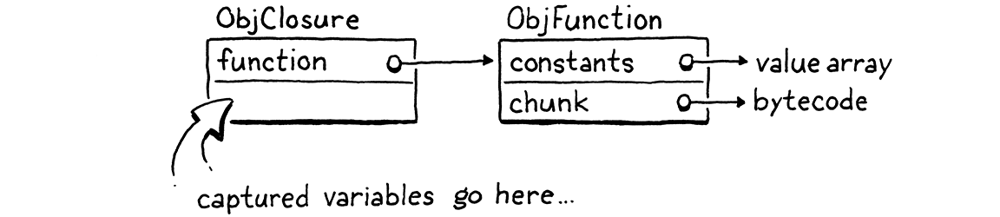

   为了简化 vm 实现，我们将所有函数作为闭包对象(ObjClosure)处理，包装 ObjFunction 对象。运行时将不再尝试调用裸露的 ObjFunction。
   call() 的作用是创建一个新的 CallFrame。

2. Upvalues (外部变量；lua 里的概念；被闭包引用的变量)
   `Upvalues are explicitly designed for tracking variables that have escaped the stack.`
   每个闭包都保持着一个 upvalue 数组,其中包含了闭包所使用的每个周围的局部变量。
   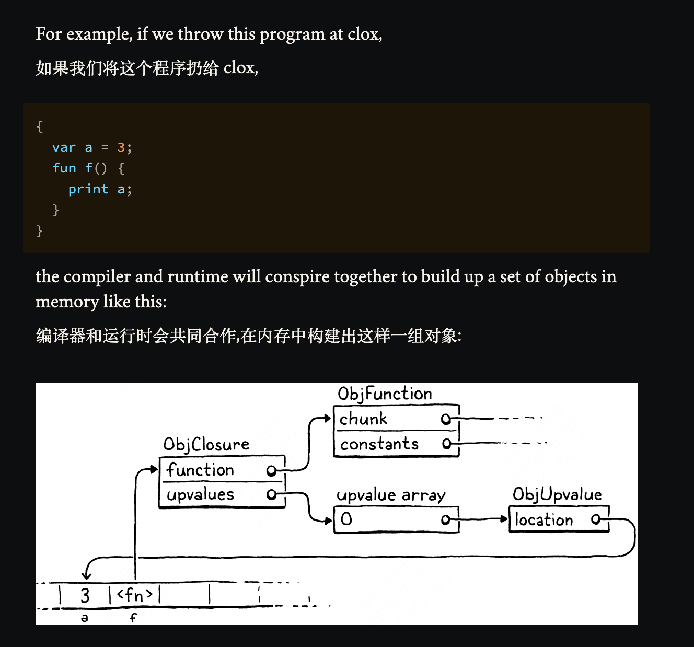

   - 在编译期间的 namedVariable()环节需要 resolveUpvalue，查找 surrounding functions 里的 local 变量，返回变量的 `upvalue index`，该索引成为 OP_GET_UPVALUE 和 OP_SET_UPVALUE 指令的操作数。
   - 由于函数可能多次使用同一个变量，所以有一个缓存机制。
   - 扁平化(flattening) Upvalue：resolveUpvalue 算法类似在树中查找节点，需要递归查找。
     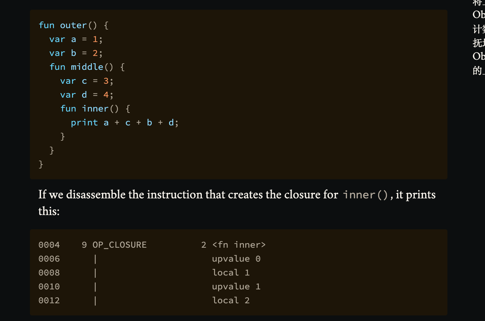

3. Upvalue Objects
   我们需要一个 UpValue 的运行时表示

4. Closed Upvalues

   - `Open Upvalue：仍然保存在栈上的 Upvalue`
   - `Closed Upvalue：已经提升到堆上的 Upvalue`

   **Does a closure close over a value or a variable?**
   一个重要的语义问题。闭包是闭合一个值还是一个变量？(eg: JavaScript 的闭包是闭合一个变量)
   如果闭包捕获值，那么`每个闭包都会获得被捕获变量的一个副本`；
   如果闭包捕获变量，那么`每个闭包都会共享同一个变量`。（它们共享对同一底层存储位置的引用。）

   **答案是：闭包捕获变量。**
   当一个变量移动到堆上时，我们需要确保所有捕获该变量的闭包都保留对其唯一新位置的引用。
   这样，当变量被修改时，所有闭包都能看到变化。

   - 两个问题

     - Closed UpValue 在堆的哪个位置 -> 我们已经在堆上有一个方便的对象来存储 UpValue 的所有信息，即 ObjUpvalue。
     - 我们什么时候 Close 一个 UpValue ->
       尽可能晚。如果我们在变量超出作用域时立即移动它，我们可以确定在那之后的代码不会尝试从栈中访问它。
       编译器在局部变量超出作用域时已经发出一个 OP_POP 指令。如果一个变量被闭包捕获，我们将发出一个不同的指令，将该变量从栈中提升到其对应的上值。
       `我们在 local 中添加一个 isCaptured 标志`，判断局部变量在超出作用域(endScope)时是否被闭包捕获。

   - 使用链表跟踪 Open UpValues
     vm 需要复用现有既存的 UpValue。但是所有先前创建的 UpValue 都藏在各种闭包的 UpValue 数组中。这些闭包可能位于虚拟机内存的任何地方。
     可以按它们指向的栈槽索引对开放的 UpValue 列表进行排序。
     虚拟机拥有该列表(openValues)，因此头指针直接位于主虚拟机结构内部。
     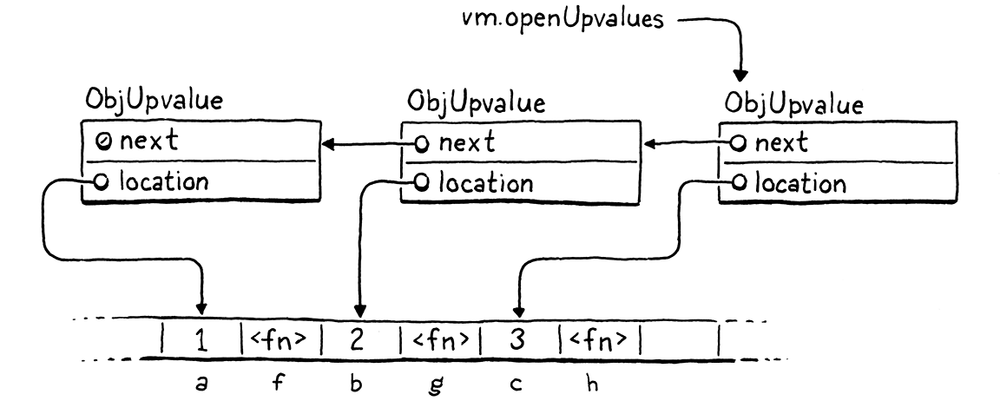
     虚拟机现在确保任何给定的局部槽位只有一个 ObjUpvalue。如果两个闭包捕获了相同的变量，它们将获得相同的 upvalue。
     我们现在准备将这些 upvalue 移出栈。
   - 在运行时 Closing UpValues
     OP_CLOSE_UPVALUE 如何处理的问题。
     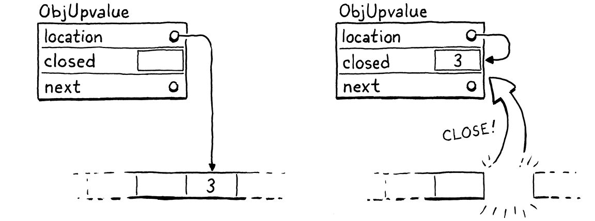
     在 ObjUpValue 中新增一个 closed 字段。

   jlox 为我们提供了“免费”的闭包。
   在 clox 中，对于大多数具有栈语义的变量，我们将它们完全分配在栈上，这样简单且快速。然后，对于少数不适用的局部变量，我们可以根据需要选择第二条较慢的路径。
   我们现在在 clox 中完全实现了词法作用域（lexical scoping），这是一个重要的里程碑。

   [闭包和对象是等价的(Closures And Objects Are Equivalent)](https://wiki.c2.com/?ClosuresAndObjectsAreEquivalent)

## 26 Garbage Collection 垃圾回收

因为用 golang 写的，所以大致看下

我们称 lox 为一种"high-level"语言，是因为它使程序员不必担心与他们正在解决的问题无关的细节。
`动态内存分配`是自动化的完美候选者。

> managed language：自动内存管理的语言

1. Reachability 可达性
   问题：vm 如何知道哪些内存是不需要的？
   语言做了一个保守的近似：如果一块内存在未来可能被读取，它就被认为仍在使用中。

   - conservative GC (保守式 GC) vs. precise GC (精确式 GC)

     - 保守式 GC ：
       considers any piece of memory to be a pointer if the value in there looks like it could be an address
       会将任何看起来像指针的东西都视为指向内存。这可能会导致一些问题，例如，如果一个整数看起来像一个指针，那么 GC 就会认为它指向的内存仍在使用中。
     - 精确式 GC 会检查每个指针，确保它们确实指向内存。这样可以避免保守式 GC 的问题，但是会增加 GC 的复杂性。
       knows exactly which words in memory are pointers and which store other kinds of values like numbers or strings.

   - 例子
     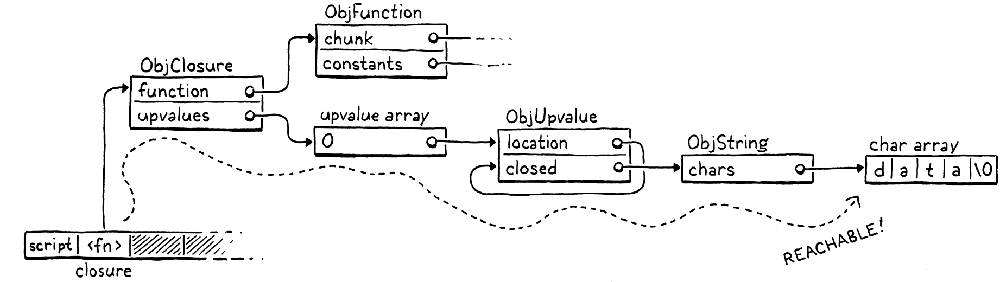

     ```
     fun makeClosure() {
       var a = "data";

       fun f() { print a; }
       return f;
     }

     {
       var closure = makeClosure();
       // GC here.
       closure();
     }
     ```

     如今许多不同的垃圾收集算法大致遵循相同的结构，它们主要在执行每个步骤的方式上有所不同。

     - 从根开始，遍历对象引用找到可达对象的完整集合。
     - 释放所有不在该集合中的对象。

2. Mark-Sweep Garbage Collection 标记-清除垃圾收集

   1. 约翰·麦卡锡，LISP 的发明者，设计了第一个最简单的垃圾回收算法，称为标记-清扫或简称标记清扫(mark-and-sweep or just mark-sweep)。

      - Marking
        遍历标记所有可达对象
      - Sweeping
        清理未标记的对象

   2. collectGarbage
      这个函数什么时候被调用？

      - 为垃圾收集器添加一个可选的“压力测试”模式 (stress test mode)。
        在这种模式下，虚拟机将在每次 reallocate 时运行垃圾收集器。
      - 调试日志

3. Marking the Roots 标记根源
   根是指虚拟机无需通过其他对象中的引用，可以直接访问的对象。

   1. 栈中的 Lox 对象 -> markObject
   2. 全局变量 -> markTable
   3. 栈帧上的闭包 -> markObject
   4. openUpValues -> markObject
   5. 编译器直接访问的任何值 -> markCompilerRoots -> markObject(=)
      编译器本身会定期从堆中获取内存用于字面量和常量表。如果垃圾回收器在我们编译的过程中运行，那么编译器直接访问的任何值也需要被视为根。这里主要是正在编译的 ObjFunction.

4. Tracing Object References 跟踪对象引用

   1. The tricolor abstraction 三色抽象
      为什么需要：增量垃圾回收(incremental garbage collection)。

      - 白色：未访问
      - 灰色：访问过，但还未处理
      - 黑色：访问过，且已处理

   2. 维护、处理灰色物体

5. Sweeping Unused Objects 清理未使用的物品

   - 一般对象
     删除链表中未标记的对象

   - Weak references and the string pool
     弱引用和字符串池

     弱引用（Weak Reference） 是一种引用类型，用于引用对象而不阻止垃圾回收器（GC）回收该对象。`当一个对象仅被弱引用所引用时，GC 可以在需要内存时回收该对象`，而不会因为存在弱引用而保留它。即：垃圾回收时不作为根节点。

6. **When to Collect 何时收集**
   我们现在有一个完全正常工作的标记-清扫垃圾收集器。当`压力测试标志`启用时，它会一直被调用，并且在启用日志记录的情况下，我们可以观察它的工作过程，看到它确实在回收内存。

   - Latency and throughput 延迟和吞吐量(一对矛盾)
     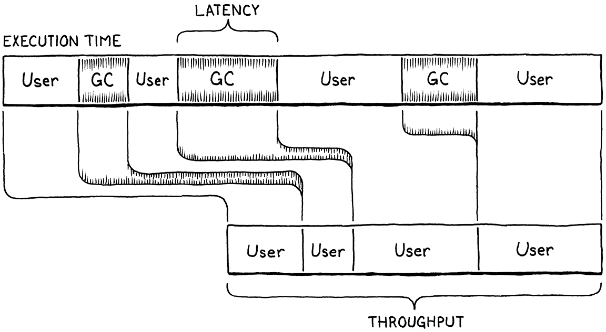
     两个在衡量内存管理器性能时使用的基本数字：吞吐量和延迟。
     垃圾收集器在牺牲多少吞吐量和容忍多少延迟之间做出不同的权衡。`收集器运行的频率是我们调整延迟和吞吐量之间权衡的主要因素之一。`

     - 吞吐量是运行用户代码与`进行垃圾回收工作所花费的总时间的比例`。
       假设你运行一个 clox 程序十秒钟，其中有一秒是在 collectGarbage() 内。这意味着吞吐量是 90%——它花费了 90% 的时间在运行程序上，10% 的时间在垃圾回收开销上。
     - 延迟是用户程序在垃圾收集发生时`完全暂停的最长连续时间段`
       eg:时间分片(增量垃圾收集)可以降低延迟

     如果收集器花费很长时间重新访问仍然存活的对象，它会降低吞吐量。但如果它避免收集并积累大量垃圾以供处理，则可能会增加延迟。
     如果每个人代表一条线程，那么一个明显的优化就是让独立的线程运行垃圾回收，从而实现并发垃圾收集器。
     这就是非常复杂的垃圾收集器的工作方式，因为它确实让工作线程能够在很少的中断下继续运行用户代码。

   - Self-adjusting heap 自适应堆
     我们可以把这个问题抛给用户，让他们通过暴露垃圾回收调优参数来选择。
     许多虚拟机都是这样做的。
     但是，如果我们这些垃圾回收器的作者都不知道如何进行良好的调优，那么大多数用户也很可能不知道。
     他们应该得到一个合理的默认行为。

     `想法是：收集器频率根据堆的实时大小自动调整。`
     我们跟踪虚拟机分配的托管内存的总字节数。当它超过某个阈值时，我们触发垃圾回收。
     之后，我们记录剩余的内存字节数——有多少没有被释放。然后`我们将阈值调整为比这个值更大的某个值。`

     The result is that as the amount of live memory increases, we collect less frequently in order to avoid sacrificing throughput by re-traversing the growing pile of live objects. As the amount of live memory goes down, we collect more frequently so that we don’t lose too much latency by waiting too long.
     结果是，随着活内存量的增加，我们收集的频率降低，以避免通过重新遍历不断增长的活对象堆来牺牲吞吐量。随着活内存量的减少，我们收集的频率增加，以免因等待过久而损失过多延迟。

     添加两个字段：`bytesAllocated` 和 `nextGC`，分别表示已分配的字节数和下一次触发垃圾回收的阈值。

     ```js
     if (vm.bytesAllocated > vm.nextGC) {
       collectGarbage()
     }

     //
     vm.nextGC = vm.bytesAllocated * GC_HEAP_GROW_FACTOR
     ```

7. Garbage Collection Bugs 垃圾收集错误
   收集器的工作是释放死对象并保留活对象。两方面都容易出错。如果虚拟机未能释放不需要的对象，它会慢慢泄漏内存。如果它释放了正在使用的对象，用户的程序可能会访问无效内存。这些故障通常不会立即导致崩溃，这使我们很难追溯时间找到错误。

8. **优化策略：分代回收(Generational Collectors)**

   分代回收不是某种具体的算法，而是策略。

   是什么：根据对象存活时间的不同，将堆分为几个代，每个代使用不同的垃圾回收算法。
   为什么：为了让"垃圾收集器就可以减少对长寿命对象的重新访问频率，更频繁地清理短暂对象"。
   怎么办：将堆分为年轻代和老年代，年轻代使用复制算法，老年代使用标记-清除算法。

## 27 Classes and Instances 类和实例

在 clox 中最后一个需要实现的领域是面向对象编程。面向对象编程是一组交织在一起的特性：
classes, instances, fields, methods, initializers, and inheritance.

在本章中，我们将介绍前三个特性：classes, instances, fields。这是面向对象的状态部分。

接下来的两章中，我们将基于这些对象挂载行为和代码复用。

```
class Pair {}

var pair = Pair();
pair.first = 1;
pair.second = 2;
print pair.first + pair.second; // 3.
```

1. Class Objects 数据结构

2. Class Declarations 声明
   - newClass(name)
3. Instances of Classes
   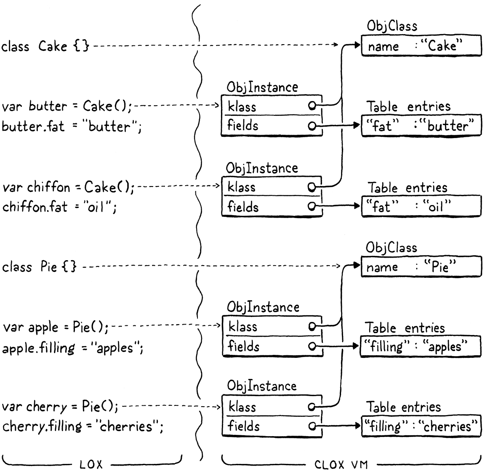
   - ObjInstance 数据结构
   - 实例如何存储其状态 => fileds 哈希表
   - newInstance(class)
4. Get and Set Expressions
   - complier 中添加 dot 中缀运算符
   - **property 和 field 的区别**
     Property is the general term we use to refer to any named entity you can access on an instance.
     Fields are the subset of properties that are backed by the instance’s state.
     **field 一般是不暴露给外部的，只用作类或对象的内部数据储存只用；而 property 是需要暴露给外部的，用于控制类或对象的行为的参数**
   - 避免错误
     a + b.c = 3 这在语法上是无效的；
     我们仅在 canAssign 为真时解析和编译等号部分。如果在 canAssign 为假时出现等号标记， dot() 将保持不变并返回。在这种情况下，编译器最终将回溯到 parsePrecedence() ，在意外的 = 仍然作为下一个标记时停止并报告错误。

## 28 Methods and Initializers 方法和初始化器

1. Method Declarations
   - 数据结构 ObjClass 里加一个 methods 哈希表
     Map<string, ObjClosure>
   - 编译方法声明
     要定义一个新方法，虚拟机需要三样东西：
     方法名、方法体、方法所属的类
     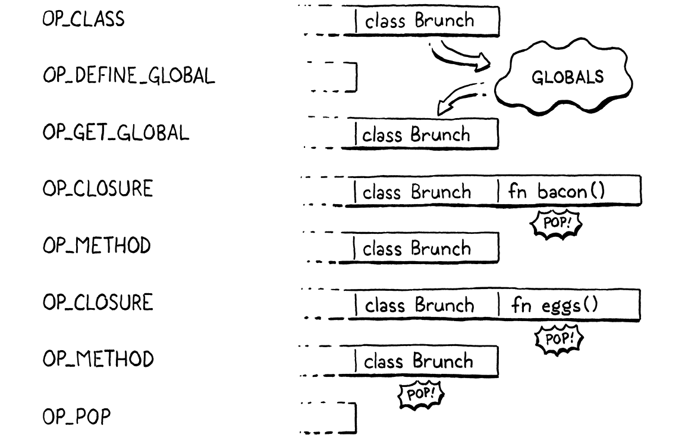
   - 为OP_METHOD 指令实现运行时
     虚拟机相信它执行的指令是有效的，因为将代码传递给字节码解释器的唯一方式是通过 clox 自己的编译器。
     许多字节码虚拟机，如 JVM 和 CPython，支持执行单独编译的字节码。
     这导致了不同的安全问题。恶意构造的字节码可能会使虚拟机崩溃，甚至更糟。
     为了防止这种情况，JVM 在执行任何加载的代码之前会进行字节码验证。CPython 表示用户有责任确保他们运行的任何字节码是安全的。
2. Method References
   instance.method(argument) 等价于

   ```js
   var method = instance.method
   method(argument)
   ```

   我们的字节码虚拟机具有更复杂的状态存储架构。
   局部变量和临时变量在栈上，全局变量在哈希表中，而闭包中的变量使用UpValue。

   - Bound methods 绑定方法
     当用户执行方法访问时，我们会找到该方法的闭包，并将其包装在一个新的“绑定方法”对象中，该对象跟踪访问该方法的实例。
     数据结构：ObjBoundMethod
     它将接收者和方法闭包结合在一起（reveiver + method）。
   - Accessing methods 访问方法
     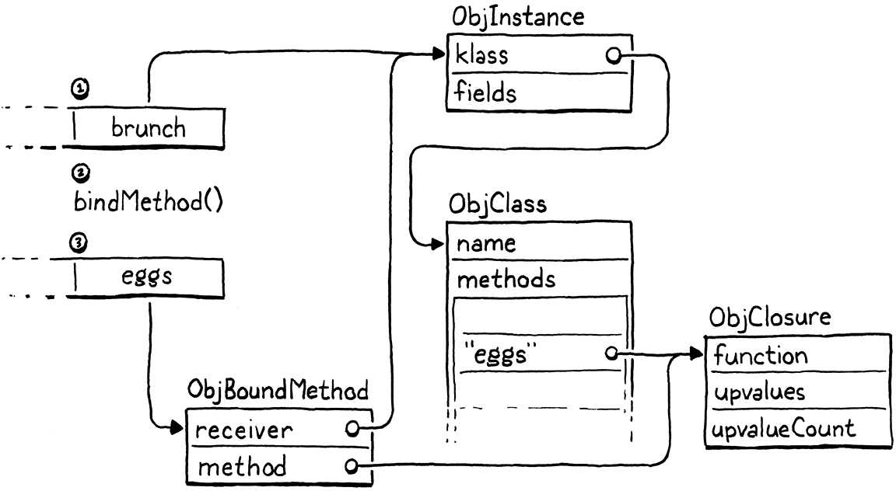
   - Calling methods 调用方法
     call(bound.method, argCount)

3. This
   - 处理 this 前缀运算符
     我们将 this 视为一个词法作用域的局部变量
     > 编译器会通过声明一个名称为空字符串的局部变量来预留栈槽 0。
   - ClassCompiler 数据结构
     为了支持内部类，我们需要在编译器中跟踪当前所在的类。
4. Instance Initializers
   1. 三个特殊规则
      - 每当创建一个类的实例时，运行时都会自动调用初始化器方法。
      - 在初始化器结束后，无论初始化器函数本身返回什么，构造实例的调用者总是会得到实例。
      - 事实上，初始化器是禁止返回任何值的，因为无论如何都不会看到该值。
        ```
        fun create(klass) {
           var obj = newInstance(klass);
           obj.init();
           return obj;
        }
        ```
5. Optimized Invocations 优化调用
   现在，即使在 clox 中，方法调用也很慢。
   Lox 的语义将方法调用定义为两个操作- 访问方法，然后调用结果。
   每次 Lox 程序访问和调用一个方法时，运行时堆都会分配一个新的 ObjBoundMethod，初始化其字段，然后再将其拉出。`之后，GC 必须花费时间释放所有这些短暂的绑定方法。`

   - 经典的 优化技术是定义一种新的单一指令，称为 `超级指令(superinstruction)`。superinstruction 将多个指令融合为一条指令，其行为与整个序列相同。
     字节码解释器最大的性能损耗之一是解码和分派每条指令的开销。将多条指令合并为一条指令，就可以消除其中的部分开销。

   **我们在这里编写的代码遵循了一种典型的优化模式：**

   1. 识别对性能至关重要的常见操作或操作序列。
   2. 添加该模式的优化实现。
   3. 用一些条件逻辑来保护优化后的代码，验证模式是否确实适用。如果确实适用，则继续采用快速路径。否则，就退回到较慢但更稳健的未优化行为。

---

静态语言要求你学习 两种语言- 运行时语义和静态类型系统- ，然后才能达到让计算机做事情的地步。动态语言只需要学习前者。
用户在学习一门新语言时愿意接受的新内容总量有一个较低的阈值。如果超过这个门槛，他们就不会出现。

在语法上相当保守，而在语义上更加冒险：虽然换上新衣服很有趣，但把大括号换成其他块分隔符不太可能给语言增加多少真正的功能，但确实会带来一些新意。语法上的差异很难体现其重要性。另一方面，新的语义可以大大提高语言的功能。多方法、mixins、traits、反射、依赖类型、运行时元编程等可以从根本上提高用户使用语言的能力。

## 29 Superclasses 超类

1. Inheriting Methods 继承方法

   - `class Cruller < Doughnut {`
     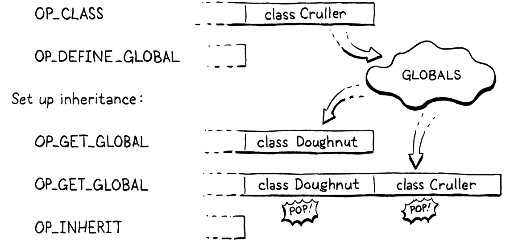

   - 向下复制继承(copy-down inheritance)
     它之所以能在 Lox 中使用，是因为 Lox 类是 封闭(closed)的。一旦类声明执行完毕，该类的方法集就永远不会改变。

2. Storing Superclasses
   每个子类都有一个隐藏变量，其中存储着对超类的引用。每当我们需要执行超类调用时，我们就从该变量访问超类，并告诉运行时从那里开始寻找方法。
3. Super Calls
   解析前缀表达式 `super_`

   super.finish("icing") 表达式的字节码是这样的：
   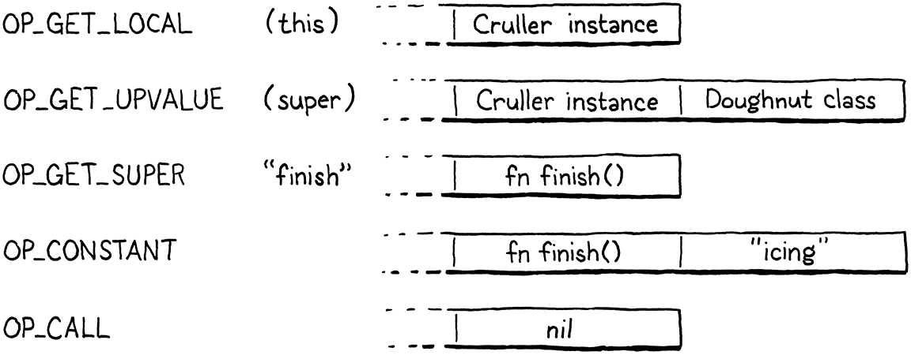

4. Complete Virtual Machine

## 30 Optimization 优化

我们将对虚拟机进行两种截然不同的优化。在这个过程中，你会感受到如何衡量和提高语言实现-或任何程序的性能。

1. Measuring Performance
   优化后的程序做的是同样的事情，只是占用的资源更少。

   - Benchmarks 基准
     - 我们如何验证优化确实提高了性能，以及提高了多少？
     - 我们如何确保其他无关的更改不会降低性能？
   - Profiling 性能分析
     profiler 是一种运行 程序并在代码执行过程中`跟踪硬件资源使用情况的工具`。简单的工具会显示程序中每个函数所花费的时间。复杂的可记录数据缓存未命中、指令缓存未命中、分支预测错误、内存分配以及其他各种指标。

2. Faster Hash Table Probing

   - Slow key wrapping
     在 x86 上，除法和模数约比加法和减法慢 30-50 倍。

     如果我们在虚拟机的代码库中瞎逛，猜测热点(hotspot)，我们很可能不会注意到这一点。我希望您能从中学到的是，在您的工具箱中配备一个`profiler`是多么重要。

3. NaN Boxing
   https://bbs.huaweicloud.cn/blogs/430560
   将NaN作为mask，使用位运算来区分不同的数据类型，这种技术称为NaN boxing。
   通过利用浮点数的NaN位存储额外信息，如类型标签和指针，从而提高缓存效率。
   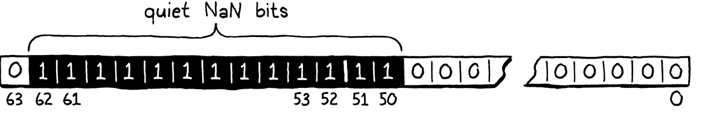
   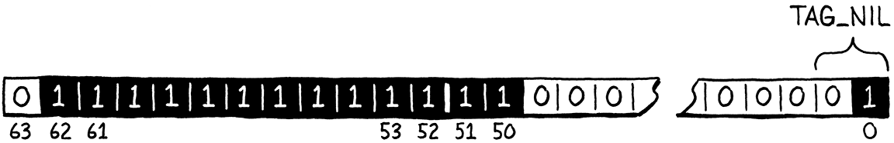
   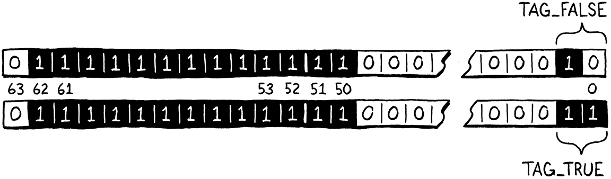
   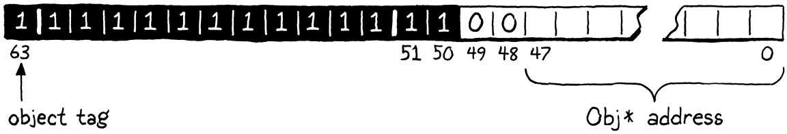

   ### NaN Boxing 是什么

   **NaN Boxing** 是一种在编程语言实现中用于高效表示多种数据类型（如数值、指针、对象等）的技术。它通过利用 IEEE 754 浮点数格式中 **NaN（Not a Number）** 的特定比特模式，将不同类型的值压缩到单一的机器字中。

4. Where to Next
   启动剖析器，运行几个基准测试，查找虚拟机中的其他热点。你是否发现运行时有任何可以改进的地方？
   Fire up your `profiler`, run a couple of `benchmarks`, and look for other `hotspots` in the VM. Do you see anything in the runtime that you can improve?

# BACKMATTER 后记

## A1 Appendix I: Lox Grammar Lox 词法、语法

1. 词法
   syntax is context free, the lexical grammar is regular—note that there are no recursive rules.

   ```js
   NUMBER         → DIGIT+ ( "." DIGIT+ )? ;
   STRING         → "\"" <any char except "\"">* "\"" ;
   IDENTIFIER     → ALPHA ( ALPHA | DIGIT )* ;
   ALPHA          → "a" ... "z" | "A" ... "Z" | "_" ;
   DIGIT          → "0" ... "9" ;
   ```

2. 语法

   ```js
   program        → declaration* EOF ;

   // `程序`由一系列`声明`组成，声明是绑定`identifier`或`statement`
   declaration    → classDecl
                  | funDecl
                  | varDecl
                  | statement ;

   classDecl      → "class" IDENTIFIER ( "<" IDENTIFIER )?
                    "{" function* "}" ;
   funDecl        → "fun" function ;
   varDecl        → "var" IDENTIFIER ( "=" expression )? ";" ;

   // `语句`产生副作用，但不会引入`绑定`
   statement      → exprStmt
                  | forStmt
                  | ifStmt
                  | printStmt
                  | returnStmt
                  | whileStmt
                  | block ;

   exprStmt       → expression ";" ;
   forStmt        → "for" "(" ( varDecl | exprStmt | ";" )
                              expression? ";"
                              expression? ")" statement ;
   ifStmt         → "if" "(" expression ")" statement
                    ( "else" statement )? ;
   printStmt      → "print" expression ";" ;
   returnStmt     → "return" expression? ";" ;
   whileStmt      → "while" "(" expression ")" statement ;
   block          → "{" declaration* "}" ;

   // `表达式`产生值
   // Lox 有许多具有不同优先级的一元和二元运算符。有些语言的语法并不直接编码优先级关系，而是在其他地方指定。在这里，我们为每个优先级使用了单独的规则，使其明确化。
   expression     → assignment ;

   assignment     → ( call "." )? IDENTIFIER "=" assignment
                  | logic_or ;

   logic_or       → logic_and ( "or" logic_and )* ;
   logic_and      → equality ( "and" equality )* ;
   equality       → comparison ( ( "!=" | "==" ) comparison )* ;
   comparison     → term ( ( ">" | ">=" | "<" | "<=" ) term )* ;
   term           → factor ( ( "-" | "+" ) factor )* ;
   factor         → unary ( ( "/" | "*" ) unary )* ;

   unary          → ( "!" | "-" ) unary | call ;
   call           → primary ( "(" arguments? ")" | "." IDENTIFIER )* ;
   primary        → "true" | "false" | "nil" | "this"
                  | NUMBER | STRING | IDENTIFIER | "(" expression ")"
                  | "super" "." IDENTIFIER ;

   // utils
   // 为了使上述规则更加简洁，部分语法被拆分成一些重复使用的辅助规则。
   function       → IDENTIFIER "(" parameters? ")" block ;
   parameters     → IDENTIFIER ( "," IDENTIFIER )* ;
   arguments      → expression ( "," expression )* ;
   ```

## A2 Appendix II: Generated Syntax Tree Classes 语法树类

一些AST类型

---

问题

- 即时编译(JIT)往往是实现动态类型语言的最快方法，但并非所有语言都使用它。有哪些理由不采用 JIT？
  Slower startup 启动速度较慢
  Memory overhead 内存开销
  Implementation complexity 实施复杂度

https://stackoverflow.com/q/3221861

- The lexical grammars of Python and Haskell are not regular. What does that mean, and why aren’t they? Python 和 Haskell 的词法语法并不规则。这意味着什么？为什么不呢？
  正则语言是可以用正则表达式或确定性或非确定性有限自动机或状态机来表达的语言。
  **Python 基于缩进的作用域无法用正则表达式来表达。**

- 龙书、虎书、鲸书
  只推荐看下龙书，而且快速过...
  龙书前端部分学理论+b 站中科大课程
