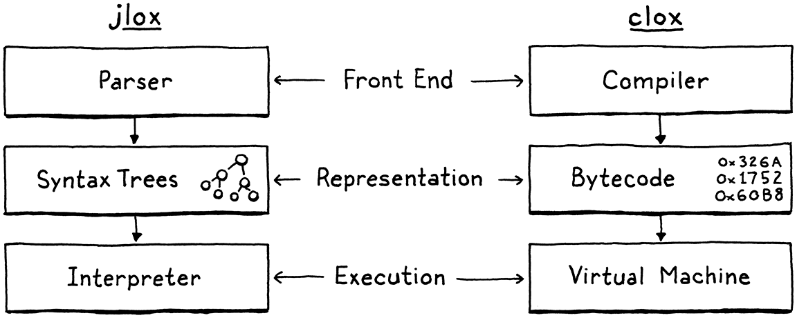

# III A BYTECODE VIRTUAL MACHINE clox 介绍

手写一个字节码虚拟机
jlox 依赖 JVM 为我们做很多事情。如果我们想了解解释器是如何工作的，我们就需要自己构建这些零碎的东西
`写一个虚拟机`

## 14 Chunks of Bytecode 字节码

jlox 不够用的一个更根本的原因在于，它太慢了。树遍历解释器对于某些高级的声明式语言来说是不错的，但是对于通用的命令式语言——即使是 Lox 这样的“脚本”语言——这是行不通的。
我们可以把 jlox 放在性能分析器(profiler)中运行，并进行调优和调整热点(start tuning and tweaking hotspots)，但这也只能到此为止了。它的执行模型（遍历 AST）从根本上说就是一个错误的设计。我们无法将其微优化到我们想要的性能，就像你无法将 AMC Gremlin 打磨成 SR-71 Blackbird 一样。

1. tree-walk interpreter 的利弊
   - 利：简单、可移植(portable)
   - 弊：内存效率不高(节点的空间占用大、空间局部性不好)
     树遍历器的每一步都会引用子节点，都可能会超出缓存的范围，并迫使 CPU 暂停，直到从 RAM 中拉取到新的数据块（才会继续执行）。仅仅是这些树形节点及其所有指针字段和对象头的开销，就会把对象彼此推离，并将其推出缓存区。
2. 为什么不编译成本地代码(native code)
   如果你想真正快，就要摆脱所有的中间层，一直到最底层——机器码。
   最快的语言所做的是直接把代码编译为芯片支持的本地指令集(native instruction set)。将一个值从这个地址移动到这个寄存器”“将这两个寄存器中的整数相加”，诸如此类。
   `但是!这种性能是有代价的。编译成本地代码并不容易。`如今广泛使用的大多数芯片都有着庞大的拜占庭式架构，其中包含了几十年来积累的大量指令。它们需要复杂的寄存器分配、流水线和指令调度。
   `当然，你可以把可移植性抛在一边。`花费几年时间掌握一些架构，但这仍然只能让你接触到一些流行的指令集。为了让你的语言能在所有的架构上运行，你需要学习所有的指令集，并为每个指令集编写一个单独的后端。
3. 什么是字节码

   > 在很多字节码格式中，每条指令只有一个字节长，因此称为“字节码”

   trade-off (权衡)
   一方面，树遍历解释器简单、可移植，而且慢。另一方面，`本地代码复杂且特定与平台`，但是很快。字节码位于中间。它保留了树遍历型的可移植性——在本书中我们不会编写汇编代码，同时它牺牲了一些简单性来换取性能的提升，虽然没有完全的本地代码那么快。
   它是一个理想化的幻想指令集(emulation)。虚拟机（VM）是一个用软件编写的芯片，每次会解释字节码的一条指令。
   `模拟层增加了开销，这是字节码比本地代码慢的一个关键原因。但作为回报，它为我们提供了可移植性。`
   这就是我们的新解释器 clox 要走的路。我们将追随 Python、Ruby、Lua、OCaml、Erlang 和其它主要语言实现的脚步。在许多方面，我们的 VM 设计将与之前的解释器结构并行。
   

4. 指令块(Chunks of Instructions)
   使用“chunk”指代字节码序列
   在我们的字节码格式中，每个指令都有一个字节的操作码（通常简称为 opcode）。这个数字控制我们要处理的指令类型——加、减、查找变量等。
5. 反汇编字节码块(Disassembling Chunks)
   assembler 是一个老式程序，它接收一个文件，该文件中包含 CPU 指令（如 "ADD "和 "MULT"）的可读助记符名称，并将它们翻译成等价的二进制机器代码。
   `反汇编程序(disassembler)则相反——给定一串机器码，它会返回指令的文本列表。`
6. 常量
   我们的虚拟机中应该如何表示数值？
   因为我们没有语法树，现在我们需要一个不同的解决方案。

   - 表示值：
     对于像`整数`这种固定大小的值，许多指令集直接将值存储在操作码之后的代码流中。这些指令被称为`即时指令(immediate instructions)`，因为值的比特位紧跟在操作码之后。
     对于`字符串`这种较大的或可变大小的常量来说，在本地编译器的机器码中，这些`较大的常量会存储在二进制可执行文件中的一个单独的“常量数据”区域。`然后，加载常量的指令会有一个地址和偏移量，指向该值在区域中存储的位置。例如，Java 虚拟机将常量池与每个编译后的类关联起来。https://docs.oracle.com/javase/specs/jvms/se7/html/jvms-4.html#jvms-4.4

   当 VM 执行常量指令时，它会“加载”常量以供使用。一个简单的操作码不足以知道要加载哪个常量。为了处理这样的情况，我们的字节码像大多数其它字节码一样，`允许指令有操作数(operands)`。这些操作数以二进制数据的形式存储在指令流的操作码之后，让我们对指令的操作进行参数化。
   

   每次我们向 clox 添加一个新的操作码时，我们都会指定它的操作数是什么样子的——即它的`指令格式(instruction format)`。

7. 行信息
   在 jlox 中，这些数字保存在词法标记中，而我们又将词法标记存储在 AST 节点中。既然我们已经抛弃了语法树而采用了字节码，我们就需要为 clox 提供不同的解决方案。对于任何字节码指令，我们需要能够确定它是从用户源代码的哪一行编译出来的。
   `将行信息保存一个单独的数组中，而不是将其编入字节码本身中`。行信息只在运行时出现错误时才使用，我们不希望它在指令之间占用 CPU 缓存中的宝贵空间，而且解释器在跳过行数获取它所关心的操作码和操作数时，会造成更多的缓存丢失。
   优化：我们对行信息的编码非常浪费内存。鉴于一系列指令通常对应于同一源代码行，`一个自然的解决方案是对行号进行类似游程编码的操作。`

   > 设计一个编码方式，压缩同一行上一系列指令的行信息。修改 writeChunk() 以写入该压缩形式，并实现一个 getLine() 函数，给定一条指令的索引，确定该指令所在的行。
   > getLine()不一定要特别高效。因为它只在出现运行时错误时才被调用，所以在它并不是影响性能的关键因素。

jlox 中定义的整个 AST 类族吗？在 clox 中，我们把它减少到了三个数组：**代码字节数组，常量值数组，以及用于调试的行信息。**
这种减少是我们的新解释器比 jlox 更快的一个关键原因。`你可以把字节码看作是 AST 的一种紧凑的序列化，`并且解释器在执行时按照需要对其反序列化的方式进行了高度优化。

## 15 A Virtual Machine 虚拟机

在构建新解释器的前端之前，我们先从后端开始——执行指令的虚拟机。它为字节码注入了生命。通过观察这些指令的运行，我们可以更清楚地了解编译器如何将用户的源代码转换成一系列的指令。

1. 全局变量 vm
   选择使用静态的 VM 实例是本书的一个让步，但对于真正的语言实现来说，不一定是合理的工程选择。如果你正在构建一个旨在嵌入其它主机应用程序中的虚拟机，那么如果你显式地获取一个 VM 指针并传递该指针，则会为主机提供更大的灵活性。`这样，主机应用程序就可以控制何时何地为虚拟机分配内存，并行地运行多个虚拟机，等等。我在这里使用的是一个全局变量，你所听说过的关于全局变量的一切坏消息在大型编程中仍然是正确的。但是，当你想在一本书中保持代码简洁时，就另当别论了。`
2. 一个值栈操作器(A Value Stack Manipulator)
   我们的老式 jlox 解释器通过递归遍历 AST 来实现这一点。其中使用的是后序遍历。首先，它向下递归左操作数分支，然后是右操作数分支，最后计算节点本身。
   在对左操作数求值之后，jlox 需要将结果临时保存在某个地方，然后再向下遍历右操作数。`我们使用 Java 中的一个局部变量来实现。`
   在 clox 中，我们应该如何存储这些临时值呢？
   
3. 基于栈的虚拟机
   基于堆栈的解释器并不是银弹。它们通常是够用的，但是 JVM、CLR 和 JavaScript 的现代化实现中都使用了复杂的`即时编译(JIT)`管道，在动态中生成更快的本地代码。 ↩︎
   给我们的虚拟机一个固定的栈大小，意味着某些指令系列可能会压入太多的值并耗尽栈空间——典型的“堆栈溢出”。我们可以根据需要动态地增加栈，但是现在我们还是保持简单。

   > 除了基于堆栈的字节码外，还有一种基于寄存器的字节码

   在我们基于堆栈的虚拟机中，`最后一条指令的编译结果`类似于

   ```c
   load <a>  // 读取局部变量a，并将其压入栈
   load <b>  // 读取局部变量b，并将其压入栈
   add       // 弹出两个值，相加，将结果压入栈
   store <c> // 弹出值，并存入局部变量c
   ```

   在基于寄存器的指令集中，指令可以直接对局部变量进行读取和存储。上面最后一条语句的字节码如下所示：

   ```c
   add <a>, <b>, <c> // 从a和b中读取值，相加，并存储到c中
   ```

   只有一条指令需要解码和调度，整个程序只需要四个字节。由于有了额外的操作数，解码变得更加复杂，但相比之下它仍然是更优秀的。没有压入和弹出或其它堆栈操作。
   **Lua 的实现曾经是基于堆栈的。到了 Lua 5.0，实现切换到了寄存器指令集，并注意到速度有所提高。**
   寄存器虚拟机是很好的，但要为它们编写编译器却相当困难。考虑到这可能是你写的第一个编译器，我想坚持使用一个易于生成和易于执行的指令集。基于堆栈的字节码是非常简单的。

4. 数学计算器
   我们的虚拟机的核心和灵魂现在都已经就位了。字节码循环分派和执行指令。栈堆随着数值的流动而增长和收缩。
   把操作符作为参数传递给宏。现在你知道了。预处理器并不关心操作符是不是 C 语言中的类，在它看来，这一切都只是`文本符号`。
   ```c
   #define BINARY_OP(op) \
    do { \
      double b = pop(); \
      double a = pop(); \
      push(a op b); \
    } while (false)
   ```

## 16 Scanning on Demand 按需扫描

我们的第二个解释器 clox 分为三个阶段——`扫描器、编译器和虚拟机。`每两个阶段之间有一个数据结构进行衔接。词法标识从扫描器流入编译器，字节码块从编译器流向虚拟机。我们是从尾部开始先实现了字节码块和虚拟机。现在，我们要回到起点，构建一个生成词法标识的扫描器。


1. 开启编译管道
   我们还不会构建真正的编译器，但我们可以开始布局它的结构(laying out its structure)
   当我们的扫描器一点点处理用户的源代码时，它会跟踪自己已经走了多远。就像我们在虚拟机中所做的那样，**我们将状态封装在一个结构体中，然后创建一个该类型的顶层模块变量，这样就不必在所有的函数之间传递它。(we wrap that state in a struct and then create a single top-level module variable of that type so we don’t have to pass it around all of the various functions.)**

## 17 Compiling Expressions 编译表达式

## 18 Types of Values 值类型

## 19 Strings 字符串

## 20 Hash Tables 哈希表

## 21 Global Variables 全局变量

## 22 Local Variables 局部变量

## 23 Jumping Back and Forth 来回跳转

## 24 Calls and Functions 调用和函数

## 25 Closures 闭包

## 26 Garbage Collection 垃圾回收

## 27 Classes and Instances 类和实例

## 28 Methods and Initializers 方法和初始化

## 29 Superclasses 超类

## 30 Optimization 优化

# BACKMATTER 后记

## A1 Appendix I: Lox Grammar Lox 语法

## A2 Appendix II: Generated Syntax Tree Classes 语法树类

---

问题

- 即时编译(JIT)往往是实现动态类型语言的最快方法，但并非所有语言都使用它。有哪些理由不采用 JIT？
  Slower startup 启动速度较慢
  Memory overhead 内存开销
  Implementation complexity 实施复杂度

https://stackoverflow.com/q/3221861

- The lexical grammars of Python and Haskell are not regular. What does that mean, and why aren’t they? Python 和 Haskell 的词法语法并不规则。这意味着什么？为什么不呢？
  正则语言是可以用正则表达式或确定性或非确定性有限自动机或状态机来表达的语言。
  **Python 基于缩进的作用域无法用正则表达式来表达。**

- 龙书、虎书、鲸书
  只推荐看下龙书，而且快速过...
  龙书前端部分学理论+b 站中科大课程
