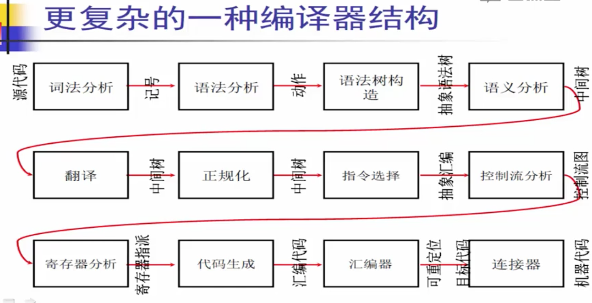

- 偏理论：龙书
- 偏实践：crafting interpreters、编程语言实现模式

  https://www.bilibili.com/video/BV17W41187gL

笔记：
https://kbug.cn/post/813.html
https://github.com/wangfupeng1988/read-notes/blob/master/video/%E7%BC%96%E8%AF%91%E5%8E%9F%E7%90%86.md

# 第一单元：编译器介绍 (1)

## 第一讲：编译器概述 (1.1)

- 什么是编译器
  编译就是将高级语言转换为计算机所能识别的低级语言的过程
- 计算机科学史上第一个编译器是 Fortran 语言的编译器
  影响：
  理论上：自动机、文法
  实践上：算法、数据结构
  编译器架构

## 第二讲：编译器结构 (1.2)

- 编译器具有非常`模块化`的高层结构
  
  
- 编译器通常会被划分为两个部分（如下图）：
  
  前端：源代码生成中间代码，和源代码有关
  后端：中间代码生成目标代码并优化，和目标代码有关
  两者以抽象语法树 AST 作为连接数据

## 第三讲：编译器实例 (1.3)

# 第二单元：词法分析(Part I) (2)

## 第一讲：词法分析的任务 (2.1)

- 字符流 -> 词法分析器 -> 单词流

- 词法分析器(Scanner)的实现方式
  - 手工编码实现(手写)
    效率高，但是复杂度高，容易出错
    但是是目前非常流行的实现方式，例如 gcc、llvm
  - 词法分析器生成器(自动生成)
    可快速原型，但是难以控制细节

## 第二讲：词法分析器的手工构造 (2.2)

- 词法分析的手工构造法：转移图
  
  查表转移
- 词法分析的自动生成技术：正则表达式
  工具：lex、flex、jlex
  输入一些`声明式的规范(正则表达式)`，即可自动生成一个词法分析器
  **四个阶段：**
  1. 正则表达式 -> NFA : Thompson 算法
  2. NFA -> DFA：子集构造算法
  3. DFA 最小化：Hopcroft 算法
  4. 从 DFA 生成词法分析器

## 第三讲：正则表达式 (2.3)

对给定的字符集 ∑ = {c1, c2, … cn }，归纳定义：

- 空串是正常表达式
- 对于任意 C ∈ ∑ ， C 是正则表达式
- 如果 M 和 N 是 正则表达式，则以下也是正则表达式
  - `选择` M | N = { M, N }
  - `连接` MN = {mn | m ∈ M，n ∈ N}
  - `闭包` `M*` = {e, M, MM, MMM, …. } ∞

这就是正则表达式的定义，而现代正则表达式这么多的语法，例如 [a-b] ? + 等，都是后来扩展出的`语法糖`，即对基本规则的一种简写方式。

- [c1-cn] = c1 | c2 | … | cn
- e+ = 一个或多个 e
- e? = 0 或 1 个 e
- `e*` = 0 或 多个 e
- e{i,j} = i 到 j 个 e
- . = 除开换行符外的任意字符

## 第四讲：有限状态自动机 FA (2.4)

也称“有穷自动机”，是一种数学模型。简单理解，就是输入一个字符串，输出这个字符串是否满足某个规则（true / false）。

五个组成部分：

1. 输入字母表 ∑
2. 有限状态集 S
3. 转移函数 δ
4. 初始状态 q0
5. 终结状态集合 F

```ts
interface Fa<T, S> {
  move(input: T): S
  accept(state: S): boolean
}
```

有限状态自动机 FA 又分为两种：

确定的有限状态自动机 DFA 。针对一个状态，输入一个字符，只能有一个出口。
非确定的有限状态自动机 NFA 。针对一个状态，输入一个字符，可能会有多个出口。如上图中的 0 状态，输入 a 时有两个出口，所以它是 NFA 。

`每一个正则表达式，都能对应一个 FA 。`

# 第三单元：词法分析(Part II) (3)

## 第一讲：RE 转换成 NFA：`Thompson 算法` (3.1)

**根据正则表达式建图**

基本的逻辑是：

- 对基本的 RE（空串、单个字符） 直接构造
- 对复杂的 RE （或、连接、闭包）递归构造
  
  

## 第二讲：NFA 转换成 DFA：`子集构造算法` (3.2)

NFA 上 bfs，沿着某个字符转移后可以到达的点的集合就是一个子集。
“子集”就是原来 NFA 的若干状态的集合，通过构造子集，来实现 DFA 。
有点像求 SCC

最坏时间复杂度 O(2^n)

## 第三讲：DFA 的最小化：`Hopcroft 算法` (3.3)

基本逻辑是，将生成的 DFA 的子集再进行合并，减少节点数量。状态节点越少，占用的空间复杂度越少，提高运算效率。

## 第四讲：从 DFA 生成分析算法 (3.4)

DFA 是一个有向图

# 第四单元：语法分析(Part I) (4)

- 数学理论：上下文无关文法(CFG)
  描述语言语法规则的数学工具
- 自顶向下分析
  - 递归下降分析算法(预测分析算法)
  - LL 分析算法
- 自底向上分析

  - LR 分析算法

- **语法分析器的实现方式**
  - 手工方式
    - 递归下降分析算法
  - 自动生成方式
    - LL(1) 分析算法
    - LR(1) 分析算法

## 第一讲：语法分析的任务 (4.1)

错误处理：输入一个程序语法的表示，判断是否符合程序的语法
结构化：如果符合，就根据输入的符号集，生成抽象语法树 AST

## 第二讲：上下文无关文法`CFG`和推导 (4.2)

历史背景：`乔姆斯基文法体系`，用数学建模研究自然语言结构

- 乔姆斯基文法体系

  - 0 型文法：任意文法
  - 1 型文法：上下文相关文法
  - 2 型文法：**上下文无关文法**，可以描述语言文法结构
  - 3 型文法：**正规文法**，可以描述语言词法结构

  0 和 1 目前还没有广泛应用

- 形式化

  - 终结符号：语言中的基本符号
  - 非终结符号：语法规则中的符号
  - 开始符号：推导的起始符号

- **上下文无关文法**
  定义：四元组 G = (T, N, P, S)

  - 终结符号集合 T
  - 非终结符号集合 N
  - 产生式集合 P
    BNF 范式(巴科斯-诺尔范式)：
    非终结符要用尖括号括起来，终结符用下划线
  - 开始符号 S

  **语法分析就是：给定一个文法 G 和句子 s ，要确定：是否能在 G 的推导结果中，找到 s (即，是否存在对句子的推导)**

- 推导
  给定文法 G，从 G 的开始符号 S 出发，用产生式的右部替换左侧的`非终结符`。此过程不断重复，直到不出现`非终结符`为止。最终的串称为句子。

  推导方式一般有两种：

  最左推导：每次推导过程当中总是选择最左侧的符号进行替换
  最右推导：同理，选择最右侧

## 第三讲：分析树和二义性文法 (4.3)

- 二义性文法：ast 不唯一
- 解决方案：
  **重写文法**，规定优先级、结合律
  没有通用解决方案，需要 case by case

## 第四讲：自顶向下分析 (4.4)

- 即通过文法 G 随意推导出一个句子 t ，然后拿 t 和目标句子 s 进行对比
- 如果 t == s ，则成功
- 如果 t != s ，则回溯，从新计算一个 t1 ，再比较

就是暴力搜索，效率低
`我们需要线性时间的算法`
怎么办？
**用前看符号避免回溯**

## 第五讲：递归下降分析算法 (4.5)

- 也称预测分析算法，其基本思路是：

  - 每个非终结符构造一个分析函数（即将整个文法匹配整个句子的方式，拆解开，用单个非终结符去匹配句子中的字符，即算法的分治思想），因为非终结符是可以层层定义的，因此是“递归”，如下图。

  

  - 用“前看符号”（即不知道匹配哪一个，就去目标句子 s 中看一眼，给一个提示）指导当前产生式规则的选择。

- 递归下降分析算法的特点是
  线性时间复杂度，运行高效
  容易实现，适合手工编码。错误定位准确。使用者有 GCC、LLVM

# 第五单元：语法分析(Part II) (5)

其他的分析算法，一般用于 `parser generator，即自动生成语法分析器。`
应用：
ANTLR : LL(1)
YACC(unix)、Bison(linux) : LR(1)

## 第一讲：LL(1)分析算法 (5.1)

递归下降分析算法适合于手工编码，而 `LL(1) 分析算法适用于语法分析的自动生成`。所谓“LL(1)”，是指：从左（L）向右读入程序，最左（L）推导，采用 1 个前看符号。分析高效，也是线性时间复杂度。

其基本思想是 —— 表驱动的算法
分析表是根据语法由 parsergen 生成的。行是非终结符，列是终结符，表格中的值是产生式的序号。含义为：在某个状态下，如果遇到某个终结符，就用对应的产生式规则进行替换。


回顾之前讲过的自顶向下分析算法，最大的问题就在于去盲目推导，盲目匹配出句子，然后再去和目标句子 s 做对比，对比出错就要回溯，时间复杂度非常高。**因此，就需要在推导过程中就需要做分析预测，就可以从参考这个分析表。从分析表中，通过预测输入能得到产生式的序号，就知道接下来要匹配哪个产生式了，就不需要回溯了。**


- FIRST 集
  FIRST(N) = 从非终结符 N 开始推导的句子的所有可能终结符的集合

- FIRST 集的不动点算法

  可以理解为，**对每个 N 中的顶点，求出所有可达的 T 的点集。**

  ```py
  def first_set(G):
    first = {}
    for N in G.N:
      first[N] = set()
    # 暴力合并，直到不再变化
    while True:
      old_first = copy.deepcopy(first)
      for p in G.P:
        if p.right[0] in G.T:
          first[p.left].add(p.right[0])
        elif p.right[0] in G.N:
          first[p.left] = first[p.left].union(first[p.right[0]])
      if old_first == first:
        break
    return first
  ```

  **根据这个 FIRST 集，就可以构造出分析表了。**

## 第二讲：LL(1)分析的冲突处理 (5.2)

LL(1) 可能会产生冲突，一个对应的位置中可能会有两个数字

- Nullable 集
  Nullable(N) = N 是否能推导出空串

  ```py
  def nullable_set(G):
    nullable = {}
    for N in G.N:
      nullable[N] = False
    while True:
      old_nullable = copy.deepcopy(nullable)
      for p in G.P:
        if p.right == ['ε']:
          nullable[p.left] = True
        elif all([nullable[n] for n in p.right]):
          nullable[p.left] = True
      if old_nullable == nullable:
        break
    return nullable
  ```

  First 集推导过程中需要考虑 Nullable 集，因为如果一个非终结符 N 可以推导出空串，那么 First(N) 就要包含 First(N) ∪ First(N+1)。

## 第三讲：LR(0)分析算法 (5.3)

自底向上分析算法
从左(L)向右(R)读入程序，最右(R)推导，采用 0 个前看符号。
优点：容易实现
缺点：能分析的文法有限

## 第四讲：SLR 分析算法 (5.4)

TODO

## 第五讲：LR(1)分析算法 (5.5)

TODO

## 第六讲：LR(1)分析工具 (5.6)

- YACC
  Yet Another Compiler-Compiler
  1975 年，首先由 S.C.Johnson 开发，在 UNIX 上实现
  后来，很多工具在此基础上发展，如 Bison，并移植到了很多其他语言上
  YACC 现在是一个标准的工具

  ```
  用户代码和 Yacc 声明
  %%
  语法规则
  %%
  用户代码
  ```

# 第六单元：`语法制导翻译`与抽象语法树 (6)

## 第一讲：语法制导翻译 (Syntax-Directed Translation) (6.1)

- 编译器在做语法分析的过程中,除了回答程序语法是否合法外,还必须完成后续工作。
  包括，但不限于
  - 类型检查
  - 目标代码生成
  - 中间代码生成
    。。。
- 这些后续工作一般可以通过**语法制导翻译**完成。

## 第二讲：语法制导翻译的实现原理 (6.2)

给每条产生式规则附加一个语义动作，语义动作在产生式规约时执行。

## 第三讲：抽象语法树 (6.3)

AST 是编译器中非常重要的数据结构，因为它是编译器前端和后端的接口形式。
后续的过程仅仅依赖于 AST ，不会再依赖于前面的源码或者字符集。因此，一旦生成了 AST ，前面的源码就会被丢弃。因此，AST 中要有很详细的信息，不仅仅是本课程中讲的这个简单的树。
`例如，AST 要存储当前程序的文件、行、列，这样在语法报错时才能准确的给出具体的错误位置。`

AST 必须仔细设计！

## 第四讲：抽象语法树的自动生成 (6.4)

# 第七单元：语义分析 (7)

程序如果能通过了语义分析这个阶段，那再往后就不应该出现任何语法错误，除非是编译器自己的 bug 。

## 第一讲：语义分析的任务 (7.1)

上文中的`语法分析`用到的是 CFG 即上下文无关的语法，即不依赖于上下文。因此，`语义分析`是在 AST 基础上，结合上下文(Context)来分析。

语义分析 也称为`类型检查、上下文相关分析`
负责检查程序（抽象语法树）的上下文相关的属性：

- 这是具体语言相关的，典型的情况包括：
- 变量 在使用前先进行声明
- 每个表达式都有合适的类型
- 函数调用和函数的定义一致
- ….

## 第二讲：语义规则及实现 (7.2)

## 第三讲：符号表 (7.3)

- Environment

## 第四讲：语义分析中的其它问题 (7.4)

# 第八单元：代码生成 (8)

经过语义分析的 AST ，即可用来做代码生成，即生成最终的机器（物理机或者虚拟机）代码。注意，这里直接从 AST 到目标代码，是一种最简单的编译器模型，暂时忽略了优化的部分。优化过程下文会详细解说。


为什么会有这么多中间层？
降低复杂度、跨平台

## 第一讲：代码生成的任务 (8.1)

**代码生成是把源程序翻译成“目标机器”（可能是真实的机器，也可能是虚拟机）上的代码**，而且要保证和源程序的“等价性”（重要！！！）。主要的任务是：

- 给源程序的`数据`（全局变量，局部变量等）`分配计算资源`（寄存器、数据区、代码区、栈区、堆区）
- 给源程序的`代码`（运算 语句 函数）`选择机器指令`（算数运算 逻辑运算 跳转 函数调用等）

（而且要考虑空间和时间的效率，在满足等价性的前提下）
接下来通过两个示例来看代码生成的过程：

- 栈计算机 Stack —— 代表了虚拟机，例如 JVM
- 寄存器计算机 Reg —— 代表了 RISC 精简指令集，如 ARM 芯片

## 第二讲：栈计算机 (8.2)

70 年代有栈计算机的物理机，但是今天已经退出了历史舞台，因为执行效率太低。但是这里还要研究 Stack ，`一来是因为在 Stack 上代码生成比较简单，二来是很多虚拟机是这样设计的，例如 JVM 。`


三个组成部分：

- 内存：存放程序变量
  给变量 x 分配内存空间的伪指令：.int x （伪指令，不会被 ALU 执行）
- stack ：进行计算的空间
- ALU：计算单元
  指令集(ISA)：push、load、store、add、sub、mul、div
  以上这几条指令，就是 java 字节码的一个子集。真实的 java 字节码有 200+ 个。
  

## 第三讲：面向栈计算机的代码生成 (8.3)

递归下降代码生成算法

如何运行生成的汇编指令？

- 找一台真实的物理机
- 写一个虚拟机(解释器)
  类似 JVM
- 在非栈式计算机上进行模拟
  例如，在 x86 上模拟栈式计算机

## 第四讲：寄存器计算机及其代码生成 (8.4)

寄存器计算机是目前最流行的机器体系结构之一

- 效率高
- 机器体系结构规整，基于寄存器架构
  典型的有 16、32 或更多寄存器
  访问都用过 load/store 进行，内存不能直接运算

这种机器类型是基于寄存器架构，`所有操作都在寄存器完成，执行效率非常高（因为寄存器访问速度是内存访问速度的百倍），访存都通过 load 或 store 指令（RISC 指令集特点）。`

三个组成部分：

- 内存
  存放“溢出(spill)”的变量（寄存器中放不开的变量，如果假设寄存器有无限多个的话，就不用考虑“溢出”了）
- 寄存器
  进行计算的空间
  给变量 x 分配寄存器的伪指令 .int x （伪指令不会被 ALU 执行）
- ALU 计算单元
  指令集：
  - movn n, r1 把立即数 n 存入寄存器 r1
  - mov r1, r2 把 r1 的值赋值给 r2
  - load [x], r1 将 x 地址的值取出，放在 r1 。其中 x 是指针，[x]- 即取出指针对应内存的值。
  - store r1, [x] 将 r1 的值赋值给 x 内存地址
  - add r1, r2, r3 加法，表示 r3 = r1 + r2
  - sub r1, r2, r3 减法，同理
  - times r1, r2, r3 乘法，同理
  - div r1, r2, r3 除法，同理

实际的物理机器上不可能有无限多的寄存器，因此要确定哪些变量被用于寄存器？哪些变量被“溢出”放在内存？—— 这个问题是另外一个编译器的重要部分：**编译器分配。**
如何进行编译器分配，这个问题会在下文介绍：活性分析。

# 第九单元：中间代码与程序分析 (9)

中间表示是一个统称，有很多种表示形式，AST 就是其中之一。上文提到，从 AST 直接生成目标代码是比较原始的编译技术，现代编译器中往往会在编译器的“后端”进行各种各样的代码优化，`不同的优化形式就需要不同的表示形式。`

## 第一讲：中间代码的地位和作用 (9.1)

常见的中间代码形式：

- 树和有向无环图(DAG)：
  高层表示，适用于程序源代码
- 三地址码(3-address code)：
  低层表示，靠近目标机器
- 控制流图(CFG)：
  更精细的三地址码，程序的图状表示
- 静态单赋值形式(SSA) ：
  更精细的控制流图
- 连续传递风格(CPS) ：
  更一般的 SSA （函数式语言中用的比较多）

还有很多。。。
每个编译器的中间表示都不完全一样

- 为什么要划分成不同的中间表示
  - 编译器工程角度
    - 阶段划分
    - 任务分解
    - 代码工程
  - 程序分析和代码优化需要
    许多优化在特定的中间表示上才能进行，例如活性分析、到达定义分析等


## 第二讲：三地址码 (9.2)

**AST -> 三地址吗**

“三地址码”，`即一个指令有一个运算符，最多有三个操作数。`这样就使得每一条指令都比较简单，易于和机器语言对应。
三地址码的特点：

- 给每个`中间变量和计算结果命名`，即没有符合表达式。例如将 a = 3 + 4 \* 5 拆解成一个一个的中间变量
- 只有最基本的控制流，即没有各种控制结构，`只有 goto 和 call` 。例如将 if else 改为 Cjmp（条件跳转指令）


- 三地址码的优点
  1. 所有操作都是原子的
  2. 控制流被简化了，只有跳转
  3. 是抽象的机器代码，向后做代码生成更容易

## 第三讲：控制流图 (9.3)

**三地址码 -> 控制流图**
三地址码是一种线性的表示方式，这就没法通过它来分析和确定流程。
控制流图是一种更加精细的三地址码（本质上还是三地址码），`将程序中的各个控制流块都表示了出来`，如下图。


控制流图就是一个有向图 G = (V, E) ，其中节点 V 表示程序的基本块，边 E 表示基本块之间的跳转关系。生成控制流图的目的有很多，但都是为了做代码优化，例如：

- 做控制流分析，例如程序中有没有循环？
- 做数据流分析，例如程序中某行的变量 x 可能的值是什么？

图论算法都可以用在控制流图的操作上
一个应用：死基本块删除优化(入度为 0)

## 第四讲：数据流分析 (9.4)

“数据流分析”，就是通过`静态的观察程序（并不执行）来判断其中的变量和数据的一些变化`，得到被优化程序的静态保守信息。
eg：到达定义分析、活性分析...


常量传播的例子：
通过控制流图，既可以判断一个变量 y 的赋值可能性。如果 y 能编译器识别为一个固定的值，直接 a = 3 并且把一开始的 y = 3 删掉。这就是一个优化过程

## 第五讲：到达定义分析 (9.5)

到达定义：对每个变量的使用点，有哪些定义可以到达？(即：该变量是在哪里被赋值的？)
分析一个变量是如何一步一步的被`定义`和`使用`的

## 第六讲：活性分析 (9.6)

“活性分析”，即`分析变量的活跃区间（可以理解为生命周期）然后来做寄存器的分配。`

三个变量，只有一个寄存器，该如何分配？
答案是：计算出每个变量的活跃区间，即可共享寄存器。寄存器分配，就依赖于变量的活动区间数据。如下图：


`干扰图`：
如果变量 x 和 y 同时活跃，则在 x 和 y 之间连一条无向边

# 第十单元：代码优化 (10)

1.  优化必须要在语义分析完成之后再进行，即确保源程序没有任何语法和语义的问题。因为优化可能会删改代码，如果优化之后再报错，错误信息就不准确了。
2.  优化并不是一个单独的阶段（如词法分析、语法分析等），而是在各个阶段都可能进行。

## 第一讲：代码优化概述 (10.1)

1. 前端优化
   - 局部的、流不敏感的
   - 常量折叠、代数优化、死代码删除
2. 中期优化
   - 全局的、流敏感的
   - 常量传播、拷贝传播、死代码删除、公共子表达式消除
3. 后端优化
   - 在后端汇编代码级进行
   - 寄存器分配、指令调度、窥孔优化

## 第二讲：前端优化 (10.2)

ast 的优化

1. 常量折叠。静态计算，可以在数字类型和 bool 类型进行优化，例如：

- a = 3 + 5 变为 a = 8 （少了一步 + 计算，就相当于帮 AST 节省了一个分支）
- if (true && false) 变为 if (false) 。而且，if (else) 还可以进行“不可达代码”优化（见下文）

需要考虑语言的语义：溢出或异常

2. 代数化简。利用代数的恒等式，进行优化，例如：

- a = 0 + b 变为 a = b （少一个运算符，简化 AST）
- `2 * a`变为 a + a （`强度削弱`，Strength Reduction）
- `2 * a` 变为 a << 1 （`强度削弱`，Strength Reduction）

3. 死代码（不可达）代码优化，例如

- if (false) 不会被执行，测试环境的 debug 代码，到了线上环境就会是死代码
- 函数的 return 之后的语句，不会被执行

## 第三讲：中间代码优化 (10.3)

优化的一般模式

- 程序分析
  - 控制流、数据流、依赖分析
  - 得到被优化程序的静态保守信息
- 程序重写

基于控制流图进行讨论
