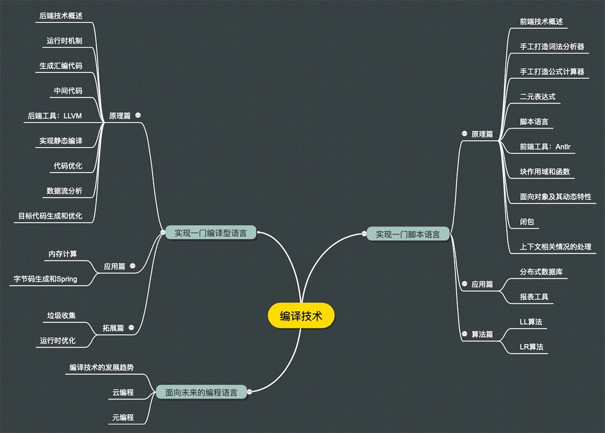

# 极客时间-编译原理之美(宫文学)

## 1 开篇词 | 为什么你要学习编译原理？

BPM(Business Process Management)业务流程管理的核心就是编译技术
编译原理不是只能用于炫耀的屠龙技。 别的不说，作为程序员，在实际工作中你经常会碰到需要编译技术的场景。

- Java 程序员想必很熟悉 Hibernate 和 Spring，前者用到了编译技术做 HQL 的解析，后者对注解的支持和字节码动态生成也属于编译技术。
  所以，如果你要深入理解和用好这类工具，甚至想写这种类型的工具，会需要编译技术。
- 模板引擎对模板进行编译，形成可执行的 PHP 代码。模板引擎可以很强大，支持条件分支、循环等语法。
- 工作流软件，里面有依据自定义公式判断流转方向的功能。像这类需要用户自定义功能的软件，比如报表软件、工资管理软件等，都需要编译技术。
- 解析用户输入，防止代码注入，为前端工程师提供像 React 那样的 DSL，像 TypeScript 那样把一门语言翻译成另一门语言，像 CMake 和 Maven 那样通过配置文件来灵活工作，以及运维工程师分析日志文件等等高级别的需求，都要用到编译技术。

- 使用：
  Antlr 和 LLVM 工具，前者能帮你做编译器前端的工作，后者能帮你完成编译器后端的工作

## 2 01 | 理解代码：编译器的前端技术

- 词法分析、语法分析和语义分析
- 词法分析器的生成工具来生成，比如 Lex（或其 GNU 版本，Flex）。
  这些生成工具是基于一些规则来工作的，这些规则用“正则文法”表达，符合正则文法的表达式称为“正则表达式”。

## 3 02 | 正则文法和有限自动机：纯手工打造词法分析器

- 原理：
  要实现一个词法分析器，首先需要写出每个词法的`正则表达式，并画出有限自动机`，之后，只要用代码表示这种状态迁移过程就可以了。

但是实际不会这么做, 一般是 if-else 或者 switch-case + peek/match 实现。
ANTLR 使用 switch-case 来匹配 token，形成 Token 流。

## 4 03 | 语法分析（一）：纯手工打造公式计算器

- 算法分为自顶向下和自底向上算法，其中，递归下降算法是一种常见的自顶向下算法。
- 语法分析的原理和递归下降算法（Recursive Descent Parsing），并初步了解上下文无关文法（Context-free Grammar，CFG）。
  `递归下降算法`特点：`程序结构基本上是跟文法规则同构的。这就是递归下降算法的优点，非常直观。`
  `下降`的含义：上级文法嵌套下级文法，上级的算法调用下级的算法
  `上下文无关`的含义：在任何情况下，文法的推导规则都是一样的。

## 5 04 | 语法分析（二）：解决二元表达式中的难点

- 优先级
  表现为递归的每一级
- 结合律
  对于左结合的运算符，递归项要放在左边；而右结合的运算符，递归项放在右边。
  **本质是前序遍历、后续遍历的区别。**

## 6 05 | 语法分析（三）：实现一门简单的脚本语言

-

## 7 06 | 编译器前端工具（一）：用 Antlr 生成词法、语法分析器

编译器前端工具有很多，比如 Lex（以及 GNU 的版本 Flex）、Yacc（以及 GNU 的版本 Bison）、JavaCC 等等。你可能会问了：“那为什么我们这节课只讲 Antlr，不选别的工具呢？”主要有两个原因：

1. 第一个原因是 `Antlr 能支持更广泛的目标语言`，包括 Java、C#、JavaScript、Python、Go、C++、Swift。
   无论你用上面哪种语言，都可以用它生成词法和语法分析的功能。而我们就使用它生成了 Java 语言和 C++语言两个版本的代码。

2. 第二个原因是 `Antlr 的语法更加简单。它能把类似左递归的一些常见难点在工具中解决，对提升工作效率有很大的帮助。`
   这一点，你会在后面的课程中直观地感受到。

## 8 07 | 编译器前端工具（二）：用 Antlr 重构脚本语言

Antlr 文法 如何区分优先级和结合律

## 9 08 | 作用域和生存期：实现块作用域和函数

## 10 09 | 面向对象：实现数据和方法的封装

## 11 10 | 闭包： 理解了原理，它就不反直觉了

## 12 11 | 语义分析（上）：如何建立一个完善的`类型系统`？

a = b + 10

- 如果 b 是一个浮点型，b+10 的结果也是浮点型。如果 b 是字符串型的，有些语言也是允许执行+号运算的，实际的结果是字符串的连接。这个分析过程，就是类型推导（Type Inference）。
- 当右边的值计算完，赋值给 a 的时候，要检查左右两边的类型是否匹配。这个过程，就是类型检查（Type Checking）。
- 如果 a 的类型是浮点型，而右边传过来的是整型，那么一般就要进行缺省的类型转换（Type Conversion）。

## 13 12 | 语义分析（下）：如何做上下文相关情况的处理？

## 14 13 | 继承和多态：面向对象运行期的动态特性

## 15 14 | 前端技术应用（一）：如何透明地支持数据库分库分表？

解析 SQL 语句

## 16 15 | 前端技术应用（二）：如何设计一个报表工具？

表格公式能力
把 PlayScript.g4 里的规则拿过来改一改用的

## 17 16 | NFA 和 DFA：如何自己实现一个正则表达式工具？

## 18 17 | First 和 Follow 集合：用 LL 算法推演一个实例

## 19 18 | 移进和规约：用 LR 算法推演一个实例

## 20 19 | 案例总结与热点问题答疑：对于左递归的语法，为什么我的推导不是左递归的？

## 21 用户故事 | 因为热爱，所以坚持

## 22 期中考试 | 来赴一场 100 分的约定吧！

## 23 20 | 高效运行：编译器的后端技术

## 24 21 | 运行时机制：突破现象看本质，透过语法看运行时

## 25 22 | 生成汇编代码（一）：汇编语言其实不难学

## 26 加餐 | 汇编代码编程与栈帧管理

## 27 23 | 生成汇编代码（二）：把脚本编译成可执行文件

## 28 24 | 中间代码：兼容不同的语言和硬件

## 29 25 | 后端技术的重用：LLVM 不仅仅让你高效

## 30 26 | 生成 IR：实现静态编译的语言

## 31 27 | 代码优化：为什么你的代码比他的更高效？

## 32 28 | 数据流分析：你写的程序，它更懂

## 33 29 | 目标代码的生成和优化（一）：如何适应各种硬件架构？

## 34 30 | 目标代码的生成和优化（二）：如何适应各种硬件架构？

## 35 31 | 内存计算：对海量数据做计算，到底可以有多快？

## 36 32 | 字节码生成：为什么 Spring 技术很强大？

## 37 33 | 垃圾收集：能否不停下整个世界？

## 38 34 | 运行时优化：即时编译的原理和作用

前面所讲的编译过程，都存在一个明确的编译期，编译成可执行文件后，再执行，这种编译方式叫做提前编译（AOT）。
与之对应的，另一个编译方式是即时编译（JIT），也就是，在需要运行某段代码的时候，再去编译。其实，Java、JavaScript 等语言，都是通过即时编译来提高性能的。

## 39 35 | 案例总结与热点问题答疑：后端部分真的比前端部分难吗？

## 40 36 | 当前技术的发展趋势以及其对编译技术的影响

## 41 37 | 云编程：云计算会如何改变编程模式？

## 42 38 | 元编程：一边写程序，一边写语言

## 43 结束语 | 用程序语言，推动这个世界的演化

## 44 第二季回归 | 这次，我们一起实战解析真实世界的编译器

## 45 结课测试 | 编译原理的这些知识，你都掌握了吗？
