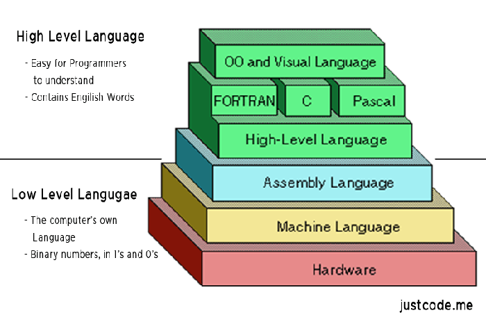
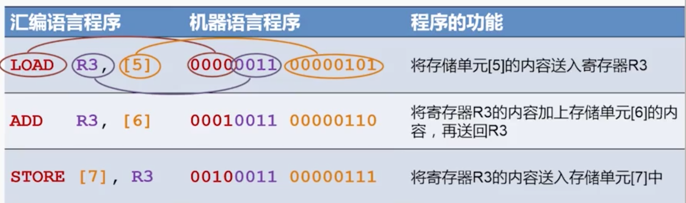
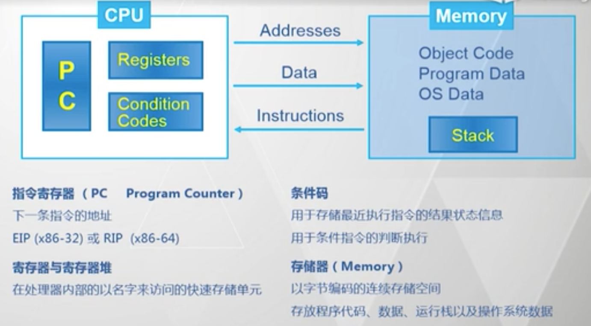
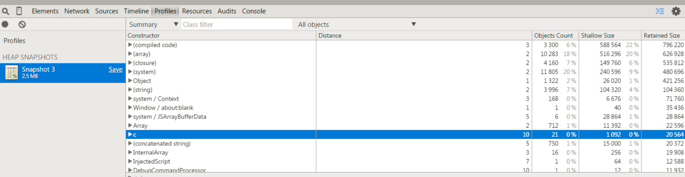

https://github.com/wangfupeng1988/read-notes/blob/master/video/%E6%B1%87%E7%BC%96%E8%AF%AD%E8%A8%80.md
http://www.ruanyifeng.com/blog/2018/01/assembly-language-primer.html

关注：
寄存器和内存模型
堆栈模型
CPU 指令

不求甚解。

# 汇编语言是什么



- 含义：`给 CPU 看的语言`，机器语言（二进制代码）的助记符，每条汇编语言都能直接翻译成机器语言。
  

  assembly language，缩写为 asm
  `汇编语言都是针对特定的计算机体系结构的`，例如 x86 汇编（本课重点内容）、MIPS 汇编、ARM 汇编，因此没有让所有计算机都通用的汇编语言。
  每一种 CPU 的机器指令都是不一样的，因此对应的汇编语言也不一样。本文介绍的是目前最常见的 x86 汇编语言，即 Intel 公司的 CPU 使用的那一种。

- 寄存器和内存模型
- CPU 指令

下面是一个简单的程序 example.c。

```c
int add_a_and_b(int a, int b) {
   return a + b;
}

int main() {
   return add_a_and_b(2, 3);
}
```

gcc 将这个程序转成汇编语言。
gcc -S example.c
上面的命令执行以后，会生成一个文本文件 example.s，里面就是汇编语言，包含了几十行指令。这么说吧，一个高级语言的简单操作，底层可能由几个，甚至几十个 CPU 指令构成。CPU 依次执行这些指令，完成这一步操作。

```asm
_add_a_and_b:
   push   %ebx
   mov    %eax, [%esp+8]
   mov    %ebx, [%esp+12]
   add    %eax, %ebx
   pop    %ebx
   ret

_main:
   push   3
   push   2
   call   _add_a_and_b
   add    %esp, 8
   ret
```

# 指令集

“指令集”，我理解就是一套操作 CPU 的指令体系集合，以及体系规范。指令集是一种上层定义，汇编就是其具体的体现和实现。指令集分两类：

- CISC 复杂指令集，以 x86 为代表（x86 在 PC 服务器领域具有统治地位）
- RISC 精简指令集，以 ARM MIPS 为代表（ARM 统治了手机和平板领域，MIPS 常用语手机、电脑之外的其他电子设备）

# x86 计算机系统结构


就好像程序猿占有了一个（虚拟的） CPU 和一段内存地址

- CPU 中包括 PC 寄存器，表示小一条指令的地址
- CPU 中包括寄存器和寄存器堆，以名字来访问的快速存储单元
- CPU 中有条件码，用于存储最近执行指令的结果状体信息，用于条件指令的判断执行
- 内存即以字节编码的连续存储空间，存放代码、数据、运行栈、以及操作系统数据

# 程序执行时的内存模型

- Stack
- Heap

  - 堆是 自下（内存低地址）而上（内存高地址） 的累积的
  - 堆没有“先进后出”这种规则，它就是简单粗暴的占有和释放
  - 堆中被占用的内存不会自动释放，需要手动释放，或者通过虚拟机定期 GC （如常见的引用计数方法、标记清除方法等）

  常说的内存泄露就是在堆中占有的内存没有被及时的清理或者 GC ，导致长时间积累之后内存崩溃。对于 JS 开发者，应该知道 Chrome devtools 中有一个 heap Snapshot ，用来记录当前时刻 JS 堆内存，如下图：
  
