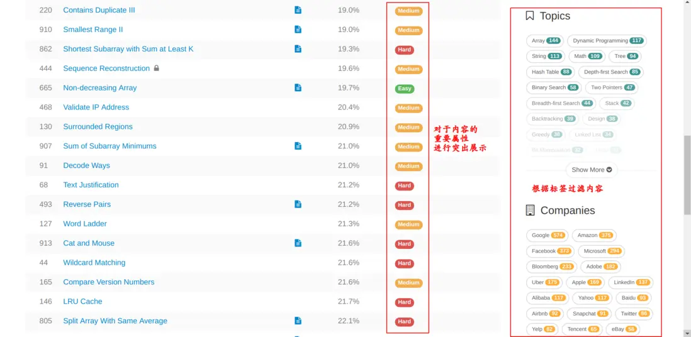

1. 有价值的程序员不仅仅要写好代码，更要有自己对需求的思考。
   身为前端，不应该只会做网页。应该时刻对产品保持深刻的思考：`这个产品的价值是什么？它是如何带来收益的？`如何更好地满足需求、实现其价值？

- 发布/展示型
  比如论坛、博客平台。

  - 业务分析
    产品的目标是`促进双方沟通和互动`（比如58同城连接买卖双方、大众点评连接消费者和消费者）。分类、搜索、推荐、SEO对于业务有很重要的作用，产品应该竭尽全力地将用户引导到最有价值的内容上。
  - 技术分析
    服务端主要负责存储，前端负责展示。前后端的交互相对比较简单，主要是提交和获取数据。
    在这种应用中，最重要的页面应该就是**首页、列表页和详情页了。**

    - 对于首页，一个很重要的特性是：`不同用户看到的首页应该是不一样的。`即使没有能力用机器学习来做推荐信息流，至少也应该允许用户选择自己感兴趣的内容、允许用户将经常访问的专栏放在首页，将用户最快地引导到最有价值的内容。
    - 对于列表页，应该做好内容`分类、过滤、检索`。在这方面可以学习leetcode。
      
    - 对于详情页，需要具体分析。做好SEO往往有很大的帮助，利用用户发布的内容吸引更多的用户。

    这种应用复杂性相对较低，开发人员不会很多，协作成本比较低，`因此做好代码复用是一个基本要求，`这有助于最大化开发效率，并为后续迭代降低工作量。

- 业务流程在线化
  比如淘宝、美团外卖、滴滴打车、企业内部采购平台。大部分业务流程都是交易流程、事务处理流程。
  - 业务分析
    将业务流程搬到线上，记录流程，以便进行追溯和统计分析。
  - 技术分析
    `质量管理`在这种情况下非常关键，测试应该覆盖到各个业务场景和逻辑。发布前构建，引入工程链的体系，搭建低容错、自动化的开发流程。使用前后端监控，从而能够尽早发现问题、方便排查故障、为性能优化提供指标。
    前端不能局限于用框架写页面，更要从工程师的角度来优化开发流程和系统效率。不仅要关注软件最终的运行结果，更要关注开发流程建设、团队建设、基础设施建设、系统架构建设。
- 委托系统进行某种操作
  比如系统控制平台、运营平台、leetcode。
  - 业务分析
    用户使用它们的目的，主要是委托系统（主要是后端）完成某种操作/计算，这个操作的结果能够满足用户。
  - 技术分析
    技术上的主要难点在于如何进行模块划分，为其他开发者、用户提供简单的抽象（思维模型）。
