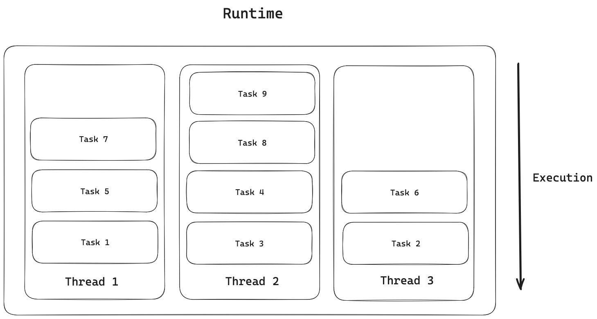

https://blog.varunramesh.net/posts/stackless-vs-stackful-coroutines/
https://zhuanlan.zhihu.com/p/330606651
https://blog.csdn.net/cdj0321/article/details/134408877

1. 协程
   所谓协程指的是某个函数执行到一半的时候，可以通过某些机制保存当前现场然后暂停执行，之后可以通过外部代码重新恢复执行。
   **可暂停+恢复的函数，就是协程。**

   在这个暂停的过程中需要保存的现场就包括调用栈，细分一下大致有两部分：

   - 栈上保存的返回地址(调用链信息)
   - 栈上保存的局部变量(函数自身信息)

   于是，关于栈上数据保存的思路就有两种方法：

   1. 干脆保存整个栈，`每个协程用自己独立的栈`，暂停就切换到别的栈上面去，恢复的时候再切换回来。这种方法对现有的调用栈使用来说是最透明的，而且机制基本上跟线程切换一样。缺点则是每个协程都需要分配独立的栈空间，比较耗费内存。协程的唤醒和挂起就是拷贝、切换上下文。
   2. 干脆什么都不保存在栈上，通过编译器将临时变量之类的`保存改为存在某个堆空间里的对象中。`同时，`也就丧失了保存返回地址的能力`，因而是没法在普通函数调用中暂停的。

2. 有栈协程与无栈协程
   如今协程已经成为大多数语言的标配，例如 Golang 里的 goroutine，JavaScript 里的 async/await。都可以被划分为两大类，

   - 一类是有栈（stackful）协程，例如 goroutine；
   - 一类是无栈（stackless）协程，例如 async/await。

   有栈协程是指协程拥有自己的调用栈，可以在调用栈上保存函数的局部变量、参数等信息。
   而无栈协程则是在调用栈上不保存函数的局部变量、参数等信息，只保存函数的返回地址，这样可以减少内存占用。
   二者都有堆栈，**关键区别不在于协程是否有堆栈，而在于协程在挂起(suspense)时是否需要堆栈。**

   有栈协程可以在其`任意嵌套函数`中暂停、恢复，而无栈协程则不可以。

   比如使用无栈协程的 JavaScript 就不能这么写：

   ```js
   async function processArray(array) {
      // 显然这里 forEach 是个嵌套函数
      array.forEach(item => {
          // Uncaught SyntaxError:
          // await is only valid in async function
          const result = await processItem(item)
          ...
      })
   }
   ```

   但使用有栈协程的 Golang 就可以轻松实现类似的逻辑：

   ```go
       func processArray(array []int) {
        for i := 0; i < len(array); i++ {
            ch := make(chan int)
            go processItem(array[i], ch)
            result := <- ch
            ...
        }
    }
   ```

   无栈协程：相比于有栈协程直接切换栈帧的思路，无栈协程在`不改变函数调用栈`的情况下，`采用类似生成器（generator）的思路实现了上下文切换`。

3. 实现方式

- 有栈协程：go 的实现，类似于内核态线程的实现，不同协程间切换还是要切换对应的栈上下文，只是不用陷入内核而已。
- 无栈协程：js，c++，rust 那种 await，async 实现，主要原理就是`闭包+异步`，换句话说，其实就是`协程的上下文都放到公共内存中，协程切换时，使用状态机来切换，就不用切换对应的上下文了，因为都在堆里的。比有栈协程都要轻量许多。`
  [闭包保存局部变量](image-2.png)
  [闭包保存局部变量](https://www.typescriptlang.org/zh/play/?target=1&module=7#code/IYZwngdgxgBAZgV2gFwJYHsI2AB1QCgEoYBvAWACgYYAnAU2QRqwEZKBfSy0SWRFDFgC2wVBCKlK1KJhDJsMALww2VGDIhzadEEuwB3UfNwFCU9bPQAbOgDor6AOb56IADTAzFThSA)
  在await另一个协程方法的过程中，一般来说编译器会`为新的方法创建一个保存状态的对象`，然后在新对象中保存当前协程的引用，当新协程执行结束之后重新resume当前协程，从而实现调用的过程。
  例如一般会使用await关键字。在await另一个协程方法的过程中，一般来说编译器会`为新的方法创建一个保存状态的对象，然后在新对象中保存当前协程的引用，当新协程执行结束之后重新resume当前协程，从而实现调用的过程。`可以发现这种链式结构其实类似于一个链表实现的栈，所以严格来说无栈协程并不是没有栈结构，**而是栈结构独立于一般函数的调用栈**。**既然一般函数的调用链保存方式和无栈协程的保存方式不同，自然就不能形成混合的调用链了。**

4. 无栈协程关键字的传染性问题
   async / await的巨大成本：函数着色([function coloring](https://journal.stuffwithstuff.com/2015/02/01/what-color-is-your-function/))，其中sync函数无法调用async函数。

   三种语言不存在此问题：Go、Lua 和 Ruby。
   共同点是：[multiple independent callstacks that can be switched between.](https://journal.stuffwithstuff.com/2013/01/13/iteration-inside-and-out/)
   Go 中的 Goroutines、Lua 中的协程以及 Ruby 中的 Fiber 已经足够了。

5. [Rust 的并发模型 vs Go 的并发模型：stackless 与 stackfull 协程](https://kerkour.com/rust-vs-go-concurrency-models-stackfull-vs-stackless-coroutines)
   Go 和 Rust 内置了语言功能，让程序在等待 I/O（输入/输出）时可以执行其他`任务(Task)`。
   但是，什么是任务？
   **任务是可以并发执行的抽象计算单元：多个函数可以同时（由程序）处理，但它们不一定（由CPU）同时执行（这是需要多个线程的并行性） 。**
   您可以使用go关键字在 Go 中生成新任务：

   ```go
   go doSomething()
   ```

   在 Rust 中，您需要使用spawn函数：

   ```rust
    tokio::spawn(async move {
     do_something().await
   });
   ```

   在这两种情况下，语言的`运行时(runtime)`都会同时处理任务。
   但是，什么是运行时？

   **运行时的目的是管理和调度不同的任务以有效地使用硬件。**
   
   这是 Rust 和 Go 的首先不同之处。你无法更改 Go 运行时（除非你使用完全不同的编译器，例如tinygo ），它是内置于语言中的，而在 Rust 中，语言不提供运行时，你必须自带运行时。

   `当函数等待某些东西（例如网络）时，它们会将控制权交还给运行时。在 Go 中，这是由标准库、语言和编译器自动完成的，而在 Rust 中，这是在到达await关键字时发生的。`

   Stackfull 协程也称为绿色线程、goroutines 或 M:N 线程（M 个绿色线程运行在 N 个内核线程上）是 Go 采用的并发模型。在此模型中，运行时管理轻量级（绿色）线程并将它们调度到可用的硬件线程上。与内核线程一样，每个任务都有自己的堆栈，如果需要，可以由运行时增长。
   stackfull 协程的第一个问题是每个任务都有自己的堆栈，这意味着每个任务使用最少的内存。
   从Go 1.22开始， goroutine 使用的最小内存量为 [2 KiB](https://github.com/golang/go/blob/master/src/runtime/stack.go#L75)
   Stackfull 协程的第二个问题是运行时需要完全控制堆栈布局，这使得与其他语言（例如 C 的 FFI）的互操作性变得困难，因为运行时必须在能够调用 C 代码之前做一些准备堆栈的工作。

   另一方面，Rust 采用了无堆栈协程方法，其中任务没有自己的堆栈。在 Rust 中，Future 基本上是实现Future 特征的简单结构，`其中每个.await链都被编译成巨大的状态机。`
   缺点是 function coloring 问题。因为标准库不提供与sync函数相同的async函数（例如读取整个文件的read ），并且因为不同的运行时甚至不能一起互操作：如果你开始编写程序tokio运行时，您将很难将其移植到另一个运行时。
   所有这些都在 Go 中解决，一切都是sync ，编译器和运行时在调用程序员不可见的异步函数时自动插入await点，但正如我们所见，这是以性能损失为代价的（内存和中央处理器）。
