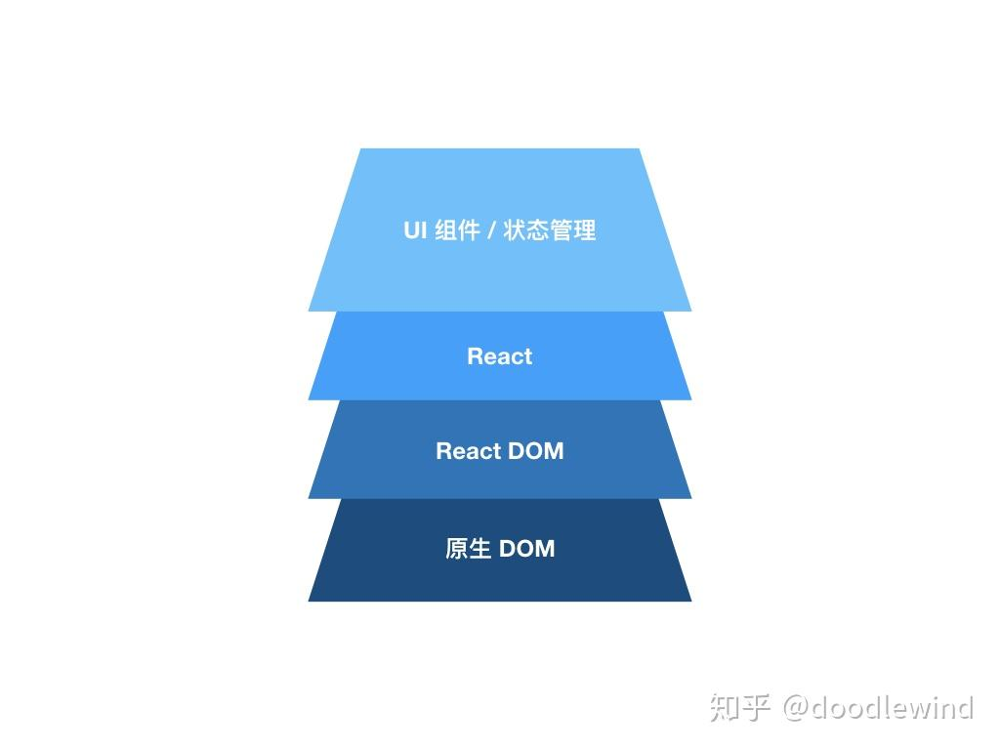
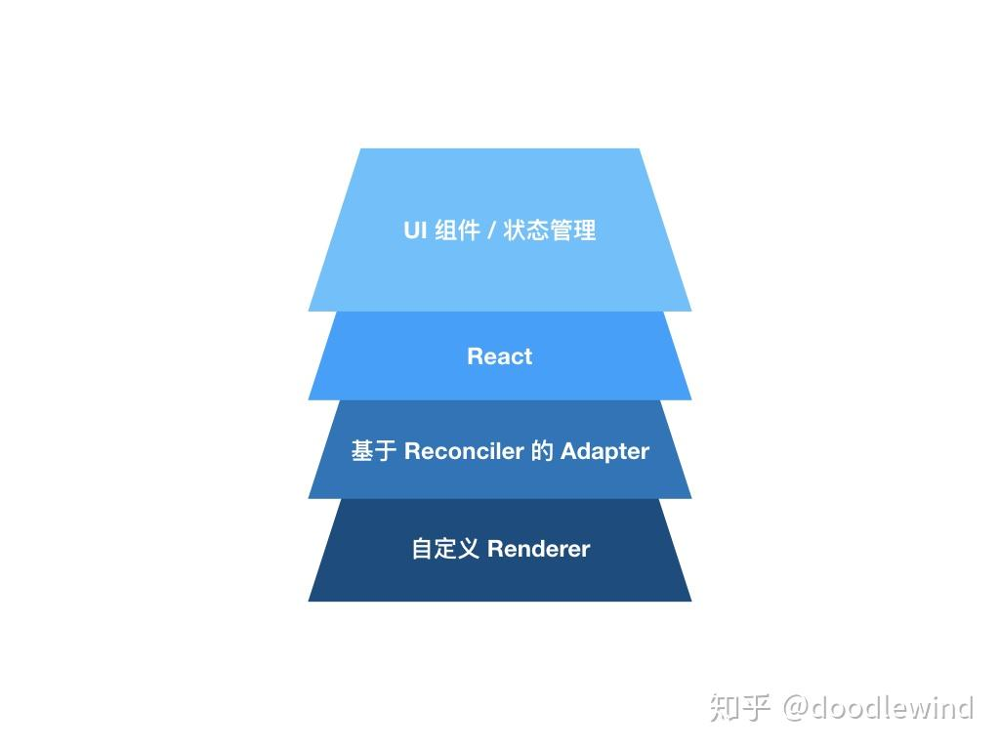
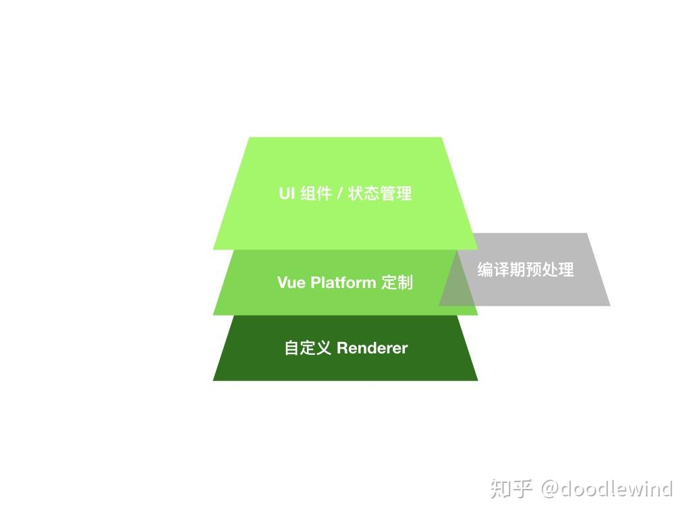

好的，我们来对这篇文章进行深入、详细的分析和讲解。

这篇文章是王译锋撰写的一篇高质量的技术剖析文章，旨在揭示 React 和 Vue 这两大前端框架实现“跨端渲染”的底层原理。文章的核心目的在于**祛魅**，让前端开发者明白，将熟悉的组件化开发模式（JSX、.vue 文件）应用到非 DOM 环境（如原生 App、Canvas、WebGL、小程序等）并非遥不可及的魔法，而是有章可循的工程实践。

### 核心概念：什么是跨端渲染？

文章开篇就精准地定义了核心概念：

1.  **“端” (End) 的抽象化**：这里的“端”不只是 PC 或移动端，而是任何可以被渲染的目标，作者称之为**渲染层 (Renderer)**。DOM、iOS/Android 原生控件、Canvas、WebGL、PDF、甚至 VR 环境，都可以是渲染层。
2.  **跨端渲染的目标**：核心诉求是**“Learn Once, Write Anywhere”**（学习一次，到处编写）。我们希望用同一套组件化开发范式（React/Vue 的组件模型）来描述 UI，然后让框架负责将这份描述“翻译”成不同渲染层能理解的指令并执行。
3.  **框架的分层结构**：作者通过图示清晰地展示了 React 和 Vue 的分层思想。
    - **React**: 明确地分为 `react` (核心逻辑，定义组件、state 等) 和 `react-dom` (渲染器，负责与 DOM 交互)。这种解耦是其跨端能力的基础。
    - **Vue (2.x)**: 虽然没有像 React 那样在包层面拆分，但其内部设计同样存在核心与平台渲染器的划分。

文章接下来围绕“如何为 React/Vue 适配一个新的渲染层”这一问题，系统地介绍了四种主流实现方案。

---

### 方案一：React Reconciler 适配 (官方正统方案)

这是 React 官方提供的、最标准、最直接的跨端实现方式。

- **核心武器**: `react-reconciler` 包。这是 React 16 Fiber 架构重构后，将**协调算法 (Reconciliation)** 抽离出的独立模块。
- **工作原理**: `react-reconciler` 负责所有“虚拟 DOM”的 diff、更新调度等核心工作。但它不知道如何真正地操作一个具体的渲染环境（比如，它不知道怎么在 DOM 中创建一个 `
`）。它通过暴露一套**宿主配置 (Host Config)** 钩子函数，将这些具体操作的实现委托给开发者。
- **开发者的任务**: 创建一个**适配器 (Adapter)**。这个适配器的核心就是一个实现了 `react-reconciler` 所要求的一系列钩子函数的对象。
  - `createInstance(type, props)`: 当 React 需要创建一个元素时调用。你需要在这里返回一个目标渲染层的实例（例如 `new PIXI.Sprite()`）。
  - `appendChild(parent, child)`: 当需要将一个子元素添加到父元素时调用。你需要在这里执行 `parent.addChild(child)`。
  - `removeChild(...)`, `insertBefore(...)`, `prepareUpdate(...)` 等等：实现这些钩子，将其与目标渲染层（如 PIXI.js）的 API 一一对应。
- **最终效果**: 一旦适配器完成，你就可以创建一个自定义的 `render` 函数（类似 `ReactDOM.render`），它内部使用 `react-reconciler` 来管理组件树。从此，你就可以用 JSX 编写 PIXI.js 的场景，享受 React 带来的组件化、状态驱动更新等所有好处。
- **评价**:
  - **优点**: 官方支持，API 稳定，思路清晰，是 React 生态中最“正统”的跨端方式。
  - **缺点**: 需要对 React 的渲染流程有较深的理解。

---

### 方案二：Vue 非侵入式适配 (业务层模拟方案)

由于 Vue 2.x 没有提供类似 `react-reconciler` 的公开 API，社区探索出了多种实现方式。这是最简单、最容易上手的一种。

- **核心思想**: **模拟**。不修改 Vue 源码，完全在业务组件层面，通过封装和通信机制来“假装”实现了跨端。
- **实现步骤**:
  1.  **顶层渲染器组件 (`<pixi-renderer>`)**:
      - 它负责初始化真正的渲染引擎实例（如 `new PIXI.Application()`）。
      - 通过 Vue 的 `provide` API，将渲染引擎实例和一个**事件总线 (EventBus)** 注入到所有后代组件中。
  2.  **中间/叶子节点组件 (`<container>`, `<pixi-text>`)**:
      - 通过 `inject` API 获取到渲染引擎实例和 EventBus。
      - 在 `created` 或 `mounted` 生命周期里，手动创建对应的 PIXI 对象（如 `new PIXI.Container()`）。
      - 通过 EventBus 监听一个“ready”事件，当顶层渲染器准备好后，将自己创建的 PIXI 对象添加到父组件的 PIXI 对象上 (`this.$parent.container.addChild(...)`)。
      - 通过 `props` 和 `watch` 来同步状态：当 Vue 组件的 prop 变化时，手动更新 PIXI 对象的属性。
- **评价**:
  - **优点**: 简单，无需理解框架底层，易于在现有项目中快速实现 POC (概念验证)。
  - **缺点**:
    - **非原生**: 仍然依赖 DOM 渲染（Vue 组件本身还是会渲染成一个空的 DOM 节点）。
    - **手动维护**: 开发者需要手动管理渲染对象的创建、销毁和层级关系，非常繁琐。
    - **通信混乱**: 同时使用了 `props` 和 `EventBus`，逻辑容易混乱。
    - **性能问题**: 状态同步是手动的，无法利用 Vue 的高效 diff 算法。

---

### 方案三：Vue Mixin 适配 (Hack 方案)

这是一种更巧妙但带有“黑魔法”色彩的方案。

- **核心思想**: **监听 VNode**。通过 Mixin 注入到所有组件中，利用 Vue 的 `$watch` API 来监听虚拟节点树 (VNode) 的变化。
- **实现机制**:
  - 在 Mixin 的 `mounted` 钩子中，设置一个特殊的 `$watch`：`this.$watch(this.updateCanvas, ...)`。
  - 这里的 `updateCanvas` 函数被设计为返回 `this._vnode`（当前组件的虚拟节点）。
  - 由于 Vue 的 `watch` 会在依赖项变化时触发回调，所以每当组件重新渲染、VNode 发生变化时，回调就会被执行。
  - 在回调函数中，你拿到了最新的 VNode 树，然后可以自己编写一个遍历器，将 VNode 树递归地“翻译”成 Canvas 的绘图指令。
- **评价**:
  - **优点**: 思路新颖，能够将 VNode 的更新与渲染层的操作直接关联起来。
  - **缺点**:
    - **Hacky**: 依赖了 Vue 的内部实现细节 (`_vnode`)，非常脆弱，框架升级可能导致失效。
    - **实现成本高**: 需要自己实现 VNode 遍历和渲染逻辑，相当于自己写了一个迷你的渲染器。
    - **耦合度高**: 强耦合 VNode 的数据结构，这在 React Reconciler 的设计中被视为反模式。

---

### 方案四：Vue Platform 定制适配 (源码级方案)

这是 Vue 生态中最“正统”的跨端方式，Weex 和 mpvue 都采用了此方案。

- **核心思想**: **Fork and Extend**。直接修改 Vue 的源码，为其增加一个新的目标平台。
- **实现机制**:
  - Vue 的源码结构中有一个 `platforms` 目录，里面包含了 `web` (浏览器) 和 `weex` (原生) 的平台相关实现。
  - 开发者需要 fork Vue 仓库，在 `platforms` 目录下新增一个自己的平台目录（如 `mp` for 小程序）。
  - 在这个目录里，你需要实现平台专属的模块，最核心的是 `runtime/node-ops.js`。这个文件定义了如何操作节点，其作用等价于 React Reconciler 的 Host Config。
    - `createElement(tagName)`: 如何创建一个节点。
    - `appendChild(parent, child)`: 如何添加子节点。
    - ...等等。
  - **mpvue 的特例**: 作者敏锐地发现，mpvue 的 `node-ops.js` 几乎都是空实现。他推断这是因为小程序独特的渲染机制（WXML + setData）使得直接操作节点树变得困难且低效。mpvue 选择了另一条路：在编译期将 `.vue` 文件同时生成小程序的 WXML/JS 和一套用于数据驱动的 Vue 运行时逻辑，通过 `setData` 保持两棵树的同步。
- **评价**:
  - **优点**: 最灵活、最强大、性能最好，可以真正脱离 DOM，对业务组件侵入性最小。
  - **缺点**:
    - **维护成本极高**: 需要 fork 源码，意味着要自己跟进上游 Vue 的更新。
    - **环境分裂**: 如果在项目中同时使用原生 Vue 和你 fork 的版本，会存在两个略有不同的 Vue 环境。
    - **（已改善）**: 作者在文末提到，Vue 3.0 已经将这部分 API 公开，开发者不再需要 fork 源码，可以直接通过 `@vue/runtime-core` 的 `createRenderer` API 来实现自定义渲染器，其原理与 React Reconciler 高度一致。

### 总结

文章通过对四种方案的层层剖析，为读者构建了一幅清晰的跨端渲染技术图景。在文章写作的那个时间点（Vue 3.0 之前），结论是：

- **React**: 拥有官方、稳定、简洁的 `react-reconciler` 方案，是实现自定义渲染层的首选。
- **Vue**: 方案选择更为纠结。非侵入式方案过于简陋，Mixin 方案过于 Hack，而最正统的 Platform 方案又需要 fork 源码，成本高昂。

这篇文章不仅讲解了“如何做”，更重要的是解释了“为什么这么做”以及各种方案的优劣权衡，充分体现了作者深厚的技术洞察力和优秀的表达能力。对于希望深入理解现代前端框架工作原理的开发者来说，这是一篇极佳的入门指南。
