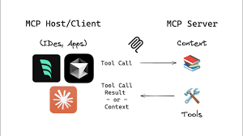
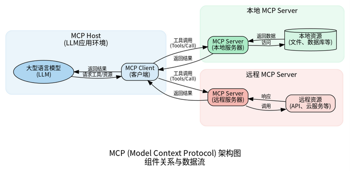
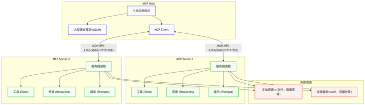
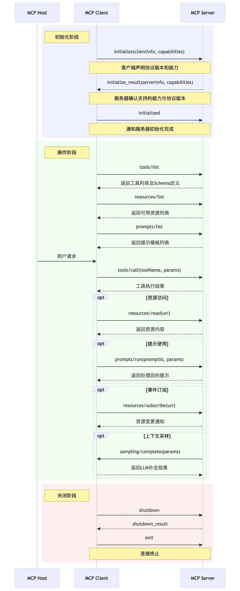

## 带你从零理解 MCP

https://www.zhihu.com/column/c_158541431

1. 是什么
   Anthropic 推出的 Model Context Protocol（MCP），一个可能彻底改变 AI 工具生态的协议。
   MCP 即模型上下文协议（Model Context Protocol），是 Anthropic 公司推出的开放协议。
   `它标准化了应用程序向大语言模型提供上下文信息的方式`，如同 “AI 应用的 USB-C 端口”，通过 MCP Server 中间层，让 AI 模型能以统一方式访问文件系统、数据库、API 等外部资源，简化 AI 应用与外部资源的集成流程 。​

2. 为什么会出现 MCP？
   在 MCP 出现之前，大型语言模型虽然具备强大的推理和生成能力，但存在明显的局限性：

   - 知识时效性差：模型的知识通常止于训练数据的截止日期，无法获取最新信息。
   - 专有数据获取困难：对于企业内部的数据库、文档仓库等信息孤岛，模型完全不了解。
   - 整合代价高昂：不同的 AI 应用要接入数据库、API 或第三方工具，都需针对每个数据源编写单独的连接器，导致维护成本高、重复劳动多。

   业界曾尝试通过多种方式解决这些问题：

   - 自定义 API 集成：为每个数据源单独开发连接器
   - 插件机制：如 OpenAI 插件
   - 检索增强生成（RAG）：通过向量检索提供相关信息
   - 工具调用框架：如 LangChain

   然而，这些方案普遍存在开发成本高、代码维护复杂、缺乏统一性等问题。
   MCP 的出现，正是为了通过标准化协议，大幅简化 LLM 相关的 Agent/工作流的开发、维护成本和模型切换成本。

3. MCP 核心概念
   

   MCP Host <-> MCP Client <-> MCP Server
   

---

好的，我们来将这篇文章的内容梳理成一个从零开始、逻辑清晰的讲解。

### 标题：从零开始，彻底理解模型上下文协议 (MCP)

---

#### 1. 问题：为什么我们需要 MCP？

想象一下，你拥有一个非常聪明的 AI 助手，比如 ChatGPT 或 Claude。但它就像一个被关在房间里、只读过旧书的天才，存在几个核心问题：

- **知识过时**：它的知识停留在训练数据截止的那一天，不知道今天发生了什么。
- **信息隔离**：它无法访问你电脑上的本地文件，也无法查询你公司的内部数据库。
- **集成困难**：如果你想让 AI 连接到一个新的 API 或工具，就需要为它专门编写和维护一套连接代码。每增加一个工具，复杂性就成倍增加。

为了解决这些问题，Anthropic 公司提出了**模型上下文协议 (Model Context Protocol, MCP)**。

---

#### 2. 核心思想：MCP 是什么？

**MCP 是一种开放的、标准化的协议，好比是“AI 应用的 USB-C 端口”。**

它的核心思想是：为 AI 模型（LLM）与外部世界（如文件、数据库、API）的交互，建立一套统一的语言和规则。

通过这套规则，任何 AI 应用（如 Cursor 编辑器、AI Agent）都可以通过一个标准的“插座”，去连接和使用各种外部工具，而无需为每个工具定制开发。这大大降低了开发和维护成本。

---

#### 3. 架构解析：MCP 的四大核心组件

MCP 采用经典的客户端-服务器 (Client-Server) 架构，将 AI 应用与后端服务解耦。理解这四个角色是理解 MCP 的关键：

1.  **MCP Host (主机)**

    - **它是谁？** 你直接交互的 AI 应用程序，例如 Cursor 编辑器、一个对话机器人。
    - **它做什么？** 运行大语言模型 (LLM)，接收你的指令，并最终向你展示结果。它是整个流程的“大脑”和“前端”。

2.  **MCP Client (客户端)**

    - **它是谁？** 位于 Host 内部的一个抽象层，是 Host 与 Server 之间的“翻译官”和“联络员”。
    - **它做什么？** 将 Host（LLM）的意图，转换成 MCP 标准协议的消息，然后发送给 MCP Server。它负责与 Server 建立和管理连接。

3.  **MCP Server (服务器)**

    - **它是谁？** 一个提供具体能力的轻量级服务进程。它可以运行在你的本地电脑上，也可以在远程服务器上。
    - **它做什么？** 连接并操作实际的资源。例如，一个 Server 连接到数据库，另一个 Server 连接到文件系统。它接收 Client 的指令并执行。

4.  **能力 (Tools, Resources, Prompts)**
    - **它们是什么？** MCP Server 具体能提供的三种服务。
    - **工具 (Tools)**: 可被 LLM 调用的函数。例如 `run_sql_query` 或 `get_current_time`。LLM 会根据你的问题自主决定调用哪个工具。
    - **资源 (Resources)**: 类似文件的数据，可供读取。例如一个 `.txt` 文档、一个数据库的表结构。
    - **提示 (Prompts)**: 预设好的、可复用的提示词模板，帮助用户或 LLM 高效完成特定任务。

---

#### 4. 工作流程：一次完整的 MCP 调用过程

假设你在一个集成了 MCP 的编辑器（Host）里，对 AI 说：“**帮我查一下上海今天的天气**”。

整个流程如下：

1.  **发现能力**：

    - Host 启动时，其内部的 Client 会询问所有已连接的 Server：“你们都会做什么？”
    - 一个“天气 Server”会回应：“我有一个工具叫 `getWeatherForecast`，它可以查询天气。”

2.  **模型决策**：

    - Host 将你的问题（“帮我查一下上海今天的天气”）和它发现的工具列表（包括 `getWeatherForecast`）一起打包，发送给 LLM。
    - LLM 分析后，理解到需要调用天气工具，并从问题中提取出参数 `{ location: "Shanghai" }`。

3.  **工具调用**：

    - Host 将 LLM 的决策（“调用 `getWeatherForecast`，参数是 `{ location: "Shanghai" }`”）告诉 Client。
    - Client 按照 MCP 协议，向“天气 Server”发送一个标准的 `tools/call` 请求。
    - “天气 Server”收到请求后，执行内部代码（比如调用一个天气 API），获取到天气数据“晴，25 度”。

4.  **生成响应**：
    - “天气 Server”将执行结果“晴，25 度”返回给 Client。
    - Client 再将这个结果交给 Host，Host 最终把它提供给 LLM。
    - LLM 拿到“晴，25 度”这个原始数据后，组织成一句通顺的自然语言：“上海今天天气晴朗，气温为 25 摄氏度。”，并由 Host 展示给你。

整个过程对用户来说是无缝的，你只感觉和 AI 进行了一次简单的对话。

---

#### 5. 技术实现：如何连接 Client 和 Server？

Client 和 Server 之间需要一个通信通道，MCP 支持多种方式：

- **Stdio (标准输入/输出)**: 最简单的方式，适用于 Client 和 Server 在同一台电脑上运行。Client 启动 Server 作为一个子进程，通过命令行管道直接通信。非常适合本地工具。
- **HTTP with SSE (服务器发送事件)**: 适用于 Client 需要通过网络访问远程 Server 的场景。Server 是一个 Web 服务器，Client 通过 HTTP 请求与之通信，并且 Server 可以通过 SSE 主动向 Client 推送实时更新（例如，股票价格变动）。

所有通信的消息都遵循 **JSON-RPC 2.0** 这个标准格式，确保双方都能准确理解对方的意图。

---

#### 6. 总结

MCP 通过**标准化的协议**和**解耦的 C/S 架构**，优雅地解决了 AI 模型与外部世界交互的难题。

- 它让 AI **“手脚”得以延伸**，能够操作真实世界的数据和工具。
- 它让开发者可以构建一个**可插拔的 AI 工具生态**，极大地提高了开发效率和系统的可扩展性。
- 它通过将 Server 部署在本地，保证了**私有数据的安全性**。

理解了 MCP，你就掌握了释放 AI 全部潜能、构建强大 AI 应用的关键钥匙。

---

## AI 新程序员

好的，这篇文章是一位开发者在深度体验了 AI 编程工具后，对 AI 时代程序员角色、工作流和编码方式变化的深刻思考和总结。我将为你详细讲解其中的核心观点和实践方法。

---

### 讲解《AI 新程序员》

这篇文章的核心论点是：**AI 正在引发软件开发领域的范式革命，程序员的角色正从“代码实现者”转变为“AI 协作者与管理者”。** 作者认为，适应这种变化，掌握与 AI 协作的技能，是当前程序员避免被时代淘汰的关键。

以下是文章各部分的详细解读：

#### 1. 时代的拐点：为什么说我们已经落后了？

- **技术壁垒的消失**：过去，程序员通过深入研究源码、掌握复杂技术来建立自己的“护城河”。但在 AI 时代，AI 能够快速学习并生成代码，纯粹的编码技能不再是难以逾越的壁垒。
- **角色的转变**：未来的程序员将不再是埋头写代码的工匠，而是成为一个“项目经理”或“技术总监”。你的主要工作是：
  - **统筹规划**：将复杂任务拆解，指导 AI 完成。
  - **监督审查**：Review AI 生成的代码，确保质量和方向正确。
  - **AI 即团队**：你一个人就可以指挥多个 AI “小弟”同时完成前端、后端、测试等工作。
- **紧迫感**：作者强调，如果你还没用过 Cursor、Trae 这类 AI 编辑器，不了解 Agent、MCP 等概念，那么你已经在这个新时代里掉队了。

#### 2. 核心概念：Agent 与 MCP 是如何驱动变革的？

这是理解 AI 如何工作的技术核心。

- **Agent (智能体)**

  - **它不是简单的聊天 (Chat)**：聊天机器人是被动回答，而 Agent 是**主动的执行者**。
  - **核心能力**：Agent 能够**感知环境**（如读取文件、查看数据库）、**自主决策**（根据目标规划步骤）并**执行任务**（调用工具、修改代码）。
  - **例子**：你给 Agent 一个 Bug 链接，它会自己规划并执行：`读取 Bug 描述 -> 分析代码定位问题 -> 修改代码 -> 提交 -> 创建合并请求 -> 通知你`。

- **MCP (模型上下文协议)**
  - **“AI 的 USB-C 端口”**：这是一个绝佳的比喻。MCP 是一套**标准化的接口协议**，它让大语言模型 (LLM) 有了连接和操作外部世界（文件系统、API、数据库等）的统一方式。
  - **解决的问题**：LLM 本身是个“黑盒”，无法直接操作电脑。MCP Server 就像是为 LLM 准备的“工具箱”，LLM 决定要用哪个工具（如“读文件”），Agent 就通过 MCP 调用这个工具去执行。
  - **协同工作**：**LLM (大脑) + Agent (决策与调度) + MCP (手和脚)**。这三者结合，让自动化研发工作流成为可能。开发者只需提供原子化的 MCP 工具，Agent 就能像搭积木一样将它们串联起来完成复杂任务。

#### 3. 强大的 Coding Agent：如何与 AI 高效协作？

这部分以 AI 编辑器 Cursor 为例，介绍了具体的实践技巧。

- **自动补全 (Auto-completion)**：这只是基础功能。AI 能预测你下一步要写的代码，通过 `Tab` 键即可快速生成，极大地提升了编码效率。

- **代码分析与生成**：

  - **分析**：你可以将整个项目或某个模块拖入聊天框，让 AI 帮你分析架构、梳理逻辑。
  - **生成**：直接用自然语言描述需求，让 AI 生成代码。

- **高效协作技巧**：

  - **计划 -> 实施 (Plan -> Act)**：直接让 AI 写复杂代码容易出错。最佳实践是：
    1.  先让 AI 输出一个详细的**行动计划 (Plan)**。
    2.  你审查并确认计划可行后，再让它**开始执行 (Act)**。
        这能确保 AI 的工作方向始终在你的掌控之中。
  - **管理上下文**：AI 的记忆（上下文）是有限的。处理复杂任务时，可以：
    1.  **任务拆分**：将大任务拆成小任务，分步让 AI 完成。
    2.  **新开会话**：完成一个子任务后，新开一个聊天窗口，引用（@）之前的对话，继续下一个子任务。
  - **利用脚本**：对于模块迁移这类重复性高、文件操作频繁的任务，让 AI 直接操作文件效率很低。更好的方法是**让 AI 帮你写一个迁移脚本**（例如，使用 AST 解析代码），然后你来执行这个脚本，事半功倍。

- **Rule (规则)**：这是 Cursor 的核心功能，本质是**系统提示 (System Prompt)**。通过设定 Rule，你可以为 AI 的行为提供明确的指导和约束。
  - **作用**：定义项目规范、组件开发规范，甚至可以设定一套工作流，让 AI 扮演产品经理、架构师等不同角色，进行更专业的输出。
  - **Few-shot 学习**：在项目中提供一个符合规范的 `demo` 模块，让 AI 参考这个例子来写新代码，效果通常很好。

#### 4. AI 友好型代码：如何写出让 AI 能维护的代码？

未来的代码不仅要让人看懂，更要让 AI 能轻松理解和维护。

- **架构**：推荐 **DDD (领域驱动设计)**。按领域划分模块，使得每个模块的功能高度内聚，包含了组件、逻辑、接口等所有相关代码。AI 在修改时，可以聚焦于一个独立的模块，不易影响其他部分。

- **组件**：

  - **技术栈推荐**：**Tailwind CSS + shadcn/ui**。
  - **为什么？**
    - **Tailwind CSS**：使用语义化的 `className`，AI 更容易理解和组合样式。
    - **shadcn/ui**：它不是一个传统的组件库，而是将组件源码直接复制到你的项目中。这赋予了极大的灵活性，当设计稿与组件样式不符时，你可以直接让 AI 修改组件源码，而不是通过复杂的 CSS 选择器去覆盖样式。这对于 AI 来说极其友好。

- **命名与注释**：
  - **一个文件一个函数**：文件名直接体现函数功能，结构清晰，便于 AI 定位。
  - **多写注释**：让 AI 为你的代码生成详细的 JSDoc 注释。未来，其他 AI 或你自己维护时，可以通过注释快速理解代码意图。

#### 5. 研发全流程：AI 如何贯穿从需求到上线的每一个环节？

文章最后展望了 AI 在整个研发流程中的应用，这不再是科幻，而是正在发生的事实。

- **前置阶段（需求 -> 设计）**：

  - AI 读取需求文档、后端方案，自动生成**前端技术方案**。

- **开发阶段（设计 -> 代码）**：

  - AI 读取接口文档，自动生成**数据服务层代码 (Service) 和 Mock 数据**。
  - AI 读取设计稿 (D2C)，自动生成**UI 组件**。
  - AI 读取埋点文档，自动**植入埋点代码**。

- **后置阶段（代码 -> 上线）**：
  - AI 读取测试用例，进行**代码自测**。
  - AI 自动生成**单元测试和端到端 (E2E) 测试用例**。

通过为每个环节创建自定义的 AI Agent (在 Cursor 中称为 Mode)，可以将整个研发流程高度自动化。

---

### 总结

这篇文章为你描绘了一幅 AI 时代软件开发的全新图景。它不仅指出了变革的方向，更提供了大量切实可行的实践方法。核心要点可以归结为：

1.  **拥抱变化**：承认并接受程序员角色的转变，从执行者变为指挥者。
2.  **掌握工具**：熟练使用 AI 编程工具，并理解其背后的 Agent 和 MCP 原理。
3.  **优化协作**：学会任务拆分、计划审查等与 AI 高效协作的技巧。
4.  **编写 AI 友好的代码**：采用更现代化、更利于 AI 理解和维护的架构与编码风格。

这不仅仅是学习一个新工具，而是重塑你的整个开发思维和工作流程。
