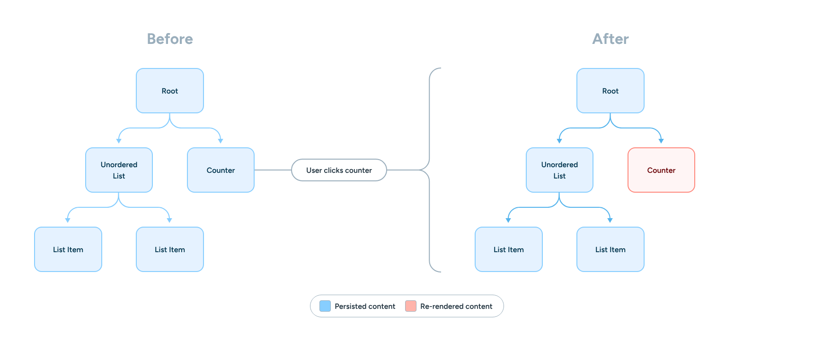

# 通过代码了解 React 的历史

React 是一个奇特的网页开发框架。我发现他们的许多 API 需要特定的思维方式才能正确使用；这是为什么呢？

- The foundation of React; Its history, JSX, and the VDOM.
  React 的基础；它的历史、JSX 以及虚拟 DOM。
- Early component authoring; Class components and its usage at the time.
  早期的组件编写；类组件及其当时的使用方式。
- The introduction to hooks and how it changed React
  Hooks 的引入以及它如何改变了 React。
- How a rewrite of React changed everything
  React 重写如何改变了一切
- Why React's data fetching model looks like it does today
  为什么 React 的数据获取模型看起来是现在这个样子
- React's "move" to the server
  React 向服务器的“迁移”
- The near-term future of React's APIs
  React API 的近期发展趋势

## React 的最初日子

1. 标记语言的问题
   模板编译可以在运行时之前进行——从而使错误能够在开发生命周期的更早阶段被发现
   由于 JSX 不是字符串，它天生就具备更好的 XSS 防护，无需依赖特定的 API 来实现
   复用 JavaScript 进行流程控制；无需在另一种基于字符串的语言中重新发明 JavaScript 的表达能力
2. React 的 render 方法中的模板不仅仅是组件的初始模板；它是贯穿整个时间使用的模板。
3. 使标记具有响应性
   当某个组件需要更新 DOM 时，它会与这个虚拟 DOM 进行比较，并且只将重新渲染局限于特定的节点。
   

## 早期的开发者体验

1. 当 MyComponent 变得更复杂时，这尤其成为一个问题；**我们需要使用 super 关键字来允许基类继续保持原有的行为：**
   为了解决这个问题，许多应用程序和库采用了一种称为“高阶组件”（HoC）的模式。
   避免让用户在整个代码库中多次调用 super ，而是将参数作为 props 从基类传递给扩展类：
   **在 hooks 出现之前，这就是 React 中组件逻辑复用的最先进方法。**

2. 重大缺陷：函数组件无法拥有自己的状态。

## 开发者体验的成熟

1. 回归到组合的概念
2. 副作用

- A "side effect" is the idea of mutating state from some external boundary.
  “副作用”是指从某个外部边界改变状态的概念。
- As a result of this, all I/O is a "side effect" since the user is external to the system executing the code.
  因此，所有的输入输出都是“副作用”，因为用户是执行代码的系统之外的外部对象
- Most I/O requires some flavor of cleanup: either to stop listening for user input or to reset state set during an output before the next iteration
  大多数输入输出操作都需要某种形式的清理：要么停止监听用户输入，要么在下一次迭代之前重置在输出期间设置的状态
- As a result, side effects need a good way to clean up; otherwise your application will suffer from bugs and memory leaks.
  因此，**副作用需要一个良好的清理方式；否则你的应用程序将会出现错误和内存泄漏。**

3. React 团队希望确保你在组件中清理副作用，以避免内存泄漏和错误
   **他们希望保持组件渲染行为的幂等性**
   <StrictMode> 主要以以下内容而闻名

   ```tsx
   function App() {
     useEffect(() => {
       // Runs twice on dev with StrictMode, once on prod
       console.log('Mounted')
     }, [])
     return <>{/* ... */}</>
   }
   ```

   **这并不是在 React 18 之后临时加上的想法；幂等性对 React 来说非常重要，事实上，它在 Facebook 团队关于 React 的第二次演讲中就被提及为核心设计决策。**

## 充分利用虚拟 DOM 的全部潜力

1. fiber
   Pause work and come back to it later.
   暂停工作，稍后再继续。
   Assign priority to different types of work.
   为不同类型的工作分配优先级。
   Reuse previously completed work.
   重用之前完成的工作。
   Abort work if it's no longer needed.
   如果工作不再需要，则中止。

2. Solving error handling 解决错误处理
   由于虚拟 DOM 的特性，每当一个组件抛出错误时，整个 React 树都会崩溃。
   然而，由于组件是层级排列的，我们可以在可能抛出错误的组件与应用程序其余状态之间建立一个边界。
   如果没有 Fiber 新的协调管线中中止工作的能力，这项工作是不可能完成的。
3. 解决代码包拆分问题
4. 解决加载状态
5. 探索并发性
   startTransition

## The big play: First-class data fetching

React 团队一直建议“提升状态”到组件之外，以避免数据共享带来的麻烦

## 使用分层 React 结构扩展您的项目

1. 将同步工具称为 utils，而将类似的异步函数称为 services
2. 定义“智能(smart)”组件与“哑(dumb)”组件
   不包含任何状态或应用逻辑；我们称这样的组件为“哑”组件。
   “哑”组件用于样式和组合性，但不用于应用逻辑或状态。
   **将状态提升出组件本身，保留“哑”组件的这种模式，来源于 React 团队本身的指导。这种模式被称为“状态提升”。**

## 单向数据流

单向数据流的理念是组件的数据流动应当只有一个方向。
**子组件只能调用父组件传递的函数，而父组件只能设置或传递数据给子组件。**

## useEffect

1. 将所有副作用保留在 useEffect 内
