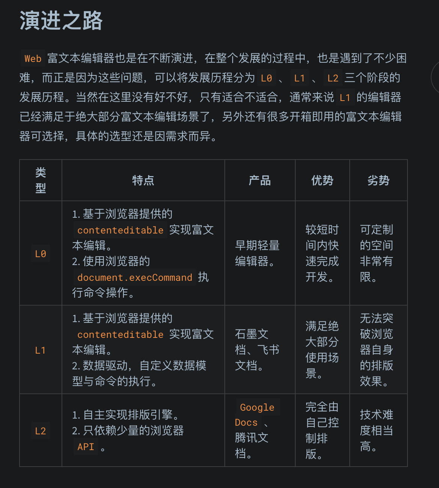

https://blog.touchczy.top/?p=/RichText/%E5%88%9D%E6%8E%A2%E5%AF%8C%E6%96%87%E6%9C%AC%E4%B9%8B%E5%AF%8C%E6%96%87%E6%9C%AC%E6%A6%82%E8%BF%B0

- 演进之路
  
  L1 阶段的富文本编辑器，通过抽离数据模型，解决了富文本中脏数据、复杂功能难以实现的问题。
  通过数据驱动，可以更好的满足定制功能、跨端解析、在线协作等需求。
  富文本编辑器在 L0 跃迁至 L1 发生的改变是自定义数据模型的抽离，在 L1 跃迁至 L2 的改变则是自定义的排版引擎。

- 概念

  - Selection
  - Range
  - Copy & Paste
  - History

- 编辑器引擎
- 协同算法不需要是正确的，其只需要保持一致，并且需要努力保持你的意图，就是说协同算法最主要的目的是在尽可能保持用户的意图的情况下提供最终的一致性，重点在于`提供最终一致性而不是保持用户的意图。`
- CRDT 是一种数据结构，也就是说 CRDT 是通过数据结构来保证最终一致性的。
  可以在网络中的多个终端上复制的数据结构，副本可以独立和并行地更新，不需要在副本之间进行协调，并保证不会有冲突发生，从而保证最终各个副本的内容一致。
  https://zhuanlan.zhihu.com/p/1933110651129164105
- 在 Js 中我们能直接执行代码中能直接执行代码的方法有两个: eval 和 new Function。那么我们肯定是不能用 eval 的，eval 执行的代码将在当前作用域中执行，这意味着其可以访问和修改当前作用域中的变量，虽然在严格模式下做了一些限制但明显还是没那么安全，这可能导致安全风险和意外的副作用。而 new Function 构造函数创建的函数有自己的作用域，其只能访问全局作用域和传递给它的参数，从而更容易控制代码的执行环境，在后文中安全也是我们需要考虑的问题，所以我们肯定是需要用 new Function 来实现动态代码执行的。

---

## 富文本编辑器设计思路

- 富文本编辑器很类似于低代码的设计，准确来说是 No Code 的一种实现。本质上低代码和富文本都是基于 DSL 的描述来操作 DOM 结构，只不过富文本主要是`通过键盘输入来操作 DOM，而无代码则是通过拖拽等方式来操作 DOM`，我想这里应该是有些共通的设计思路。
- 在行内容的末尾后面插入`零宽字符`，就可以做到末尾的文本选中效果
- MVC 架构的编辑器，将应用程序分为控制器、模型、视图三个核心组件，通过控制器执行命令时会修改当前的数据模型，进而表现到视图的渲染上。

## 基于 Canvas 实现一个简历编辑器

- Canvas 绘制文档主要选了两个原因:
  文档的一致性: 这里的一致性指的是浏览器对于类似行为的兼容，举个例子: 在 Chrome 中双击某段文本的内容，选区会自动选择为整个单词，而在早期 FireFox 中则是会自动选择一句话。类似这种行为的不一致会导致用户体验的不一致，而使用 Canvas 绘制文档可以自行实现保证这种一致性。
  高效的绘制性能: 通过 Canvas 绘制文档，可以更好地控制绘制时机，而不需要等待重绘回流，更不需要考虑 DOM 本身复杂的兼容性考量，以此造成的性能损失。此外，Canvas 绘图替代繁重的 DOM 操作，通过逐帧渲染和硬件加速可以提升渲染性能，从而提高用户操作的响应速度和整体使用体验。

- 绘制的性能优化主要有: 1. 可视区域绘制，完全超出画布的元素不绘制。 2. 按需绘制，只绘制当前操作影响范围内的元素。 3. 分层绘制，高频操作绘制在上层画布，基础元素绘制在下层画布。 4. 节流批量绘制，高频操作节流绘制，上层画布收集依赖批量绘制。

- 图形绘制与状态管理(轻量级 DOM)

## Slate

- Slate 文档编辑器#3-TS 类型扩展与节点类型检查
  interface 和 type 还有一个比较重要的区别就是 interface 可以被合并，也就是可以将定义的接口进行扩展。而 type 在同一个模块内是无法重新定义类型声明的。
  **实际应用中 interface 的合并特性是非常重要的，特别是在 declare module 的场景下，我们可以用于为模块扩展声明类型，也就是为已经有类型定义的库增加额外类型定义。**

  ```ts
  declare module 'some-library' {
    export interface A {
      a: number
    }
    export function fn(): void
  }
  ```

  ```ts
  // packages/delta/src/interface.ts
  import type { BaseEditor } from 'slate'

  declare module 'slate' {
    interface CustomTypes {
      Editor: BaseEditor
      Element: BlockElement
      Text: TextElement
    }
  }

  export interface BlockElement {
    text?: never
    children: BaseNode[]
    [key: string]: unknown
  }

  export interface TextElement {
    text: string
    children?: never
    [key: string]: unknown
  }
  ```
