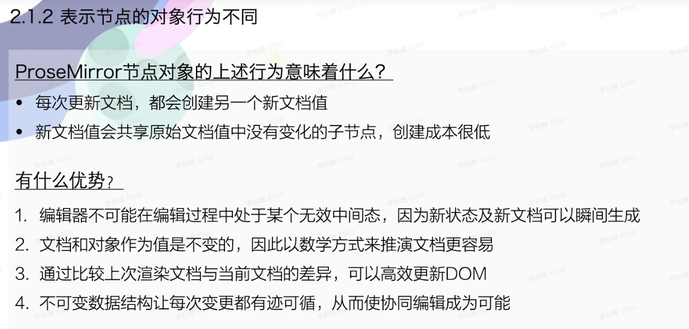

## 背景

- 马金-哈弗贝克
- CodeMirror、ProseMirror、Lezer、Acorn、Eloquent JavaScript
- 模块化、定制化

## 四大核心模块

## 文档(doc)

1. 与 dom 区别
   - 保存行内元素的方式不同
   - 可持久化
     
2. 三种创建方式
   - 直接创建
   - 从 JSON 解析
   - 从 DOM 解析
3. 索引、位置、偏移量

## Schema

1. 创建
   
2. 内容表达式
   
   - 节点顺序很重要
     
3. 序列化与解析
   

## 文档变换

1. 为什么要使用文档变换
   
2. 步骤：Step
   
3. 变换：Transform
   
4. 位置映射：StepMap/Mapping
   
   
5. 理解 Rebase
   
   

## State

1. 编辑器状态中包含什么
   
   
2. 选区
   
3. 事务
   
   
4. 插件
   
   
   

## View

三种

1. 视图组件概述
   
2. 数据流与高效更新
   
3. 视图属性
   
4. 视图装饰
   
   
5. 节点视图
   
   
   

## Command

## Collab

1. 协同算法简介
   
2. 算法步骤
   rebase
3. 中心服务
   
4. collab 模块
   
