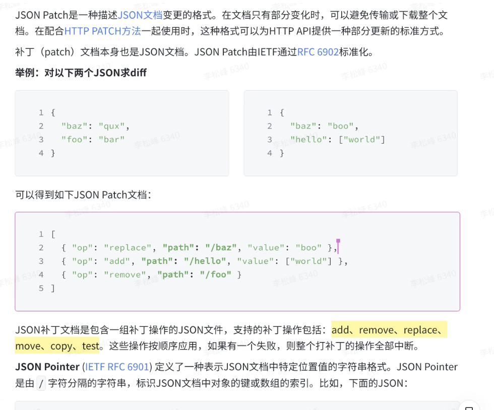

## 编辑器 diff

- json diff：JSON Patch：描述 JSON 文档变更的格式
  
  jsondiffpatch
- 纯文本 diff：diff-match-patch、Unidiff

---

好的，我们来系统地、深入地讲解“编辑器 diff”这个主题。这不仅仅是比较两个文本文件，更是现代编辑器，尤其是协同编辑和版本控制功能的核心基石。

我们将从以下几个层面来解构这个概念：

1.  **为什么需要 Diff：核心应用场景**
2.  **两大流派：基于状态的 Diff vs. 基于操作的 Diff**
3.  **技术详解：`diff-match-patch`, `Unidiff`, `JSON Patch`**
4.  **结构化文档的挑战与 ProseMirror 的选择**

---

### 1. 为什么需要 Diff：核心应用场景

“Diff”（Difference）的本质是**用一种结构化的方式，描述从状态 A 到状态 B 所需的变更**。在编辑器领域，它主要用于：

- **版本控制 (Version Control)**：像 Git 这样的系统，其核心就是存储和应用 diff（在 Git 中称为 patch），从而高效地记录每次提交的变更，而不是存储整个文件的无数个副本。
- **协同编辑 (Collaborative Editing)**：当多个用户同时编辑时，每个用户的修改都需要以 diff 的形式发送给其他人。其他人接收到 diff 后，将其应用（合并）到自己的文档版本上。
- **追踪修订 (Track Changes)**：在 Word 或 Google Docs 中，你看到的红色删除线、绿色下划线等，本质上就是将 diff 可视化地呈现在文档上，而不是直接应用它。
- **撤销/重做 (Undo/Redo)**：用户的每次操作都可以被看作一个 diff。撤销就是应用这个 diff 的“逆操作”，重做就是再次应用它。

---

### 2. 两大流派：基于状态的 Diff vs. 基于操作的 Diff

这是理解编辑器 diff 的最核心分野，它决定了 diff 算法的设计哲学。

#### A. 基于状态的 Diff (State-based Diff)

这种方法不关心“如何”从 A 变成 B，只关心“结果”。它通过直接比较两个完整的文档状态（快照），计算出它们之间的差异。

- **工作方式**：`diff(stateA, stateB) -> patch`
- **典型代表**：`diff-match-patch`, `Unidiff`
- **优点**：
  - **无状态**：算法本身不需要知道任何历史信息，给两个版本就能算，非常纯粹。
  - **健壮**：即使中间过程丢失，只要有最终状态，总能算出差异。
- **缺点**：
  - **意图丢失**：它无法区分用户的真实意图。例如，用户“删除一个段落再输入一个新段落”和“修改了原段落的每个字”，在状态 diff 看来可能结果完全一样。
  - **性能开销**：对于大文档，每次都进行全文比较，成本可能很高。
  - **冲突解决困难**：在协同编辑中，合并两个用户基于同一旧版本的 diff（即 `patch(patch(stateA, stateB1), stateB2)`）非常困难且容易出错，这就是著名的“三方合并”难题。

#### B. 基于操作的 Diff (Operation-based Diff)

这种方法记录的是用户完成变更所执行的**一系列具体操作（Operations）**。它关心的是“过程”而非“结果”。

- **工作方式**：监听用户事件，直接生成操作序列 `[op1, op2, ...]`。
- **典型代表**：**操作变换 (Operational Transformation, OT)**，如 ProseMirror 和 Google Docs 使用的；**无冲突复制数据类型 (CRDTs)**。
- **优点**：
  - **意图保留**：每个操作都精确地代表了用户的意图（例如 `updateStyle`, `splitNode`），信息量更丰富。
  - **轻量级**：操作通常非常小，网络传输开销低。
  - **为协同而生**：OT 和 CRDTs 的核心就是设计了一套数学模型来保证在并发操作下，不同客户端应用操作序列后能收敛到一致的状态。
- **缺点**：
  - **实现复杂**：需要实现复杂的转换（transform）或合并（merge）函数来处理并发操作的冲突。
  - **有状态**：通常需要维护版本号或操作历史，对实现要求更高。

---

### 3. 技术详解

现在我们来看你在笔记中提到的具体技术，它们都属于**基于状态的 Diff**。

#### `diff-match-patch` (by Google, Neil Fraser)

这是一个非常著名且强大的**纯文本**比较库。它包含三个核心部分：

1.  **Diff**:

    - **算法**: 它使用 Myers 差分算法及其变体，在效率和精度上做了很多优化。
    - **输出**: 生成一个由 `[操作, 文本]` 元组组成的数组。操作有三种：`DIFF_INSERT` (1), `DIFF_DELETE` (-1), `DIFF_EQUAL` (0)。
    - **示例**: `diff("Apple", "Crabapple")`
      - 输出: `[ [1, "Crab"], [0, "apple"] ]` (含义：插入 "Crab"，然后是公共部分 "apple")

2.  **Match**: 在文本中进行模糊匹配，即使目标文本有少量错误也能找到。
3.  **Patch**:
    - **功能**: 基于 Diff 的结果，生成一种可应用的补丁格式，并能将补丁应用到源文本上。
    - **特点**: 它的 Patch 格式包含了上下文信息，使得应用补丁时更加健壮。即使目标文本与生成补丁时的源文本不完全一样，只要上下文能对上，补丁依然有很大概率成功应用。

**局限性**: `diff-match-patch` 是**语义盲目**的。它只关心字符。对于富文本编辑器，`<b>Apple</b>` 变成 `<i>Apple</i>`，它可能会识别为删除了 `<b>` 和 `</b>`，并插入了 `<i>` 和 `</i>`，而无法理解这是“样式变更”。

#### `Unidiff` (Unified Diff Format)

这是一种**标准化的文本补丁格式**，而不是一个库。你每天在 `git diff` 或 GitHub Pull Requests 中看到的就是它。

- **特点**:
  - **面向行 (Line-oriented)**：它的最小比较单位是“行”。
  - **人类可读**: 格式清晰，易于阅读。
  - **包含上下文**: `@@ -1,5 +1,6 @@` 这样的头部信息定义了变更的起始行和影响行数。`+` 表示新增行，`-` 表示删除行，空格开头的行是未变的上下文。
- **示例**:
  ```diff
  --- a/file.txt
  +++ b/file.txt
  @@ -1,3 +1,4 @@
   Apple
  -Banana
  +Blueberry
   Cherry
  +Durian
  ```
  这个 diff 清晰地表示了：删除了 "Banana"，新增了 "Blueberry"，并在末尾新增了 "Durian"。

**局限性**: 因为是面向行的，它完全不适用于富文本。它无法表示一行中某个单词从普通变为粗体的操作。它主要用于代码和纯文本文档。

#### `JSON Patch` (RFC 6902)

这是一种用于描述 JSON 文档变更的**标准化格式**。

- **工作方式**: 它将 diff 表示为一个由多个“操作对象”组成的数组。每个对象描述一个原子操作。
- **核心操作**: `add`, `remove`, `replace`, `move`, `copy`, `test`。
- **路径表示**: 使用 JSON Pointer (RFC 6901) 来精确定位文档中的某个位置，例如 `/users/1/name`。
- **示例**:
  - 源 JSON: `{ "name": "Alice", "contact": { "email": "a@a.com" } }`
  - 目标 JSON: `{ "name": "Bob", "contact": { "email": "a@a.com", "phone": "123" } }`
  - JSON Patch:
    ```json
    [
      { "op": "replace", "path": "/name", "value": "Bob" },
      { "op": "add", "path": "/contact/phone", "value": "123" }
    ]
    ```

**与编辑器的关系**: 如果你的编辑器文档模型本身就是一个 JSON 结构（或者可以被看作 JSON），那么 JSON Patch 是一个非常好的**基于状态**的 diff 格式。它比纯文本 diff 更具结构性。

---

### 4. 结构化文档的挑战与 ProseMirror 的选择

富文本编辑器的文档不是纯文本，而是一个**结构化的树形文档**（Document Object Model）。

- **挑战**:

  1.  **语义**: “将两个段落合并”和“删除第一个段落结尾的换行符”在文本 diff 上可能一样，但在结构上是完全不同的操作。
  2.  **位置**: 当文档结构变化时，基于字符偏移量的位置会失效。例如，在文档开头加一个字，后面所有位置都需要更新。
  3.  **并发**: 状态 diff 难以解决并发冲突。

- **ProseMirror 的解决方案**:
  ProseMirror 彻底抛弃了基于状态的 diff 思想，全面拥抱**基于操作的 Diff (OT)**。
  1.  **`Step`**: 用户的每个最小操作（如 `addMark`, `replace`）都被抽象成一个可序列化、可逆的 `Step` 对象。这就是最原子的 diff。
  2.  **`Transaction`**: 一系列 `Step` 组成一个事务。
  3.  **`Transform`**: `Transaction` 的父类，核心是 `map` 方法。它定义了如何让一个位置或一个 `Step` 在另一个 `Step` 发生后进行“坐标变换”。
  4.  **`rebaseSteps`**: 正如我们之前深入分析的，`collab` 模块的核心就是利用 `map` 能力，智能地合并远程和本地的操作序列（`Step` 数组）。

**结论**: 对于像 ProseMirror 这样复杂的结构化编辑器，简单的文本 diff 或 JSON diff 无法满足其对语义、性能和协同能力的要求。因此，它选择了更复杂但功能更强大的**操作变换（OT）**作为其 diff 机制的理论基础，将 diff 的核心从“比较结果”转移到了“记录和变换过程”。
