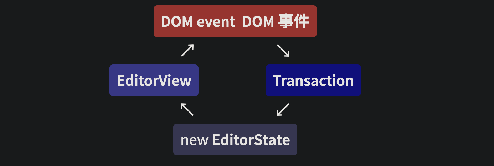

- ProseMirror 的主要原则是你的代码对文档及其变化拥有完全控制。这个文档不是一团 HTML，而是一个自定义的数据结构，只包含你显式允许它包含的元素，以你指定的关系组织。所有更新都通过单一入口点进行，在那里你可以检查并对其做出响应。
- we are prioritizing modularity and customizability over simplicity
  我们优先考虑模块化和可定制性，而不是简便性
- 每次状态更新都必须经过 updateState ，每次普通的编辑更新都通过分发一个事务来完成。
- 要以编程方式创建节点，必须通过 schema，例如使用 node 和 text 方法。
- 每个模式至少必须定义一个顶层节点类型（默认为名称 "doc" ，但你可以配置它），以及一个用于文本内容的 "text" 类型。
- Content Expressions 内容表达式
  你可以通过在节点规范中添加一个 group 属性来创建一个节点组，然后在表达式中通过该名称引用该组。
- the main thing the transform system does is to leave a trail of updates, in the form of values that represent the individual steps taken to go from an old version of the document to a new one.
  转换系统的主要作用是留下更新的痕迹，以表示从文档的旧版本到新版本所采取的各个步骤。
- 最简单的插件只是向编辑器视图添加一些 props，例如用于响应特定事件。更复杂的插件可能会向编辑器添加新的状态并基于事务更新它。
- 插件往往需要在事务上添加一些额外信息，这通常很有用。例如，撤销历史在执行实际撤销时会标记结果事务，这样当插件看到该事务时，就不会像通常那样将更改添加到撤销栈中，而是特殊处理它——从撤销栈中移除顶部项目，并将该事务添加到重做栈中。
  
- nodeView

```js
let view = new EditorView({
  state,
  nodeViews: {
    image(node, view, getPos) {
      return new ImageView(node, view, getPos)
    }
  }
})

class ImageView {
  constructor(node, view, getPos) {
    this.dom = document.createElement('img')
    this.dom.src = node.attrs.src
    this.dom.alt = node.attrs.alt
    this.dom.addEventListener('click', e => {
      e.preventDefault()
      let alt = prompt('New alt text:', '')
      if (alt)
        view.dispatch(
          view.state.tr.setNodeMarkup(getPos(), null, {
            src: node.attrs.src,
            alt
          })
        )
    })
  }

  stopEvent() {
    return true
  }
}
```
