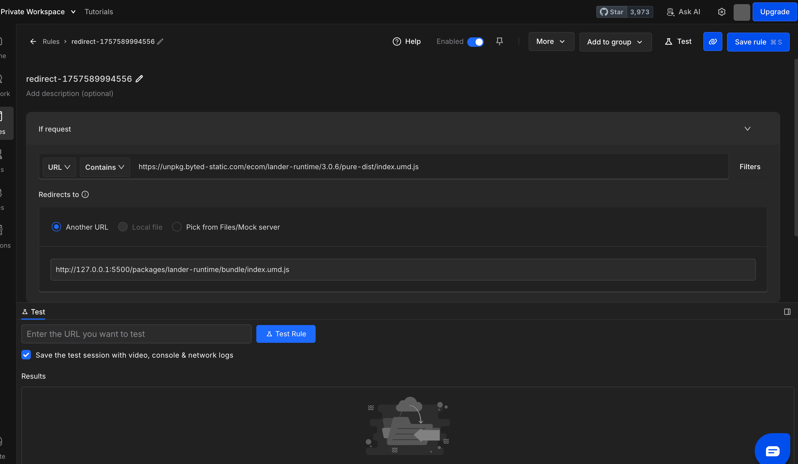

好的，明白了！你的需求是想在浏览器里访问一个线上地址时，把其中某个或某些请求（比如一个 JS 文件、CSS 文件或 API 请求）拦截下来，并让它实际访问你本地的对应文件或服务。

这是一个非常常见的开发调试技巧，主要用于：

- **调试线上 Bug**：直接用本地修改过的代码替换线上文件，快速验证修复方案。
- **开发新功能**：在已有的线上环境中，用本地正在开发的新版 JS/CSS 文件进行测试。
- **Mock API 数据**：将线上的 API 请求指向本地的 Mock Server，返回自定义的数据。

Chrome DevTools 自带的 **Local Overrides (本地替换)** 功能是实现这个需求最直接、最方便的方法。

### 方法一：使用 Chrome DevTools 的 "Local Overrides" (推荐)

这是最原生、最简单的方法，不需要安装任何额外工具。

**操作步骤：**

1.  **打开开发者工具**：
    在目标网页上按 `F12` (或 `Cmd+Option+I` on Mac) 打开 DevTools。

2.  **打开 "Sources" (源代码) 面板**：
    点击顶部导航栏的 "Sources" 标签。

3.  **启用 Overrides**：

    - 在左侧的导航窗格中，找到并点击 `Overrides` (替换) 标签页。如果没看到，可以点击 `>>` 箭头找到它。
    - 点击 `+ Select folder for overrides` (选择用于替换的文件夹)。
    - 在你的电脑上**新建一个空文件夹**（比如 `my-overrides`），然后选择它。
    - Chrome 会在顶部弹出一个权限请求，点击 `Allow` (允许)。

4.  **选择要代理(替换)的请求**：

    - 切换到 **"Network" (网络) 面板**。
    - 刷新页面，让所有请求重新加载。
    - 在请求列表中，找到你想要代理到本地的那个文件（比如一个叫 `main.js` 的文件）。
    - 在那个请求上**右键单击**，选择 `Save for overrides` (保存以供替换)。

5.  **修改本地文件**：

    - 完成上一步后，Chrome 会自动将这个文件保存在你之前选择的 `my-overrides` 文件夹中，并保持其网站的目录结构。
    - 同时，DevTools 会自动跳转回 "Sources" 面板，并打开这个刚刚保存的本地文件。
    - 现在，你可以**直接在这个文件里修改代码**了。比如加一行 `console.log('Hello from local override!');`。修改后按 `Ctrl+S` (或 `Cmd+S`) 保存。

6.  **验证效果**：

    - **刷新网页**。
    - 你会发现，浏览器加载的不再是服务器上的原始文件，而是你本地修改过的版本！
    - 在 "Network" 面板中，被替换的请求旁边会出现一个**紫色圆点** 🟣，提示你这个请求已被本地文件替换。将鼠标悬停在上面，会显示 "Served from local overrides" (由本地替换提供)。
    - 在 "Sources" 面板中，被替换的文件名旁边也会有这个紫色圆点。

    !验证效果

**总结 "Local Overrides"：**

- **优点**：无需任何第三方工具，集成在 DevTools 中，操作简单直观。
- **缺点**：主要用于替换**静态文件**（JS, CSS, 图片等）。对于需要代理到本地**动态服务**（比如一个 Node.js API Server）的场景，它就不太适用了。

---

### 方法二：使用代理工具 (如 Charles, Fiddler, Proxyman)

如果你的需求更复杂，比如需要将 API 请求 `https://api.example.com/user` 代理到你本地运行的 `http://localhost:3000/user` 服务，那么使用专业的代理工具会更强大。

以 **Charles** 为例，其核心功能是 "Map Local" (映射到本地)。

**通用思路：**

1.  **安装并运行代理工具** (如 Charles)。
2.  **配置浏览器/系统代理**：让电脑的所有网络请求都通过这个工具。通常工具会自动配置。
3.  **找到目标请求**：在工具的请求列表中找到你想代理的线上请求。
4.  **设置映射规则**：
    - 右键点击该请求，选择 "Map Local"。
    - 在弹出的窗口中，将这个线上 URL 映射到一个本地文件路径，或者如果你要代理的是 API，可以设置 "Map Remote" 将一个域名映射到 `localhost:端口号`。
5.  **刷新浏览器**，请求就会被代理工具拦截并指向你的本地资源。

**总结代理工具：**

- **优点**：功能极其强大，不仅能代理文件，还能代理整个 API 服务、修改请求/响应内容、限速等。跨浏览器、跨应用通用。
- **缺点**：需要安装和配置，学习成本比 DevTools 稍高。

---

### 方法三：使用浏览器插件 (如 Requestly)

有些浏览器插件也能实现类似的功能，提供一个图形界面来设置重定向规则。

**通用思路：**

1.  从 Chrome 网上应用店安装 **Requestly** 或类似插件。
2.  打开插件，创建一个新的 "Redirect Rule" (重定向规则)。
3.  设置规则：

    - **Source (源)**: 填入你想要拦截的线上 URL，支持通配符。
    - **Destination (目标)**: 填入你本地文件的 URL。**注意**：这里需要你本地也起一个静态服务器（比如用 `npx http-server`、`live server`），然后填入 `http://localhost:8080/path/to/your/file.js` 这样的地址。

    **为什么 requestly 的目标不能直接写本地文件路径，而是需要静态服务器**

4.  保存并启用规则，然后刷新页面即可。

**总结浏览器插件：**

- **优点**：规则管理方便，可以随时开关。
- **缺点**：通常需要配合本地 Web Server 使用，比 DevTools Overrides 稍微麻烦一点。

对于你的问题描述 “chrome 调试面板里的请求代理到本地”，**方法一 (Local Overrides) 是最契合、最推荐的方案**。如果遇到它无法解决的复杂场景，再考虑方法二或方法三。
