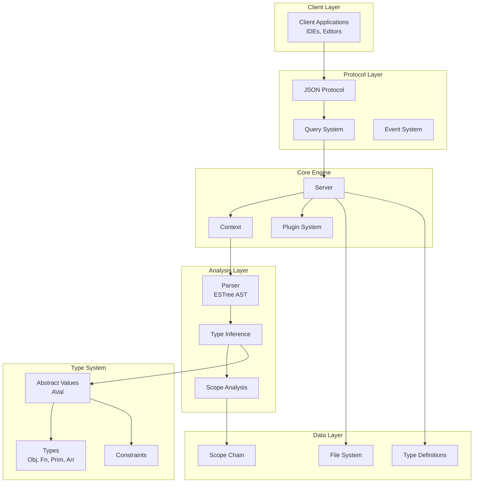
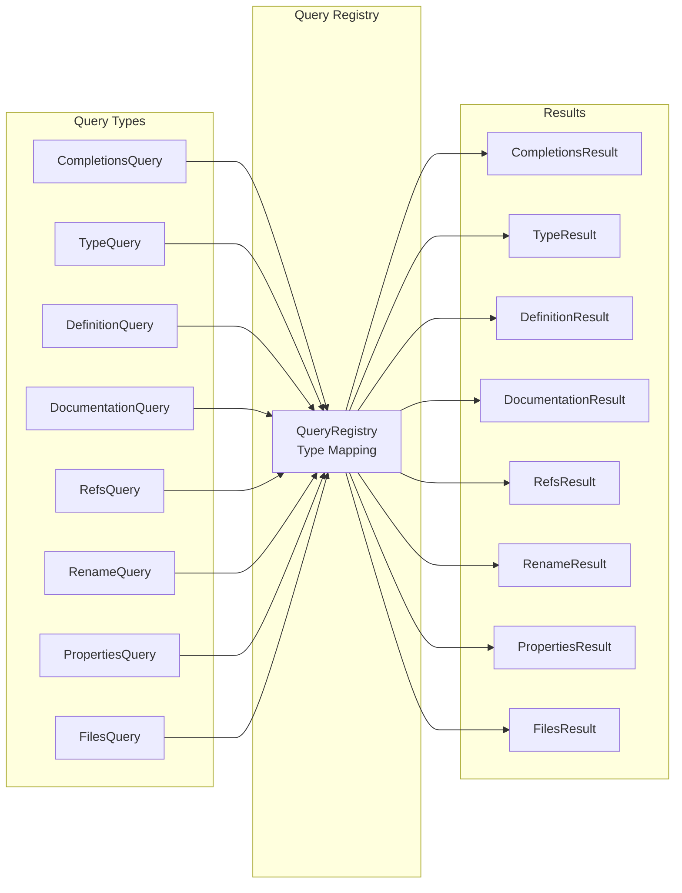
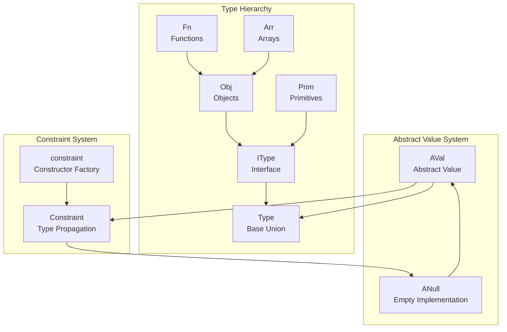
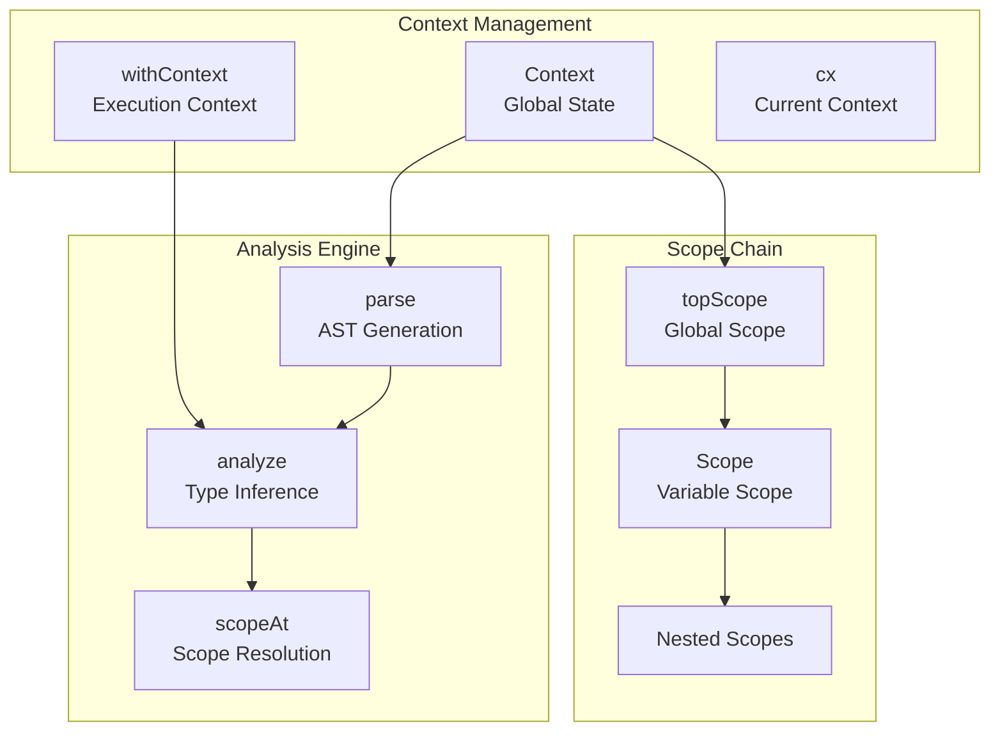
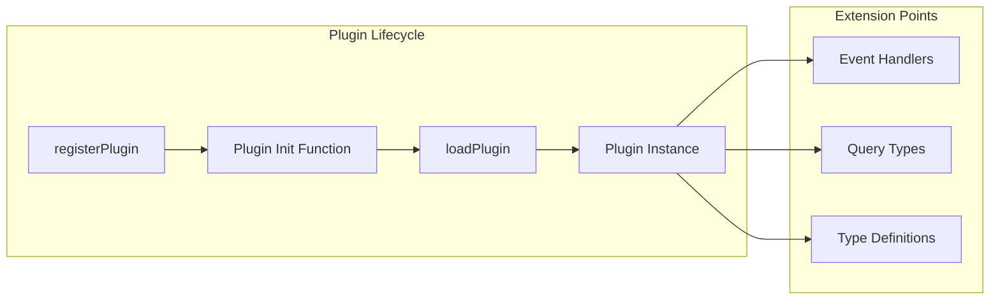

# Tern.js 类型声明文件详细分析

## 整体架构概述

Tern.js 是一个强大的 JavaScript 代码分析引擎，主要用于提供代码补全、类型推断、定义跳转等 IDE 功能。从类型声明文件可以看出，它采用了**分层架构**和**抽象语法树（AST）驱动**的设计模式。

## 核心架构图



## 详细组件分析

### 1. 服务器核心 (Server)

```typescript
export interface Server {
  readonly cx: Context
  readonly options: ConstructorOptions
  readonly files: File[]
  readonly plugins: any
  // ... methods
}
```

**Server** 是整个系统的核心控制器，负责：

- 管理分析上下文 (

Context

)

- 处理文件管理和依赖关系
- 插件系统管理
- 请求路由和处理

### 2. 查询系统架构



查询系统采用了**类型安全的注册表模式**：

```typescript
export type QueryResult<Q extends Query> = QueryRegistry[Q['type']]['result']

export interface QueryRegistry {
  completions: {
    query: CompletionsQuery
    result: CompletionsQueryResult
  }
  type: {
    query: TypeQuery
    result: TypeQueryResult
  }
  // ...
}
```

这种设计确保了查询类型与结果类型的一一对应关系。

### 3. 类型系统架构



**类型系统核心特点**：

1. **抽象值 (AVal)**：表示类型集合，支持类型传播
2. **类型层次**：

Obj

>

Fn

,

Arr

；

Prim

独立3. **约束系统**：通过

Constraint

实现类型推断和传播

### 4. 作用域和上下文管理



### 5. 文件和依赖管理

```typescript
export interface File {
  name: string
  text: string
  scope: Scope
  ast: ESTree.Program
  type?: 'full' | 'part' | 'delete'
  asLineChar?(nodePosition: number): Position
}
```

文件管理支持：

- 增量分析 (`'part'` 类型)
- 文件删除追踪
- 位置映射功能

### 6. 插件系统架构



插件系统设计特点：

- **声明式注册**：通过

registerPlugin

注册

- **延迟加载**：通过

loadPlugin

按需加载

- **多扩展点**：事件、查询类型、类型定义

## 关键设计模式

### 1. 类型安全的多态查询系统

通过 TypeScript 的条件类型和映射类型，实现了类型安全的查询-结果映射：

```typescript
request<Q extends Query, D extends Document>(
  doc: D & { query?: Q },
  callback: (
    error: string | null,
    response: QueryResult<Q> | undefined
  ) => void
): void
```

### 2. 抽象值传播机制

```typescript
interface AVal {
  addType(type: Type, weight?: number): void
  propagate(target: Constraint): void
  // ...
}
```

这种设计允许类型信息在程序分析过程中自动传播，实现了高效的类型推断。

### 3. 事件驱动架构

```typescript
export interface Events {
  reset(): void
  beforeLoad(file: File): void
  afterLoad(file: File): void
  // ...
}
```

通过事件系统，插件可以在分析过程的各个阶段插入自定义逻辑。

## 总结

Tern.js 的架构展现了以下设计优势：

1. **模块化设计**：清晰的分层和职责分离
2. **类型安全**：充分利用 TypeScript 的类型系统
3. **可扩展性**：强大的插件系统
4. **性能优化**：增量分析和抽象值系统
5. **标准兼容**：基于 ESTree AST 标准

这种架构使 Tern.js 成为了一个既强大又灵活的 JavaScript 代码分析引擎，能够为各种开发工具提供高质量的语言服务。
