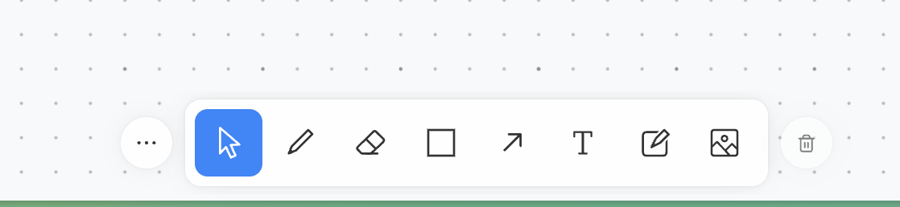

- core

  - renderer
    - Page 的 Schema(需要持久化) 和 State，基于 Context
    - shapeUtils 组件列表
    - 配置项(hideHandles 等)
    - 事件监听(从 app 传入)
  - shapeUtil
    - Shape
    - Indicator
    - Bounds

- app

  - TldrawApp
    - 4000+行 代码
    - 全局的应用实例，包含了完整的数据状态、工具方法，基本暴露了所有 app 的操作能力
    - app 是基于文档的思路，包含多个 page（所以包含多个 page 和 pageState）
    - undo/redo 的功能，抽象到了 Command
  - Command
    - 具体功能的实现，比如 createShape
    - 返回的数据结构 {id, before, after}，并存入 stack，方便 undo 操作
  - Session
    - Session 是一个处理有开始、中间和结束的互动事件的类，比如圈选组件
    - app 同时只能有一个 active 的 session
    - Session 的数据结构 { start, update, cancel, complete }
  - Tool
    - 画布的具体行为模式，比如 Select、文本状态，对应下方的类型
      

- web

---

https://deepwiki.com/tldraw/tldraw/4.2-configuration-and-preferences
