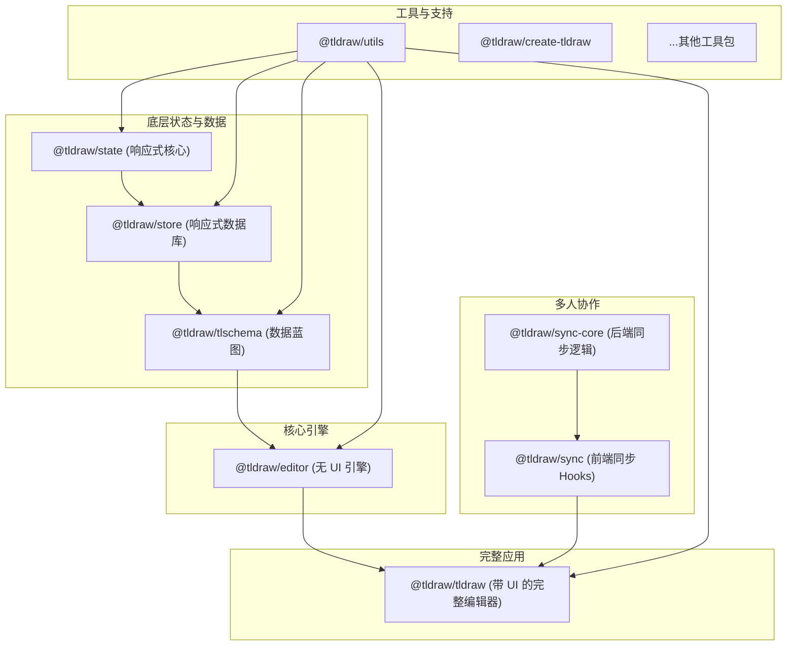

好的，我们来结合您工作区中的所有包，对 `tldraw` 的整体架构进行一个全面的讲解。

`tldraw` 采用了一个现代化的 **Monorepo (单一代码仓库)** 架构，将其复杂的系统拆分成了多个功能独立、职责清晰的包。这种模块化的设计使得代码更易于维护、测试和复用。

下面是这些包的逻辑分组和核心职责讲解：

---

### **第一层：核心状态与数据层 (The Foundation)**

这是整个 `tldraw` 系统的基石，负责管理所有的数据和状态，并且是响应式的。

- **`@tldraw/state`**: **响应式核心**。一个独立的、轻量级的信号 (Signals) 库。它提供了创建响应式状态原语（如 `atom` 和 `computed`）的能力，是 `tldraw` 所有动态更新的基础。
- **`@tldraw/store`**: **响应式数据库**。基于 `@tldraw/state` 构建的一个内存数据库。它负责存储所有的“记录”（如图形、页面、相机等），并处理事务、快照、撤销/重做历史记录。
- **`@tldraw/tlschema`**: **数据蓝图/法律**。定义了 `store` 中所有数据的结构、类型、验证规则和版本迁移逻辑。它确保了存入数据库的每一条数据都是合法和一致的。这是实现数据持久化和向后兼容性的关键。

---

### **第二层：编辑器核心引擎 (The Headless Engine)**

这一层构建在数据层之上，提供了画布的核心编辑能力，但不包含任何具体的 UI。

- **`@tldraw/editor`**: **无 UI 的编辑器引擎**。这是 `tldraw` 的“大脑”。它实现了 `Editor` 类，管理着状态图 (State Chart)、工具逻辑、渲染循环、用户输入处理、相机控制和选择逻辑。这个包本身并不知道任何具体的图形（如箭头或矩形），它只提供一个通用的画布编辑框架。

---

### **第三层：完整的应用层 (The Full Application)**

这是大多数开发者会直接使用的层，它将核心引擎与默认的图形、工具和 UI 组合在一起。

- **`@tldraw/tldraw`**: **“开箱即用”的 tldraw 编辑器**。这是最终面向用户的包。它整合了 `@tldraw/editor` 引擎，并为其添加了所有默认的图形（矩形、箭头、手绘等）、默认工具（选择、画笔、橡皮擦等）以及一套完整的用户界面（工具栏、菜单、样式面板等）。

---

### **第四层：多人协作与同步 (Multiplayer & Sync)**

这一层为 `tldraw` 提供了实时多人协作的能力。

- **`@tldraw/sync-core`**: **同步核心逻辑**。这是一个与后端无关的库，提供了在服务器端运行的 `TLSocketRoom` 类。它负责管理一个协作房间的权威状态，并在多个客户端之间同步数据。
- **`@tldraw/sync`**: **同步客户端**。这是一个 React 库，提供了 `useSync` 和 `useSyncDemo` 这两个 Hooks。开发者可以使用它们轻松地将前端应用连接到 `tldraw sync` 后端，实现多人协作。

---

### **第五层：工具与实用程序 (Tooling & Utilities)**

这些包为整个项目提供了支持和便利。

- **`@tldraw/create-tldraw`**: **项目脚手架**。这是一个命令行工具 (CLI)，可以通过 `npx create-tldraw` 快速创建一个新的 `tldraw` 项目模板。
- **`@tldraw/utils`**: **通用工具库**。包含整个项目中共享的各种辅助函数，如数学计算、类型守卫、颜色处理等。
- **`@tldraw/validate`**: **数据验证库**。一个简单的数据验证库，被 `@tldraw/tlschema` 用来确保数据格式的正确性。
- **`@tldraw/assets`**: **资源处理工具**。提供与资源（图片、视频等）相关的实用程序。
- **`@tldraw/worker-shared`** 和 **`@tldraw/dotcom-shared`**: **后端共享代码**。这些包包含了 `tldraw.com` 官方网站后端服务（基于 Cloudflare Workers）之间共享的代码和常量。

---

### **第六层：兼容性与桥接 (Compatibility & Bridging)**

- **`@tldraw/namespaced-tldraw`**: **遗留兼容包**。这个包主要是为了向后兼容和支持 CDN 使用场景。它简单地重新导出了 `@tldraw/tldraw` 的所有内容，并注册了全局版本信息。新项目应直接使用 `tldraw` 包。
- **`@tldraw/state-react`**: **React 状态桥接**。提供了将 `@tldraw/state` 的信号（signals）与 React 组件连接起来的 Hooks，使得在 React 组件中使用和响应 `tldraw` 的状态变得简单。

### **整体架构图**

这个分层、解耦的架构是 `tldraw` 如此强大和可扩展的根本原因。你可以只使用核心引擎 `@tldraw/editor` 来构建一个完全自定义的画布应用，也可以直接使用 `@tldraw/tldraw` 快速搭建一个功能齐全的白板，并通过 `@tldraw/sync` 为其赋能多人协作。
