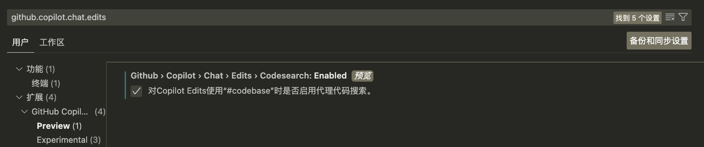
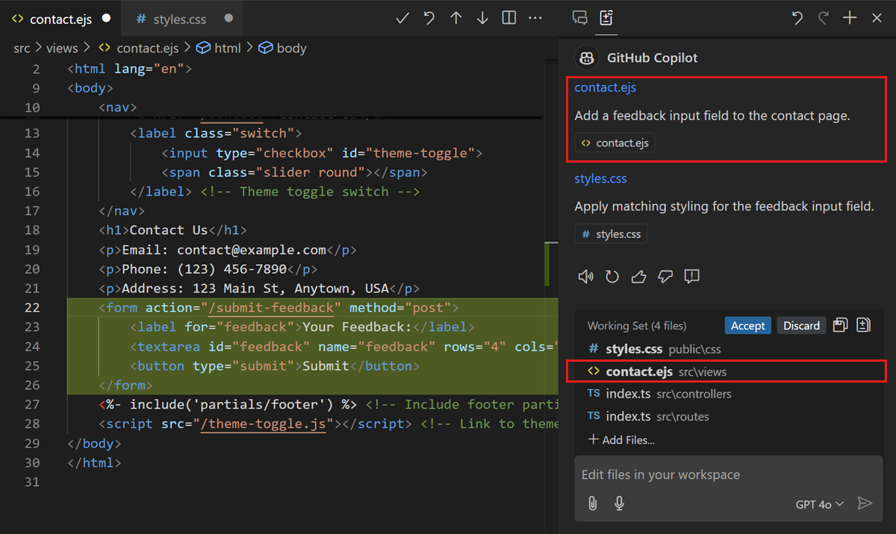
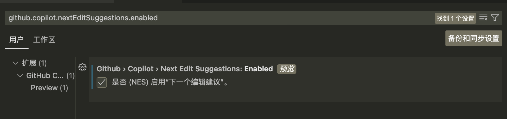
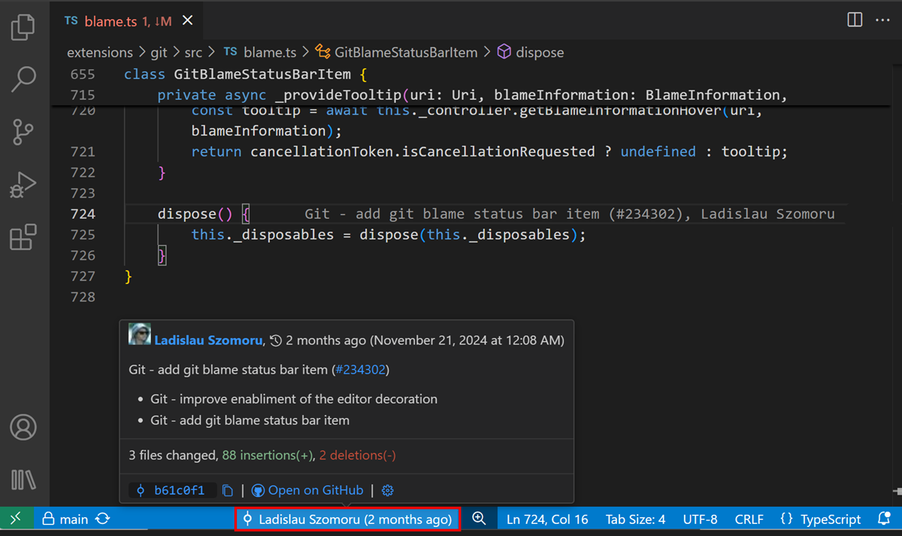
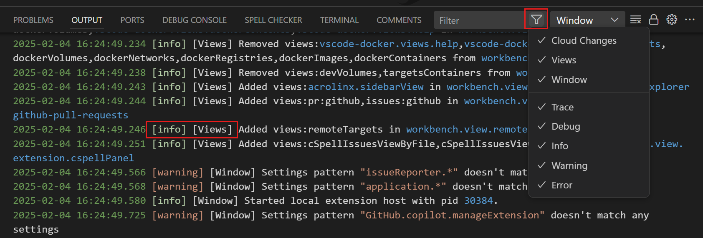
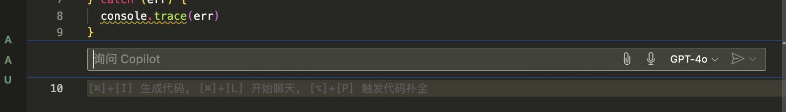

# vscode copilot 使用

https://code.visualstudio.com/updates/v1_97
https://code.visualstudio.com/docs/copilot/overview

## copilot 使用

[cheat sheet](https://code.visualstudio.com/docs/copilot/copilot-vscode-features)

1. `#` 开头的命令 (引用)
   - #changes
     引用在 Git 源代码控制中修改的文件
   - #codebase
     引用代码库中的相关文件区块、符号和其他信息。
   - #sym
     引用代码库中的符号
   - #terminalLastCommand
     引用最后一次在终端中运行的命令
   - #vscodeAPI
     使用 VS Code API 引用回答有关 VS Code 扩展开发的问题。
2. `@` 开头的命令 (聊天参与者，每个参与者都有其特定领域的专业知识)
   - @workspace
     引用有关工作区的信息
   - @github
     获取基于 Web 搜索、代码搜索和企业知识库的答案
   - @terminal
     使用 @terminal 参与者询问有关集成终端或 shell 命令的问题
   - @vscode
     使用 @vscode 参与者询问有关 VS Code 的问题
3. `/` 开头的命令 (常用操作)

   - /new 为您选择的技术生成一个新的 VS Code 工作区
   - /explain 让 Copilot 解释一段代码或一个编程概念
   - /docs 为代码库中的函数和方法生成代码文档
   - /fix 请向 Copilot 请求建议，了解如何修复一段代码或解决代码中的任何编译器或代码检查错误

   使用 / 命令和 @ 参与者来获得更精确和相关的答案。
   要具体，保持简单，并提出后续问题以获得最佳结果
   将文件、符号或选择附加到您的聊天提示中提供上下文

4. Agent mode (Experimental)
   在代理模式下，Copilot 可以自动搜索您的工作区以获取相关上下文，编辑文件，检查错误，并在您的许可下运行终端命令，以完成端到端的任务。
5. Agentic codebase search (Preview)
   
   将 #codebase 添加到您的查询中，Copilot Edits 将发现与您的任务相关的文件。我们增加了对使用额外工具（如文件和文本搜索、Git 仓库状态和目录读取）发现相关文件的实验性支持。
   让 Copilot 通过在您的提示中添加 #codebase 自动找到正确的文件。确保启用 github.copilot.chat.edits.codesearch.enabled（预览）设置，以获得最佳结果。
6. Copilot Edits
   Copilot Edits 将 Copilot Chat 的对话流和 Inline Chat 的快速反馈结合在一个体验中。在旁边进行持续的多轮聊天对话，同时享受内联代码建议的好处。
   
   Copilot Edits 可以在两种模式下运行：
   - edit mode
   - agent mode
7. 通过可重用的提示文件，您可以在 Markdown 文件 ( \*.prompt.md ) 中指定常见的提示指令和相关内容，然后在聊天提示中重用它们
   在您的工作区的 .github/copilot-instructions.md 文件中定义代码生成的共享指令。这些通用指令补充了您个人的代码生成指令。

8. NES(nextEditSuggestions) 下一个编辑建议（预览）
   
   按照顺序修改代码

## copilot 周边插件

## vscode-mermAId

还有一种方法是直接 claude 3.7 生成 PlantUML/mermaid 图。

## Data Analysis for Copilot

---

1. git blame
   
2. Output panel filtering 输出面板过滤
   
3. Agent mode (Experimental)
   代理模式（实验性）
   We've been working on a new agent mode for Copilot Edits. When in agent mode, Copilot can automatically search your workspace for relevant context, edit files, check them for errors, and run terminal commands (with your permission) to complete a task end-to-end.
   我们一直在为 Copilot Edits 开发一种新的代理模式。在代理模式下，Copilot 可以自动搜索您的工作区以获取相关上下文，编辑文件，检查错误，并在您的许可下运行终端命令，以完成端到端的任务。

---

几种聊天的能力

# VS Code Copilot 功能能力对照表

| 能力                                                   | Copilot Edits 编辑 | Chat view 聊天视图 | Inline Chat 内联聊天 | Quick Chat 快速聊天 |
| ------------------------------------------------------ | :-------------------: | :-------------------: | :---------------------: | :--------------------: |
| Receive code suggestions 接收代码建议               |          ✅           |          ✅           |           ✅            |           ✅           |
| Multi-file edits 多文件编辑                         |          ✅           |          ✅           |                         |           ✅           |
| Preview code edits in editor 在编辑器中预览代码编辑 |          ✅           |                       |           ✅            |                        |
| Code review flow 代码审查流程                       |          ✅           |                       |                         |                        |
| Roll back changes 回滚更改                          |          ✅           |                       |                         |                        |
| Attach context 附加上下文                           |          ✅           |          ✅           |           ✅            |           ✅           |
| Use participants & commands 使用参与者和命令        |                       |          ✅           |                         |           ✅           |
| Generate shell commands 生成 shell 命令             |                       |          ✅           |                         |           ✅           |
| General-purpose chat 通用聊天                       |                       |          ✅           |           ✅            |           ✅           |

注：标有 ✅\*的功能可能有一些限制或需要特定条件。

- Copilot Edits 与 Copilot Chat 有什么不同？
  Copilot Edits 让你处于代码编辑的上下文中，你可以开始一个编辑会话，并使用提示来对代码库进行更改。Copilot Edits 可以直接在代码库中的多个文件中生成和应用代码更改。你可以立即在代码的上下文中预览生成的编辑。
