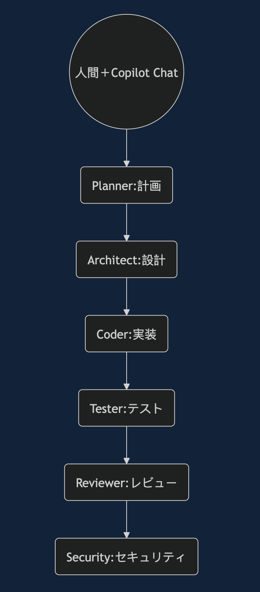
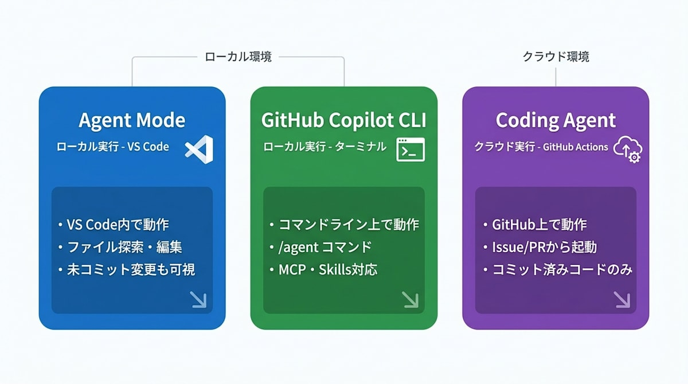
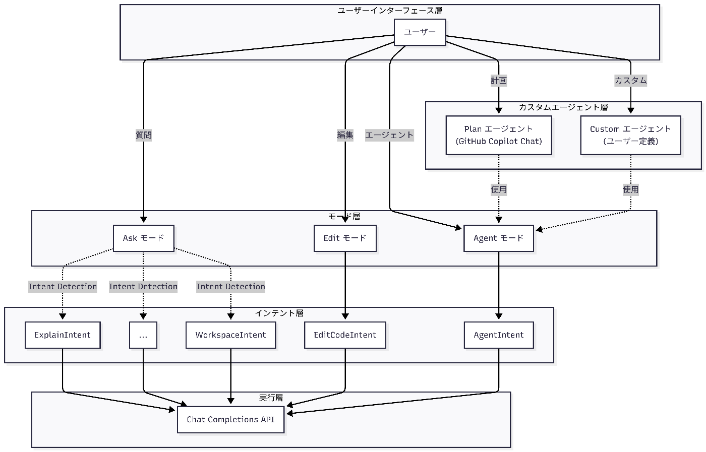
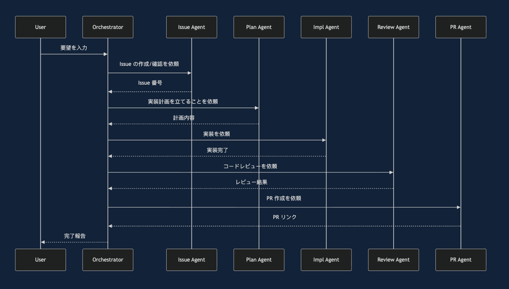
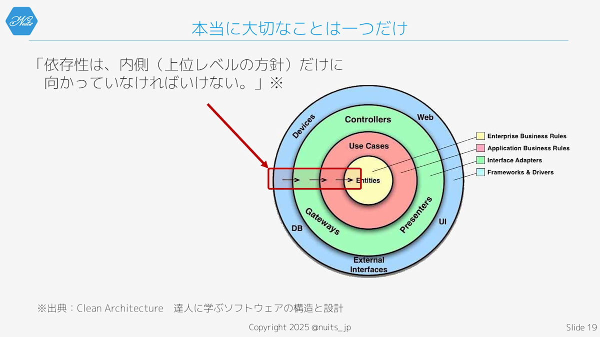
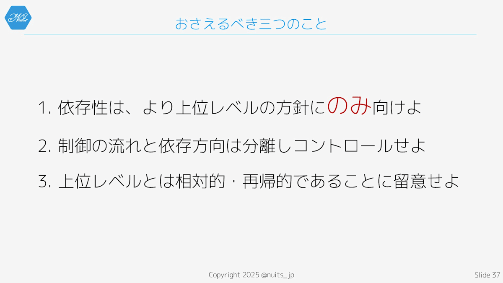

- [VS Code + GitHub Copilotで「”半自動”マルチエージェント」開発をやってみた](https://zenn.dev/jins/articles/25900be95ab8b8)
  
  虽然不能并行运行代理，但并行应该是指像 claude code 那样同时运行 10 个代理这样的情况
  这怎么看都不是多智能体，而只是 1 个智能体在按顺序处理任务而已吧？而且上下文信息全部都被保留了。
  如果想实现真正的多智能体，用 subagent 会不会更好？
  **注意这个不是多agent**

- [GitHub Copilot 的工具应该只启用必要的功能](https://zenn.dev/gyory/articles/cd425bc30c9201)
- [GitHub Copilot 使用指南中的概念整理](https://zenn.dev/cbmrham/articles/202601-github-copilot-concepts)
  当有疑问时，从 Ask 开始是最安全的做法。对于大规模变更，先用 Plan 制定计划，再用 Agent 进行实现的流程是最有效的。
  
- [GitHub Copilot CLI](https://zenn.dev/10q89s/articles/4a42fb779fde89)
- [GitHub Copilot Agent Skills 入门](https://zenn.dev/openjny/articles/a9d4f6ec2a05c2)
- [GitHub Copilot SDK](https://zenn.dev/openjny/articles/8c98d344f78889)
  GitHub Copilot 很方便，但目前"多个模型的协作"和"确定性工作流"无法单独通过 Copilot Chat 实现。使用 GitHub Copilot SDK 可以解决这些问题。
- [从代码层面理解 GitHub Copilot Chat 的 Plan "模式"](https://zenn.dev/openjny/articles/43e010c65faa9a)
  传统的 Ask/Edit/Agent 模式是作为调用意图的逻辑来实现的。有关这一点，请参考之前的文章。而 Plan 模式则是作为自定义代理的一种来实现的。
  
- [在代码层级理解和区分 GitHub Copilot Chat 的 Ask/Edit/Agent 模式](https://zenn.dev/openjny/articles/5487004a195051)
  - GitHub Copilot Chat 具有多种意图（扩展功能也可以添加自己的意图），这些意图成为了任务执行的最小单位。
  - Ask 模式是"根据用户的提问内容选择最优意图"，而 Edit/Agent 模式则是"从一开始就固定在特定意图"。

  | 观点             | Ask 提问              | Edit 编辑           | Agent                 |
  | ---------------- | --------------------- | ------------------- | --------------------- |
  | **意图的选择**   | 从多个自动检测        | EditCodeIntent 固定 | AgentIntent 固定      |
  | **提示词的焦点** | 回答问题              | 编辑指定文件        | 完成任务              |
  | **执行循环**     | 一轮回答              | 重复                | 重复                  |
  | **文件编辑方式** | 不可编辑              | 代码块解析          | 工具使用              |
  | **工具调用**     | 根据意图自动决定      | 无                  | 内置工具 + 扩展工具   |
  | **扩展功能工具** | ✅ （可作为意图添加） | ❌                  | ✅ （可作为工具添加） |

  这个表格清晰地展示了三种模式在功能和能力上的差异，特别是在工具调用和扩展性方面有明显区别。
  **基本选择 Agent 模式**

- [Chat Debug](https://zenn.dev/openjny/articles/4d4a1ecf04e435)
- ["Skills？MCP？指令？"从机制理解 GitHub Copilot 的定制策略指南](https://zenn.dev/openjny/articles/91e88d7914e5bc)
  LLM 是一种输入输出四种类型消息的装置：系统消息、用户消息、工具消息和助手消息。

  | 目的                             | 推荐手法                 | 理由                                       |
  | -------------------------------- | ------------------------ | ------------------------------------------ |
  | **想要创建一个任务特化型的代理** | 自定义代理               | 可以将指示与工具集进行组合优化             |
  | **项目或文件操作的总体指导方针** | 自定义指令               | 必然会被添加到系统消息中                   |
  | **想要分享特定任务的脚本或知识** | Agent Skills（代理技能） | 将脚本和知识作为技能进行提取，可以重复利用 |
  | **想要增加与外部环境的交互方式** | MCP 服务器               | 除了内置工具外，MCP 工具是唯一的方法       |
  | **想要轻松调用代理**             | 提示文件                 | 使用斜杠命令可以轻松调用                   |

- [让 GitHub Copilot 代理来创建代理吧](https://zenn.dev/openjny/articles/264b7b02b406f0)
- [GitHub Copilot 现在可以通过 runSubagent 运行自定义代理了](https://zenn.dev/openjny/articles/32c8ca30e43c38)
  agent/runSubagent 接收 prompt 、 description 、 agentName 这 3 个输入参数。
- [GitHub Copilot 子代理编排器模式的实践](https://zenn.dev/openjny/articles/e11450f61d067f)
  从 VS Code v1.107 开始，可以在 runSubagent 中直接调用自定义代理（ .agent.md ），从而实现更加一致的编排
  **注意这个不是多agent**
  
  **子代理不消耗高级请求**
- [用 GitHub Copilot 自定义代理打造"山寨版 Deep Research"代理](https://zenn.dev/openjny/articles/ac83e9eca6678a)
  根据 LangChain 的博客，Deep Research 代理具有"详细的系统提示词""规划工具""子代理""文件系统"四个主要组成部分。与普通 AI 聊天的区别如下：
  制定计划、反复搜索、结构化输出
  - 子代理的活用：防止上下文污染，提高评价代理的中立性
  - 通过文件系统进行子代理间通信：利用文件只交换必要的信息

- 
  
  - 软件应该只依赖于更高层次
  - 将依赖性从控制流中分离出来进行管理
