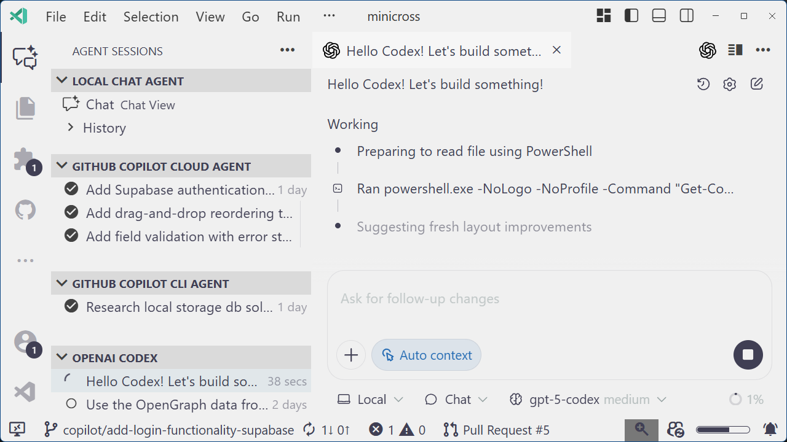

# 统一的编码 Agent 体验

链接：https://code.visualstudio.com/blogs/2025/11/03/unified-agent-experience

## 摘要

随着 Copilot、OpenAI Codex 等多种 Agent 的涌现，VS Code 在 2025 年末推出了“统一 Agent 体验”。其核心组件包括“Agent Sessions”管理视图、专门用于制定技术方案的“Plan Agent”，以及能够实现上下文隔离的“Subagents（子代理）”。通过 `#runSubagent` 工具，开发者可以将复杂任务拆解到独立的子模型中运行，从而避免上下文污染并提高处理精度。

## 一针见血的分析

当 AI 代理的数量呈现爆炸式增长，VS Code 演变为一个 **“Agent 调度编排器（Orchestrator）”**。这一阶段的技术重心从“生成代码”转移到了**“上下文工程（Context Engineering）”**。`#runSubagent` 的引入解决了 LLM 的“长文本疲劳”和“逻辑混淆”问题，通过物理意义上的上下文隔离（Context Isolation），实现了任务的并行化和模块化。同时，“Plan Agent”的设计承认了一个朴素的软件工程真理：**需求不明（Ambiguity）才是 AI 提效的最大障碍**。通过强制性的交互式需求澄清，VS Code 正在构建一种新型的“AI 引导式对话”，确保 AI 在动手之前真正“读懂”了人类意图。

## 深入分析

### 1. 指挥中心：从工具到“任务编排”

随着 2025 年多种 Agent（GitHub Copilot、OpenAI Codex、自定义 Agents 等）的爆发，开发者面临“工具过载”。VS Code 推出的 **Agent Sessions** 视图将编辑器转变为了一个 **Mission Control (指挥中心)**。它`统一`了本地与云端 Agent 的状态监控，允许开发者在不同 Agent 间无缝切换和指派任务。

### 2. 突破性的 Subagents 机制

为了解决 AI 交互中最头疼的 **Context Confusion (上下文混淆)** 问题，VS Code 引入了 `#runSubagent` 工具。这是一种隔离机制：主 Chat 可以派生出一个“子 Agent”去处理特定子任务（如专门研究某个 API 的实现），子 Agent 的琐碎上下文不会污染主对话，仅将最终结果返回。这是对长会话 AI 体验的一次重大工程化改进。

### 3. 解耦与透明：Planning Agent

文章还提到了 **Planning Agent**。它擅长将开发者模糊的原始指令（如 "加个拖拽功能"）拆解为多步计划，并要求开发者确认。这种“先规划、后执行”的模式极大地提高了 AI 生成代码的成功率和可预测性。
