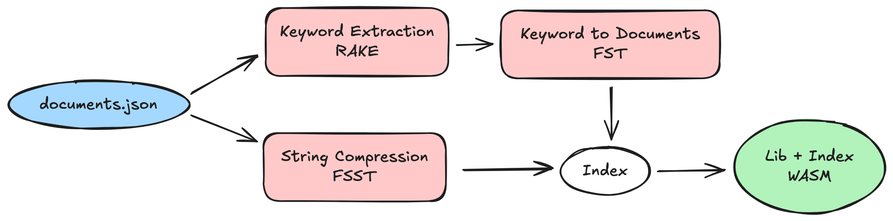

# 构建 docfind：使用 Rust 和 WebAssembly 的高速客户端搜索

链接：https://code.visualstudio.com/blogs/2026/01/15/docfind

## 深入分析

### 1. `纯客户端搜索`的技术极限

可以完全在浏览器中搜索 1e5 级别新闻文章

`docfind` 是一个极致的工程实践案例，旨在解决静态文档网站在大规模内容下的搜索性能问题。它通过以下三大支柱实现了高性能：

- **FST (Finite State Transducers)**：借鉴 `ripgrep` 的底层逻辑，将海量关键词压缩入紧凑的状态机结构，实现亚毫秒级的查询。
  https://burntsushi.net/transducers/ FST 可以将排序后的字符串键存储在一个状态机中
- **RAKE（快速自动关键词提取） 算法**：实现自动化的关键词重要度提取与打分。
- **FSST(快速静态符号表，一种为短字符串优化的压缩算法) 压缩**：针对短字符串片段进行极致压缩，确保索引体积与加载速度。

### 2. WebAssembly 的二进制 Trick

文章揭示了一个非常巧妙的工程方案：如何避免在每次文档更新时重新编译 WASM 模块？
开发者设计了一个**WASM 模板文件**，通过补丁技术在构建时直接修改二机制文件中的 `0xdead_beef` 占位符地址，将新生成的索引数据直接注入。这种“热补丁”思路规避了昂贵的重编译，极大地优化了 CI/CD 流程。

### 3. AI 辅助开发的实战价值

作者作为一名管理人员，在缺乏 Rust 经验和对 WASM 底层格式了解的情况下，利用 GitHub Copilot Agents 成功攻克了借用检查器（Borrow Checker）和 WASM 内存补丁等高难度挑战。这证明了 AI Agent 在跨领域即时学习与复杂工程落地的强大能力。

---

**精简逻辑版讲解：docfind 是怎么做“秒出结果”的站内搜索**

- **问题**：VS Code 文档站原来搜索要跳转传统搜索引擎；目标是像 VS Code `Ctrl+P` 一样“边输边出结果”，且不想引入服务端/运维成本。
- **调研结论**：Algolia/TypeSense 要服务端或运维；Lunr.js 在 ~3MB 文档量下索引约 10MB 太大；Stork 索引仍偏大且维护状态不理想 → 决定自研纯前端方案。
- **核心思路**：把“文档→关键词→相关文档”的检索完全搬到浏览器里，用 **Rust + WebAssembly** 做高性能执行。
- **三件套技术**：
  - **FST（有限状态转导器）**：用紧凑自动机存大量排序关键词，实现快速匹配；
  - **RAKE**：从每篇文档自动提取关键词并打相关性分；
  - **FSST**：把标题/分类/片段等短字符串压缩存储，显示时再按需解压。
- **索引怎么构建**：构建期 CLI 读 `documents.json` → RAKE 提取关键词 → 建 FST（关键词→索引）+ `keyword -> [(doc, score)]` 映射 → 文档字符串 FSST 压缩 → 打包成二进制索引。
- **关键工程技巧**：索引不是单独文件，而是**直接嵌进 WASM 模块**；为了避免“文档一改就重编 WASM”，用“预编译 WASM 模板 + CLI patch 二进制”的方式，把索引作为 data segment 写入，并把 `INDEX_BASE/INDEX_LEN` 两个占位全局变量从 `0xdead_beef` 改成真实地址/长度。
- **查询怎么跑**：用户输入时加载 WASM（代码+索引），用 **前缀匹配 + Levenshtein automaton（容错拼写）** 命中关键词，合并多关键词得分排序，只对命中结果解压必要字符串。
- **效果（文中数据）**：VS Code 网站（~3MB markdown、~3,700 文档分段）索引约 **5.9MB**，Brotli 后约 **2.7MB**；查询约 **0.4ms/次**（M2 MacBook Air）；**只在用户有搜索意图时下载一个 WASM 资源**，无需服务端、无需 API key。

---

### 1. Indexing Phase (CLI) - 索引构建阶段

这是“准备数据”的过程，目的是将杂乱的消息转化为计算机能秒级检索的结构。

- **RAKE (Rapid Automatic Keyword Extraction)**：
  - **通俗解释**：一种自动找“重点”的算法。它不只是找单个字，而是找“短语”。
  - **细节**：比如“Visual Studio Code”，RAKE 会识别这是一个完整的关键词，而不是拆成三个无关单词，这让搜索更符合语感。
- **FST (Finite State Transducers - 有限状态转导器)**：
  - **通俗解释**：一种极度压缩的“字典”。
  - **细节**：它像一棵树，多个单词共享相同的前缀和后缀（比如 `walk` 和 `walking` 共享 `walk` 部分）。它能让数百万个词条只占用极小的内存，且支持极速的模糊匹配。
- **FSST (Fast Static Symbol Table)**：
  - **通俗解释**：专门针对“短文本”的压缩算法。
  - **细节**：普通的 ZIP 压缩在处理短句子（如网页标题）时效率很低。FSST 专门为这种短字符串设计，既能省空间，搜索时解压速度又极快。
- **Postcard**：一种高效的二进制序列化格式（类似轻量版 JSON），让数据以极小的体积存储在磁盘上。

### 2. Embedding Phase (CLI) - 嵌入阶段

这是 `docfind` 最精妙的地方。它不重新编译代码，而是直接对二进制文件做“手术”。

- **WASM Memory & Data Segment**：
  - **细节**：WebAssembly (WASM) 程序像一个紧凑的包裹。开发者先编译好一个“空”的程序模板，然后直接在二进制文件的“数据段”（Data Segment）里挖个坑，把上一步生成的索引填充进去。
- **Global Variable Patching (全局变量补丁)**：
  - **细节**：代码里预留了两个占位符（比如 `INDEX_BASE = 0xdeadbeef`）。在索引填入后，CLI 工具会直接修改二进制文件，把这个地址改为索引的真实起始位置。**这样做的好处是：文档内容更新时，不需要重新编译复杂的 Rust 代码，只要几毫秒的“二进制替换”即可完成发布。**

### 3. Search Phase (WASM) - 搜索阶段

这是在用户浏览器中运行的部分。

- **Levenshtein Automaton (莱文斯坦自动机)**：
  - **通俗解释**：处理“拼写错误”的神器。
  - **细节**：当你搜 `rustt`（多打了一个 t）时，这个数学模型能自动计算出它和 rust 的编辑距离。配合 FST，它能在几毫秒内找回那些拼错但意思相近的结果。
- **Score Accumulation (评分累加)**：
  - **细节**：如果用户搜两个词，系统会分别计算这两个词在文档中的权重（元数据 > 标题 > 正文），最后加总。
- **On-demand Decompression (按需解压)**：
  - **细节**：即使索引里有几千条结果，程序也只会在显示前端列表的那 10 条结果时，才去解压对应的标题和摘要。这极大地减少了浏览器的 CPU 开销。

这种设计让搜索变成了“纯前端”行为，不依赖任何服务器接口，且速度极快。

---

RAKE（Rapid Automatic Keyword Extraction）是一种快速自动关键词提取算法。它的核心理念是：**关键词通常由多个不含停用词（Stop Words）的单词组成。**

### RAKE 算法的核心步骤

1.  **候选短语提取**：
    - 利用标点符号和**停用词**（如 "and"、"the"、"of"）作为分隔符，将文本拆分成短语列表。
    - 例如："Software engineering is a disciplined approach" -> `[Software engineering, disciplined approach]`。
2.  **构建词频 (Frequency) 与度 (Degree) 表**：
    - **频率 $freq(w)$**：单词 $w$ 在所有候选短语中出现的次数。
    - **度 $deg(w)$**：与单词 $w$ 在同一短语中共同出现的单词数量（包括自身）。
3.  **计算得分**：
    - 单词得分：$\text{score}(w) = \frac{deg(w)}{freq(w)}$。
    - _逻辑_：频繁出现在长短语中的词（度高）比零散出现的词（频率高但度低）更重要。
4.  **短语汇总**：
    - 将短语中每个单词的得分相加，得出短语总分，按得分从高到低排序。

### Python 代码实现

这是一个基础的 RAKE 实现示例：

```python
import re
from collections import Counter, defaultdict

def rake_extract(text, stop_words):
    # 1. 使用正则表达式根据停用词和标点拆分短语
    stop_pattern = r'\b(' + '|'.join(map(re.escape, stop_words)) + r')\b'
    # 替换停用词和标点为分隔符 "|"
    text_processed = re.sub(stop_pattern, '|', text.lower())
    text_processed = re.sub(r'[^\w\s|]', '|', text_processed)

    # 提取候选短语
    phrases = [p.strip() for p in text_processed.split('|') if p.strip()]

    # 2. 计算词频 freq 和度 deg
    word_freq = Counter()
    word_deg = Counter()

    for phrase in phrases:
        words = phrase.split()
        word_count = len(words)
        for word in words:
            word_freq[word] += 1
            word_deg[word] += word_count # 该短语中的词数贡献给度

    # 3. 计算单词得分 deg/freq
    word_scores = {word: word_deg[word] / word_freq[word] for word in word_freq}

    # 4. 计算短语总分
    phrase_scores = {}
    for phrase in set(phrases):
        words = phrase.split()
        phrase_scores[phrase] = sum(word_scores[word] for word in words)

    # 排序返回
    return sorted(phrase_scores.items(), key=lambda x: x[1], reverse=True)

# 示例数据
sample_text = "Software engineering is a disciplined approach to the design, development, and maintenance of software."
stop_words_list = ["is", "a", "to", "the", "and", "of"]

keywords = rake_extract(sample_text, stop_words_list)
for kw, score in keywords:
    print(f"Phrase: {kw:<25} | Score: {score:.2f}")
```

### 为什么 `docfind` 选择 RAKE？

- **无需训练**：它不依赖机器学习模型，直接基于统计学，运行极快。
- **多词短语**：相比单字搜索，RAKE 提取的短语（如 "memory management"）更能体现文档核心。
- **性能**：算法复杂度低，非常适合在 CLI 工具中批量处理数千篇文档。

---

### 1. FST (Finite State Transducers - 有限状态转导器)

**核心原理**：FST 是 Trie（前缀树）的进化版。它不仅通过共享**前缀**来压缩空间，还通过共享**后缀**来进一步压缩，形成一个有向无环图（DAG）。“转导”意味着它能将输入映射到输出（如：`key -> ID`）。

**优势**：极高的压缩率，支持快速的模糊匹配和范围查询。

#### Python 示例：构建一个简化的 FST

实现完整的逻辑最小化非常复杂，这里展示其核心逻辑：

```python
class SimpleFST:
    def __init__(self):
        self.transitions = {} # (state, char) -> next_state
        self.outputs = {}     # (state, char) -> value_increment
        self.final_states = {} # state -> final_output_value
        self.next_node = 1

    def build_from_sorted(self, data):
        """简单演示：映射有序字符串列表到其索引"""
        for i, (key, val) in enumerate(data):
            current = 0
            # 实际 FST 会在此处进行节点合并（最小化），此处仅为示意路径
            for char in key:
                if (current, char) not in self.transitions:
                    self.transitions[(current, char)] = self.next_node
                    self.next_node += 1
                current = self.transitions[(current, char)]
            self.final_states[current] = val

    def lookup(self, key):
        current = 0
        for char in key:
            if (current, char) not in self.transitions:
                return None
            current = self.transitions[(current, char)]
        return self.final_states.get(current)

# 示例：将键值对映射到 ID
fst = SimpleFST()
fst.build_from_sorted([("apple", 1), ("apply", 2), ("banana", 3)])
print(f"Lookup 'apple': {fst.lookup('apple')}")
```

### 2. FSST (Fast Static Symbol Table - 快速静态符号表)

**核心原理**：FSST 是一种针对短文本优化的压缩算法。它通过构建一个包含最多 255 个常见符号（长度为 1-8 字节的字符串）的静态表，将这些符号替换为单字节。

**优势**：解压时不需要解压整个块（随机访问友好），速度极快，且在短字符串上优于 LZ4 或 Zstd。

#### Python 示例：FSST 风格的编码逻辑

```python
class SimpleFSST:
    def __init__(self):
        self.symbol_table = [] # 存储常见短语
        self.encoder = {}      # 短语 -> 字节 ID

    def train(self, texts):
        # 实际算法会统计频率并选取最优符号，此处硬编码演示
        common_symbols = ["the ", "ing ", "tion", " and "]
        for i, sym in enumerate(common_symbols):
            self.symbol_table.append(sym)
            self.encoder[sym] = i + 128 # 使用非 ASCII 范围

    def compress(self, text):
        result = []
        i = 0
        while i < len(text):
            match = None
            # 贪婪匹配候选符号
            for sym in sorted(self.symbol_table, key=len, reverse=True):
                if text.startswith(sym, i):
                    match = sym
                    break

            if match:
                result.append(self.encoder[match])
                i += len(match)
            else:
                result.append(ord(text[i])) # 原始字节
                i += 1
        return bytes(result)

fsst = SimpleFSST()
fsst.train([])
compressed = fsst.compress("the distribution and processing")
print(f"Compressed bytes: {list(compressed)}")
```

### 总结

- **FST** 用于**检索**：在千亿级词条中快速定位 key，并获取关联的指针或数值。
- **FSST** 用于**存储**：在检索到结果后，用极低的内存代价和极高的速度还原出标题、摘要等文本信息。
