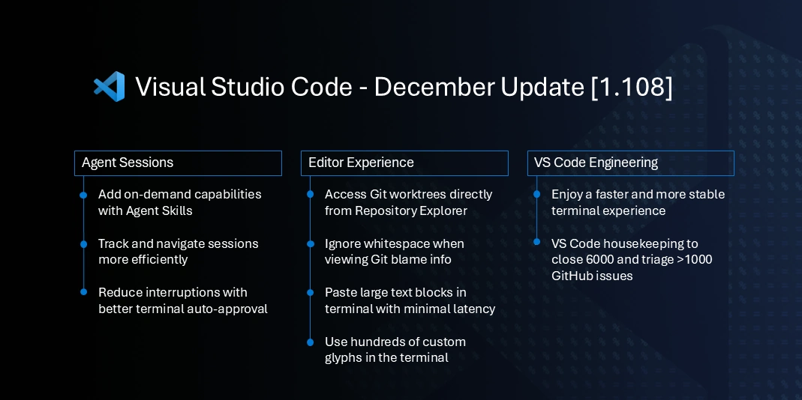
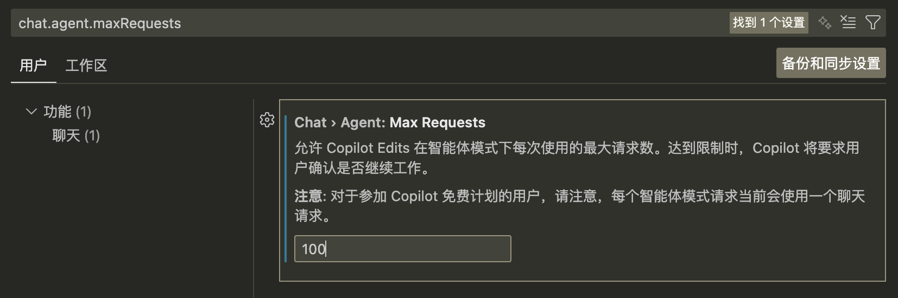
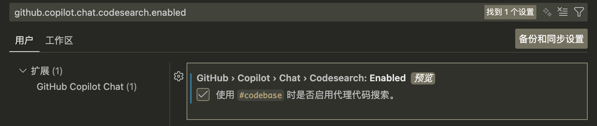
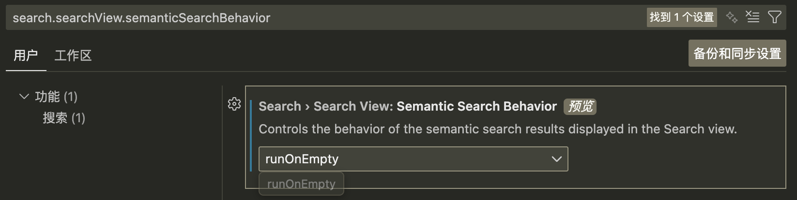
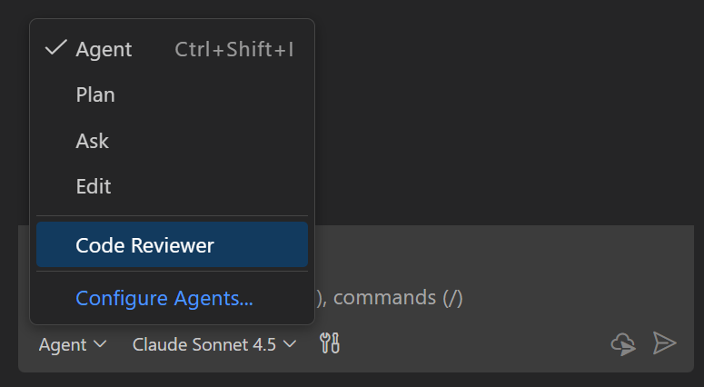
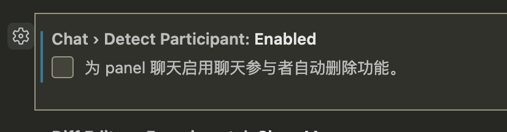
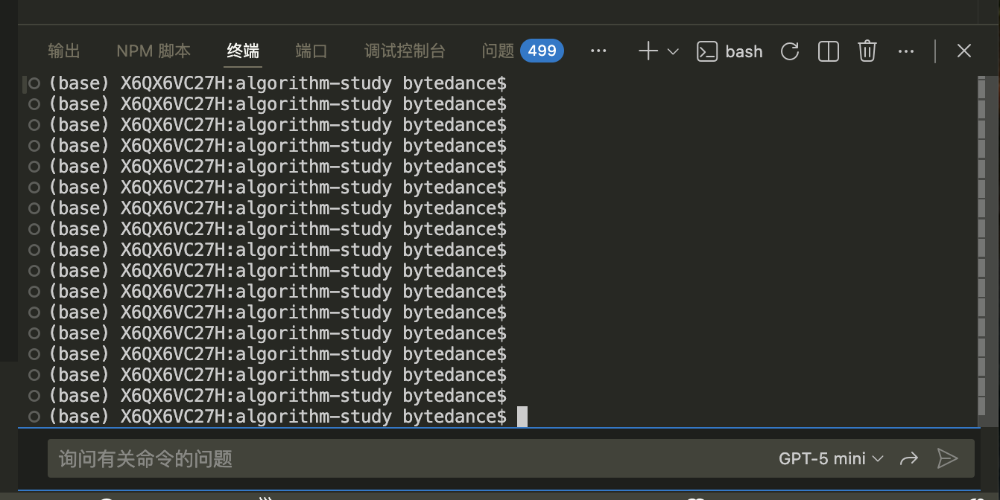

根据 Code 2025 年及 2026 年初的更新说明（版本 v1.100 到 v1.108），这段时间是 VS Code 及其 AI 能力（GitHub Copilot）发生**质变**的关键时期。

核心趋势可以概括为：**从 AI 聊天助手 (Chatbot) 向 AI 代理 (Agents) 的全面进化**，以及 **MCP (Model Context Protocol)** 协议的标准化与普及。

以下是对 VS Code 1.100 到 1.108 版本更新的深入分析与讲解：

---

### 1. 核心战略转变：AI Agent 化与 MCP 生态

这段时间最大的亮点是 AI 不再仅仅是 "聊天窗口里的问答机器"，而是变成了能主动规划、执行任务、甚至跨工具协作的 "代理 (Agent)"。

- **Copilot Chat 开源 (v1.102)**:这是一个里程碑事件。微软将 `vscode-copilot-chat` 扩展开源，极大加速了社区在 AI 交互模式上的创新。
- **Agent HQ 与多代理编排 (v1.107)**: 引入了 "Agent HQ"（代理指挥部），允许用户统一管理本地、后台和云端的多个代理。VS Code 开始支持 **多代理编排**，即使是普通开发者也可以让不同的 AI 专员（如规划代理、编码代理）协同工作。
- **MCP (Model Context Protocol) 的全面落地 (v1.101 - v1.108)**:
  - **v1.102**: MCP 正式在 VS Code 中 **GA (Generally Available)**。这意味任何工具（如数据库、API、本地文件系统）都可以通过 MCP 协议轻松变成 AI 的 "手眼"。
  - **v1.105**: 改进了 MCP 资源的展示，AI 不仅能调用工具，还能更好地理解工具返回的复杂结果（如图像预览）。
  - **v1.107**: 支持最新的 MCP 规范（2025-11-25），引入了 "URL mode elicitation" 和 "Tasks"（长任务支持），让 AI 能处理更耗时的工作。

### 2. 版本亮点深度解析 (v1.100 - v1.108)

#### **v1.100 (2025年4月)** - AI 定制化的开端

- **Prompt Files (提示词文件)**: 这一版本正式强化了 `.prompt.md` 文件的支持，允许开发者用 Markdown 编写可复用的提示词模板。这是 "Prompt Engineering as Code" 的重要一步，团队可以像管理代码一样管理 AI 提示词。
- **安全性**: 禁止在 Stable 版安装 Copilot 预发布版，增强稳定性。对于恶意扩展，提供了更详细的 "Learn More" 链接。

#### **v1.101 (2025年5月)** - Chat UX 与 Python 环境革新

- **Copilot Coding Agent 集成**: 在源代码管理（Source Control）视图中不仅能看代码变更，还能直接分配任务给 AI Agent，并追踪其后台工作状态。
- **Chat UX**: 改进了聊天界面，让用户消息与 AI 回复区分更明显。
- **Python**: **Python Environments** 扩展开始作为可选组件随 Python 核心插件一起推送，改进了 `poetry` 和 `pyenv` 支持，特别是针对 Poetry 2.0.0+ 的终端激活兼容性。

#### **v1.102 (2025年6月)** - 开源与 MCP GA

- **开源里程碑**: **Copilot Chat 插件开源**。
- **MCP GA**: 模型上下文协议正式可用，开发者可以轻松安装和管理 MCP 服务器。
- **终端命令自动批准 (Auto Approval)**: 为 AI 在终端执行命令引入了安全策略，默认允许 `ls`, `cd` 等无害命令，拒绝 `rm`, `kill` 等危险命令。这是 AI 自主行动的关键安全基石。
- **Next Edit Suggestions (NES)**: 默认启用 "下一次编辑建议"，AI 开始预判你的光标去向。

#### **v1.103 (2025年7月)** - 模型升级 (GPT-5)

- **GPT-5 支持**: 更新说明中明确提到 **"Update 1.103.1: The update adds GPT-5 prompt improvements, support for GPT-5 mini"**。这意味着 VS Code 正式接入了新一代基础模型，极大增强了理解和生成能力。
- **Git Worktrees**: 增强了对 Git Worktree 的支持，方便开发者同时检出多个分支进行开发，这对于并行处理多个 AI 任务流非常有帮助。

#### **v1.104 (2025年8月)** - 灵活性与安全性双重提升

- **模型灵活性**: 允许 VS Code 自动选择“最佳模型”，或通过插件贡献新的模型。
- **敏感文件保护**: 引入了“敏感文件编辑确认”机制，防止 AI 意外修改关键配置文件（如 `.env` 或 package.json）。
- **AGENTS.md**: 支持项目级的 `AGENTS.md` 文件，用于向 AI 介绍项目特定的架构和规范上下文（类似于 `.cursorrules` 的概念，但在 VS Code 原生 Agent 体系下）。

#### **v1.105 (2025年9月)** - 规划代理 (Plan Agent) 与 GitHub Universe

- **Plan Agent**: 引入了专门用于“研究和规划”复杂任务的 Agent。在写代码前，AI 可以先做需求分析。
- **Subagents (子代理)**: 引入了子代理概念，进一步细化 AI 分工。
- **OpenAI Codex 集成**: 增强了对 Codex 模型的特定集成。

#### **v1.106 (2025年10月)** - 视觉刷新与终端智能

- **Refreshed Iconography (图标更新)**: 产品图标迎来了一次大更新，风格更加现代圆润。
- **Terminal IntelliSense (终端智能提示)**: 经过一年半的测试，终端智能提示（Shell 补全）默认向稳定版用户推送，不仅支持 PowerShell，还涵盖 bash, zsh, fish。

#### **v1.107 (2025年11月)** - 多代理编排 (Orchestration)

- **Multi-Agent Orchestration**: 正式引入多代理协作。你可以同时指派本地 Agent 和云端 Agent。
- **Agent Skills (技能)**: 开始支持复用 Claude Skills，允许开发者定义 skills 或 `.claude/skills`，让 Agent 像安装插件一样“学会”新能力（如查询特定数据库、操作特定 API）。
- **TypeScript 7.0 Preview**: 开始预览 TypeScript 7.0 支持。

#### **v1.108 (2025年12月)** - 代理技能化与年终大扫除



- **Agent Skills (Experimental)**: 进一步强化 Agent Skills，允许通过 `SKILL.md` 定义能力，AI 可以按需加载这些技能文件夹。
- **Agent Sessions View**: 专门的视图来管理 AI 会话，支持侧边栏对比查看（Side-by-side），方便回顾 AI 的工作历史。
- **Edit Tool 改进**: 针对 GPT-4 和 Claude Sonnet 模型优化了编辑工具的可靠性。
- **年终 Housekeeping**: 清理了近 6000 个 Issue，优化了仓库维护状态。

---

### 3. 总结与展望

从这 9 个版本的更新来看，VS Code 团队的核心逻辑非常清晰：

1.  **基础设施搭建 (v1.100-v1.102)**: 完善 MCP 协议，开源 Chat 插件，制定安全规则（自动批准/敏感文件保护）。
2.  **核心能力突破 (v1.103-v1.104)**: 接入 GPT-5，引入 Prompt Files 和 `AGENTS.md` 上下文机制。
3.  **完全代理化 (v1.105-v1.108)**: 从单一 Chat 转向 **Plan Agent** + **Coding Agent** + **Subagents** 的多代理协同模式，并引入 **Agent Skills** 让 `AI 能力模块化`。

对于开发者而言，VS Code 已经不仅仅是一个编辑器，它正在变成一个 **AI 驱动的集成开发环境 (AIDE)**，你需要开始习惯不仅仅是“写代码”，而是“定义技能”、“编写 Agent 提示词”以及“审查 AI 的规划”。

---

## VS Code 1.100 - 1.108 版本更新深度分析

### 📅 版本概览

| 版本  | 发布日期   | 核心主题                                             |
| ----- | ---------- | ---------------------------------------------------- |
| 1.100 | 2025年4月  | Prompt/指令文件、Agent模式优化、MCP Streamable HTTP  |
| 1.101 | 2025年5月  | Chat工具集、MCP全面支持、自定义Chat模式              |
| 1.102 | 2025年6月  | **Copilot Chat开源**、MCP正式发布(GA)、终端自动批准  |
| 1.103 | 2025年7月  | GPT-5上线、Chat检查点、Git工作树支持、TypeScript 5.9 |
| 1.104 | 2025年8月  | 自动模型选择、AGENTS.md支持、敏感文件确认            |
| 1.105 | 2025年9月  | Plan Agent、子代理(Subagents)、MCP市场(Preview)      |
| 1.106 | 2025年10月 | Agent Sessions视图、Plan Agent、内联建议开源         |
| 1.107 | 2025年11月 | 代理会话集成、Claude技能支持、TypeScript 7预览       |
| 1.108 | 2025年12月 | Agent Skills、终端IntelliSense重构、年度清理         |

---

### 🤖 一、AI与代理功能演进（核心主线）

#### 1. **Agent Mode（代理模式）的成熟化**

**v1.100**: 引入更快的Agent模式编辑，优化编辑应用速度
**v1.105**: 推出**Plan Agent**，帮助分析复杂任务并生成实施计划
**v1.106**: Chat模式重命名为**Custom Agents**，文件位置迁移到 agents
**v1.107**: Agent会话与Chat视图深度集成，支持侧边栏并排显示
**v1.108**: 引入**Agent Skills**，允许教授代理新能力和领域知识

```markdown
# Agent Skills 定义示例 (.github/skills/skill-name/SKILL.md)

---

## description: 描述技能用途

技能的具体指令和资源...
```

#### 2. **模型支持升级**

| 版本   | 新增模型                                    |
| ------ | ------------------------------------------- |
| v1.100 | GPT-4.1 作为基础模型                        |
| v1.103 | **GPT-5**、GPT-5 mini                       |
| v1.104 | **Auto模型选择（预览）** - 自动选择最优模型 |
| v1.106 | GPT-5-Codex，Gemini 2.5 Pro 思维链支持      |
| v1.107 | Anthropic扩展思维、Entra ID认证Azure模型    |

#### 3. **代理会话管理**

**v1.105**: 引入Agent Sessions视图（Insiders）
**v1.106**: Agent Sessions视图默认启用，支持本地和云端会话管理
**v1.107**:

- 会话与Chat视图集成
- 支持一键"Continue in"将任务交给后台/云端代理
- 支持OpenAI Codex、GitHub Copilot CLI集成

**v1.108**:

- 键盘访问支持
- 按状态和年龄分组会话
- 显示关联的PR和修改文件

---

### 🔌 二、MCP（Model Context Protocol）生态

#### 演进路线

```
v1.100: Streamable HTTP支持
    ↓
v1.101: Prompts/Resources/Sampling/Auth全面支持
    ↓
v1.102: MCP正式GA发布，服务器管理视图
    ↓
v1.105: MCP市场（Preview），自动启动服务器
    ↓
v1.106: Elicitation支持增强
    ↓
v1.107: 支持2025-11-25规范，GitHub MCP Server
```

#### 关键特性

- **MCP服务器市场**（v1.105）：在扩展视图中直接浏览安装MCP服务器
- **完全限定工具名**（v1.105）：`github/github-mcp-server/list_issues` 格式避免命名冲突
- **自动启动**（v1.105）：发送聊天消息时自动启动MCP服务器

---

### ✏️ 三、代码编辑体验

#### 1. **内联建议（Inline Suggestions）**

**v1.102**: 引入"Snooze"功能暂停建议
**v1.106**: **内联建议开源**，合并到vscode-copilot-chat仓库
**v1.107**:

- TypeScript重命名建议（Shift+Tab应用）
- 新的NES模型，更智能的编辑建议
- 视口外建议预览

#### 2. **Inline Chat v2**

**v1.106**: 预览版，优化为：

- 单次提示
- 单文件
- 仅代码更改
- 无法处理的任务自动升级到Chat视图

**v1.107**: 继续优化，对齐其他Chat体验

#### 3. **思维链（Chain of Thought）**

**v1.105**: GPT-5-Codex支持显示推理过程
**v1.106**: 更多模型支持，可折叠的工具调用输出
**v1.107**: 进一步优化折叠UI

---

### 🔐 四、安全与信任机制

| 版本   | 安全特性                                   |
| ------ | ------------------------------------------ |
| v1.102 | 终端命令自动批准规则                       |
| v1.104 | 敏感文件编辑确认                           |
| v1.106 | 工具批准与信任管理、树解析器改进命令检测   |
| v1.107 | URL/域名两步批准流程                       |
| v1.108 | 默认自动批准规则（git、rg、npm scripts等） |

```json
// 敏感文件配置示例
{
  "chat.tools.edits.autoApprove": {
    "settings.json": false,
    "package.json": false
  }
}
```

---

### 🖥️ 五、终端与Shell集成

#### Terminal IntelliSense演进

**v1.104**: 预览阶段，各种改进
**v1.106**: **正式发布**，移除Preview标签
**v1.107**: Terminal Suggest推广到Stable
**v1.108**: **默认UX重构**

- 不再自动显示，需 `Ctrl+Space` 触发
- 新增状态栏配置按钮
- 支持macOS/Linux可执行文件提示

#### 其他终端改进

- **v1.107**: 富终端输出在Chat中渲染
- **v1.108**: 性能稳定性大幅提升，curly下划线渲染优化

---

### 📦 六、源代码控制

#### Git工作树支持

**v1.103**: 引入Git工作树支持
**v1.107**: 实验性Stashes在仓库视图
**v1.108**: 实验性工作树在仓库视图

#### AI辅助功能

**v1.105**: **AI解决合并冲突**
**v1.108**: Git blame增强设置（忽略空白、禁用悬停）

---

### 🔧 七、开发者体验改进

#### TypeScript支持

| 版本   | 更新                                   |
| ------ | -------------------------------------- |
| v1.103 | TypeScript 5.9，可展开悬停             |
| v1.107 | **TypeScript 7.0预览**（原生代码重写） |

#### Python增强

- **v1.104**: Python Environments扩展改进、Pipenv支持
- **v1.104**: 运行代码片段工具（内存执行）
- **v1.106**: Poetry路径设置、dev-requirements.txt检测

---

### 🏢 八、企业功能

**v1.104**: 隐藏/禁用GitHub Copilot AI功能
**v1.106**: Linux策略支持（JSON文件管理）
**v1.107**:

- 策略禁用代理使用
- Codespaces支持GitHub Enterprise策略

---

### 🌟 九、里程碑事件

#### 1. **Copilot Chat开源**（v1.102）

GitHub Copilot Chat正式开源，代码位于vscode-copilot-chat仓库

#### 2. **内联建议开源**（v1.106）

合并到vscode-copilot-chat，GitHub Copilot扩展计划2026年初废弃

#### 3. **扩展统一**（v1.107）

GitHub Copilot扩展默认禁用，所有功能由Chat扩展提供

#### 4. **年度清理**（v1.108）

- 关闭5,951个issues
- 分类1,203个issues
- 核心仓库关闭2,872个issues

---

### 🔮 十、发展趋势总结

1. **代理化发展**：从简单的Chat演进为完整的Agent生态，支持Plan、Skills、子代理
2. **开源化进程**：Copilot核心功能逐步开源，提升透明度
3. **MCP标准化**：MCP成为工具扩展的标准协议
4. **模型多样化**：支持多种模型，自动选择最优
5. **安全优先**：完善的信任和批准机制
6. **性能优化**：TypeScript 7原生重写，终端性能提升

这9个版本（1.100-1.108）标志着VS Code从传统代码编辑器向**AI原生开发环境**的重大转型，代理模式和MCP生态的成熟使其成为AI辅助开发的核心平台。

---

1.  终端与聊天合体
    这个功能彻底解决了频繁切换的痛点。
    所有的命令、代码、AI 的回答和日志输出，都按时间线清晰地排列在同一个地方。
2.  AI Agent Skills
3.  聊天会话(chat session)不再自动加载，每个会话都有清晰标题
4.  终端命令自动批准机制
5.  #agent 可以发送给另一个agent执行
6.  一次会话默认最多请求25次模型，超出则需要确认是否继续
    
7.  codebase search
    
8.  语义搜索
    
9.  Custom instructions 自定义指令
    添加贯穿所有对话的持久指令来指导聊天行为，例如编码标准、首选框架或架构指南
    https://code.visualstudio.com/docs/copilot/getting-started#_create-custom-instructions

    ```md
    <!-- copilot-instructions.md -->

    # Project general coding guidelines

    ## Code Style

    - Use semantic HTML5 elements (header, main, section, article, etc.)
    - Prefer modern JavaScript (ES6+) features like const/let, arrow functions, and template literals

    ## Naming Conventions

    - Use PascalCase for component names, interfaces, and type aliases
    - Use camelCase for variables, functions, and methods
    - Prefix private class members with underscore (\_)
    - Use ALL_CAPS for constants

    ## Code Quality

    - Use meaningful variable and function names that clearly describe their purpose
    - Include helpful comments for complex logic
    - Add error handling for user inputs and API calls
    ```

10. 自定义 agent
    https://code.visualstudio.com/docs/copilot/getting-started#_create-a-custom-agent-for-code-reviews
    
11. ChatView、InlineChat、QuickChat
12. The plan agent generates a detailed plan outlining the steps needed and ask clarifying questions to ensure a comprehensive understanding of the task. You can then handoff the plan to an implementation agent or use it as a guide.
13. 编写有效的提示词
    - 使用 # 提及添加上下文：引用特定文件（ #file ）、你的代码库（ #codebase ）或终端输出（ #terminalSelection ）。
14. 将聊天会话导出为 JSON 文件(Export Chat)
15. /savePrompt 将聊天会话保存为可重用的提示
16. chat.customAgentInSubagent.enabled 子代理继承主聊天会话中的代理
17. 如果内容过大无法适应上下文窗口，将包含文件的大纲，其中包括函数及其描述但不包括实现。如果大纲也过大，则该文件将不会成为提示的一部分。
18. #fetch、#githubRepo
19. checkPoints 便于还原更改
    chat.checkpoints.showFileChanges

    当启用检查点时，VS Code 会在聊天交互的关键时刻自动创建文件快照
    检查点是为了在聊天会话中快速迭代而设计的，它们是临时的。它们补充 Git 但不能替代它。使用 Git 进行永久版本控制和协作。检查点非常适合在活跃的聊天会话中进行实验。

20. 编辑之前的聊天请求
    对话历史记录中的每个聊天请求都是可编辑的。编辑之前的聊天请求时，编辑后的请求会作为新请求发送到语言模型，原始请求和后续请求所做的任何文件更改都会被还原。
21. VS Code 支持三种类型的工具：内置工具、模型上下文协议（MCP）工具和扩展工具。
22. #changes
23. 存档会话
    为了保持会话列表的有序，你可以存档(隐藏)已完成或不活跃的会话。存档会话不会删除它，而是将其从活跃会话列表中移出。你随时可以取消存档会话以将其恢复到活跃会话列表中。
24. Start Implementation > Continue in Background
    后台代理创建一个 Git worktree，在其中开始实现该功能。
25. 本地代理、后台代理、云代理、第三方代理
    
26. 內联建议：Ghost text suggestions、Next edit suggestions
    GitHub Copilot: Change Completions Model 使用的模型
    在使用 Copilot 时，在 VS Code 中打开相关文件有助于设置这个上下文，让 Copilot 能够更全面地了解您的项目
27. Smart Actions
28. 实现待办事项注释
29. 为 Markdown 中的图像生成替代文本
30. 语义搜索
31. 输入 /<prompt name> 来运行名为 <prompt name>.prompt.md 的提示文件
32. VS Code 内置工具好用的：`# changes`、`#codebase`、`#runSubagent`
33. Workspace Context（工作区上下文）
    基于您提供的官方文档和链接，深入分析 VS Code Copilot 工作区上下文（Workspace Context）的实现原理如下。

    这一机制的核心在于**如何让 AI 超越“当前打开的文件”，获得对整个项目的“上帝视角”**。VS Code 采用了一种混合架构（Hybrid Architecture），结合了**远程预构建索引**与**本地实时感知**，以平衡性能与准确性。

    ### 1. 核心架构：多层级索引系统 (The Indexing Architecture)

    VS Code 不会每次都在本地暴力扫描所有文件，而是根据项目规模和托管平台，自动选择最优的索引策略。这是一种**分级降级（Tiered Fallback）**的设计：

    #### A. 远程索引 (Remote Index) - _首选策略_
    - **适用场景**：托管在 GitHub.com 或 Azure DevOps 的仓库。
    - **工作原理**：
      - **服务端预计算**：索引构建发生在云端（GitHub/Microsoft 服务器）。 Copilot 可以在你提问之前就已经“读”过了你的代码库。
      - **基于提交（Commit-based）**：远程索引反映的是仓库中已提交代码的状态。
      - **优势**：极快，不消耗本地 CPU/内存，支持超大规模代码库。

    #### B. 本地语义索引 (Local Semantic Index)
    - **适用场景**：非 GitHub/Azure 仓库，且文件数 < 2500 的中小型项目。
    - **工作原理**：
      - 在本地机器上运行嵌入模型（Embedding Model）。
      - 将代码片段转换为向量（Vectors）存储在本地。
      - **优势**：支持语义搜索（如搜索“鉴权逻辑”能找到 `auth.ts`，即使没有 key match），比纯文本搜索更懂代码意图。

    #### C. 本地基础索引 (Basic Index) - _保底策略_
    - **适用场景**：非 GitHub/Azure 仓库，且文件数 > 2500 的大型项目。
    - **工作原理**：
      - 退化为传统的文本搜索（类似 `grep` 或 VS Code 的全局搜索）。
      - **劣势**：对语义理解较弱，主要依赖关键词匹配。

    ***

    ### 2. 关键实现机制：混合状态同步 (Hybrid State Sync)

    这是实现原理中最精妙的部分。因为远程索引只知道“过去”（已 push 的 commit），而你正在写代码（包括未提交的更改）。
    - **原理**：`Context = Remote Index (基准)` + `Local Changes (增量)`
    - **流程**：
      1.  Copilot 首先从远程索引获取代码库的基准知识。
      2.  VS Code 本地客户端会实时跟踪**自上次 commit 以来的文件变化**。
      3.  对于未提交的修改（Dirty Files）或当前编辑器中的内容，直接从内存/本地读取。
      4.  查询时，系统会合并这两部分信息，确保 AI 既知道整体架构，又知道你刚才改了什么。

    ***

    ### 3. 搜索与构建上下文的策略 (Search Strategy)

    当你在 Chat 中提问时，VS Code 并非把这堆索引直接丢给模型，而是经过了一个复杂的**检索增强生成（RAG）**流程：
    1.  **意图识别 (Intent Detection)**：
        - 判断你的问题是否需要全库上下文（例如问“如何排序”可能不需要，但问“项目中怎么处理日期格式化”就需要）。
    2.  **多路召回 (Multi-stage Retrieval)**：
        - 并行运行多种搜索策略：
          - **GitHub Code Search**（利用语法树和引用图）。
          - **Local Semantic Search**（向量相似度）。
          - **Text Search**（关键词匹配）。
          - **IntelliSense**（利用语言服务获取函数签名、定义跳转）。
    3.  **重排序与剪枝 (Reranking & Pruning)**：
        - 召回的内容通常远超 Context Window（上下文窗口）限制。
        - 系统会根据相关性对片段进行评分，只保留最相关的部分传给 LLM。

    ***

    ### 4. 索引内容范围 (Content Boundary)

    了解“什么**不**被包含”对于开发者同样重要：
    - **包含 (Whitelisting)**：
      - 所有文本文件（代码、Markdown 文档、配置）。
      - 目录结构（文件夹树状图）。
      - 代码符号（Symbols：类名、函数名）。
      - 当前选中的文本。
    - **排除 (Blacklisting)**：
      - .gitignore 中的文件（除非你显式打开了它或选中了其中的文本，此时规则会被绕过）。
      - 二进制文件（图片、PDF）。
      - VS Code 配置 `files.exclude` 排除的文件。
      - 临时文件（`.tmp`, `.out`）。

    ### 5. 总结

    VS Code 的工作区上下文实现是一个**端云协同**的系统。它尽可能利用云端的算力（Remote Index）来处理繁重的全库理解任务，同时利用本地客户端的能力（Local Tracking）来捕捉毫秒级的代码变更，最后通过多路搜索算法（RAG）将最精准的代码片段喂给模型。

34. 建议在您的聊天提示中使用 #codebase ，因为它提供了更多的灵活性。
    #codebase 是一个聊天工具，@workspace 是一个聊天参与者
    使用聊天参与者时，语言模型无法执行任何其他处理或调用其他工具。一个聊天提示词只能包含一个聊天参与者。
35. 不要开启自动识别参与者
    
36. ctrl+I 內联聊天
    
37. 查看模型命令 `Chat: Manage Language Models`
    
