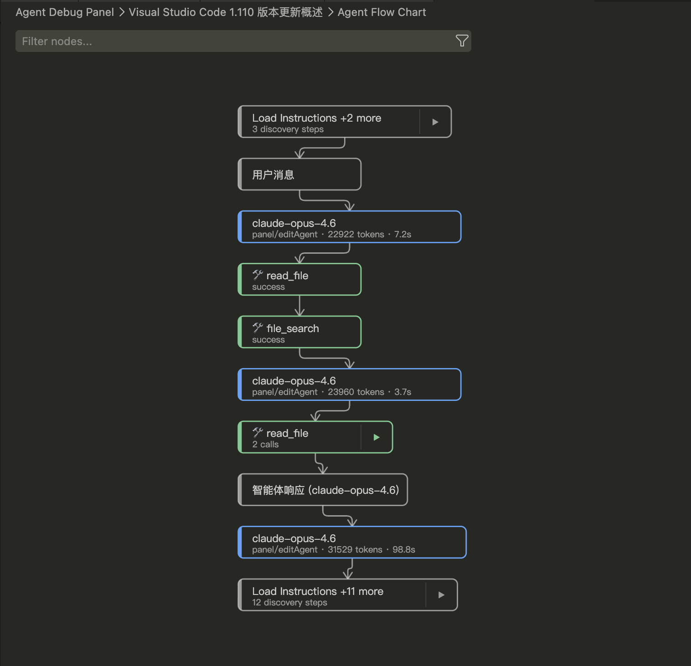
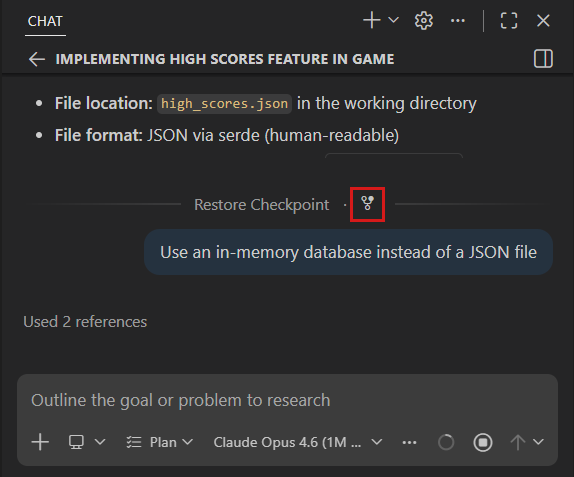
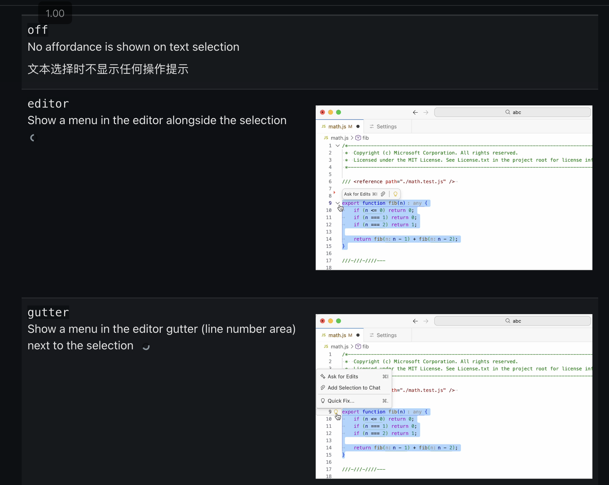

## VS Code v1.110（2026 年 2 月） 深入分析：Agent 实用化的关键一步

**发布日期**: 2026 年 3 月 4 日

### 版本定位

如果说 v1.100~v1.108 是 **从聊天机器人向 AI Agent 的转型期**，那么 v1.110 的主题就是 **让 Agent 真正可用于长时间、复杂任务**。这一版不再追求堆砌新功能，而是解决实际使用 Agent 时的"最后一公里"问题——可观测性、记忆持久化、会话管理、浏览器自动化，以及插件生态的标准化封装。

---

### 1. Agent 控制面板：从黑盒到透明

#### Agent Debug Panel（预览）

这是本版最有工程价值的改进之一。此前，Agent 模式下 hooks、skills、custom agents 多种定制叠加，用户很难知道"我发了一条消息，背后到底发生了什么"。

Agent Debug Panel 提供了：

- **实时事件流**：系统 prompt 组装、tool 调用链、hooks 触发时序全部可视
- **图表视图**：以层级流程图展示事件的父子关系和执行顺序
- **定制加载审查**：能看到当前会话加载了哪些 prompt files、skills、hooks

**实际意义**：这等于给 Agent 系统配了一套 DevTools。对于企业团队来说，调试自定义 Agent 配置（为什么某个 skill 没生效？为什么 hook 没触发？）的成本大幅降低。入口是 `Developer: Open Agent Debug Panel` 或 Chat 视图齿轮图标 → View Agent Logs。



#### Background Agents 增强

后台代理（Copilot CLI 驱动的异步任务）现在支持：

- **手动 `/compact`**：对话过长时可主动压缩上下文
- **Slash commands 全量可用**：prompt files、hooks、skills 等定制在后台会话中同样生效
- **重命名会话**：多任务并行时不再混淆

#### Claude Agents 完善

上月引入的 Claude Agent 本月拿到了关键补齐：

- **Steering & Queuing**：可以在对话中途发消息改变 Agent 方向或排队新请求，不必等当前任务完成
- **`getDiagnostics` 工具**：Claude Agent 现在能读取编辑器和工作区的诊断信息（编译错误、lint 问题），这是真正参与"修 bug"工作流的前提
- **显著性能优化**

#### `/autoApprove` 与 `/yolo`

直接在聊天输入框通过 slash 命令开关全局自动批准，省去了翻设置的步骤。`/yolo` 是别名——命名直白地传达了风险：**跳过所有确认，Agent 可以不经你同意执行任何操作**。配合终端沙箱使用是强烈建议的。

---

### 2. Agent 可扩展性：插件化 + 浏览器自动化

#### Agent Plugins（实验性）—— Agent 生态的"应用商店"

这是本版最具战略意义的特性。

此前，要给 Agent 增加能力，你需要分别配置 skills、MCP servers、hooks、custom agents，散落在不同文件和设置里。**Agent Plugins 将这些统一打包成一个可安装的实体**，从 Extensions 视图直接搜索安装。

```
Agent Plugin = Skills + Commands + Agents + MCP Servers + Hooks
```

关键设计决策：

- **默认市场源**：`copilot-plugins` 和 `awesome-copilot` 两个 GitHub 仓库
- **兼容 Claude 生态**：`chat.plugins.marketplaces` 支持 Anthropic 的 Claude 风格市场
- **本地开发支持**：`chat.plugins.paths` 可注册本地目录

**分析**：这标志着 VS Code Agent 生态开始从"手工配置"走向"包管理"，类似于 npm 之于 Node.js。一旦社区插件丰富起来，Agent 的能力边界将由生态决定而非 VS Code 团队。

#### Agentic Browser Tools（实验性）—— Agent 闭环验证

这是让人兴奋的功能。Agent 不仅能写代码，现在能**自己打开浏览器验证结果**。

提供的工具集：

| 类别 | 工具                                                                        |
| ---- | --------------------------------------------------------------------------- |
| 导航 | `openBrowserPage`, `navigatePage`                                           |
| 读取 | `readPage`, `screenshotPage`                                                |
| 交互 | `clickElement`, `hoverElement`, `dragElement`, `typeInPage`, `handleDialog` |
| 高级 | `runPlaywrightCode`                                                         |

关键安全设计：

- Agent 打开的页面默认运行在**私有内存会话**中，与用户浏览数据隔离
- 用户可以**显式共享**特定页面给 Agent，授予临时访问

**实际意义**：实现了 **"编写 → 运行 → 验证 → 修复"** 的全自动闭环。例如 Agent 可以改 CSS → 截图验证 → 发现布局问题 → 再改 → 再验证，整个过程无需人工介入。`runPlaywrightCode` 开放了 Playwright 级别的自动化能力，几乎可以模拟任何浏览器操作。

#### `/create-*` 系列命令 —— 从对话中提炼 Agent 定制

```
/create-prompt      → 可复用提示词
/create-instruction → 项目约定
/create-skill       → 多步骤工作流
/create-agent       → 自定义 Agent 人设
/create-hook        → 生命周期钩子
```

这些命令解决了一个实际痛点：你在调试过程中摸索出了一套有效流程，但之前只能手动整理文档。现在可以直接说 "save this workflow as a skill"，Agent 自动提取并保存。

#### Usages 与 Rename 工具

Agent 获得了 LSP 级别的代码导航工具——查找引用和重命名。这比 grep 精确得多（grep 无法区分同名变量），但 release notes 也坦承 **Agent 偏好用 grep**，建议通过 `#rename` 精确引导。这反映了当前 LLM 在工具选择上的一个普遍问题：倾向于使用"万能但不精确"的工具。

---

### 3. 更聪明的会话管理

#### Session Memory for Plans

Plan Agent 生成的计划现在**持久化到会话内存**，跨对话轮次保留。这解决了长对话中的核心问题：

之前：context window 满了 → 计划丢失 → Agent 重新规划  
现在：context window 满了 → 被 compact → 但计划在 memory 中存活 → Agent 继续执行

#### Context Compaction（上下文压缩）

当对话积累到 context window 极限时：

- **自动压缩**：VS Code 自动将旧对话总结为摘要释放空间
- **手动压缩**：`/compact` 命令，可附加指令如 `/compact focus on the database schema decisions`
- **适用范围**：本地、后台、Claude Agent 会话均支持

**技术本质**：这是对 LLM 有限 context window 的工程化适配。通过 summarization 实现了类似"虚拟内存"的效果——总容量不变，但可用空间通过压缩回收。

#### Explore 子代理

Plan Agent 现在将代码库研究委托给专门的 **Explore 子代理**：

- **只读**：只能搜索和读文件，不能修改
- **快速模型**：默认使用 Claude Haiku 4.5 / Gemini 3 Flash 等轻量模型
- **并行化**：专注于快速、并行的代码库探索

这是 **分治思想** 在 Agent 架构中的体现：用便宜快速的模型做信息收集，用强力模型做决策规划。

#### Fork a Chat Session

`/fork` 或在任意消息处 "Fork Conversation"，创建继承历史但独立发展的分支会话。这类似 Git 的 branch 概念应用到对话上——探索不同方案时不必破坏原始上下文。


---

### 4. 编辑器体验革新

#### Inline chat affordance



#### Edit Mode 正式废弃

> Edit Mode is officially deprecated as of VS Code version 1.110.

Agent Mode 现在**完全覆盖**了 Edit Mode 的能力。Ask Mode 也被重写为自定义 Agent 定义，使其成为完整的 agentic 体验。这意味着：

- 用户不再需要在 Ask / Edit / Agent 三个模式间选择
- 如果你喜欢 Edit Mode 的行为，可以**自定义一个等价的 Agent**
- Edit Mode 将在 v1.125 彻底移除

**这是大胆但合理的决策**——三个模式的认知负担一直是用户的痛点，统一为 Agent + Ask 更清晰。

#### Modal Editors（实验性）

Settings、Keyboard Shortcuts 等"打开后快速看一眼就关"的编辑器，现在可以以**浮动模态窗口**呈现，按 Escape 关闭。不再占据编辑器 Tab 位置，减少上下文切换的干扰。

`"workbench.editor.useModal": "some"`

#### 通知位置可配置

`workbench.notifications.position` 支持 `top-right`、`bottom-right`、`bottom-left`。解决了 Chat 面板在右侧时通知遮挡的实际问题。

---

### 5. 终端与语言支持

#### Kitty Graphics Protocol

VS Code 终端现在支持 Kitty 图像协议，可以**直接在终端内渲染高保真图像**。支持 PNG、24-bit RGB、32-bit RGBA，以及 zlib 压缩传输、z-index 层叠、裁剪、缩放等高级特性。

这对于 CLI 工具（如 `kitten icat`）、数据可视化、TUI 应用开发很有价值。

#### Ghostty 外部终端支持

Ghostty（由 Mitchell Hashimoto 开发的新终端）现在可以作为 VS Code 的外部终端。

#### Terminal Sandboxing 改进

macOS 上**无需安装额外依赖**即可启用终端沙箱，增强了 Agent 执行命令时的安全边界。支持"受信任域名"白名单网络隔离。

#### 统一的 JS/TS 设置

为迎接 TypeScript 6.0/7.0，所有 `javascript.*` 和 `typescript.*` 设置统一到 `js/ts.*` 命名空间。这是一个**破坏性但必要的改动**——之前的双重设置是历史包袱，现在通过 language-specific settings 可以精确控制。

```json
// 旧方式：两个设置
"javascript.format.enable": false,
"typescript.format.enable": true

// 新方式：统一设置 + 语言覆盖
"[javascript][javascriptreact]": { "js/ts.format.enabled": false },
"[typescript][typescriptreact]": { "js/ts.format.enabled": true }
```

#### Python Environments 全面推送

经过一年预览，Python Environments 扩展正式面向所有用户。统一管理 venv、conda、pyenv、poetry、pipenv，支持 uv 加速，settings.json 可跨机器移植。

---

### 6. 无障碍 (Accessibility)

本版对无障碍的投入非常显著：

- **思维链内容切换**：屏幕阅读器用户可以选择是否包含 AI 的推理过程
- **问题轮播无障碍化**：位置播报、Alt+N/P 导航
- **⇧⌘T 快速聚焦 TODO 列表**
- **光标位置记忆**：关闭再打开 accessible view 时保持阅读位置
- **查找/筛选的 Alt+F1 帮助**：所有查找对话框支持无障碍帮助

---

### 7. 工程实践

#### TypeScript-Go (tsgo) 采用

VS Code 仓库自身已默认使用 **TypeScript-Go** 进行开发：

- 内置扩展的编译和类型检查**每个不到 1 秒**
- 这既是性能提升，也是 tsgo 的 dogfooding

#### esbuild 迁移

大部分内置扩展从 webpack 迁移到 esbuild，简化并加速构建流程。

---

### 8. 总结与趋势

| 维度           | v1.108 (2025.12)      | v1.110 (2026.02)                        |
| -------------- | --------------------- | --------------------------------------- |
| Agent 定制     | Skills/Hooks 分散配置 | **Plugin 统一打包安装**                 |
| Agent 可观测性 | 有限日志              | **Agent Debug Panel 实时事件流**        |
| Agent 验证     | 需人工确认结果        | **浏览器自动化闭环验证**                |
| 会话记忆       | 无持久化              | **Session Memory + Context Compaction** |
| 代码导航       | grep 为主             | **LSP-based Usages + Rename**           |
| 模式选择       | Ask/Edit/Agent 三选一 | **Edit 废弃，Agent 统一**               |
| 会话管理       | 线性对话              | **Fork 分支对话**                       |

**核心趋势**：VS Code 正在构建一个完整的 **"Agent Operating System"**——有包管理（Plugins）、有调试器（Debug Panel）、有内存管理（Session Memory + Compaction）、有进程隔离（子代理）、有 I/O 系统（Browser Tools + Terminal Sandboxing）。Agent 不再是附加功能，而是 VS Code 的核心运行时。
