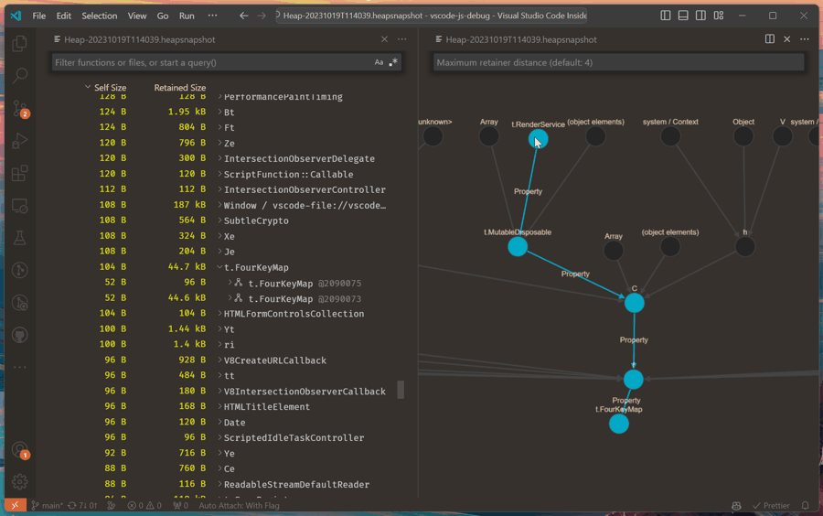

1. Floating editor windows - Drag and drop editors onto your desktop.
   浮动编辑器窗口 - 将编辑器拖放到桌面上。

2. JavaScript Debugger JavaScript 调试器
   Visualize heap snapshots 可视化堆快照
   
   保存为 .heapsnapshot 的 V8 堆快照现在可以在 VS Code 中可视化。既有传统的表格视图，也有给定内存对象的 retainer 的图形表示。
3. ts 5.3
   通过跳过 JSDoc 解析进行优化
