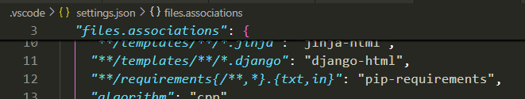
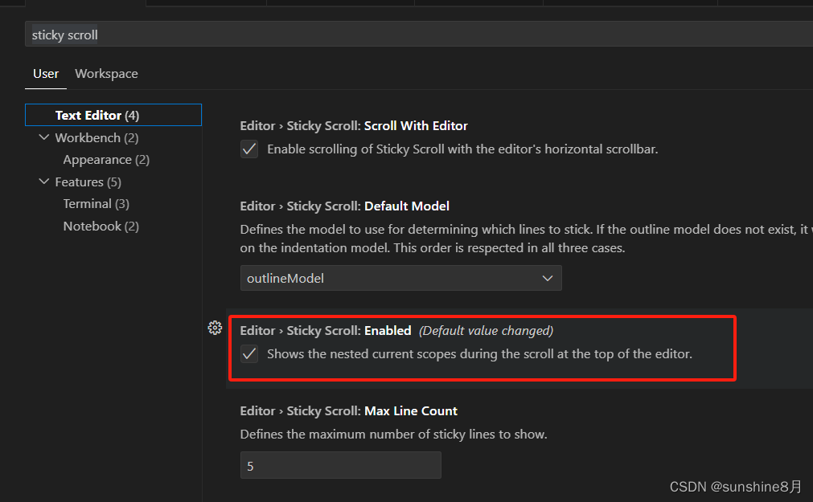

1. 吸顶 feature(Sticky)：在编辑器中，当滚动到顶部时，标题栏会固定在顶部，以便快速访问标题栏中的功能。
   
   

   ```json
   // 控制左侧滚动是否吸顶
   "workbench.tree.enableStickyScroll": false
   // 控制编辑器滚动是否吸顶
   "editor.stickyScroll.enabled": false
   ```
