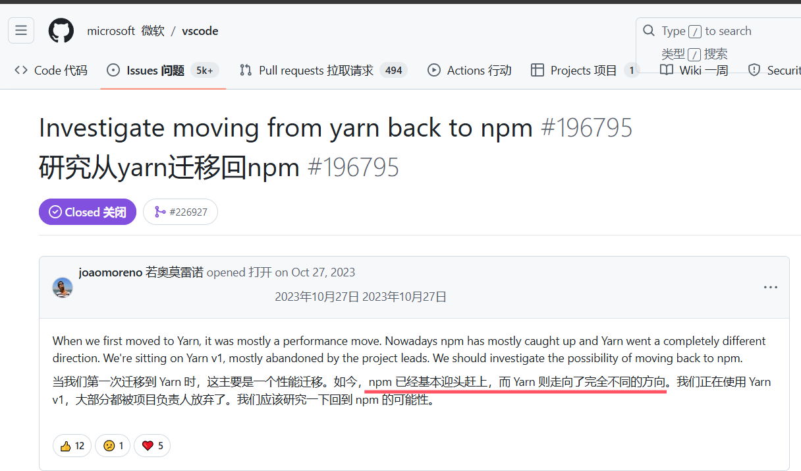

vscode 从 1.94 后的更新倾向是，`打造 copilot 插件市场`

1. 焕然一新的 copilot 体验
   - 拖动文件添加 context
   - @ 调用内置、插件命令
2. 拖放操作在新的编辑器组中打开文件，或者在拖放之前按住Shift将其插入文本编辑器中
3. **Find in Explorer 在资源管理器中查找**
   https://code.visualstudio.com/updates/v1_94#_find-in-explorer
4. 使用 NPM 作为默认包管理器
   microsoft/vscode 项目包管理工具从 YARN 切到 NPM了
   https://github.com/microsoft/vscode/issues/196795
   
   - Performance: we initially moved to yarn because of performance reasons and npm can now also meet our requirements
     性能：由于性能原因，我们最初转向了yarn，npm现在也可以满足我们的要求
   - Security: we make our supply chain more secure by limiting exposure and reducing the number of tools we depend upon
     安全性：我们通过限制风险和减少我们依赖的工具数量来使我们的供应链更加安全
