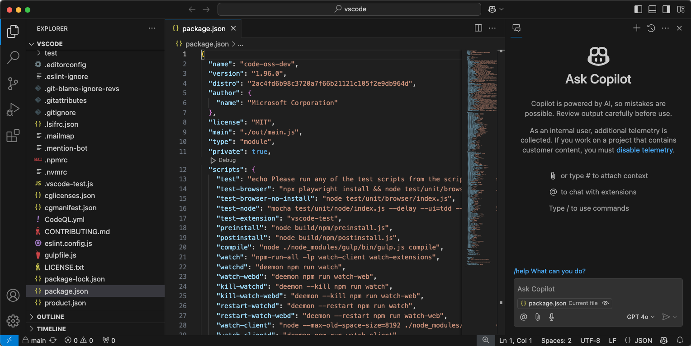
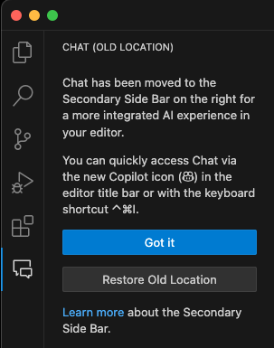
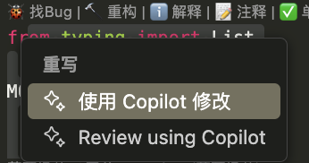
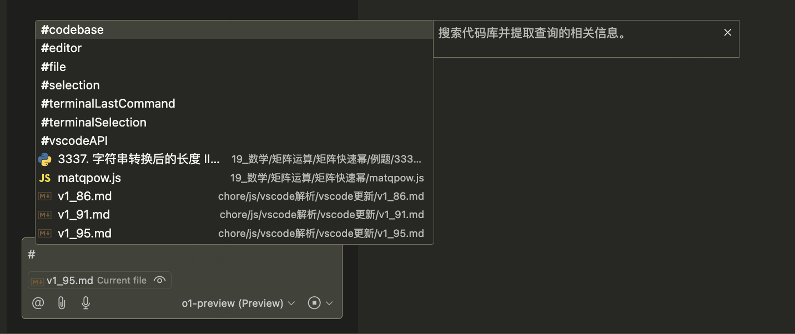

2024.10

1. Copilot Chat in `Secondary Side Bar`
   
   

   隐藏：

   ```
   chat.commandCenter.enabled: false
   ```

2. copilot 支持 code review 了
   
   https://docs.github.com/en/copilot/using-github-copilot/code-review/using-copilot-code-review

3. copilot 添加上下文
   - 通过 #{file}
     
   - 直接拖拽文件到 chat
4. 使用技巧：@workspace
5. vscode-mermAId 插件
   vscode 画图
   - @mermaid
   - /iterate
6. Data Analysis for Copilot 插件

   - @data 进行数据分析

7. TypeScript 5.7
