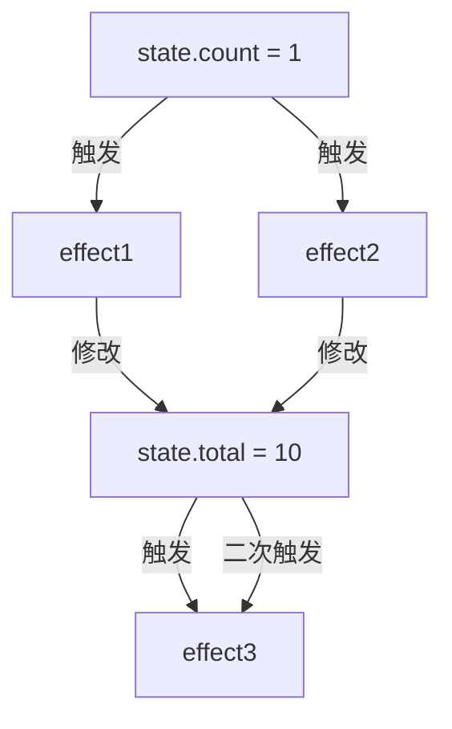
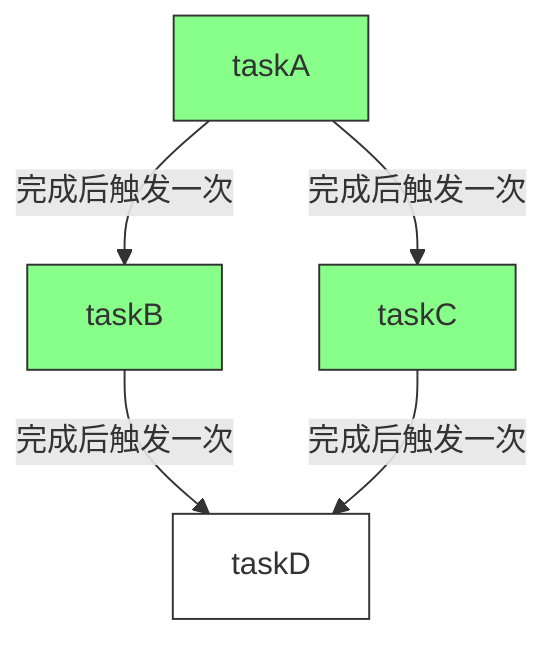

# dag与响应式相比，响应式是否有重复触发的问题

你提出了一个非常深刻的问题。确实，响应式系统相比DAG在重复触发方面存在明显的挑战：

## 响应式系统容易出现的重复触发场景



如果任务不是幂等的，多次触发会有问题。

### 1. 多路径更新

```javascript
const state = reactive({
  count: 0,
  total: 0
})

// effect1和effect2都会在state.count改变时触发
// 两者都会修改state.total
watchEffect(() => {
  console.log('Effect 1')
  // 读取count
  const count = state.count
  // 修改total
  state.total = count * 10
})

watchEffect(() => {
  console.log('Effect 2')
  // 同样读取count
  const count = state.count
  // 也修改total
  state.total = count + 100
})

// 当state.total变化时触发
watchEffect(() => {
  console.log('Effect 3: total =', state.total)
})

// 修改一次，连锁反应引发多次更新
state.count++ // 导致effect3可能执行两次
```

### 2. 自更新循环

```javascript
watchEffect(() => {
  // 读取属性建立依赖
  console.log(state.count)
  // 同时修改，导致再次触发自身
  // Vue中会阻止这种循环，但原始实现容易忽视
  state.count++
})
```

### 3. 高频批量更新

```javascript
// 不同的数据修改触发相同的更新
for (let i = 0; i < 100; i++) {
  state.items[i] = newValues[i] // 每次修改都可能触发相同的effect
}
```

## DAG天然避免重复触发



DAG通过状态管理避免重复触发：

```javascript
const tasks = {
  taskA: {
    state: 'COMPLETED', // 任务状态清晰
    deps: [],
    run: () => {...}
  },
  taskB: {
    state: 'COMPLETED',
    deps: ['taskA'], // 明确依赖关系
    run: () => {...}
  },
  taskD: {
    state: 'PENDING',
    deps: ['taskB', 'taskC'],
    // 即使B和C都完成触发D
    // D也只会执行一次
    run: () => {...}
  }
};
```

## Vue响应式系统如何解决重复触发

Vue等成熟框架通过多种机制缓解这个问题：

1. **批量更新机制**：

```javascript
// Vue内部实现（简化版）
const queue = new Set() // 使用Set自动去重
let isFlushing = false

function queueJob(job) {
  queue.add(job) // effect加入队列

  if (!isFlushing) {
    isFlushing = true
    Promise.resolve().then(() => {
      try {
        queue.forEach(job => job())
      } finally {
        isFlushing = false
        queue.clear()
      }
    })
  }
}

// 修改trigger实现
function trigger(target, key) {
  const deps = getDeps(target, key)
  const effects = new Set()

  deps.forEach(dep => {
    dep.forEach(effect => {
      if (effect !== activeEffect) {
        // 避免自触发
        effects.add(effect)
      }
    })
  })

  effects.forEach(effect => {
    if (effect.scheduler) {
      effect.scheduler()
    } else {
      queueJob(effect) // 不直接执行，而是加入队列
    }
  })
}
```

2. **调度器和优先级机制**：

```javascript
// Vue 3中组件更新优先级排序
queue.sort((a, b) => {
  // 1. 组件更新优先级不同
  if (a.pre && !b.pre) return -1
  if (!a.pre && b.pre) return 1

  // 2. 基于组件层级关系排序(父组件先于子组件)
  return a.id - b.id
})
```

## 结论

你的理解是正确的：响应式系统因其自动化和隐式依赖特性，确实比DAG更容易出现重复触发问题。这正是响应式框架需要精心设计调度和优化机制的原因之一。

DAG通过明确的任务状态管理和拓扑排序执行，天然避免了这种问题，这也是它适合复杂任务流程的原因之一。

每种模式都有其设计权衡，选择合适的工具应基于具体应用场景和需求。
