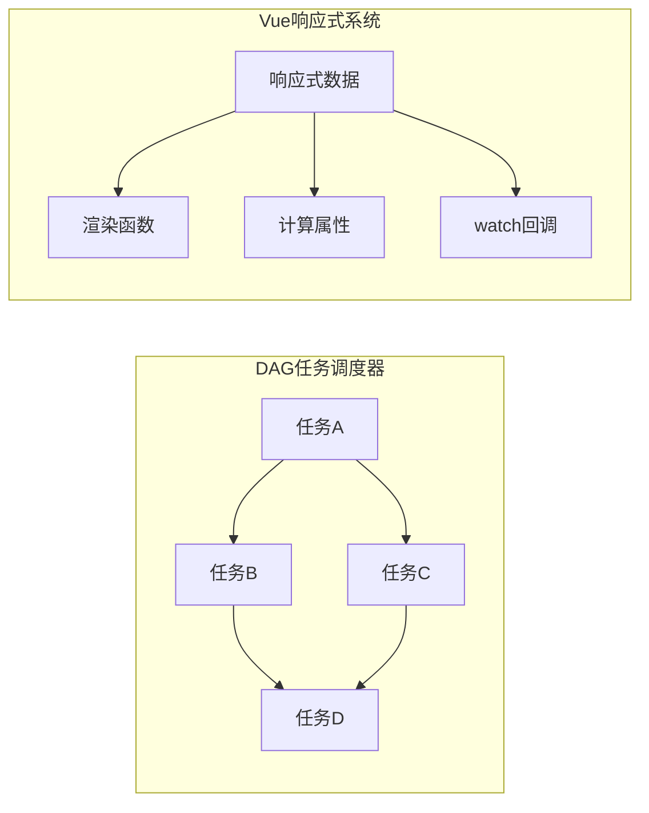

# DAG任务调度器与Vue响应式系统的联系与区别

## 基本概念



## 核心联系

1. **依赖关系管理**：两者都建立和维护依赖关系图结构

   - DAG：显式定义任务间依赖
   - Vue：通过数据访问自动建立依赖

2. **变化传播机制**：当图中节点状态变化时，影响需要更新的部分

   - DAG：上游任务完成触发下游任务
   - Vue：数据变化触发依赖更新

3. **拓扑序执行**：确保按正确顺序处理依赖项

   - 避免在依赖未就绪时执行操作

4. **循环依赖处理**：两者都需要处理循环依赖问题
   - DAG天然避免循环（定义为无环图）
   - Vue系统检测并警告循环依赖

## 关键区别

| 特性         | DAG任务调度器                   | Vue响应式(watch)             |
| ------------ | ------------------------------- | ---------------------------- |
| **依赖定义** | 显式定义（代码/配置中明确声明） | 隐式收集（自动追踪数据读取） |
| **触发方式** | 主动调度（定时/事件/手动触发）  | 被动响应（数据变化自动触发） |
| **应用场景** | 批处理工作流、数据管道、CI/CD   | UI更新、状态同步、副作用处理 |
| **粒度**     | 粗粒度（任务级别）              | 细粒度（属性级别）           |
| **执行模式** | 通常一次性执行完整流程          | 持续监听并响应变化           |
| **状态跟踪** | 任务状态（等待/运行/完成/失败） | 数据状态和依赖是否最新       |

## 实现方式对比

**DAG调度器**:

```javascript
// 显式定义任务及其依赖
const tasks = {
  taskA: { deps: [], run: () => {...} },
  taskB: { deps: ['taskA'], run: () => {...} },
  taskC: { deps: ['taskA'], run: () => {...} },
  taskD: { deps: ['taskB', 'taskC'], run: () => {...} }
};

// 调度执行
function scheduler(tasks) {
  // 根据依赖关系确定执行顺序
  // 执行任务，可能包含重试、并行控制等
}
```

**Vue响应式系统**:

```javascript
// Vue 3 watchEffect示例
watchEffect(() => {
  // 自动追踪在此函数中访问的响应式数据
  console.log(user.name) // 访问data.user.name时自动建立依赖
  document.title = user.name // 当user.name变化时自动重新执行
})
```

## 实际应用中的融合

现代前端应用中，这两种模式可能结合使用：

- 使用Vue响应式处理UI交互和状态同步
- 在复杂业务逻辑中，可能实现一个小型DAG来处理多步骤操作
- 多个watch之间可能形成类似DAG的依赖网络

两者表面看似不同，但核心都是解决依赖关系和变化传播问题，只是应用场景和实现细节不同。
