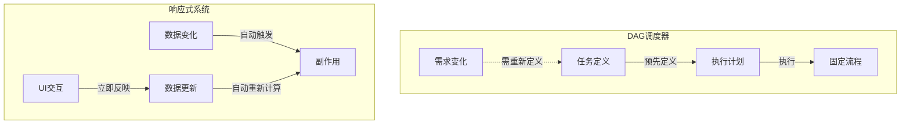
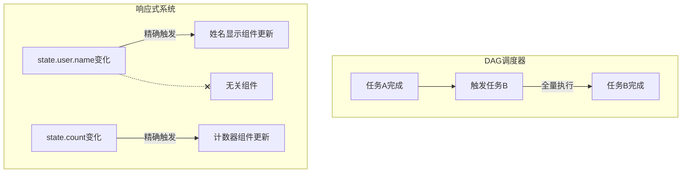
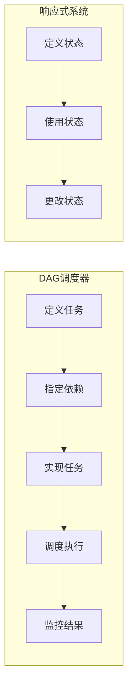
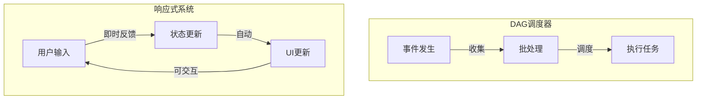
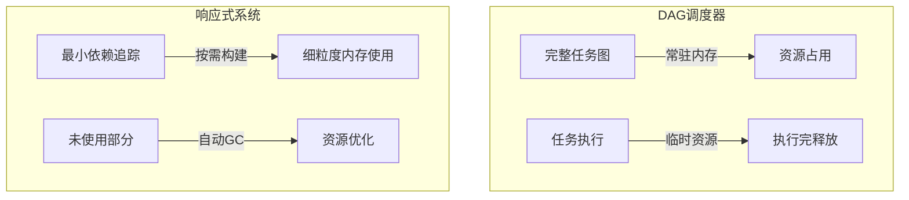
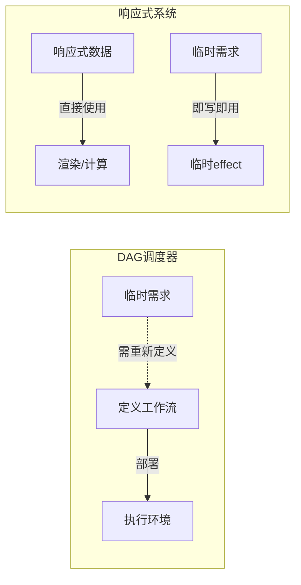

# DAG调度器相比响应式系统的局限性

DAG(有向无环图)任务调度器虽然在复杂工作流处理方面有优势，但相比响应式系统存在一些局限性：

## 1. 实时性与动态性受限



**DAG局限性**：

- 流程通常是预先定义的，难以适应高频、动态变化的需求
- 对实时交互响应的支持有限

```javascript
// DAG：需要预先定义所有流程和依赖
const workflow = {
  tasks: {
    fetchData: { deps: [], run: () => {...} },
    processData: { deps: ['fetchData'], run: () => {...} },
    renderResult: { deps: ['processData'], run: () => {...} }
  }
};
// 如果需要动态改变流程，需要重新定义和调度整个DAG

// 响应式：自动适应变化
const state = reactive({ filter: 'all', items: [] });
// 自动响应各种变化场景
const filteredItems = computed(() => {
  return state.items.filter(item => {
    if (state.filter === 'all') return true;
    return item.type === state.filter;
  });
});
```

## 2. 声明式与细粒度更新的不足



**DAG局限性**：

- 更新粒度通常是任务级别，难以实现属性级别的细粒度更新
- 更倾向于命令式而非声明式编程模型

```javascript
// DAG：任务级别的更新粒度
function runUserUpdateTask() {
  // 通常需要处理整个用户对象，即使只有一个属性变化
  fetchUserData()
  processUserData()
  updateUserInterface()
}

// 响应式：属性级别的细粒度更新
const user = reactive({
  name: 'Alice',
  email: 'alice@example.com',
  preferences: { theme: 'dark' }
})

// 只有依赖特定属性的部分会更新
watchEffect(() => (document.title = user.name)) // 只依赖name
watchEffect(() => applyTheme(user.preferences.theme)) // 只依赖theme
```

## 3. 开发体验与直观性



**DAG局限性**：

- 认知负担较重，需要思考完整的执行流程和依赖关系
- 代码结构分散，同一功能的逻辑可能分布在多个任务中

```javascript
// DAG：需要显式定义和管理任务关系
const tasks = {
  loadUser: {
    id: 'load-user',
    deps: [],
    run: async () => {
      return api.getUser()
    }
  },
  loadPosts: {
    id: 'load-posts',
    deps: ['load-user'],
    run: async results => {
      const user = results['load-user']
      return api.getPosts(user.id)
    }
  },
  renderPage: {
    id: 'render-page',
    deps: ['load-user', 'load-posts'],
    run: results => {
      renderUserProfile(results['load-user'])
      renderUserPosts(results['load-posts'])
    }
  }
}

// 响应式：自然、直观的数据流向
const userId = ref(1)
const user = computed(async () => {
  return await api.getUser(userId.value)
})
const posts = computed(async () => {
  if (!user.value) return []
  return await api.getPosts(user.value.id)
})
```

## 4. 实时协作与UI交互



**DAG局限性**：

- 不适合需要频繁交互和即时反馈的场景
- 用户界面流畅性和响应性较低

```javascript
// DAG：不适合实时UI交互
submitButton.addEventListener('click', () => {
  // 触发一个可能耗时的任务链
  scheduler.runWorkflow('form-submission')
  // 用户可能需要等待整个工作流完成
})

// 响应式：天然适合UI交互
const form = reactive({
  name: '',
  email: '',
  isValid: computed(() => validateForm(form.name, form.email)),
  isSubmitting: false
})

// 实时反馈
watchEffect(() => {
  submitButton.disabled = !form.isValid || form.isSubmitting
  feedbackText.innerText = form.isValid ? '表单有效' : '请检查输入'
})
```

## 5. 内存和资源效率



**DAG局限性**：

- 通常需要维护完整的任务图和状态，内存占用较高
- 资源利用效率较低，尤其在只需执行部分任务时

```javascript
// DAG：需要维护完整任务图
const fullWorkflow = {
  // 即使只需要运行一小部分任务
  // 也需要加载和解析整个工作流定义
  tasks: {
    task1: {
      /* 定义 */
    },
    task2: {
      /* 定义 */
    },
    // ...可能有几十上百个任务定义
    task99: {
      /* 定义 */
    }
  }
}

// 响应式：自动最小化依赖追踪
// 只有实际使用的数据才会被跟踪
const state = reactive(largeDataObject)

// 只追踪实际用到的属性
watchEffect(() => {
  // 只有state.user.profile.name被追踪
  document.title = state.user.profile.name
})
```

## 6. 即用即弃与临时性操作



**DAG局限性**：

- 不适合临时性、一次性的数据操作
- 设置和定义开销较大，不划算用于简单操作

```javascript
// DAG：即使简单操作也需要完整定义
const simpleWorkflow = {
  id: 'just-show-message',
  tasks: {
    fetchMessage: {
      deps: [],
      run: async () => api.getMessage()
    },
    displayMessage: {
      deps: ['fetchMessage'],
      run: results => showMessage(results.fetchMessage)
    }
  }
}
scheduler.run(simpleWorkflow)

// 响应式：简单直观
const message = ref('')
fetch('/api/message')
  .then(res => res.json())
  .then(data => (message.value = data.text))

// 自动响应变化
watchEffect(() => {
  if (message.value) {
    showMessage(message.value)
  }
})
```

## 结论：场景决定选择

DAG调度器和响应式系统各有所长，其局限性其实反映了它们的设计初衷不同：

- **DAG调度器**适合结构化、可预测的工作流程，特别是复杂的、长时间运行的任务序列，如数据处理管道和后端工作流

- **响应式系统**适合动态交互环境，尤其是需要实时反馈和频繁状态变化的前端应用

理想架构通常是将两者结合使用：前端用响应式系统处理交互，后端用DAG处理复杂业务逻辑。
