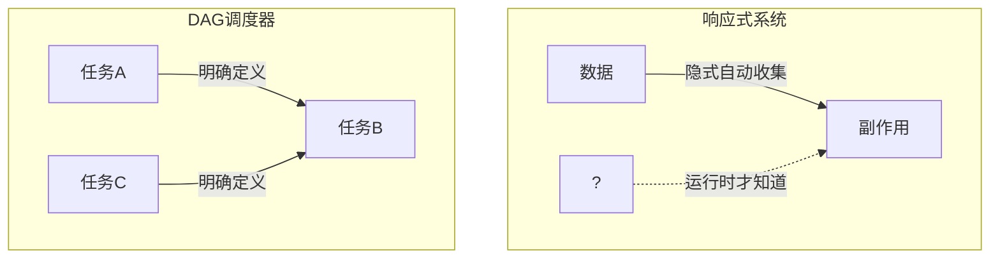
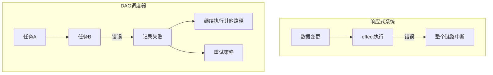
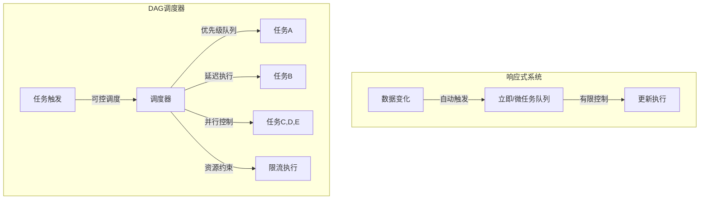
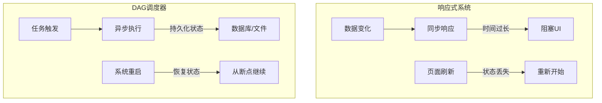
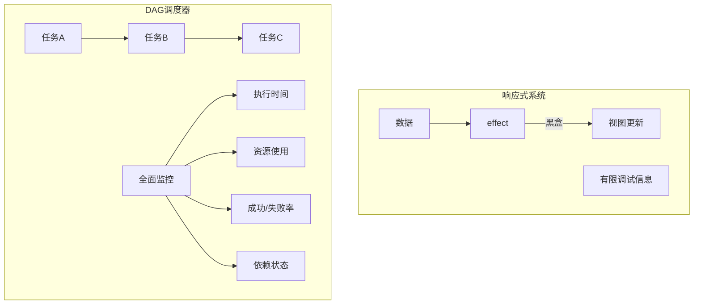
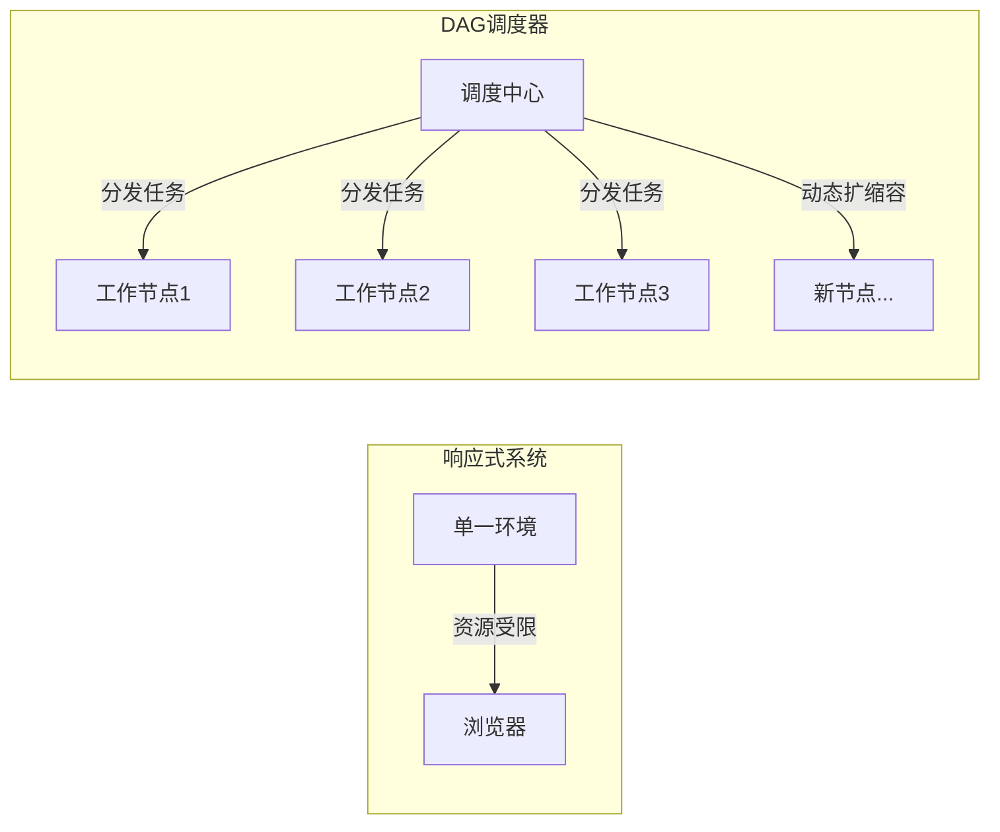

# 响应式系统与DAG调度器的局限性对比

**响应式主打的是一个全`自动`，而DAG则更加适合有明确依赖关系、需要精细控制的任务调度。**

响应式系统（如Vue）与DAG任务调度器虽然都处理依赖关系和变化传播，但面向不同场景，响应式相比DAG有以下局限性：

## 1. 依赖确定性与显式性



**响应式局限性**：

- 依赖关系隐式收集，难以预测和审计
- 难以从代码直接看出完整依赖图

```javascript
// 响应式：依赖在运行时确定
effect(() => {
  // 运行前无法确定依赖了什么
  if (condition) {
    console.log(state.a)
  } else {
    console.log(state.b)
  }
});

// DAG：依赖明确定义
const taskGraph = {
  taskA: { deps: [], run: () => {...} },
  taskB: { deps: ['taskA'], run: () => {...} } // 明确的依赖关系
};
```

## 2. 错误处理与恢复能力



**响应式局限性**：

- 错误边界不完善，一个组件错误可能导致整个应用崩溃
- 缺乏重试和降级机制

```javascript
// 响应式：错误处理不完善
effect(() => {
  // 如果这里抛出错误，可能导致整个响应链中断
  const result = state.value.nonExistentProperty.something
  renderUI(result)
})

// DAG：完善的错误处理
async function runTask(taskId) {
  try {
    await tasks[taskId].run()
    markTaskCompleted(taskId)
  } catch (err) {
    logError(taskId, err)
    if (retryCount < maxRetries) {
      scheduleRetry(taskId)
    } else {
      markTaskFailed(taskId)
      runAlternativePath()
    }
  }
}
```

## 3. 执行控制与调度能力



**响应式局限性**：

- 执行时机控制有限，主要依赖于框架内置机制
- `缺乏精细的控制`和资源分配能力

```javascript
// 响应式：有限的执行控制
// Vue只提供简单的nextTick机制
state.value = 10 // 触发更新，但无法精确控制何时执行
Vue.nextTick(() => {
  // 在下一个DOM更新周期执行
})

// DAG：精细的调度控制
scheduler.addTask({
  id: 'task1',
  priority: 10,
  concurrency: 2,
  resources: ['cpu', 'memory'],
  timeout: 5000,
  run: async () => {
    /* 任务逻辑 */
  }
})
```

## 4. 长时任务与状态持久化



**响应式局限性**：

- 不适合长时间运行的任务，会阻塞UI线程
- 无内置状态持久化机制，页面刷新状态丢失

```javascript
// 响应式：长任务会阻塞
effect(() => {
  // 长时间计算会阻塞UI
  const result = computeExpensiveValue(state.data)
  display(result)
})

// DAG：支持持久化和长任务
const workflow = {
  id: 'data-processing',
  tasks: {
    extract: {
      checkpointTo: 'db://checkpoints/extract',
      run: async () => {
        /* 可能运行数小时的任务 */
      }
    },
    transform: {
      deps: ['extract'],
      restoreFrom: 'db://checkpoints/extract',
      run: async () => {
        /* 数据转换 */
      }
    }
  }
}
```

## 5. 可观测性与监控



**响应式局限性**：

- 内部状态不透明，难以监控执行过程
- 缺乏完善的性能和状态度量指标

```javascript
// 响应式：监控困难
const state = reactive({ count: 0 })
// 外部难以监控这个effect何时执行、耗时多少
watchEffect(() => (document.title = `Count: ${state.count}`))

// DAG：完善的监控
taskRunner.on('taskStart', (taskId, timestamp) => {
  metrics.recordStart(taskId, timestamp)
})
taskRunner.on('taskComplete', (taskId, duration, result) => {
  metrics.recordCompletion(taskId, duration, result)
  dashboard.updateTaskStatus(taskId, 'completed')
})
```

## 6. 分布式扩展能力



**响应式局限性**：

- 通常运行在单一环境中，受限于其资源
- 难以进行分布式部署和扩展

```javascript
// 响应式：通常局限于单一环境
// 只能在一个浏览器实例中运行
const app = createApp({
  // 所有计算都在一个JS线程中
})

// DAG：支持分布式执行
const cluster = new ComputeCluster({
  workers: ['node-1:8080', 'node-2:8080', 'node-3:8080'],
  autoscale: { min: 3, max: 10, metric: 'cpu-utilization' }
})

cluster.scheduleTask('data-processing', {
  partitions: 100, // 将任务拆分为100个分区并行处理
  resources: { cpu: 2, memory: '4GB' }
})
```

## 结论

响应式系统和DAG调度器各有所长，适合不同场景：

- **响应式系统**适合UI交互、状态同步等需要实时响应的场景
- **DAG调度器**适合工作流、数据管道、批处理任务等需要严格控制和可靠执行的场景

在实际应用中，两种模式可以结合使用：前端使用响应式系统处理UI交互，后端使用DAG调度系统处理复杂业务流程，实现整体系统的最优架构。
