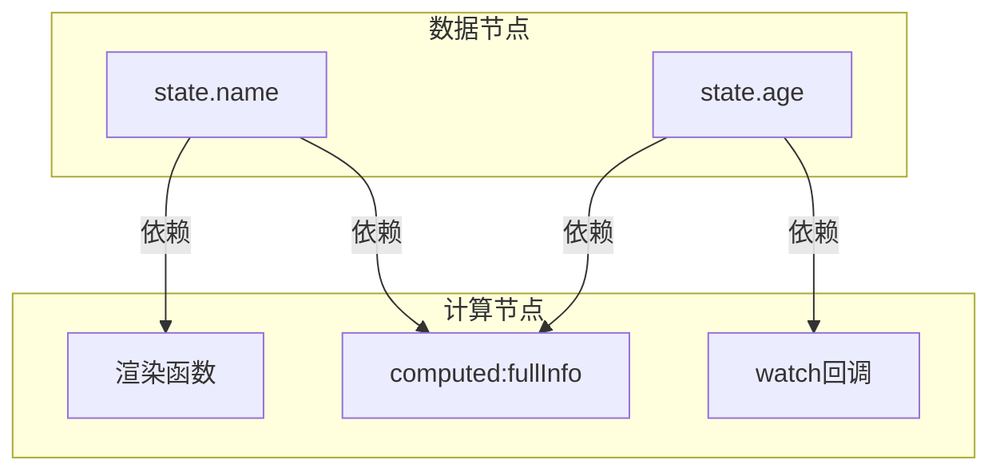
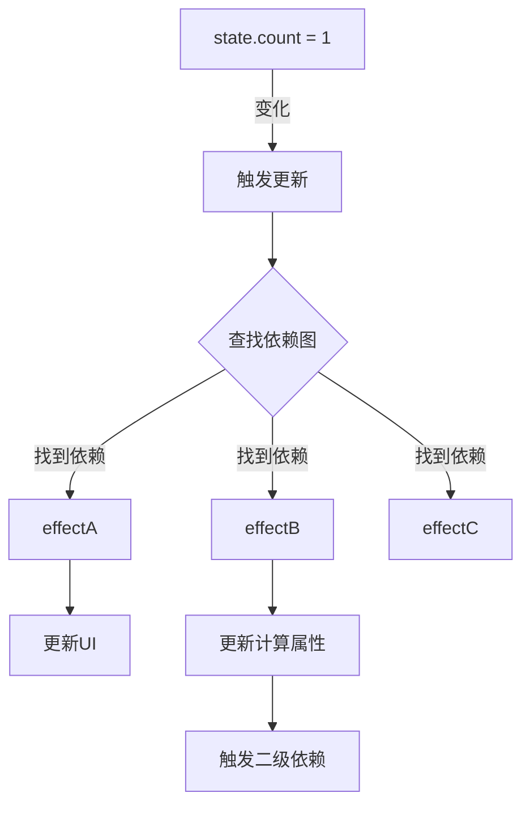
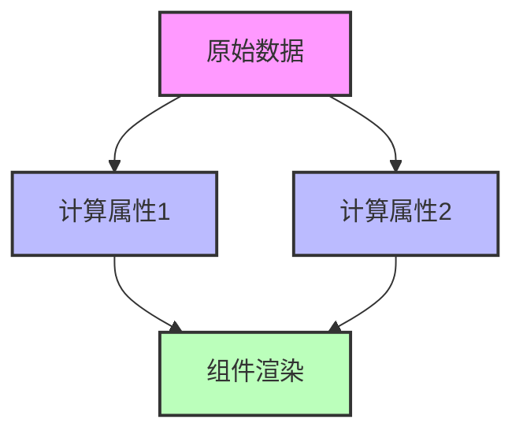
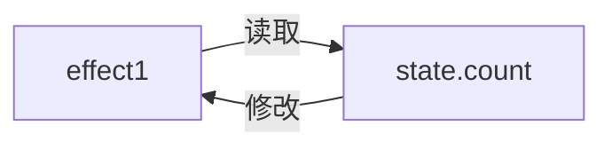
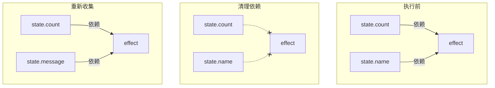
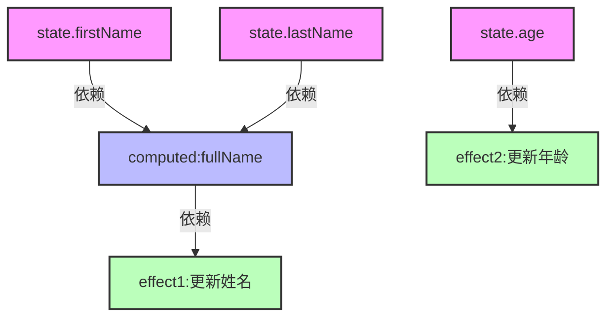

# 从图论角度理解Vue响应式系统

## 响应式系统作为有向依赖图

Vue的响应式系统本质上是一个**动态构建的有向依赖图**，其中：

- **节点**分为两类：

  - **数据节点**：响应式数据(state)
  - **计算节点**：副作用函数(effect)、计算属性、渲染函数

- **边**：表示依赖关系，从数据节点指向依赖该数据的计算节点



## 依赖图的动态构建

Vue的依赖图不是预先定义的，而是在程序执行过程中动态建立的：

```javascript
// 数据结构表示依赖图
const targetMap = new WeakMap() // 整个依赖图
// targetMap = {
//   target1: Map{
//     key1: Set[effect1, effect2], // 边的集合
//     key2: Set[effect3]
//   },
//   target2: Map{...}
// }

// 将当前effect连接到数据节点(创建一条边)
function track(target, key) {
  if (!activeEffect) return

  let depsMap = targetMap.get(target)
  if (!depsMap) {
    targetMap.set(target, (depsMap = new Map()))
  }

  let dep = depsMap.get(key)
  if (!dep) {
    depsMap.set(key, (dep = new Set()))
  }

  dep.add(activeEffect) // 添加边: data -> effect
}
```

## 图的遍历：信号传播算法

当数据变化时，需要通过图进行**广度优先遍历**找到所有受影响的计算节点：



实现代码：

```javascript
function trigger(target, key) {
  // 从依赖图中查找依赖关系
  const depsMap = targetMap.get(target)
  if (!depsMap) return

  const dep = depsMap.get(key)
  if (!dep) return

  // 广度优先执行所有依赖此数据的计算节点
  const effects = new Set()

  // 收集需要执行的effect(过滤掉当前正在运行的effect)
  dep.forEach(effect => {
    if (effect !== activeEffect) {
      effects.add(effect)
    }
  })

  // 执行所有相关联的计算节点
  effects.forEach(effect => {
    if (effect.scheduler) {
      effect.scheduler()
    } else {
      effect()
    }
  })
}
```

## 图的分层与拓扑排序

Vue的计算属性和组件更新体现了**依赖图的分层**和隐式的**拓扑排序**：



执行顺序保证依赖先更新，被依赖后更新（拓扑序）：

```javascript
// 计算属性实现了这种分层机制
function computed(getter) {
  // 缓存值和脏标记
  let value
  let dirty = true

  // 创建计算效果
  const effect = createEffect(getter, {
    lazy: true,
    // 当依赖变化时，不立即计算新值，而是标记为脏
    scheduler() {
      if (!dirty) {
        dirty = true
        // 通知依赖此计算属性的效果
        trigger(obj, 'value')
      }
    }
  })

  const obj = {
    get value() {
      // 脏时重新计算
      if (dirty) {
        value = effect()
        dirty = false
      }
      // 建立此计算属性与其使用者之间的依赖
      track(obj, 'value')
      return value
    }
  }

  return obj
}
```

## 循环依赖问题

在图论中，**循环依赖**会导致死循环，在响应式系统中也是如此：



解决方案是在遍历图时检测并避免重入：

```javascript
function effect(fn) {
  const effectFn = () => {
    try {
      // 标记当前正在运行的effect
      activeEffect = effectFn
      effectFn.running = true

      return fn() // 执行函数体
    } finally {
      activeEffect = null
      effectFn.running = false
    }
  }

  effectFn()
  return effectFn
}

// 触发更新时避免循环
function trigger(target, key) {
  // ...前面代码省略

  dep.forEach(effect => {
    // 避免effect自我触发
    if (effect !== activeEffect && !effect.running) {
      effectsToRun.add(effect)
    }
  })

  // ...执行effects
}
```

## 图的动态优化

Vue的响应式系统会对依赖图进行动态优化：

1. **边的动态修剪**：每次effect重新执行时，先断开所有旧的连接，再动态建立新的依赖关系



```javascript
function effect(fn) {
  const effectFn = () => {
    // 清理旧的依赖关系（从图中移除边）
    cleanup(effectFn)

    try {
      activeEffect = effectFn
      return fn() // 执行期间会重新建立依赖
    } finally {
      activeEffect = null
    }
  }

  // 记录此effect依赖的所有集合
  effectFn.deps = []
  effectFn()
  return effectFn
}

function cleanup(effectFn) {
  const { deps } = effectFn
  if (deps.length) {
    // 从所有依赖集合中移除当前effect
    for (let i = 0; i < deps.length; i++) {
      deps[i].delete(effectFn)
    }
    deps.length = 0
  }
}
```

2. **层级优化**：Vue使用调度器来控制更新顺序，确保父组件先于子组件更新

```javascript
const queue = []
let isFlushing = false

// 任务调度器，保证更新按组件层级进行
function queueJob(job) {
  if (!queue.includes(job)) {
    queue.push(job)

    if (!isFlushing) {
      isFlushing = true
      Promise.resolve().then(() => {
        // 执行前根据组件ID排序，实现拓扑顺序执行
        queue.sort((a, b) => a.id - b.id)

        try {
          for (let i = 0; i < queue.length; i++) {
            queue[i]()
          }
        } finally {
          isFlushing = false
          queue.length = 0
        }
      })
    }
  }
}
```

## 实际应用示例

让我们看一个完整例子，展示响应式图的构建与工作流程：

```javascript
// 创建响应式数据（图中的数据节点）
const state = reactive({
  firstName: 'John',
  lastName: 'Doe',
  age: 30
})

// 创建计算属性（中间节点）
const fullName = computed(() => {
  console.log('计算 fullName')
  return `${state.firstName} ${state.lastName}`
})

// 创建effects（计算节点）
effect(() => {
  console.log('Effect 1 执行')
  document.getElementById('app').innerHTML = `
    <div>姓名：${fullName.value}</div>
  `
})

effect(() => {
  console.log('Effect 2 执行')
  document.getElementById('info').innerHTML = `
    <div>年龄：${state.age}</div>
  `
})

// 图的节点更新触发遍历
setTimeout(() => {
  state.firstName = 'Jane' // 更新firstName节点
  // 依赖路径: state.firstName -> fullName -> effect1
}, 1000)

setTimeout(() => {
  state.age = 31 // 更新age节点
  // 依赖路径: state.age -> effect2
}, 2000)
```

最终形成的依赖图：



通过图论视角理解Vue响应式系统，可以更清晰地把握其核心工作原理和设计思想，也有助于我们编写更高效、更可维护的Vue应用。
