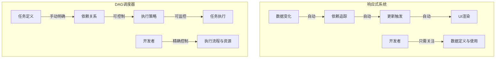

两种系统的核心差异：

## 核心区别对比

| 响应式系统           | DAG调度器            |
| -------------------- | -------------------- |
| 隐式依赖收集         | 显式依赖定义         |
| 自动变更检测         | 手动任务触发         |
| 细粒度更新           | 任务级别操作         |
| 适合UI交互           | 适合工作流处理       |
| 开发者专注于"是什么" | 开发者专注于"怎么做" |
| 简化状态同步         | 优化任务编排         |
| 动态构建依赖         | 预先构建依赖图       |

你的理解抓住了本质：响应式是一种"声明式"范式，让系统自动处理依赖与更新；而DAG则是一种"编排式"范式，让开发者能精确控制复杂流程的执行方式。
