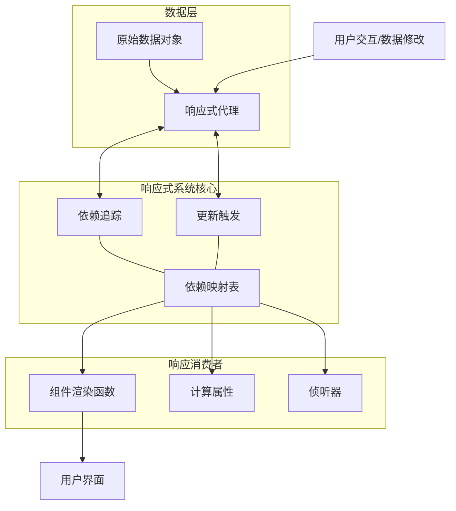
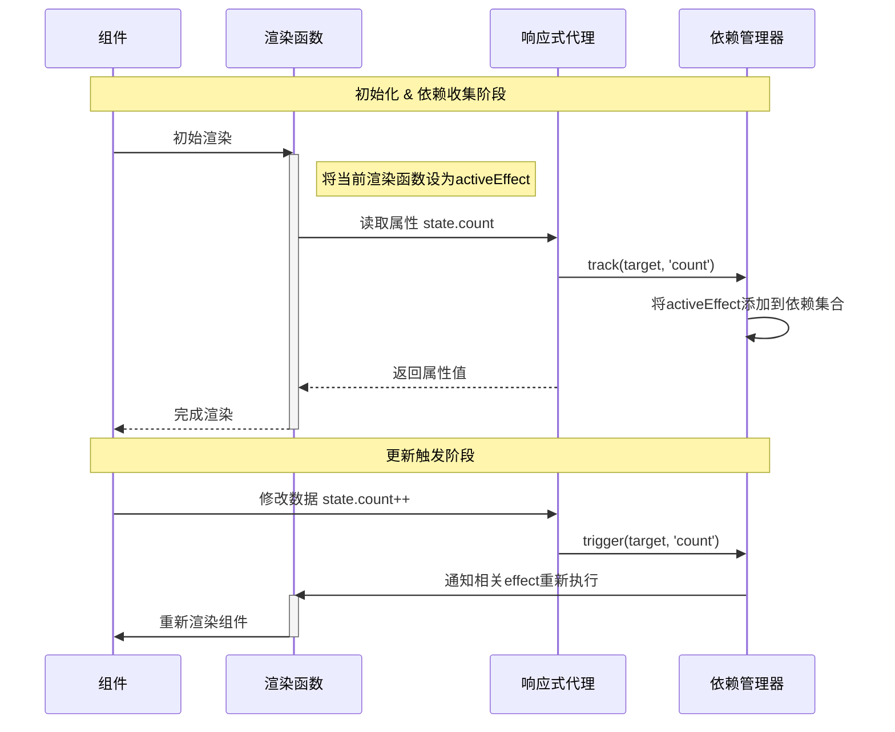
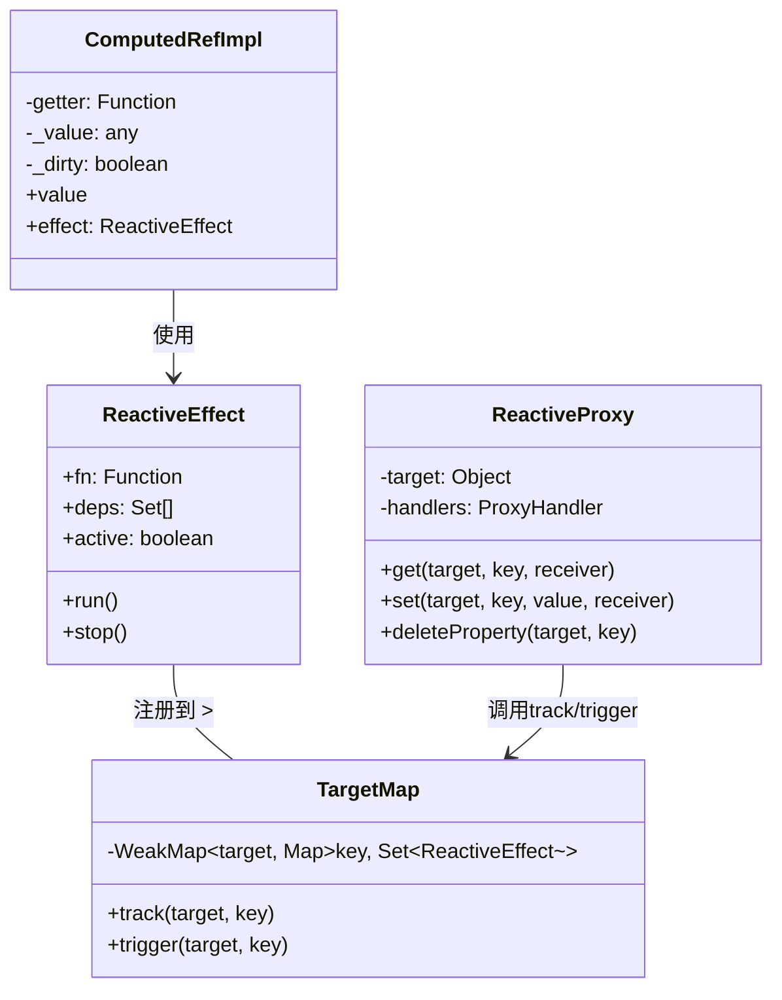
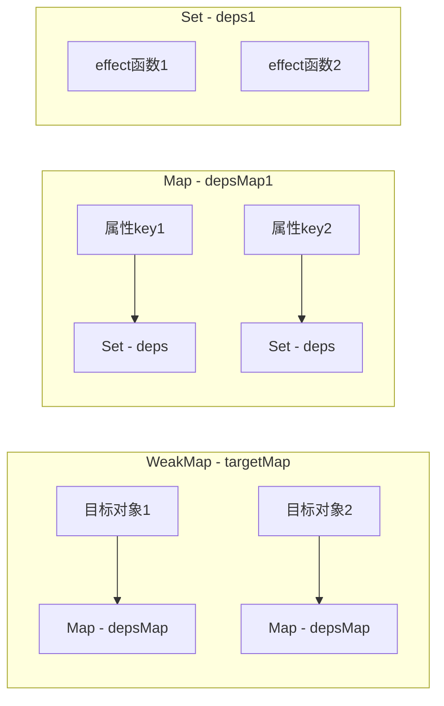

# Vue.js 响应式原理详解

## 响应式系统整体架构

## 依赖收集与更新触发流程

## 响应式系统类图

## 响应式系统详细实现解析

### 1. Proxy拦截与代理

响应式系统的核心是通过Proxy拦截数据的读取和修改操作：

- **get拦截器**：当数据被读取时，记录依赖关系（谁正在使用这个数据）
- **set拦截器**：当数据被修改时，通知所有依赖这个数据的消费者更新

### 2. 依赖收集与存储结构

### 3. 响应式工作原理细节

1. **初始化阶段**：

   - 通过`reactive()`创建数据的Proxy代理
   - 设置拦截器监听数据操作

2. **依赖收集阶段**：

   - 组件渲染时，effect函数执行
   - 访问响应式数据触发get拦截器
   - 通过track()建立数据与当前effect的依赖关系

3. **数据变化阶段**：

   - 修改响应式数据触发set拦截器
   - 通过trigger()查找依赖此数据的所有effect
   - 执行这些effect函数，更新UI

4. **清理阶段**：
   - 组件卸载时，清理相关effect防止内存泄漏
   - 数据未被使用时，依赖关系可被垃圾回收

通过以上机制，Vue实现了声明式、细粒度的自动UI更新，开发者只需关注数据变化，而无需手动操作DOM。
