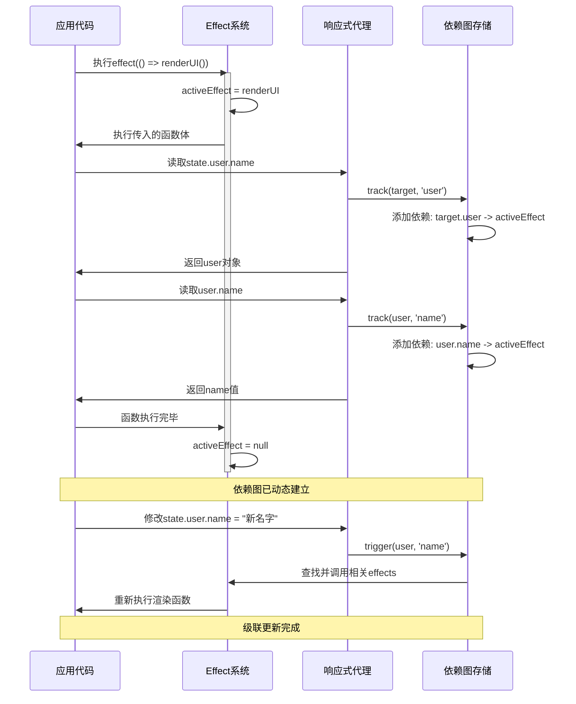
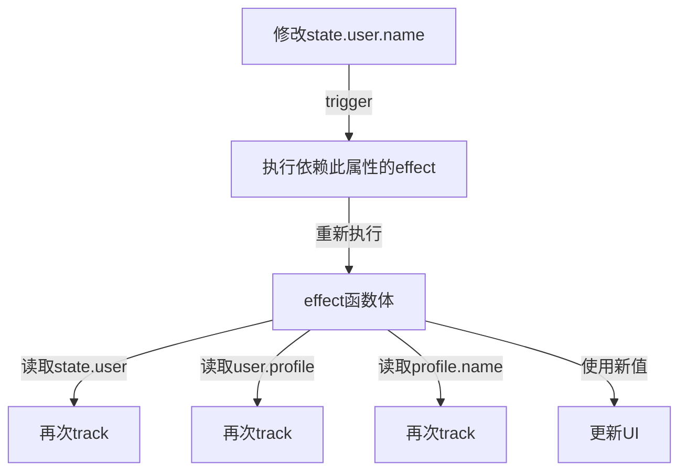

三个阶段：

1. 劫持对象
   - get -> track
   - set -> trigger
2. 依赖收集
   effect 内部，访问属性时，track 将 activeEffect 函数加入 Map<target, Map<key, Set<effect>>>
3. 触发更新
   响应式数据变化时，trigger 遍历 Set<effect> 调度 effect 函数

- 没有**预先建图**，关系在访问属性时才建立的，使用 Map<target, Map<key, Set<effect>>> 存储依赖关系。

4. **effect 之间通过对象属性间接建立依赖关系，构成一张dag**

---

# 响应式系统的动态依赖图构建与级联触发机制

响应式系统最神奇之处就在于**无需预先建图**，却能实现复杂的依赖追踪和级联触发。这种设计使其具有极高的灵活性和动态性。

## 动态图构建原理



## 为何无需预先建图却能级联触发？

### 1. 执行驱动的依赖收集

响应式系统的关键在于**"执行驱动依赖收集"**。系统不需要预先知道哪些数据被哪些函数使用，而是通过实际执行来动态发现：

```javascript
// 这个effect执行时会自动发现并记录它依赖了哪些数据
effect(() => {
  document.title = state.user.name // 执行过程中自动建立依赖关系
})
```

### 2. 代理捕获访问路径

响应式代理通过劫持所有属性访问，构建完整的访问路径：

```javascript
// 响应式代理如何捕获完整路径
const state = reactive({
  user: {
    profile: {
      name: 'Alice'
    }
  }
})

effect(() => {
  // 1. 访问state.user触发track(state, 'user')
  // 2. 访问user.profile触发track(user, 'profile')
  // 3. 访问profile.name触发track(profile, 'name')
  console.log(state.user.profile.name)
})
```

每级属性访问都会触发依赖收集，从而构建完整的依赖链。

### 3. 级联触发的实现机制

**级联触发主要通过effect函数重新执行实现：**



关键代码流程：

```javascript
// 1. 修改属性值
state.user.name = 'Bob'

// 2. 触发effect
function trigger(target, key) {
  const depsMap = targetMap.get(target)
  if (!depsMap) return

  const deps = depsMap.get(key)
  if (!deps) return

  // 找到所有依赖这个属性的effect并执行
  deps.forEach(effect => {
    // 3. 调度执行effect
    effect()
  })
}

// 4. effect执行过程
function runEffect(fn) {
  // 清理旧依赖
  cleanup(activeEffect)

  try {
    activeEffect = fn
    // 5. 重新执行函数体，会重新访问所有属性
    // 从而重建依赖关系图
    return fn()
  } finally {
    activeEffect = null
  }
}
```

## 为什么这种设计能够工作？

### 1. 动态捕获真实依赖

通过实际执行代码捕获的依赖是准确且最小的，不依赖开发者手动声明：

```javascript
effect(() => {
  // 条件分支中的依赖也能被正确捕获
  if (state.isAdmin) {
    document.title = state.adminTitle
  } else {
    document.title = state.userTitle
  }
})
// 无论条件如何变化，依赖都会被正确更新
```

### 2. 依赖的自动清理与重建

每次effect重新执行时，会清理旧依赖并重建新依赖，保证依赖图始终准确：

```javascript
function cleanup(effect) {
  // 清理effect在所有dep中的引用
  effect.deps.forEach(dep => {
    dep.delete(effect)
  })
  effect.deps.length = 0
}
```

### 3. 嵌套结构的层层传递

嵌套对象的每一层都是响应式的，保证了依赖能沿着访问路径正确建立：

```javascript
// 深度响应式对象
function reactive(obj) {
  return new Proxy(obj, {
    get(target, key, receiver) {
      const res = Reflect.get(target, key, receiver)
      track(target, key)

      // 递归使子对象也是响应式的
      return typeof res === 'object' && res !== null
        ? reactive(res) // 返回响应式子对象
        : res
    }
    // ... 其他处理器
  })
}
```

这保证了无论访问多深的属性，都能正确建立依赖关系。

## 动态图构建相比预先建图的优势

1. **精确最小依赖**：只捕获实际用到的属性，避免过度追踪
2. **条件分支处理**：可以处理复杂的条件逻辑和动态依赖
3. **运行时灵活性**：依赖可以随程序逻辑变化而调整
4. **惰性计算**：不需要一开始就计算全部可能的依赖关系
5. **内存效率**：只存储必要的依赖关系

## 总结

响应式系统能在不预先建图的情况下实现级联触发，核心在于:

1. **执行驱动**的依赖收集策略
2. 通过**代理机制**捕获所有属性访问
3. 依赖图的**动态构建与清理**机制
4. effect执行时**完整依赖路径的重新构建**
   这种设计使得响应式系统能够处理高度动态的数据关系，同时保持使用简便性，是Vue等现代前端框架的核心优势。
