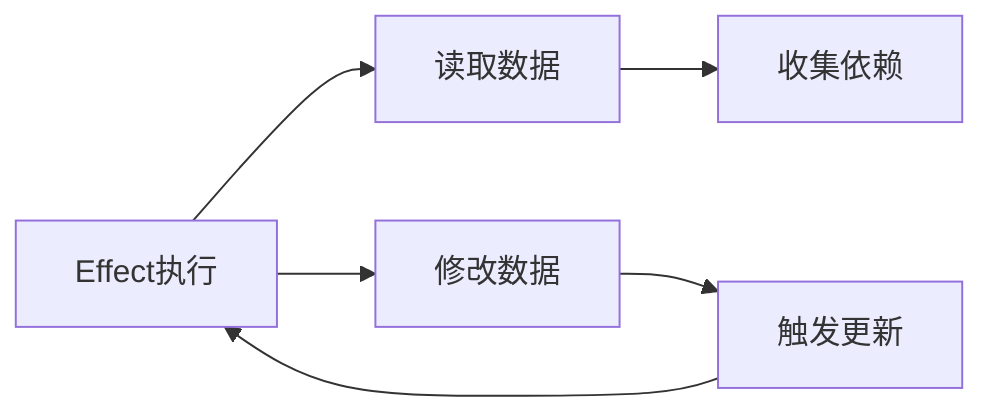

# Effect无限循环问题与解决方案

## 确实会发生无限循环

在我们的简化实现中，effect 函数确实存在无限循环的风险，尤其是当 effect 内部既读取又修改同一个响应式属性时：

```javascript
effect(() => {
  // 读取state.count建立依赖
  console.log(state.count)
  // 修改同一属性触发更新
  state.count++ // 这会再次触发当前effect运行
})
// 结果：无限递归，最终栈溢出
```

## 无限循环的几种场景



1. **自我修改**：effect内部修改自身依赖的数据
2. **交叉修改**：多个effect形成循环依赖链
3. **深层嵌套**：effect触发导致另一个effect触发，形成长链式反应

## 解决方案

要修复我们实现的响应式系统中的无限循环问题，需要添加以下机制：

```javascript
// 修改后的effect实现
function effect(fn, options = {}) {
  const effectFn = () => {
    // 清除此effect对之前依赖的引用，防止不必要的更新
    cleanup(effectFn)

    try {
      activeEffect = effectFn
      // 添加标识，表示此effect正在执行
      effectFn.running = true
      return fn()
    } finally {
      activeEffect = null
      effectFn.running = false
    }
  }

  // 用于存储此effect依赖的所有集合
  effectFn.deps = []
  effectFn.scheduler = options.scheduler

  if (!options.lazy) {
    effectFn()
  }

  return effectFn
}

// 清理effect依赖
function cleanup(effectFn) {
  // 从所有依赖集合中移除此effect
  for (let i = 0; i < effectFn.deps.length; i++) {
    const dep = effectFn.deps[i]
    dep.delete(effectFn)
  }
  effectFn.deps.length = 0
}

// 修改依赖收集逻辑
function track(target, key) {
  if (!activeEffect) return

  let depsMap = targetMap.get(target)
  if (!depsMap) {
    targetMap.set(target, (depsMap = new Map()))
  }

  let dep = depsMap.get(key)
  if (!dep) {
    depsMap.set(key, (dep = new Set()))
  }

  // 添加到依赖集合
  dep.add(activeEffect)
  // 反向收集，让effect知道自己依赖了哪些集合
  activeEffect.deps.push(dep)
}

// 修改触发更新逻辑
function trigger(target, key) {
  const depsMap = targetMap.get(target)
  if (!depsMap) return

  const dep = depsMap.get(key)
  if (!dep) return

  // 创建一个新的Set进行遍历，防止在遍历过程中Set发生变化
  const effectsToRun = new Set()

  dep.forEach(effectFn => {
    // 如果effect正在运行，不要再次触发它
    if (effectFn !== activeEffect && !effectFn.running) {
      effectsToRun.add(effectFn)
    }
  })

  effectsToRun.forEach(effectFn => {
    if (effectFn.scheduler) {
      effectFn.scheduler()
    } else {
      effectFn()
    }
  })
}
```

## 关键防护机制

1. **避免自触发**：

   - 检查正在触发的effect是否是当前正在运行的effect
   - `if (effectFn !== activeEffect)`

2. **防止重复执行**：

   - 使用running标志追踪effect是否在执行中
   - 使用调度器控制执行时机

3. **依赖清理**：

   - 每次effect执行前，清除之前建立的依赖关系
   - 避免不必要的更新和内存泄漏

4. **批量更新**：
   - 将多次更新合并为一次执行
   - 减少不必要的重复计算

这些防护机制能确保响应式系统稳定运行，避免无
